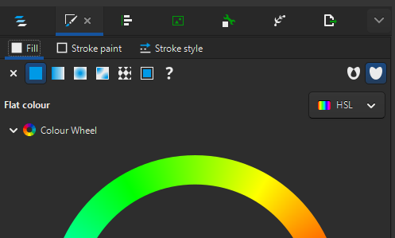
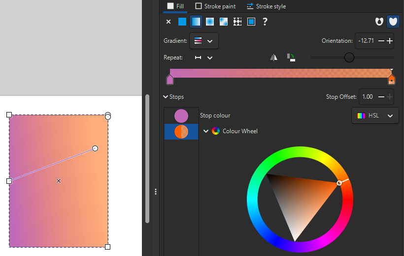
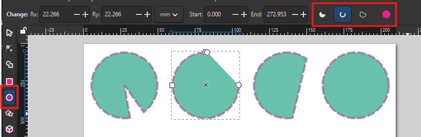
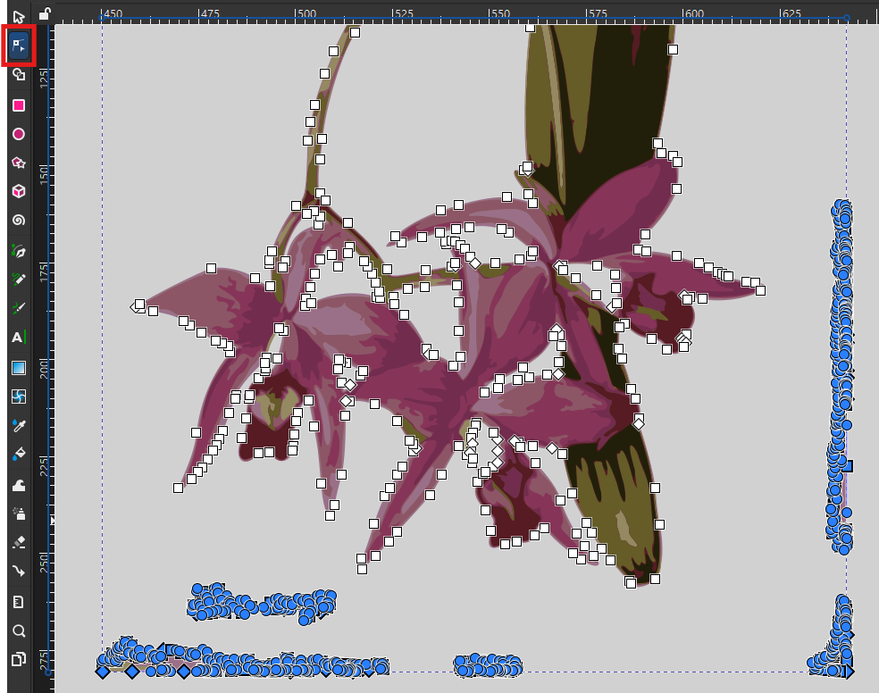
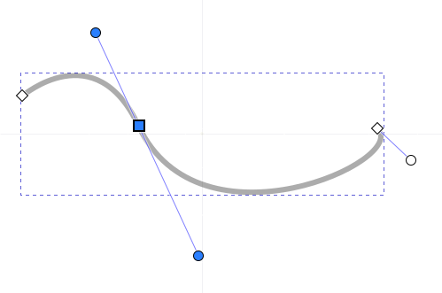
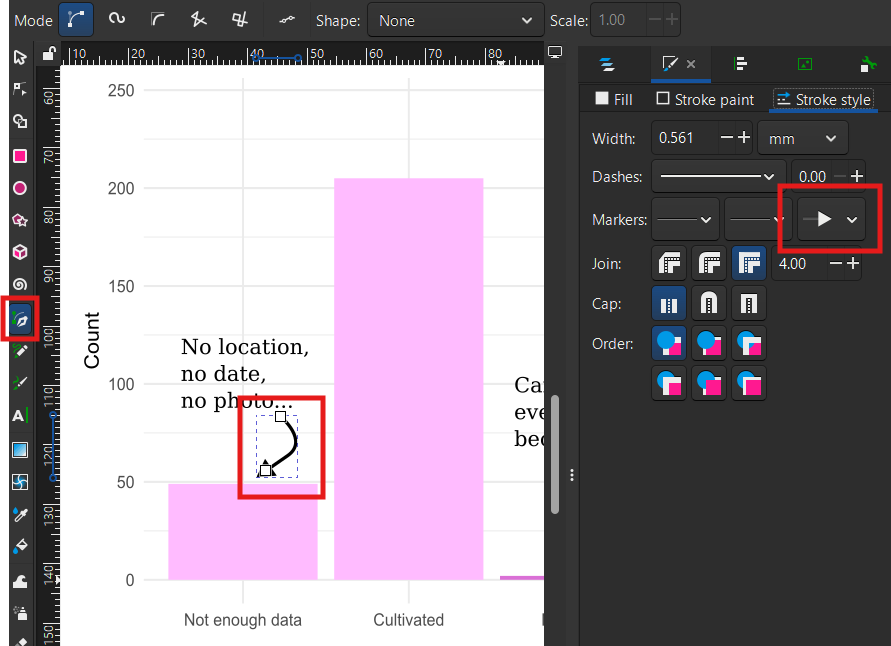

## What will we learn?

In this session, you will learn how to:

* Create custom shapes
* Turn bitmap images into a clean vector object
* Integrate plots from other tools into an infographic
* Add text annotations
* Use filters and effects

## What is Inkscape?

Inkscape is a free, open source vector drawing tool. It is a desktop application that can be installed on Linux, macOS and Windows.

## Installing Inkscape

To install Inkscape:

* On your own computer, go to the [Inkscape download page](https://inkscape.org/release/), download the installer and run it.
* On a UQ (ITS) computer, open Company Portal, search for "Inkscape" and install it.
* On a UQ Library computer, open ZENworks, search for "Inkscape" and install it.

## Vector and raster images

Vector images are made of shapes, as opposed to raster graphics that are made of pixels. This means that a vector graphic always looks sharp, and individual objects can be modified independently.

, Public Domain)](img/vector_vs_raster.png){fig-alt="Two red circles look the same, but once zoomed in, the raster image shows pixels, whereas the vector image still looks sharp."}

Inkscape allows you to create and manipulate vector objects, using the [SVG file format](https://en.wikipedia.org/wiki/SVG) ("Scalable Vector Graphics") as a default. However, images can be exported in a variety of vector and raster formats.

The SVG format is a widespread open format for 2D images, used in graphic design and web design. It can also support interactivity and animation.

## New file

Create a new file by clicking on "New Document" in the Welcome dialog.

## Draw shapes

The left toolbar (the "Toolbox") has various shape tools. Start with tracing a rectangle with the Rectangle Tool. The right panel (the "Dialogues" panel) has a Fill and Stroke tab that allows you to change what you want to fill the shape with, and the look of the outline (if any).

{fig-alt="Screenshot of user interface with Fill and Stroke tab highlighted, and showing a colour wheel."}

Try using the colour wheel in the "Fill" tab to change the colour for the "Flat colour" option, then play with defining your own gradient with the "Linear gradient" option. With gradients, you can add and remove colour stops, and you can define where the gradient starts and ends on the shape by moving the blue line's handles.

{fig-alt="Screenshot of user interface showing two colour stops in the side panel, and a slanted blue line over the coloured shape."}

Make sure there is a stoke style selected in the "Stroke style tab", then style it in the "Stroke paint" tab.

Try the same thing with the "Ellipse/Arc Tool" now. You can trace a perfect circle by keeping the <kbd>Ctrl</kbd> key pressed when dragging, and use the circle handle to switch between arcs (dragging inside the circle) or segments (dragging outside the circle). You can then switch modes with the top toolbar ("Slice", "Arc", "Chord", "Whole ellipse").

{fig-alt="Screenshot of 4 shapes showing the different ellipse modes."}

## Controls

Use <kbd>Ctrl</kbd> + <kbd>Scroll</kbd> to zoom in and out.

You can resize an object by using the corner handles, but remember that if you want to keep the aspect ratio, you have to press <kbd>Ctrl</kbd> at the same time.

If you use <kbd>Shift</kbd> while resizing, the centre of the object stays at the same position. (You can also use it to create an object from its centre point.)

You can also change the size to precise values by using the toolbar (and picking any unit you want to use). The lock button allows you to always keep the same aspect ratio for the object.

## Filters

Select a shape and use the menu Filters - Filter Gallery...

Although you can find many filters in the Filters menu, this dialog allows searching keywords. Test a few filters: some common ones are "Blur" and "Drop Shadow". Some filters will have a dialog pop up for settings, others won't. Don't forget to click "Apply" before closing the settings dialogue.

You can modify the filter's settings (or create a new filter) by going to Filters - Filter Editor..., and remove an object's filters by going to Filters - Remove Filters.

::: {.callout-tip}
To instantly what the settings do, tick "Live preview".
:::

## Trace a raster image

You can transform a raster image into a vector image by using Path - Trace Bitmap.

Choose a picture from the [Wellcome Collection of botanical art](https://commons.wikimedia.org/wiki/Category:Botanical_illustrations_in_the_Wellcome_Collection) (for example, [this orchid](https://commons.wikimedia.org/wiki/File:An_orchid_(Laelia_anceps);_flowering_stem_and_leaves._Waterc_Wellcome_V0043292.jpg)). Copy and paste the image into Inkscape, then use the menu: Path - Trace Bitmap.

::: {.callout-warning}
Using a high-resolution image can make the tracing process very slow, and result in unnecessarily detailed objects.

If you have a large image (e.g. several MB-big), you can use "Edit - Make a Bitmap Copy" to create a lower-resolution copy of the image.
:::

In the "Trace Bitmap" dialogue, switch to the "Multicolour" tab, then use the following options:

* Scans: 8 (the number of colours)
* Smooth (to blur the picture before tracing)
* Stack (to stack the scans on top of each other without gaps)
* Remove background

Then click "Apply". Inkscape generates a vector version of the original image. You can play with the settings to get better results. For example, increasing the values for "Speckles", "Smooth corners" and "Optimise" will simplify the object in various ways, making it lighter but less detailed.

If you double-click on the resulting object, you can access the different layers that make it, and remove / keep as you see fit. For example, there might still be a background depending on the contrast of the picture, which you can remove (if it doesn't affect the rest of the picture). Double-click out of the object (or click on another object) to get out of the object's layers.

If there's a part of the image you don't want to keep, but you don't want to remove the whole layer, you can use the Node Tool, click on the object, and select the nodes, then delete them.

{fig-alt="Screenshot of traced flower, one scan selected, with all nodes visible. The nodes on the edge of the image are blue because they are selected and ready to be deleted."}

You can also use this tool to modify the paths and fix up small details.

Once the vector version of the image is cleaned up, place it in a corner of the page. If needed, you can flip objects by using the menu: Object - Flip Horizontal/Vertical.

If the colours are a bit too dull, try using the Brilliance filter: Filters - Colours - Brilliance. Turn on the Live preview, tweak the Brightness, Over-saturation and Lightness values to reach a good balance, and compare with the original by turning Live preview off. Try for example 1.70, 0.10 and 0.10 respectively.

## Layers and Objects

In the Dialogue panel, the "Layers and Objects" dialoge is a very important tool, especially as your composition becomes more complex. It shows in which order all the layers are stacked, and also makes it more obvious that you are inside a multi-layer object (like our traced flower). You can drag-and-drop objects to change the order they are stacked in, and choose to hide and lock them (so you don't select or modify them by mistake).

You can also change the order of objects by using the "Raise" and "Lower" buttons in the top toolbar.

Using these features, place a circle with a gradient behind the flower.

This is also where you can control the Opacity of the whole object, and the Blend mode (which allows for creative interactions between objects). Note that you might lose some Filters in the process, like the Brilliance we applied to the flower.

## Groups

Once you think they fit well together, select the two objects (the circle and the flower) and right-click - Group them, so they move together from now on. See how that is reflected in the Layers and Objects panel?

You can also lock them so you don't move them by mistake.

## Import and tweak plots created outside of Inkscape

We will now integrate into our infographic two plots about the orchid [_Laelia anceps_](https://www.inaturalist.org/taxa/204984-Laelia-anceps), based on data from iNaturalist and generated with R.

* Drag and drop both files into Inkscape. (You can also use the menu for that: File - Import.)
* Keep the default setting when prompted to choose an "SVG Image Import Type": the plots will be added as editable objects.

For the timeline plot:

* Move the legend to the empty area of the plot. You will have to ungroup the object, select the legend object, and group them again.
* You can remove the useless white background from the group.
* Select the bar for 2026 and modify its fill to denote that the year is not over:
    * In the right panel, go to the Fill and Stroke dialogue, "Fill" tab.
    * Change the fill to "Pattern".
    * Select the "Stripes 01" pattern.
    * Change the pattern Orientation to 45 degrees (for diagonal stripes).
    * We lost the original colour! Let's restore it:
        * Click in the "Colour" box.
        * In the "Pattern colour" dialog that pops up, click the pipette icon ("Pick colours from image").
        * Click on another light pink bar to use the same colour.
* Place the plot next to the flower, in the bottom right of the page.

For the plot about observations:

* Place it above the flower, on the left of the page.
* Remove the title of the X axis (because the title will be very similar).

## Text

Use the Text Tool in the left toolbar to add text objects to the infographic. For the title, click where the text starts and type: "Laelia anceps". Pick a suitable size and font from the top toolbar.

::: {.callout-warning}
Is your text looking bold or hard to read? It might be using a stroke paint! Got to the right panel, in the "Fill and Stroke" dialogue, "Stroke paint" tab, and make sure it is set to "No paint".
:::

Also give titles to your plots: "Observation types" and "Observations per year" respectively.

You can also trace a rectangle with the Text Tool to define a text area. Do that to the right of the top plot, to include some text about your project:

> _Laelia anceps_ is an orchid found in Mexico, Guatemala and Honduras. These graphs are based on 500 observations downloaded from the citizen science network iNaturalist.

::: {.callout-tip}
If the frame is not large enough for the text, it will turn red to let you know that some text can't be displayed.
:::

## Lines, Bézier curves and arrows

The "Pen Tool" in the left toolbar allows tracing straight lines, paths and curves.

Use it to trace a path of straight segments, clicking to place each node, and right-click when you are finished. You can also double-click for the last node.

::: {.callout-tip}
Once again, Inkscape reuses your most recent stroke and fill settings. For the Pen Tool, you likely want to set the Fill to "No paint".
:::

To trace a curve:

* Place a first node
* For the second node, click and hold.
* You can now drag to change the curvature of the line.
* The next segment will follow the curve accordingly, to create a smooth path.

This is called a "[Bézier curve](https://en.wikipedia.org/wiki/B%C3%A9zier_curve)": a line with control points that define its curvature. Double-clicking a vector object turns on the Node Tool, which allows you to move nodes, but also tweak those control points to change the shape of the curve. Alternatively, you can also drag from anywhere on the curve itself (which moves the control points accordingly).

{fig-alt="A node is highlighted in blue, joining to curved segments, and revealing two curvature control points."}

To turn a curve into an arrow, go to the "Fill and Stroke" dialog, "Stroke style" tab, and set an end marker.

{fig-alt="Screenshot of Pen Tool active on a curve. The Stroke style settings show an arrow head used as the end marker."}

## Annotate the plots

We can now annotate our plots with text and arrows.

For the top plot:

* Above the "Not enough data" bar, write: "No location, no date, no photo..." (These observations, as well as the cultivated ones, can never reach a "Research" quality level.)
* Next to a curved arrow that goes from the top of the "Needs ID" bar to the middle of the "Research" bar, write: "Can eventually become". (This denotes that the "Needs ID" observations will become Research-grade when a level of agreement is reached.)

::: {.callout-tip}
Copy and paste your text objects to easily keep font and sizes consistent across the infographic!
:::

For the bottom plot:

* Add an annotation between the legend and the bars to show when iNaturalist started, with the text "2008: iNaturalist is born".
* Link it to the corresponding bar with a grey, vertical dashed line.

## Align and Distribute

With Object - Align and Distribute, you can access many tools to align objects relative to each other or to the page.

Use this to align your plot titles to the edge of the plot. For example, for the plot on the right, select both objects and use the setting "Relative to biggest objects" and the button "Align right edges".

Also make sure that your infographic title is centred relative to the page.

## Path effects

Select a simple object, then go to Path - Path Effects. This panel gives you access to numerous effects. Try for example "Rotate copies", then change the number of copies and move the centre of the modified object.

Some other useful path effects you could try:

* Roughen: to make something "less neat"
* Tiling: to generate a grid of repeated images, or a tiled pattern.

## Clone

In the right toolbar, use "Create Clone" to have a copy of an object that is synced with the original.

## Templates

In File - New from Template, you can pick various sizes depending on what you are creating a graphic for. For example, there are templates for creating icons, screen wallpapers, zine booklets, business cards and social media images.

## Import Web Image

You can import vector images from different sources in File - Import Web Image...

Choose a source and type a keyword. Make sure to respect the licensing!

## Formats and exporting

Inkscape uses SVG ("Scalable Vector Graphics") as a default format. It's an open standard that is very common, and supported in many applications, which means you usually can share the file as is.

However, if you need to, you can export your creation in many different formats, including raster formats (like PNG) if needed.

* Open the Export dialogue with File - Export.
* In the "Single File" tab, select "Page" (to crop out anything outside the page).
* You might have to tweak the Background Colour, as PNG supports transparent backgrounds.
* The resolution value ("DPI" for "Dots Per Inch") depends on what you want to do with the export. If it is going to by printed as a poster, you might want to increase the value.

