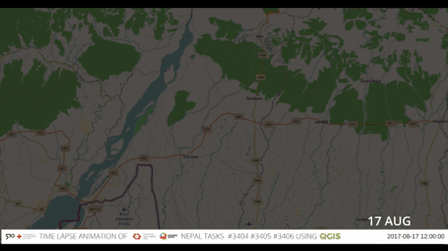

<!--
This Markdown file is designed to be compiled into a HTML file using Marpit.
Use marpit-cli to do that. Install it:
https://github.com/marp-team/marp-cli
And then run in the local directory the command:
   npx marp presentation.md
... which should create a "presentation.html" file.
-->

# OpenStreetMap

## Contribute, and use the data in QGIS

Stéphane Guillou (UQ Library)

---

# What is OSM?

See the front page: https://www.openstreetmap.org

- **Community-driven** project, mainly crowdsourced from volunteers :green_heart:
- Values **local knowledge** :round_pushpin:
- Released as **open data**: Open Database Licence :open_hands:
- Supported by non-for-profit: **OSM Foundation** :money_with_wings:

---

# Statistics

2004 -> 2022 :chart_with_upwards_trend: :

- 8+ million contributors
- 120+ million changesets
- 7+ billion nodes

<!--  -->

---

# Uses

---

# Uses (2)

 

---

# Uses (3)

 

---

# Considerations :warning:

- Coverage very variable: https://tyrasd.github.io/osm-node-density
- Only as good as the contributed data

However:

- _Possibly_ the only source of data
- _Possibly_ more up to date than others

Use your judgment!

---

# Missing Maps

Humanitarian project that maps parts of the world that are vulnerable to **natural disasters**, **conflicts**, and **epidemics**.

Founders:

Emphasizes engagement of, and respect towards the local community. :handshake:

---

# Missing Maps

Impact:

 

2010 Haïti earthquake (left); 2017 South Asian floods (right)

---

# Let's map!

https://osmlab.github.io/show-me-the-way/

---

# What else can be mapped?

A lot: https://wiki.openstreetmap.org/wiki/Map_Features

