## 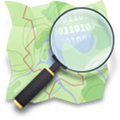{width="100"} What is OSM?

See the front page: <https://www.openstreetmap.org>

-   **Community-driven** project, mainly crowdsourced from volunteers 💚
-   Values **local knowledge** 📌
-   Released as **open data**: Open Database Licence 👐🏽
-   Supported by non-for-profit: **OSM Foundation** 💸

## Statistics

::::: columns
::: {.column width="40%"}
2004 -\> 2026 📈 :

-   10+ million contributors
-   180+ million changesets
-   10+ billion nodes
:::

::: column
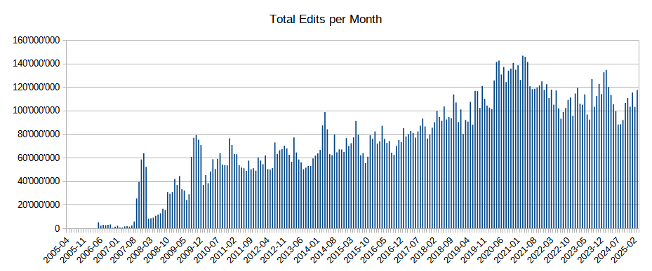

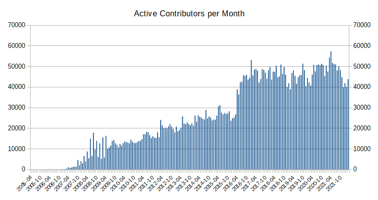
:::
:::::

## Uses

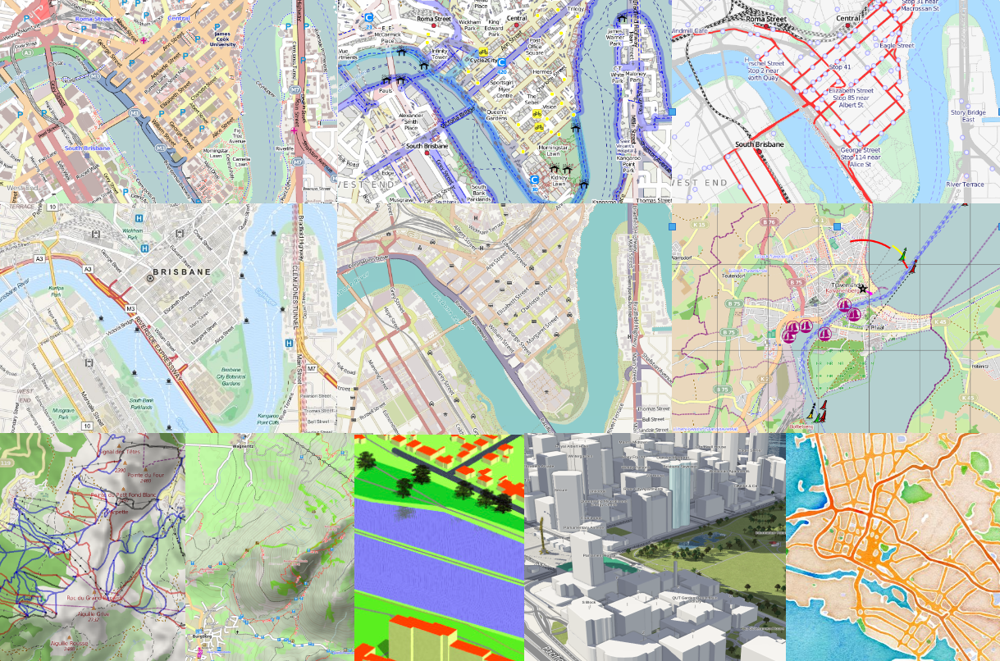

## Uses (2)

::::: columns
::: column
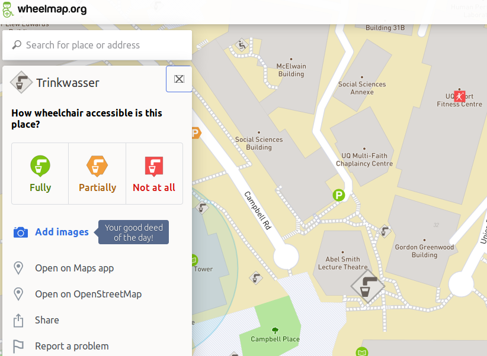
:::

::: column
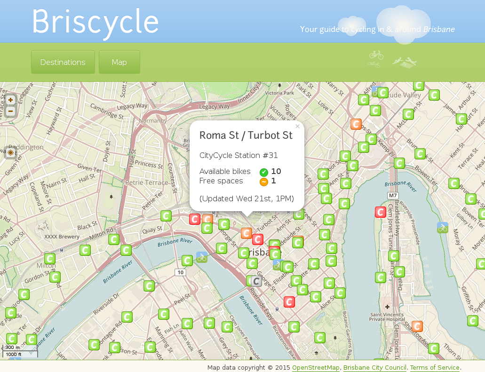
:::
:::::

## Uses (3)

::::: columns
::: {.column width="30%"}
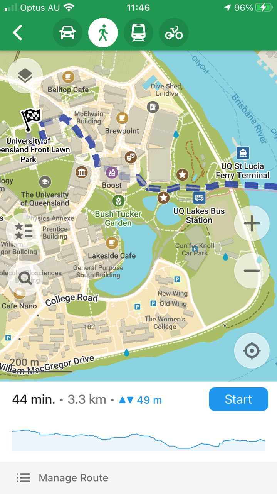
:::

::: column
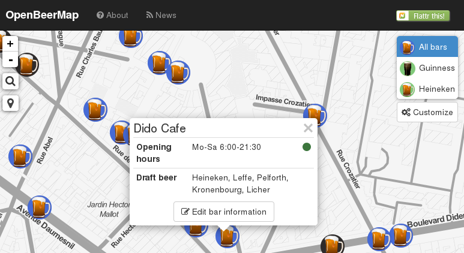
:::
:::::

## Considerations ⚠️

-   Keep in mind:
    -   Coverage very variable: <https://tyrasd.github.io/osm-node-density>
    -   Only as good as the contributed data
-   However:
    -   *Possibly* the only source of data
    -   *Possibly* more up to date than others
-   Use your judgment!

## Missing Maps

Humanitarian project that maps parts of the world that are vulnerable to **natural disasters**, **conflicts**, and **epidemics**.

Founders:

Emphasizes engagement of, and respect towards the local community. 🤝

## Missing Maps

Impact:

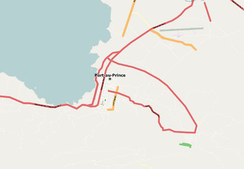 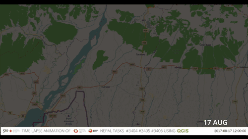

2010 Haïti earthquake (left); 2017 South Asian floods (right)

## Let's map!

<https://osmlab.github.io/show-me-the-way/>

## What else can be mapped?

A lot: <https://wiki.openstreetmap.org/wiki/Map_Features>

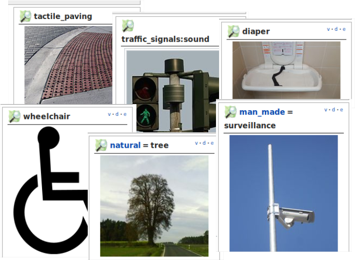
