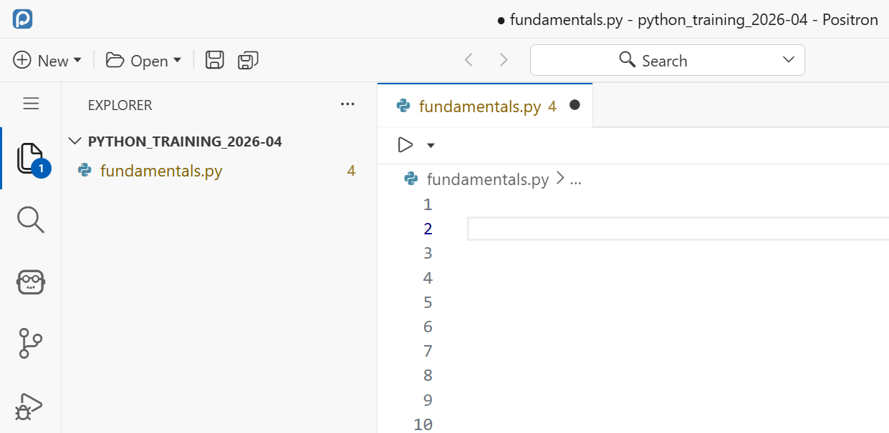

:::{.callout-note}

# Recent update: Positron

These materials have recently been updated to reflect our shift from Spyder to the [Positron](https://positron.posit.co/) IDE.

Positron looks and feels like VS Code with the data science features of RStudio and Spyder. 

The Python content remains unchanged.

:::

This hands-on programming course – directed at beginners – will get you started on using **Python 3** and the program **Positron** to import, explore, analyse and visualise data.

## Setup

You'll need to install Python 3 and Positron (or your preferred IDE). This depends on your machine (and your admin rights).

:::{.panel-tabset}

## Most users

If you can, [download and install Python](https://www.python.org/downloads/) with the official install manager. If you don't have admin rights, you should still be able to perform a user-based install.

Next, [download and install Positron](https://positron.posit.co/download.html).

## UQ-owned devices

You should install Positron via Company Portal / Self-service. If Positron cannot detect a Python interpreter, you should install Anaconda as well.

## UQ Library loan laptops

You should install Positron via Zenworks. If Positron cannot detect a Python interpreter, you should install Python with IDLE as well.

:::


## Introducing Python and Positron

Python is a **programming language** that can be used to build programs (i.e. a "general programming language"), but it can also be used to analyse data by importing a number of useful modules.

We are using **Positron** to interact with Python more comfortably. If you have used RStudio to interact with R before, you should feel right at home: Positron is a program designed for doing data science with Python and built by the RStudio developers (Posit).

We will start by using the **console** to work interactively. If Positron hasn't started with Python (it might have automatically loaded R!), you should "Start new session" or click on the R version button (top right of console) and change it to Python.

This is our direct line to the computer, and is the simplest way to run code. You know it's the console by the distinctive prompt:

```python
>>> 
```

which awaits your command.

### Maths

To start with, we can use Python like a calculator. Type the following **commands** in the console, and press <kbd>Enter</kbd> to **execute** them:

```{python}
1 + 1
2 * 3
4 / 10
5 ** 2
```

After running each command, you should see the result as an output.

## Variables

### Numbers

Most programming languages are like spoken language in that they have nouns and verbs - you have "things" and they "do things". In Python, we have **variables** and **functions**. We'll look first at variables, the nouns of Python, which store data.

To create a variable, we choose its name (e.g. `favNumber`) and assign (`=`) it a value (e.g. `42`):

```{python}
example_int = 42
```

You can then retrieve the value by running the variable name on its own:

```{python}
example_int
```

Notice that, in the **variable explorer**, the number has also appeared? This is one way that Positron helps you program.

Let's create more variables. We can use the variable names in place of their values, so we can perform maths:

```{python}
example_float = 5.678
example_int * example_float
```

In the variable explorer, the *type* of `example_int` is `int` (far right), while the other is `float`. These are different **variable types** and can operate differently. `int` means integer, and corresponds to whole numbers, while `float` stands for floating point number, meaning decimals. You may occasionally encounter errors where you can only use one type.

### Booleans

Even simpler than integers is the **boolean** type. These are either 1 or 0 (True or False), representing a single binary unit (bit). Don't be fooled by the words, these work like numbers: `True + True` gives `2`.

```{python}
example_bool = True
```

> In Python, the boolean values `True` and `False` **must** begin with a capital letter.

### Sequences

Let's look at variable types which aren't (necessarily) numbers. **Sequences** are variables which store more than one data point. For example, **strings** store a sequence of characters and are created with quotation marks `'<insert string>' ` or `"<insert string>"`:

```{python}
example_string = 'Hello world!'
```

We can also create **lists**, which will store several variables (not necessarily of the same type). We need to use square brackets for that:

```{python}
example_list = [38, 3, 54, 17, 7]
diverse_list = [3, 'Hi!', 9.0]
```

Lists are very flexible as they can contain any number of items, and any type of data. You can even nest lists inside a list, which makes for a very flexible data type.

Operations on sequences are a bit different to numbers. We can still use `+` and `*`, but they will concatenate (append) and duplicate, rather than perform arithmetic.

```{python}
example_string + ' How are you?'
example_list + diverse_list
3 * example_list
```

However, depending on the variable, some operations won't work:

```{python}
#| error: true
example_string + example_int
```

There are other data types like tuples, dictionaries and sets, but we won't look at those in this session. Here's a summary of the ones we've covered:

| Category | Type | Short name | Example | Generator |
| --- | --- | --- | --- | --- |
| Numeric | Integer | `int` | `3` | `int()` |
| Numeric | Floating Point Number | `float` | `4.2` | `float()` |
| Numeric | Boolean | `bool` | `True` | `bool()`|
| Sequence | String | `str` | `'A sentence '` | `" "` or `' '` or `str()` |
| Sequence | List | `list` | `['apple', 'banana', 'cherry']` | `[ ]` or `list()` |

The **generator** commands are new. We use these to manually change the variable type. For example, 
```{python}
int(True)
```
yields `1`, converting a **boolean** into an **integer**. These commands are **functions**, as opposed to variables - we'll look at functions a bit later.


#### Indexing

We can access part of a sequence by **indexing**. Sequences are ordered, **starting at 0**, so the first element has index 0, the second index 1, the third 2 and so on. For example, see what these commands return:

```{python}
example_string[0]
example_string[6]
example_list[4]
```

If you want more than one element in a sequence, you can **slice**. Simple slices specify a range to slice, from the first index to the last, **but not including the last**. For example:

```{python}
example_list[0:4]
```

That command returns elements from position 0 up to - but not including! - position 4.

## Scripts and folders

So far, we've been working in the console, our direct line to the computer. However, it is often more convenient to use a **script**. These are simple text files which store code and run when we choose. They are useful to

- write code more comfortably,
- store clearly defined steps in chronological order,
- share a process with peers easily, and
- make your work reproducible

Let's create a folder system to store our work and navigate there.

1. Create a new folder on your computer called "python_training" (or something similar).
2. Press `File > Open folder...`, find and select the new folder

Positron will now move to the new folder.

3. Create a new script with `New > New file...` and choose "Python file"
4. Save the file to give it a name (e.g. `fundamentals.py`)

You should now see a script on the **explorer** pane in Positron, looking something like this:



Try typing a line of code in your new script, such as
```{python}
1 + 1
```
Press <kbd>ctrl</kbd>+<kbd>enter</kbd> to run each line (or <kbd>CMD</kbd>+<kbd>return</kbd>). You should see the same code appear in the console with its result.

## Functions

**Functions** are little programs that do specific jobs. These are the verbs of Python, because they do things to and with our variables. Here are a few examples of built-in functions:

```{python}
example_list = [1,2,3,4]
len(example_list)
min(example_list)
max(example_list)
sum(example_list)
round(5.123)
```

Functions always have parentheses after their name, and they can take one or several **arguments**, or none at all, depending on what they can do, and how the user wants to use them.

Here, we use two arguments to modify the default behaviour of the `round()` function:

```{python}
round(5.123, 2)
```

> Notice how Positron gives you hints about the available arguments after typing the function name?

### Operators

Operators are a special type of function in Python with which you're already familiar. The most important is ` = `, which assigns values to variables. Here is a summary of some important operators, although there are many others:

#### General
| Operator | Function | Description | Example command |
| --- | --- | --- | --- |
| = | Assignment | Assigns values to variables | `a = 7` | 
| # | Comment | Excludes any following text from being run | `# This text will be ignored by Python`

#### Mathematical
| Operator | Function | Description | Example command | Example output |
| --- | --- | --- | --- | --- |
| + | Addition | Adds or concatenates values, depending on variable types | `7 + 3` or `"a" + "b"` | `10` or `'ab'` |
| - | Subtraction | Subtracts numerical values | `8 - 3` | `5` |
| * | Multiplication | Multiplies values, depending on variable types | `7 * 2` or `"a" * 3` | `14` or `'aaa'`|
| / | Division | Divides numerical vlues | `3 / 4` | `0.75` |
| ** | Exponentiation | Raises a numerical value to a power | `7 ** 2` | `49` |
| % | Remainder | Takes the remainder of numerical values | `13 % 7` | `6` |

#### Comparison
| Operator | Function | Description | Example command | Example output |
| --- | --- | --- | --- | --- |
| == | Equal to | Checks whether two variables are the same and outputs a boolean | `1 == 1` | `True` |
| != | Not equal to | Checks whether two variables are different | `'1' != 1` | `True` |
| > | Greater than | Checks whether one variable is greater than the other | `1 > 1` | `False` |
| >= | Greater than or equal to | Checks whether greater than (>) or equal to (==) are true | `1 >= 1` | `True` |
| < | Less than | Checks whether one variable is less than the other | `0 < 1` | `True` |
| <= | Less than or equal to | Checks whether less than (<) or equal to (==) are true | `0 <= 1` | `True` |

## Finding help

To find help about a function, you can use the `help()` function, or a `?` after a function name:

```{python}
help(max)
print?
```


> The help information can often be dense and difficult to read at first, taking some practice. In the [next session](https://github.com/uqlibrary/technology-training/blob/4ea3e86ab8f6f43a73c3b3a44d63a00ac8d366f8/Python/revamp/data_transformation.md) we look closer at interpreting this **documentation**, one of the most important Python skills.

For a comprehensive manual, go to the [official online documentation](https://docs.python.org/). For questions and answers, typing the right question in a search engine will usually lead you to something helpful. If you can't find an answer, [StackOverflow is a great Q&A community](https://stackoverflow.com/questions/tagged/python).

## Activity 1

In this first activity, write a program which takes an age in years and outputs how many minutes they've lived for. Note that

$$\text{Age (minutes)} = \text{Age (years)} \times 365 \times 24 \times 60$$

Steps

* Store the age in years in a variable
* Calculate the age in minutes
* Print a message with the output

> Note: if you want to print a number (e.g. the age), the easiest way is to send multiple arguments to the print function. For example,
> `print("The first number is", 1)`


:::{.callout-note}
# Advanced

If this is too easy, try to get the user to provide their age themselves with the command `int(input(...))`. **Make sure to use `int()`**, otherwise the string multiplication will may cause a crash. You'll want the [documentation for `input()`](https://docs.python.org/3/library/functions.html#input).
:::

<!--
### Stage 2

Next, we'll get the user to provide the age themselves. To prompt the user for to submit a value, we need to use a new command: `input`.

```{python}
#| eval: false
number = int(input("Pick a number: "))
```

Here, `input` asks the user to pick a number. After the user (you) types something into the console and presses <kbd>enter</kbd>, it is saved by Python in the variable `number`. Note that we need to put the input inside an `int( ... )` function to turn it into a number.

-->

:::{.callout-note collapse="true"}
# Solution

We have three lines of code corresponding to the steps above:

```{python}
### Age in minutes calculator
  
# Input age
age_years = 56

# Calculate age in mins
age_mins = age_years * 365 * 24 * 60

# Print result
print("You have lived for", age_mins, "minutes!")
```

To include the `input()` command,

```{python}
#| eval: false
### Age in minutes calculator
  
# Input age
age_years = int(input("What is your age? "))

# Calculate age in mins
age_mins = age_years * 365 * 24 * 60

# Print result
print("You have lived for", age_mins, "minutes!")
```
:::

<!-- 
## Conditionals

Funnelling code through different blocks based on conditions is a fundamental element of all programming, and achieved in Python with conditionals. The most important is the `if` statement, which checks a condition and runs the **indented** code block if it returns `True`:

```{python}
if 1 + 1 == 2:
    print("We are inside the if statement!")
```

Here's how it works
1. `if` starts the conditional.
2. `1 + 1 == 2` is the condition - this comes after `if`, and must return `True` (1) or `False` (0).
3. The colon, `:`, indicates that the condition is finished and the code block is next
4. `    print(" ...` the **indented** code is only run if the condition is `True` (1).

Try altering the condition, and see if the code runs.

Obviously, $1 + 1 = 2$, so this will always run and we don't need to use an `if` statement. Let's replace the condition with variables:

```{python}
name = "your_name"

if len(name) > 5:
  print(name + " is longer than 5 letters!")
```

Here, we're checking if the length of `name` is greater than `5`. Note that `name + " is longer than 5!"` concatenates (combines) the strings together.

<blockquote>
### Advanced

Using `name + " is longer than 5!"` is a bit clunky, there is a better way to include variables in strings, called **f-strings**.
```{python}
name = "your_name"

if len(name) > 5:
  print(f"{name} is longer than 5 letters!")
```

By putting `f` before `'` or `"`, Python will insert any code run between curly brackets `{ }` into the string. Here, running `name` just returns "apple".

</blockquote>

### `elif` and `else`

There are two other commands for conditionals: `elif` and `else`.

`elif` is short for *else if*, and can be used after an if statement to apply another condition, **if** the first one fails.

```{python}
name = "your_name"

if len(name) > 5:
  print(name + " is longer than 5 letters!")

elif len(name) > 3:
  print(name + " is longer than 3 letters, but not more than 5")
```

Here, if the `name` is longer than `5`, it will run in the `if` block and skip `elif`. Otherwise, it will check the `elif` condition and run if it's `True`.

Finally, `else` comes at the end of a conditional and will run if all other conditions failed

```{python}
name = "your_name"

if len(name) > 5:
    print(name + " is longer than 5 letters!")

elif len(name) > 3:
    print(name + " is longer than 3 letters, but not more than 5")

else:
    print(name + " is 3 letters long or shorter.")
```

You can only have one `if` and `else` statement, but as many `elif`s as you'd like.


## Loops

For programming to speed up repetitive tasks we need to use loops. These run a code block multiple times, and there are two types: `while` and `for` loops.

### `while` loops

`while` loops run the code block until the condition is `False`, with similar syntax to `if` statements:

```{python}
a = 0

while a < 10:
    print(a)
    a = a + 1
```

> **WARNING**
> 
> `while` loops can cause an infinite loop to occur if the condition is never `False`. If this happens, press <kbd>ctrl</kbd>+<kbd>C</kbd> or the red square in the console to stop the code.
> 
> 

### `for` loops

`for` loops iterate through a variable, like a list:

```{python}
example_list = [1,2,3,4]

for element in example_list:
    print(element)
```

These work a bit differently. Each time the loop runs, a variable (here called `element`) stores one of the values in the container (here called `myList`). The loop runs once for each element in the container, working from the start to the finish.


## Activity 2

The second activity is a name comparer. Here, we will write code which identifies the letters in common between two names. 

We'll need to use the command `in` for this activity. It checks whether a variable on the left exists inside a variable on the write, for example

```{python}
"app" in "apple"
```

will return `True`. We can use this for conditionals, like

```{python}
word = "apple"
smaller = "app"

if smaller in word:
    print(smaller + "can be found inside" + word)
else:
    print(smaller + "is not inside" + word)
```

We will also need to use a *method*. These are functions that only apply to certain variables, and we access them using dot `.` notation. Here, we will use the list method `.append`:

```{python}
a = [1, 2, 3]
a.append(4)
print(a)
```

The list `a` is originally just `[1, 2, 3]`, but after running `a.append(4)`, it appends the element 4 to the end, making it `[1, 2, 3, 4]`.

All together, for this activity we will need to 

- Ask the user for their first name using `input( ... )`
- Ask the user for their last/second name using `input( ... )`
- Initialise a list of common letters using `common = []` (this will let us append to it later)
- Use a `for` loop to iterate through the each letter in the first name
- Use an `if` statement to check if each letter is inside the last/second name
- Print a message stating the common letters

<details>
  <summary>Solution</summary>
  
  One solution could be the following:
  
  ```{python}
  #| eval: false
  # Name comparer

  # Ask user for names
  firstname = input("What is your first name? ")
  surname = input("What is your surname? ")

  # Initialise list of common letters
  common = [] 

  # Loop through each letter in first name
  for letter in firstname:
    
      # Check if the letter is in the second word
      if letter in surname:
        
          # Add it to the list of common letters
          common.append(letter)
          
  # Print final list of letters
  print("The letter(s) in common between your names are: ")
  print(common)
  ```
              
</details>
-->

## Packages

Python is set apart from other languages by the scale of its community packages and the ease with which you import them. While you *could* code everything you need from scratch, it's often more effective to import someone else's predefined functions. 

### Built-in packages

Python comes with a number of pre-installed packages, so they're already on your computer. However, your specific Python application doesn't have access to them until they're imported:

```{python}
import math
```

The module `math` brings in some mathematics constants and functions. For example, you will get an **error** if you run `pi` on its own, but we can access the constant using the module:

```{python}
math.pi
2*math.pi
math.cos(math.pi)
```

Note that we use a period `.` in order to access objects inside the module. In general, we use periods in Python to access objects stored inside other objects.

### Naming

Some modules have long names and use abbreviated nicknames when imported.

```{python}
import math as m
m.pi
```

Here the module `math` is stored as `m` in Python. 

Where this naming is used, it is usually the standard, and sharing code with different (including original/full) module names will not be compatible with other programmers.

### Common external packages

There are hundreds of thousands of external packages available. These **do not normally come with Python installations** (although they *do* often come with Anaconda-based installations).

While the `import` command lets you connect your Python script with a module *on your computer*, you'll need to download and install the package first.

The simplest way to do this is with the `pip` bash command. **This is not a Python command**: it is a separate program that you run in a terminal. Positron gives us a bit of beyond-Python magic to run it in the console anyway:

```bash
%pip install <package_name>
```

We recommend that you run this in the console directly, *not in your script*. Just because you only run it once per Python installation.

If you are running this directly the terminal (not the console), you should drop the `%`:

```bash
pip install <package_name>
```

::: {.callout-warning}
# Beware Anaconda (`conda`) users

If you've installed Python via the Anaconda distribution, you should avoid using `pip` to install packages where possible. This is because you can create conflicts with conda-based packages. However, **all the packages for today should already be installed**, so you can skip this step!

Anaconda provides an alternative interface to `pip` for installing packages:

```bash
conda install <package_name>
```

which you should preference. Only use `pip` if the package is not accesible via `conda`.

:::


We'll look at a few packages today, and a few more as we progress through the series. The ones for today are

* [numpy](https://numpy.org/) (for numerical operations, linear algebra etc.)
* [pandas](https://pandas.pydata.org/) (for panel data, e.g. csv files, spreadsheets etc.)
* [seaborn](https://seaborn.pydata.org/) (for high-level visualisations)

To install them all in one go, use

```bash
%pip install numpy pandas seaborn
```

Once you've installed the packages, **you will need to restart the console** with the *Restart Python*  button in the console.

### An example: `numpy`

You might recall that multiplication for sequences replicates them. This makes multiplying numeric lists unexpected:

```{python}
3 * [1,2,3]
```

What if we wanted to multiply *each* element by `3`? Well, the developers of `numpy` decided to create a variable where this *does* happen: the array. To turn a list into an array, use the `np.array()` function

```{python}
import numpy as np
example_array = np.array([1,2,3])

3 * example_array
```

That works well!

Some popular packages include

| Package | Install command | Import command | Description |
| ---- | ---- | ---- | ---- |
| NumPy | `pip/conda install numpy` | `import numpy as np` | A **num**erical **Py**thon package, providing mathematical functions and constants, vector analysis, linear algebra etc. |
| Pandas | `pip/conda install pandas` | `import pandas as pd` | **Pan**el **Da**ta  - data transformation, manipulation and analysis |
| Matplotlib | `pip/conda install matplotlib` | `import matplotlib.pyplot as plt` | **Mat**hematical **plot**ing **lib**rary, a popular visualisation tool. Note that there are other ways to import it, but the `.pyplot` submodule as `plt` is most common. |
| Seaborn | `pip/conda install seaborn` | `import seaborn as sns` | Another visualisation tool, closer to ggplot2 in R, built upon a matplotlib framework. |
| SciPy | `pip/conda install scipy` | `import scipy` or `import scipy as sp` | A **sci**entific **Py**thon package with algorithms and models for analysis and statistics. |
| Statsmodels | `pip/conda install statsmodels` | `import statsmodels.api as sm` and/or `import statsmodels.tsa.api as tsa`| **Stat**istical **model**ling. The first import `sm` is for cross-sectional models, while `tsa` is for time-series models. | 
| Requests | `pip/conda install requests` | `import requests` | Make HTTP (internet) **requests**. |
| Beautiful Soup | `pip/conda install beautifulsoup4` | `from bs4 import BeautifulSoup` | Collect HTML data from websites. | 


## Activity 2

In this final activity, we're going to create some sample data and visualise it.

**Our goal is to import and visualise random BMI data**

We'll complete this in two parts. Before we begin, we need to set things up by importing the modules we need

```{python}
import pandas as pd
import seaborn as sns
```

> If importing any of these causes an error, it could be because you haven't installed it yet. See [above](#External-packages) for information on how to do so.

Before we begin this activity we should bring in the data. To do this, we use the `pd.read_csv()` function, specifying the file path as the first argument (this can be a URL), and store it in a variable (typically `df`). For example,

```{python}
#| eval: false
df = pd.read_csv("insert_filepath_here")
```

Today's data is five (random) people's height and weight. You can download it [here](BMI_data.csv).

1. Create a folder called `data` next to your script
2. [Download the data](BMI_data.csv)
3. Move the csv into your `data` folder
4. Read it in with `df = pd.read_csv("data/BMI_data.csv")`

### Part 1: Modifying the data

For the first part of the challenge, you'll need to compute each person's BMI, and store it in a new column. For reference, we access columns by indexing based on their name, e.g. `df["Weight"]` is the Weight column. To make a new column, we pretend that it already exists and assign into it. For example, to convert from kilograms to pounds,

```{python}
#| eval: false
# Create a new column called Weight (lb) and store the weight in pounds
df["Weight (lb)"] = df["Weight"]*2.205
```

To compute the BMIs, make another new column and use the following formula to calculate the BMI.

$$ \text{BMI} = \frac{\text{Weight (kg)}}{(\text{Height (m)})^2} $$

It should look something like
```{python}
#| eval: false
df["BMI"] = ...
```

> Hint: $x^2$ is `x**2`

Once you've done these steps, you should see the following:

```{python}
#| echo: false

# Import packages
import pandas as pd
import seaborn as sns

# Import data - don't forget to change the file path as you need
df = pd.read_csv("BMI_data.csv")

# Example - create a new column called Weight (lb) and store the weight in pounds
df["Weight (lb)"] = df["Weight"]*2.205

# Create BMI column
df["BMI"] = df["Weight"] / (df["Height"]**2)

# Look at the data
df
```


:::{.callout-note collapse="true"}
# Solution

One solution could be the following:
  
```{python}
#| eval: false

# Import packages
import pandas as pd
import seaborn as sns

# Import data - don't forget to change the file path as you need
df = pd.read_csv("BMI_data.csv")

# Example - create a new column called Weight (lb) and store the weight in pounds
df["Weight (lb)"] = df["Weight"]*2.205

# Create BMI column
df["BMI"] = df["Weight"] / (df["Height"]**2)

# Look at the data
df
```
              
:::

### Part 2: Visualisation

To visualise the data, we can use the **seaborn** module, with the function `sns.catplot( ... )`. Inside the function, we'll need to specify the `x` and `y` values, and if we specifically want a bar plot, `kind` as well. Use the `help()` documentation to see if you can visualise the data we just created. See if you can produce something like the following plot:

```{python}
#| echo: false
# Visualise
sns.catplot(data = df, x = "Names", y = "BMI", kind = "bar")
```

You'll need to start with

```{python}
#| eval: false
sns.catplot(data = df, x = ...)
```

> Hint: You only need to use the `data = `, `x = `, `y = ` and `kind = ` parameters, so try figure out what they require!

:::{.callout-note collapse="true"}
# Solution

The plot above is produced with the code
  
```{python}
#| eval: false
# Visualise
sns.catplot(data = df, x = "Names", y = "BMI", kind = "bar")
```
            

:::

## Conclusion and saving your work

Save your script as normal. By default, variables are *not* saved, which is another reason why working with a script is important: you can execute the whole script in one go to get everything back. When you next open the folder in Positron, simply re-run the script to get back to the same state.

### Summary

Today we looked at a lot of Python features, so don't worry if they haven't all sunk in. Programming is best learned through practice, so keep at it! Here's a rundown of the concepts we covered

| Concept | Desctiption |
| --- | --- |
| **The console vs scripts** | The **console** is our window into the computer, this is where we send code directly to the computer. **Scripts** are files which we can write, edit, store and run code, that's where you'll write most of your Python. | 
| **Variables** | **Variables** are the nouns of programming, this is where we store information, the objects and things of our coding. They come in different types like integers, strings and lists. |
| **Indexing** | In order to access elements of a sequence variable, like a list, we need to **index**, e.g. `myList[2]`. Python counts from 0.
| **Functions** | **Functions** are the verbs of programming, they perform actions on our variables. Call the function by name and put inputs inside parentheses, e.g. `round(2.5)` | 
| **Help** | Running `help( ... )` will reveal the **help** documentation about a function or type. |
| **Conditionals** | `if`, `elif` and `else` statements allow us to run code if certain **conditions** are true, and skip it otherwise. |
| **Loops** | `while` **loops** will repeatedly run code until a condition is no longer true, and `for` **loops** will iterate through a variable | 
| **Packages** | We can bring external code into our environment with `import ... `. This is how we use **packages**, an essential for Python. Don't forget to install the package first! | 

### Next session

Thanks for completing this introductory session to Python! You're now ready for our next session, [Managing Data](../2-data_processing/data_processing.qmd), which looks at using the **pandas** package in greater depth.

Before you go, don't forget to check out the [Python User Group](https://uqpug.github.io/), a gathering of Python users at UQ.

Finally, if you need any support or have any other questions, shoot us an email at [training@library.uq.edu.au](training@library.uq.edu.au).
