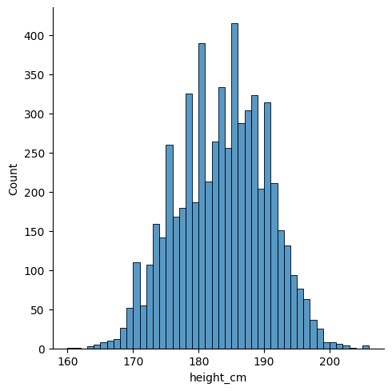
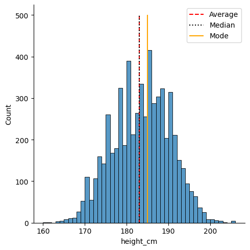
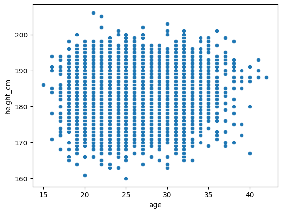
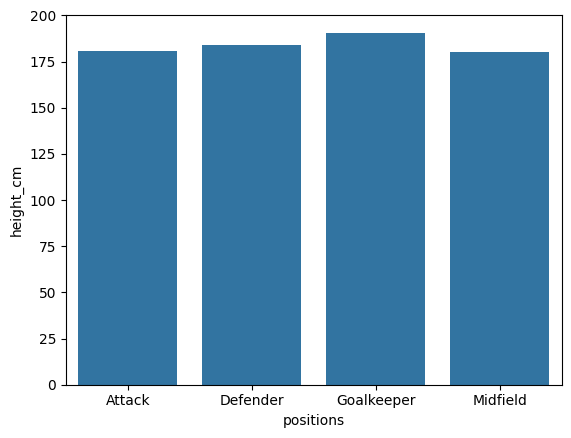
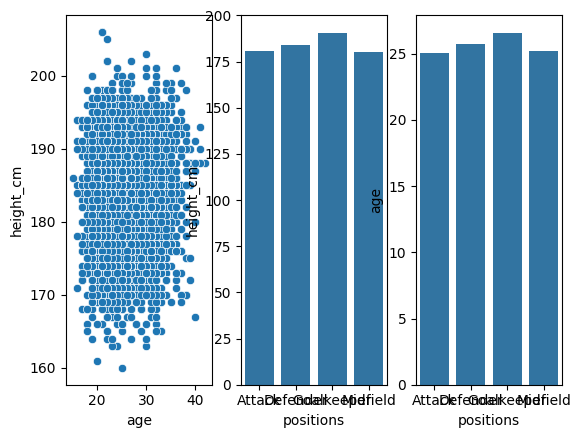
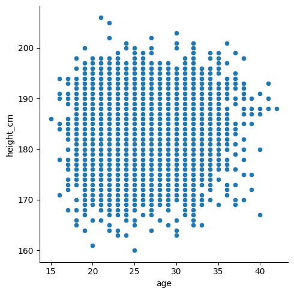
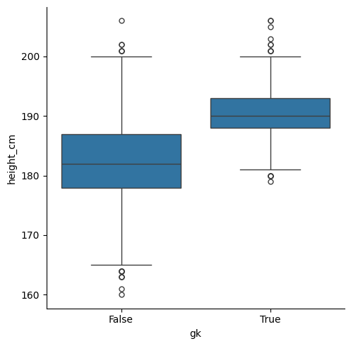
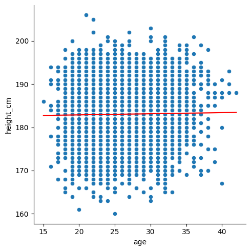

# Python training (4 of 4): statistics and further visualisation


This session is aimed as an overview of how to perform some statistical
modelling with Python. **It is a Python workshop, not a statistics
workshop** - if you’d like to better understand the statistical models,
or need help deciding what’s best for you, please consult a statistics
resource or contact a statistician.

In this session, we’ll cover

- Descriptive statistics
  - Measures of central tendancy
  - Measures of variability
  - Measures of correlation
- Inferential statistics
  - Linear regressions
  - T-tests
  - $\chi^2$ tests
  - Generalised regressions
- Visualising statistics
  - Adding lines to graphs to indicate bounds
  - Shading regions
  - Subplots
  - Boxplots

We’ll use two new modules: - `scipy.stats` - `statsmodels`

## Setup

### Jupyter notebooks

As with last week, we’re going to work from a Jupyter notebook.

#### Opening Jupyter

**If you installed Spyder via Anaconda**

Then you’ve already got it! Open the application “Jupyter” on your
computer. Alternatively, open a command prompt / shell and type
`jupyter notebook`.

**If you installed Spyder manually**

Then you’ll probably need to get it. The simplest way is via a pip
install.

1.  Open a command prompt / shell
2.  Type `pip install jupyterlab`
3.  Once it’s finished, type `jupyter notebook` in your shell

**If you can’t install it**

If you’re having issues with the installation, can’t get it to work or
don’t want to, you can use [Google Colab](https://colab.google/)
instead. Just sign in with your Google account and you gain access to a
cloud-hosted notebook. Note that everything will save to your Google
Drive.

#### Creating a notebook

Once you’ve opened Jupyter/Colab,

1.  Navigate to a folder on your computer where you’d like to save
    today’s files. We suggest the project folder you’ve been using for
    the past two sessions.
2.  Press `New` -\> `Notebook` to create your notebook. Select Python3
    when prompted.

#### Using notebooks

The fundamental building block of jupyter notebooks is the **cell**.
This is the block you can currently write in:


I can type Python code into this cell and run it. I can also change it
to [markdown](https://www.markdownguide.org/) to type formatted code.

### Modules and Data

Let’s import all our modules for today:

``` python
import matplotlib.pyplot as plt
import pandas as pd
import scipy.stats as stats
import seaborn as sns
import statsmodels.formula.api as smf
```

We’ll be working from our “Players2024” dataset again. If you don’t have
it yet,

1.  [Download the
    dataset](https://uqpug.github.io/datasets/Players2024.csv).
2.  Create a folder in **in the same location as your script** called
    “data”.
3.  Save the dataset there.

To bring it in and clean it up,

``` python
df = pd.read_csv("data/Players2024.csv")
df = df[df["positions"] != "Missing"]
df = df[df["height_cm"] > 100]
```

## Descriptive Statistics

We’ll start with sample size. All dataframes have most descriptive
statistics functions available right off the bat which we access via the
`.` operator.

To calculate the number of non-empty observations in a column, say the
numeric variable `df["height_cm"]`, we use the `.count()` method

``` python
df["height_cm"].count()
```

    5932

### Measures of central tendancy

We can compute measures of central tendancy similarly. The average value
is given by

``` python
df["height_cm"].mean()
```

    183.04130141604855

the median by

``` python
df["height_cm"].median()
```

    183.0

and the mode by

``` python
df["height_cm"].mode()
```

    0    185.0
    Name: height_cm, dtype: float64

> `.mode()` returns a dataframe with the most frequent values as there
> can be multiple.

#### Visualisation

Let’s visualise our statistics as we go. We can start by producing a
histogram of the heights with `seaborn`:

``` python
sns.displot(df["height_cm"], binwidth = 1)
```



We can use matplotlib to annotate the locations of these statistics.
Let’s save them into variables and then make the plot again. The
important function is
[`plt.vlines`](https://matplotlib.org/stable/api/_as_gen/matplotlib.pyplot.vlines.html),
which enables you to create vertical line(s) on your plot. We’ll do it
once for each so that we get separate legend entries. We’ll need to
provide the parameters

- `x =`
- `ymin =`
- `ymax =`
- `colors =`
- `linestyles =`
- `label =`

``` python
# Save the statistics
height_avg = df["height_cm"].mean()
height_med = df["height_cm"].median()
height_mod = df["height_cm"].mode()

# Make the histogram
sns.displot(df["height_cm"], binwidth = 1)

# Annotate the plot with vertical and horizontal lines
plt.vlines(x = height_avg, ymin = 0, ymax = 500, colors = "r", linestyles = "dashed", label = "Average")
plt.vlines(x = height_med, ymin = 0, ymax = 500, colors = "k", linestyles = "dotted", label = "Median")
plt.vlines(x = height_mod, ymin = 0, ymax = 500, colors = "orange", linestyles = "solid", label = "Mode")

# Create the legend with the labels
plt.legend()
```



### Measures of variance

We can also compute measures of variance. The minimum and maximum are as
expected

``` python
df["height_cm"].min()
df["height_cm"].max()
```

    206.0

The range is the difference

``` python
df["height_cm"].max() - df["height_cm"].min()
```

    46.0

Quantiles are given by `.quantile(...)` with the fraction inside. The
inter-quartile range (IQR) is the difference between 25% and 75%.

``` python
q1 = df["height_cm"].quantile(0.25)
q3 = df["height_cm"].quantile(0.75)
IQR = q3 - q1
```

A column’s standard deviation and variance are given by

``` python
df["height_cm"].std()
df["height_cm"].var()
```

    46.7683158241558

And the standard error of the mean (SEM) with

``` python
df["height_cm"].sem()
```

    0.08879229764682213

You can calculate the skewness and kurtosis (variation of tails) of a
sample with

``` python
df["height_cm"].skew()
df["height_cm"].kurt()
```

    -0.4338044567190438

All together, you can see a nice statistical summary with

``` python
df["height_cm"].describe()
```

    count    5932.000000
    mean      183.041301
    std         6.838736
    min       160.000000
    25%       178.000000
    50%       183.000000
    75%       188.000000
    max       206.000000
    Name: height_cm, dtype: float64

#### Visualisation

Let’s take our previous visualisation and shade in the IQR and standard
deviations. We’ll need to save the IQR and then use the
`plt.fill_between()` function with the parameters

- `x =`
- `y1 =`
- `y2 =`
- `alpha =` (for the opacity)
- `label =`

``` python
# Save the statistics
height_tot = df["height_cm"].count()
height_avg = df["height_cm"].mean()
height_med = df["height_cm"].median()
height_mod = df["height_cm"].mode()

# Save the quartiles as well
height_Q1 = df["height_cm"].quantile(0.25)
height_Q3 = df["height_cm"].quantile(0.75)

# Make the histogram
sns.displot(df["height_cm"], binwidth = 1)

# Annotate the plot with vertical and horizontal lines
plt.vlines(x = height_avg, ymin = 0, ymax = 500, colors = "r", linestyles = "dashed", label = "Average")
plt.vlines(x = height_med, ymin = 0, ymax = 500, colors = "k", linestyles = "dotted", label = "Median")
plt.vlines(x = height_mod, ymin = 0, ymax = 500, colors = "orange", linestyles = "solid", label = "Mode")

# Shade in the IQR
plt.fill_between(x = [height_Q1, height_Q3], y1 = 0, y2 = 500, alpha = 0.2, label = "IQR")

# Create the legend with the labels
plt.legend()
```


### Measures of correlation

If you’ve got two numeric variables, you might want to examine
covariance and correlation. These indicate how strongly the variables
are linearly related. We’ll need to use the `df["age"]` variable as
well.

The covariance between “height_cm” and “age” is

``` python
df["height_cm"].cov(df["age"])
```

    0.5126608276592359

> The `.cov()` function compares the column it’s attached to (here
> `df["height_cm"]`) with the column you input (here `df["age"]`). This
> means we could swap the columns without issue:
>
> `{python} df["age"].cov(df["height_cm"])`

Similarly, we can find the Pearson correlation coefficient between two
columns.

``` python
df["height_cm"].corr(df["age"])
```

    0.01682597901197303

You can also specify “kendall” or “spearman” for their respective
correlation coefficients

``` python
df["height_cm"].corr(df["age"], method = "kendall")
df["height_cm"].corr(df["age"], method = "spearman")
```

    0.007604345289158663

### Reminder about groupbys

Before we move to inferential statistics, it’s worth reiterating the
power of groupbys discussed in the second workshop.

To group by a specific variable, like “positions”, we use

``` python
gb = df.groupby("positions")
```

By applying our statistics to the `gb` object, we’ll apply them to
*every* variable for *each* position. Note that we should specify
`numeric_only = True`, because these statistics won’t work for
non-numeric variables

``` python
averages = gb.mean(numeric_only = True)
averages
```

<div>
<style scoped>
    .dataframe tbody tr th:only-of-type {
        vertical-align: middle;
    }
&#10;    .dataframe tbody tr th {
        vertical-align: top;
    }
&#10;    .dataframe thead th {
        text-align: right;
    }
</style>

|            | height_cm  | age       |
|------------|------------|-----------|
| positions  |            |           |
| Attack     | 180.802673 | 25.061108 |
| Defender   | 184.193269 | 25.716471 |
| Goalkeeper | 190.668508 | 26.587017 |
| Midfield   | 180.497017 | 25.201671 |

</div>

#### Visualisation

Let’s visualise these two results. We’ll look at creating linear
regressions a bit later, so for now we’ll instead look at how matplotlib
lets us combine three separate plots into a single figure.

Because we’re creating multiple plots, we’ll need to use the
**axes-level interface**. This means using `sns.scatterplot` instead of
`sns.relplot` etc.

For our first one, we’ll just do a scatterplot between the **age** and
**height** variables:

``` python
sns.scatterplot(df, x = "age", y = "height_cm")
```



Next, we’ll make a bars plot of the average heights and ages per
position from our group by object

``` python
sns.barplot(averages, x = "positions", y = "height_cm")
```



``` python
sns.barplot(averages, x = "positions", y = "age")
```


Finally, we need to use the
[`plt.subplot()`](https://matplotlib.org/stable/api/_as_gen/matplotlib.pyplot.subplot.html)
function to bring them all together.

It works a bit weirdly. Each time we make a plot, we call it *first*,
telling matplotlib that we’re making a new plot at a new index. It looks
like `plt.subplot(nrows, ncols, index)`, so if we want a $1 \times 3$
figure, we’ll go

``` python
plt.subplot(1, 3, 1)
# Plot 1

plt.subplot(1, 3, 2)
# Plot 2

plt.subplot(1, 3, 3)
# Plot 3
```

``` python
plt.subplot(1, 3, 1)
sns.scatterplot(df, x = "age", y = "height_cm")

plt.subplot(1, 3, 2)
sns.barplot(averages, x = "positions", y = "height_cm")

plt.subplot(1, 3, 3)
sns.barplot(averages, x = "positions", y = "age")
```



We can change the dimensions of our figure by using the
`plt.subplots(...)` (notice the plural `s`) to preconfigure the settings
for our plot

``` python
plt.subplots(1, 3, tight_layout = True, figsize = (12,4))

plt.subplot(1, 3, 1)
sns.scatterplot(df, x = "age", y = "height_cm")

plt.subplot(1, 3, 2)
sns.barplot(averages, x = "positions", y = "height_cm")

plt.subplot(1, 3, 3)
sns.barplot(averages, x = "positions", y = "age")
```


## Inferential Statistics

Inferential statistics requires using the module `scipy.stats`.

### Simple linear regressions

Least-squares regression for two sets of measurements can be performed
with the function `stats.linregress()`”

``` python
stats.linregress(x = df["age"], y = df["height_cm"])
```

    LinregressResult(slope=0.02582749476456191, intercept=182.38260451315895, rvalue=0.01682597901197303, pvalue=0.19506275453364208, stderr=0.01993026652960195, intercept_stderr=0.515991957177263)

If we store this as a variable, we can access the different values with
the `.` operator. For example, the p-value is

``` python
lm = stats.linregress(x = df["age"], y = df["height_cm"])
lm.pvalue
```

    0.19506275453364208

#### Visualisation

Let’s look at implementing the linear regression into our scatter plot
from before. Using the scatterplot from before,

``` python
sns.relplot(data = df, x = "age", y = "height_cm")
```



we’ll need to plot the regression as a line. For reference,

$$ y = \text{slope}\times x + \text{intercept}$$

So

``` python
sns.relplot(data = df, x = "age", y = "height_cm")

# Construct the linear regression
x_lm = df["age"]
y_lm = lm.slope*x_lm + lm.intercept

# Plot the line plot
sns.lineplot(x = x_lm, y = y_lm, color = "r")
```


Finally, we can include the details of the linear regression in the
legend by specifying them in the label. We’ll need to `round()` them and
`str()` them (turn them into strings) so that we can include them in the
message.

``` python
sns.relplot(data = df, x = "age", y = "height_cm")

# Construct the linear regression
x_lm = df["age"]
y_lm = lm.slope*x_lm + lm.intercept

# Round and stringify the values
slope_rounded = str(round(lm.slope, 2))
intercept_rounded = str(round(lm.intercept, 2))

# Plot the line plot
linreg_label = "Linear regression with\nslope = " + slope_rounded + "\nintercept = " + intercept_rounded
sns.lineplot(x = x_lm, y = y_lm, color = "r", label = linreg_label)
```


### $t$-tests

We can also perform $t$-tests with the `scipy.stats` module. Typically,
this is performed to examine the statistical signficance of a difference
between two samples’ means. Let’s examine whether that earlier groupby
result for is accurate for heights, specifically, **are goalkeepers
taller than non-goalkeepers?**

The function
[`stats.ttest_ind()`](https://docs.scipy.org/doc/scipy/reference/generated/scipy.stats.ttest_ind.html)
requires us to send in the two groups as separate columns, so we’ll need
to do a bit of reshaping.

Let’s start by creating a new variable for *goalkeeper status*, and then
separate the goalkeepers from the non-goalkeepers in two variables

``` python
df["gk"] = df["positions"] == "Goalkeeper"

goalkeepers = df[df["gk"] == True]
non_goalkeepers = df[df["gk"] == False]
```

The $t$-test for the means of two independent samples is given by

``` python
stats.ttest_ind(goalkeepers["height_cm"], non_goalkeepers["height_cm"])
```

    TtestResult(statistic=35.2144964816995, pvalue=7.551647917141636e-247, df=5930.0)

Yielding a p-value of $8\times 10^{-247}\approx 0$, indicating that the
null-hypothesis (*heights are the same*) is extremely unlikely.

#### Visualisation

We can also visualise these results with boxplots, showing the
distributions and their statistical summary. These demonstrate that
there is clearly a significant different in the distributions:

``` python
sns.catplot(df, x = "gk", y = "height_cm", kind = "box")
```



### $\chi^2$ tests

$χ^2$ tests are useful for examining the relationship of categorical
variables by comparing the frequencies of each. Often, you’d use this if
you can make a contingency table.

We only have one useful categorical variable here, “positions” (the
others have too many unique values), so we’ll need to create another.
Let’s see if there’s a relationship between players’ positions and names
with the letter “a”.

Make a binary column for players with the letter “a” in their names. To
do this, we need to apply a string method to *all* the columns in the
dataframe as follows

``` python
df["a_in_name"] = df["name"].str.contains("a")
```

Let’s cross tabulate positions with this new column

``` python
a_vs_pos = pd.crosstab(df["positions"],df["a_in_name"])
print(a_vs_pos)
```

    a_in_name   False  True 
    positions               
    Attack        291   1280
    Defender      355   1606
    Goalkeeper    149    575
    Midfield      312   1364

The $χ^2$ test’s job is to examine whether players’ positions depend on
the presence of “a” in their name. To evaluate it we need to send the
contingency table in:

``` python
stats.chi2_contingency(a_vs_pos)
```

    Chi2ContingencyResult(statistic=2.1808405074930404, pvalue=0.5357320466340116, dof=3, expected_freq=array([[ 293.17211733, 1277.82788267],
           [ 365.9519555 , 1595.0480445 ],
           [ 135.10923803,  588.89076197],
           [ 312.76668914, 1363.23331086]]))

### More complex modelling

If you need to do more advanced statistics, particularly if you need
more regressions, you’ll likely need to turn to a different package:
`statsmodels`. It is particularly useful for **statistical modelling**.

We’ll go through three examples

1.  Simple linear regressions (like before)
2.  Multiple linear regressions
3.  Logistic regressions

What’s nice about `statsmodels` is that it gives an R-like interface and
summaries.

#### Simple linear regressions revisited

Let’s perform the same linear regression as before, looking at the “age”
and “height variables”. Our thinking is that players’ heights dictate
how long they can play, so we’ll make $x = \text{height}$ and
$y = \text{age}$.

The first step is to make the set up the variables. We’ll use the
function `smf.ols()` for ordinary least squares. It takes in two imputs:

- The formula string, in the form `y ~ X1 + X2 ...`
- The data

We create the model and compute the fit

``` python
mod = smf.ols("height_cm ~ age", df)
res = mod.fit()
```

Done! Let’s take a look at the results

``` python
res.summary()
```

|                   |                  |                     |           |
|-------------------|------------------|---------------------|-----------|
| Dep. Variable:    | height_cm        | R-squared:          | 0.000     |
| Model:            | OLS              | Adj. R-squared:     | 0.000     |
| Method:           | Least Squares    | F-statistic:        | 1.679     |
| Date:             | Mon, 24 Mar 2025 | Prob (F-statistic): | 0.195     |
| Time:             | 14:25:57         | Log-Likelihood:     | -19821.   |
| No. Observations: | 5932             | AIC:                | 3.965e+04 |
| Df Residuals:     | 5930             | BIC:                | 3.966e+04 |
| Df Model:         | 1                |                     |           |
| Covariance Type:  | nonrobust        |                     |           |

OLS Regression Results

|           |          |         |         |          |         |         |
|-----------|----------|---------|---------|----------|---------|---------|
|           | coef     | std err | t       | P\>\|t\| | \[0.025 | 0.975\] |
| Intercept | 182.3826 | 0.516   | 353.460 | 0.000    | 181.371 | 183.394 |
| age       | 0.0258   | 0.020   | 1.296   | 0.195    | -0.013  | 0.065   |

|                |        |                   |          |
|----------------|--------|-------------------|----------|
| Omnibus:       | 86.537 | Durbin-Watson:    | 1.995    |
| Prob(Omnibus): | 0.000  | Jarque-Bera (JB): | 56.098   |
| Skew:          | -0.098 | Prob(JB):         | 6.58e-13 |
| Kurtosis:      | 2.566  | Cond. No.         | 151\.    |

<br/><br/>Notes:<br/>[1] Standard Errors assume that the covariance matrix of the errors is correctly specified.

  
That’s a lot nicer than with scipy. We can also make our plot from
before by getting the model’s $y$ values with `res.fittedvalues`

``` python
sns.relplot(data = df, x = "age", y = "height_cm")
sns.lineplot(x = df["age"], y = res.fittedvalues, color = "r")
```



#### Generalised linear models

The `statsmodels` module has lots of advanced statistical models
available. We’ll take a look at one more: Generalised Linear Models. The
distributions they include are

- Binomial
- Poisson
- Negative Binomial
- Gaussian (Normal)
- Gamma
- Inverse Gaussian
- Tweedie

We’ll use the *binomial* option to create logistic regressions.

Logistic regressions examine the distribution of binary data. For us, we
can compare the heights of **goalkeepers vs non-goalkeepers** again.
Let’s convert our **gk** column from `True` $\rightarrow$ `1` and
`False` $\rightarrow$ `0` by converting to an `int`:

``` python
df["gk"] = df["gk"].astype(int)
```

Now, we can model this column with height. Specifically,

$$ \text{gk} \sim \text{height}$$

Start by making the model with the function `smf.glm()`. We need to
specify the family of distributions; they all live in `sm.families`,
which comes from a different submodule that we should import:

``` python
import statsmodels.api as sm
mod = smf.glm("gk ~ height_cm", data = df, family = sm.families.Binomial())
```

Next, evaluate the results

``` python
res = mod.fit()
```

Let’s have a look at the summary:

``` python
res.summary()
```

Finally, we can plot the result like before

``` python
sns.relplot(data = df, x = "height_cm", y = "gk")
sns.lineplot(x = df["height_cm"], y = res.fittedvalues, color = "black")
```


## Conclusion

Python definitely has powerful tools for statistics and visualisations!
If any of the content here was too challenging, you have other related
issues you’d like to discuss or would simply like to learn more, we the
technology training team would love to hear from you. You can contact us
at <training@library.uq.edu.au>.

Here’s a summary of what we’ve covered

| Topic | Description |
|----|----|
| **Descriptive statistics** | Using built-in methods to pandas series (via `df["variable"].___` for a dataframe `df`) we can apply descriptive statistics to our data. |
| **Using matplotlib to include statistical information** | Using `plt.vlines()` and `plt.fill_between()`, we can annotate the plots with lines showing statistically interesting values. |
| **Subplotting** | The matplotlib functions `plt.subplots()` and `plt.subplot()` let us place multiple plots in the same figure. |
| **Inferential statistics** | Using the `scipy.stats` and `statsmodels` modules, we can perform statistical tests and modelling. |

### Resources

- [Official scipy.stats
  documentation](https://docs.scipy.org/doc/scipy/reference/stats.html)
- [Official statsmodels
  documentation](https://www.statsmodels.org/stable/index.html)
- [Official seaborn
  documentation](https://seaborn.pydata.org/index.html)
- [Official matplotlib
  documentation](https://matplotlib.org/stable/index.html)
- Our [compilation of useful Python
  links](https://github.com/uqlibrary/technology-training/blob/master/Python/useful_links.md)
