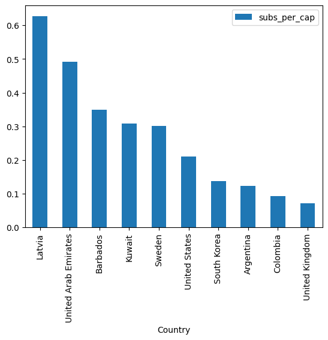

# Python Data Transformation


## Setup

This workshop is all about data transformation and analysis. We need two things:
- Data transformation tools
- Data to transform

### Importing the tools (modules)

We'll use the popular module `pandas` for analysing data. To import this module, run


```python
import pandas as pd
```

Note that we use `as pd` to indicate that we'll access the tools via `pd.`, rather than `pandas.`. It's just a local nickname for convenience.

> If you encounter the **`ModuleNotFoundError`**:
> 1. Check that you haven't misspelt anything: we're using `import pandas as pd`
> 2. You've likely not installed this module yet. Follow the steps below
> #### Installing `pandas`
> Module installation depends on your Python installation.
>
> **For Anaconda installations**
>
> If you have an Anaconda installation (i.e., you installed Anaconda to get Python), run the following line:
>
> `!conda install pandas`
>
> **For other installations**
>
> If you *don't* (make **sure** you don't), then run 
>
> `!pip install pandas`

### Importing the data

Today we'll work with data from YouTube. You can find the data [here](https://raw.githubusercontent.com/uqlibrary/technology-training/master/Python/revamp/Global%20YouTube%20Statistics.csv).

**NEED NEW LINK WHEN MOVED TO PERMANENT LOCATION - i.e. NOT /PYTHON/REVAMP/**

Please download the data **to your project folder**.

Next, we need to bring it into Python.

Using the pandas function `pd.read_csv()`, we load the data by specifying its path. Because we're in the same folder, that's just its name:


```python
df_raw = pd.read_csv("Global_YouTube_Statistics.csv")
```

> If your data is stored online, you can specify a URL instead!

We won't work directly with `df_raw` - this serves as our backup. Instead, we'll copy it into a variable that we are happy to edit:


```python
df = df_raw.copy()
```

## Basic exploration

We can see the first $n$ rows with `df.head(n)`:


```python
df.head()
df.head(2)
```


|    |   rank | Youtuber       |   subscribers |   video views | category         | Title         |   uploads | Country       | Abbreviation   | channel_type   | ...   |   subscribers_for_last_30_days |   created_year | created_month   |   created_date |   Gross tertiary education enrollment (%) |   Population |   Unemployment rate |   Urban_population |   Latitude |   Longitude |
|---:|-------:|:---------------|--------------:|--------------:|:-----------------|:--------------|----------:|:--------------|:---------------|:---------------|:------|-------------------------------:|---------------:|:----------------|---------------:|------------------------------------------:|-------------:|--------------------:|-------------------:|-----------:|------------:|
|  0 |      1 | T-Series       |     245000000 |      2.28e+11 | Music            | T-Series      |     20082 | India         | IN             | Music          | ...   |                          2e+06 |           2006 | Mar             |             13 |                                      28.1 |  1.36642e+09 |                5.36 |        4.71032e+08 |    20.5937 |     78.9629 |
|  1 |      2 | YouTube Movies |     170000000 |      0        | Film & Animation | youtubemovies |         1 | United States | US             | Games          | ...   |                        nan     |           2006 | Mar             |              5 |                                      88.2 |  3.2824e+08  |               14.7  |        2.70663e+08 |    37.0902 |    -95.7129 |


And the last $n$ rows with `df.tail(n)`:


```python
df.tail()
df.tail(2)
```


|     |   rank | Youtuber     |   subscribers |   video views | category   | Title        |   uploads | Country   | Abbreviation   | channel_type   | ...   |   subscribers_for_last_30_days |   created_year | created_month   |   created_date |   Gross tertiary education enrollment (%) |   Population |   Unemployment rate |   Urban_population |   Latitude |   Longitude |
|----:|-------:|:-------------|--------------:|--------------:|:-----------|:-------------|----------:|:----------|:---------------|:---------------|:------|-------------------------------:|---------------:|:----------------|---------------:|------------------------------------------:|-------------:|--------------------:|-------------------:|-----------:|------------:|
| 993 |    994 | RobTopGames  |      12300000 |   3.74124e+08 | Gaming     | RobTopGames  |        39 | Sweden    | SE             | Games          | ...   |                         100000 |           2012 | May             |              9 |                                      67   |  1.02854e+07 |                6.48 |        9.02116e+06 |    60.1282 |     18.6435 |
| 994 |    995 | Make Joke Of |      12300000 |   2.12977e+09 | Comedy     | Make Joke Of |        62 | India     | IN             | Comedy         | ...   |                         100000 |           2017 | Aug             |              1 |                                      28.1 |  1.36642e+09 |                5.36 |        4.71032e+08 |    20.5937 |     78.9629 |


The column names with


```python
df.columns
```


    Index(['rank', 'Youtuber', 'subscribers', 'video views', 'category', 'Title',
           'uploads', 'Country', 'Abbreviation', 'channel_type',
           'video_views_rank', 'country_rank', 'channel_type_rank',
           'video_views_for_the_last_30_days', 'lowest_monthly_earnings',
           'highest_monthly_earnings', 'lowest_yearly_earnings',
           'highest_yearly_earnings', 'subscribers_for_last_30_days',
           'created_year', 'created_month', 'created_date',
           'Gross tertiary education enrollment (%)', 'Population',
           'Unemployment rate', 'Urban_population', 'Latitude', 'Longitude'],
          dtype='object')


And the 'shape' (rows, columns) of the data:


```python
df.shape
```


    (995, 28)


### Challenge

How might we find the total number of cells / data entries using `df.shape`? 

> Remember, to access one of the numbers in a list (or here, a tuple) we need to *index*: `mylist[5]` will access the sixth element of `mylist`, counting from 0.


```python
# Solution

N_cells = df.shape[0] * df.shape[1]

print(f"There are {N_cells} cells in this dataframe.")
```

    There are 27860 cells in this dataframe.
    

## Accessing data

How do we access individual rows or columns? A few methods. [A comprehensive guide is available](https://pandas.pydata.org/docs/user_guide/indexing.html)

### Accessing columns
Index with the column names. For example, to get the "Country" column,


```python
df["Country"]
```


    0               India
    1       United States
    2       United States
    3       United States
    4               India
                ...      
    990            Brazil
    991             India
    992    United Kingdom
    993            Sweden
    994             India
    Name: Country, Length: 995, dtype: object


Or multiple with a list of names:


```python
# Save the names in a list and then index
col_names = ["Youtuber", "Country"]
df[col_names]

# This is equivalent to
df[["Youtuber", "Country"]]
```


|     | Youtuber                   | Country        |
|:----|:---------------------------|:---------------|
| 0   | T-Series                   | India          |
| 1   | YouTube Movies             | United States  |
| 2   | MrBeast                    | United States  |
| 3   | Cocomelon - Nursery Rhymes | United States  |
| 4   | SET India                  | India          |
| ... | ...                        | ...            |
| 990 | Natan por A�             | Brazil         |
| 991 | Free Fire India Official   | India          |
| 992 | Panda                      | United Kingdom |
| 993 | RobTopGames                | Sweden         |
| 994 | Make Joke Of               | India          |


These are all dataframes themselves, and operate like `df`. For example,


```python
df[["Youtuber", "Country"]].columns
```


    Index(['Youtuber', 'Country'], dtype='object')


### Accessing rows

The easiest way to get a selection of rows is by *slicing* with `df[start_row : end_row]`. Note that the last row is **not included**.


```python
df[20:25]
```


|    |   rank | Youtuber                                    |   subscribers |   video views | category      | Title                                       |   uploads | Country       | Abbreviation   | channel_type   | ...   |   subscribers_for_last_30_days |   created_year | created_month   |   created_date |   Gross tertiary education enrollment (%) |   Population |   Unemployment rate |   Urban_population |   Latitude |   Longitude |
|---:|-------:|:--------------------------------------------|--------------:|--------------:|:--------------|:--------------------------------------------|----------:|:--------------|:---------------|:---------------|:------|-------------------------------:|---------------:|:----------------|---------------:|------------------------------------------:|-------------:|--------------------:|-------------------:|-----------:|------------:|
| 20 |     21 | HYBE LABELS                                 |      71300000 |   2.86346e+10 | Music         | HYBE LABELS                                 |      1337 | South Korea   | KR             | Music          | ...   |                         900000 |           2008 | Jun             |              4 |                                      94.3 |  5.17091e+07 |                4.15 |        4.21067e+07 |    35.9078 |    127.767  |
| 21 |     22 | Zee TV                                      |      70500000 |   7.3139e+10  | Entertainment | Zee TV                                      |    129204 | India         | IN             | Entertainment  | ...   |                         900000 |           2005 | Dec             |             11 |                                      28.1 |  1.36642e+09 |                5.36 |        4.71032e+08 |    20.5937 |     78.9629 |
| 22 |     23 | Pinkfong Baby Shark - Kids' Songs & Stories |      68200000 |   3.88432e+10 | Education     | Pinkfong Baby Shark - Kids' Songs & Stories |      2865 | United States | US             | Education      | ...   |                         600000 |           2011 | Dec             |             14 |                                      88.2 |  3.2824e+08  |               14.7  |        2.70663e+08 |    37.0902 |    -95.7129 |
| 23 |     24 | Canal KondZilla                             |      66500000 |   3.67756e+10 | Music         | Canal KondZilla                             |      2572 | Brazil        | BR             | Music          | ...   |                            nan |           2012 | Mar             |             21 |                                      51.3 |  2.12559e+08 |               12.08 |        1.83242e+08 |   -14.235  |    -51.9253 |
| 24 |     25 | ChuChu TV Nursery Rhymes & Kids Songs       |      65900000 |   4.57578e+10 | Education     | ChuChu TV Nursery Rhymes & Kids Songs       |       633 | India         | IN             | Education      | ...   |                         500000 |           2013 | Feb             |              9 |                                      28.1 |  1.36642e+09 |                5.36 |        4.71032e+08 |    20.5937 |     78.9629 |


If you just want to get one row, we need to use `df.loc[]` or `df.iloc[]` (standing for .location and .indexlocation respectively). These let you access via the row label (for `.loc[]`) or row number (for `.iloc[]`). The labels always look like the first column, here they're the bold numbers **0**, **1**, **2** **...** **994**, but they **could be anything**. The row number is always a number.


```python
df.loc[20]
```


    rank                                                  21
    Youtuber                                     HYBE LABELS
    subscribers                                     71300000
    video views                                28634566938.0
    category                                           Music
    Title                                        HYBE LABELS
    uploads                                             1337
    Country                                      South Korea
    Abbreviation                                          KR
    channel_type                                       Music
    video_views_rank                                    46.0
    country_rank                                         3.0
    channel_type_rank                                    5.0
    video_views_for_the_last_30_days             598173000.0
    lowest_monthly_earnings                         149500.0
    highest_monthly_earnings                       2400000.0
    lowest_yearly_earnings                         1800000.0
    highest_yearly_earnings                       28700000.0
    subscribers_for_last_30_days                    900000.0
    created_year                                      2008.0
    created_month                                        Jun
    created_date                                         4.0
    Gross tertiary education enrollment (%)             94.3
    Population                                    51709098.0
    Unemployment rate                                   4.15
    Urban_population                              42106719.0
    Latitude                                       35.907757
    Longitude                                     127.766922
    Name: 20, dtype: object


#### Accessing rows by a condition

Finally, it's often useful to subset based on a certain condition. We put the condition in the index, usually based on a specific column. Here, we only select rows where the values in the column column `df["subscribers"]` are greater than 100 million:


```python
df[df["subscribers"] > 1e8]
```


|    |   rank | Youtuber                   |   subscribers |   video views | category         | Title                      |   uploads | Country       | Abbreviation   | channel_type   | ...   |   subscribers_for_last_30_days |   created_year | created_month   |   created_date |   Gross tertiary education enrollment (%) |    Population |   Unemployment rate |   Urban_population |   Latitude |   Longitude |
|---:|-------:|:---------------------------|--------------:|--------------:|:-----------------|:---------------------------|----------:|:--------------|:---------------|:---------------|:------|-------------------------------:|---------------:|:----------------|---------------:|------------------------------------------:|--------------:|--------------------:|-------------------:|-----------:|------------:|
|  0 |      1 | T-Series                   |     245000000 |   2.28e+11    | Music            | T-Series                   |     20082 | India         | IN             | Music          | ...   |                          2e+06 |           2006 | Mar             |             13 |                                      28.1 |   1.36642e+09 |                5.36 |        4.71032e+08 |    20.5937 |     78.9629 |
|  1 |      2 | YouTube Movies             |     170000000 |   0           | Film & Animation | youtubemovies              |         1 | United States | US             | Games          | ...   |                        nan     |           2006 | Mar             |              5 |                                      88.2 |   3.2824e+08  |               14.7  |        2.70663e+08 |    37.0902 |    -95.7129 |
|  2 |      3 | MrBeast                    |     166000000 |   2.83688e+10 | Entertainment    | MrBeast                    |       741 | United States | US             | Entertainment  | ...   |                          8e+06 |           2012 | Feb             |             20 |                                      88.2 |   3.2824e+08  |               14.7  |        2.70663e+08 |    37.0902 |    -95.7129 |
|  3 |      4 | Cocomelon - Nursery Rhymes |     162000000 |   1.64e+11    | Education        | Cocomelon - Nursery Rhymes |       966 | United States | US             | Education      | ...   |                          1e+06 |           2006 | Sep             |              1 |                                      88.2 |   3.2824e+08  |               14.7  |        2.70663e+08 |    37.0902 |    -95.7129 |
|  4 |      5 | SET India                  |     159000000 |   1.48e+11    | Shows            | SET India                  |    116536 | India         | IN             | Entertainment  | ...   |                          1e+06 |           2006 | Sep             |             20 |                                      28.1 |   1.36642e+09 |                5.36 |        4.71032e+08 |    20.5937 |     78.9629 |
|  5 |      6 | Music                      |     119000000 |   0           | nan              | Music                      |         0 | nan           | nan            | Music          | ...   |                        nan     |           2013 | Sep             |             24 |                                     nan   | nan           |              nan    |      nan           |   nan      |    nan      |
|  6 |      7 | ��� Kids Diana Show  |     112000000 |   9.3247e+10  | People & Blogs   | ��� Kids Diana Show  |      1111 | United States | US             | Entertainment  | ...   |                        nan     |           2015 | May             |             12 |                                      88.2 |   3.2824e+08  |               14.7  |        2.70663e+08 |    37.0902 |    -95.7129 |
|  7 |      8 | PewDiePie                  |     111000000 |   2.9058e+10  | Gaming           | PewDiePie                  |      4716 | Japan         | JP             | Entertainment  | ...   |                        nan     |           2010 | Apr             |             29 |                                      63.2 |   1.26227e+08 |                2.29 |        1.15782e+08 |    36.2048 |    138.253  |
|  8 |      9 | Like Nastya                |     106000000 |   9.04791e+10 | People & Blogs   | Like Nastya Vlog           |       493 | Russia        | RU             | People         | ...   |                     100000     |           2016 | Jan             |             14 |                                      81.9 |   1.44374e+08 |                4.59 |        1.07684e+08 |    61.524  |    105.319  |


## Cleaning the data

This dataset has a lot of columns, most of which we won't be using today. Often, the first task in data analysis is cleaning unnecessary variables and observations from the data.

We use the tools from before but reassign our dataframe

Let's first make a backup of our dataframe, which we can restore if things go wrong

We can choose to remove certain columns with self-assignment:


```python
cols_to_keep = ["rank", "Youtuber", "category"]
df = df[cols_to_keep]
df
```


|     | rank   | Youtuber                   | category         |
|:----|:-------|:---------------------------|:-----------------|
| 0   | 1      | T-Series                   | Music            |
| 1   | 2      | YouTube Movies             | Film & Animation |
| 2   | 3      | MrBeast                    | Entertainment    |
| 3   | 4      | Cocomelon - Nursery Rhymes | Education        |
| 4   | 5      | SET India                  | Shows            |
| ... | ...    | ...                        | ...              |
| 990 | 991    | Natan por A�             | Sports           |
| 991 | 992    | Free Fire India Official   | People & Blogs   |
| 992 | 993    | Panda                      | nan              |
| 993 | 994    | RobTopGames                | Gaming           |
| 994 | 995    | Make Joke Of               | Comedy           |


Similarly, we can choose to only keep specific rows by subsetting with a condition


```python
df = df[df["category"] == "Music"]
df
```


|     | rank   | Youtuber          | category   |
|:----|:-------|:------------------|:-----------|
| 0   | 1      | T-Series          | Music      |
| 10  | 11     | Zee Music Company | Music      |
| 17  | 18     | BANGTANTV         | Music      |
| 19  | 20     | Justin Bieber     | Music      |
| 20  | 21     | HYBE LABELS       | Music      |
| ... | ...    | ...               | ...        |
| 965 | 966    | Mundo Bita        | Music      |
| 966 | 967    | Wave Music Bhakti | Music      |
| 982 | 983    | DisneyChannelUK   | Music      |
| 987 | 988    | Avril Lavigne     | Music      |
| 989 | 990    | Migos ATL         | Music      |


Here, we've reduced our dataset to three columns and filtered to only keep the *Music* category.

### Challenge

Let's clean our data for analysis later on. Firstly, we need to reset the dataframe back to the original, since we've reduced it too much!


```python
df = df_raw.copy()
```

Your challenge is to reduce the data by the following specifications:

- Only include the following categories
    - rank
    - Youtuber
    - subscribers
    - video views
    - category
    - Country
    - subscribers_for_last_30_days
- Only include YouTubers ranked in the top 20.

Once you've done this, notice that "nan" is one of the values for the categories

> `df["category"].unique()` lists all the unique entries in the "category" column


```python
df["category"].unique()
```


    array(['Music', 'Film & Animation', 'Entertainment', 'Education', 'Shows',
           nan, 'People & Blogs', 'Gaming', 'Sports', 'Howto & Style',
           'News & Politics', 'Comedy', 'Trailers', 'Nonprofits & Activism',
           'Science & Technology', 'Movies', 'Pets & Animals',
           'Autos & Vehicles', 'Travel & Events'], dtype=object)


Let's remove those using a special logical test, `pd.isna("category")`. This performs what ~~`df["category"] == nan`~~ *should*. You'll want to subset using this test.


```python
# Solution

# Keep only a few columns
cols_to_keep = ["rank", "Youtuber", "subscribers", "video views", "category", "Country", "subscribers_for_last_30_days"]
df = df[cols_to_keep]

# Keep only the rows with top 50 YouTubers
df = df[df["rank"] <= 20]

# Keep only the rows where the Category entry is not NA
df = df[pd.notna(df["category"])]

```

## Adding and Editing Columns
To change the values in a column, it's as simple as

```python
df["column name"] = # new value
```

For example, if I wanted to replace every category with "video", I could use


```python
# Create a copy so that we don't lose df
df_new = df.copy()

# Repalce values in "category" column with "video"
df_new["category"] = "video"

df_new
```


|    |   rank | Youtuber                   |   subscribers |   video views | category   | Country        |   subscribers_for_last_30_days |
|---:|-------:|:---------------------------|--------------:|--------------:|:-----------|:---------------|-------------------------------:|
|  0 |      1 | T-Series                   |     245000000 |   2.28e+11    | video      | India          |                        2e+06   |
|  1 |      2 | YouTube Movies             |     170000000 |   0           | video      | United States  |                      nan       |
|  2 |      3 | MrBeast                    |     166000000 |   2.83688e+10 | video      | United States  |                        8e+06   |
|  3 |      4 | Cocomelon - Nursery Rhymes |     162000000 |   1.64e+11    | video      | United States  |                        1e+06   |
|  4 |      5 | SET India                  |     159000000 |   1.48e+11    | video      | India          |                        1e+06   |
|  6 |      7 | ��� Kids Diana Show  |     112000000 |   9.3247e+10  | video      | United States  |                      nan       |
|  7 |      8 | PewDiePie                  |     111000000 |   2.9058e+10  | video      | Japan          |                      nan       |
|  8 |      9 | Like Nastya                |     106000000 |   9.04791e+10 | video      | Russia         |                   100000       |
|  9 |     10 | Vlad and Niki              |      98900000 |   7.71802e+10 | video      | United States  |                   600000       |
| 10 |     11 | Zee Music Company          |      96700000 |   5.78563e+10 | video      | India          |                        1.1e+06 |
| 11 |     12 | WWE                        |      96000000 |   7.74285e+10 | video      | United States  |                   600000       |
| 13 |     14 | BLACKPINK                  |      89800000 |   3.21446e+10 | video      | South Korea    |                   700000       |
| 14 |     15 | Goldmines                  |      86900000 |   2.41182e+10 | video      | nan            |                      nan       |
| 15 |     16 | Sony SAB                   |      83000000 |   1.01e+11    | video      | India          |                        1.1e+06 |
| 16 |     17 | 5-Minute Crafts            |      80100000 |   2.62368e+10 | video      | United Kingdom |                      nan       |
| 17 |     18 | BANGTANTV                  |      75600000 |   2.0827e+10  | video      | South Korea    |                   400000       |
| 19 |     20 | Justin Bieber              |      71600000 |   3.06081e+10 | video      | Canada         |                   100000       |


I could alternatively provide a whole column for the value (instead of "video):


```python
# Replace the values in "Country" with the values in "category"
df_new["Country"] = df_new["category"]
```

### Adding columns

Let's give it a go now with `df`.

We can add columns in a similar way, we just need to give an unused name:


```python
df["new_col"] = df["subscribers"]
df
```


|    |   rank | Youtuber                   |   subscribers |   video views | category         | Country        |   subscribers_for_last_30_days |   new_col |
|---:|-------:|:---------------------------|--------------:|--------------:|:-----------------|:---------------|-------------------------------:|----------:|
|  0 |      1 | T-Series                   |     245000000 |   2.28e+11    | Music            | India          |                        2e+06   | 245000000 |
|  1 |      2 | YouTube Movies             |     170000000 |   0           | Film & Animation | United States  |                      nan       | 170000000 |
|  2 |      3 | MrBeast                    |     166000000 |   2.83688e+10 | Entertainment    | United States  |                        8e+06   | 166000000 |
|  3 |      4 | Cocomelon - Nursery Rhymes |     162000000 |   1.64e+11    | Education        | United States  |                        1e+06   | 162000000 |
|  4 |      5 | SET India                  |     159000000 |   1.48e+11    | Shows            | India          |                        1e+06   | 159000000 |
|  6 |      7 | ��� Kids Diana Show  |     112000000 |   9.3247e+10  | People & Blogs   | United States  |                      nan       | 112000000 |
|  7 |      8 | PewDiePie                  |     111000000 |   2.9058e+10  | Gaming           | Japan          |                      nan       | 111000000 |
|  8 |      9 | Like Nastya                |     106000000 |   9.04791e+10 | People & Blogs   | Russia         |                   100000       | 106000000 |
|  9 |     10 | Vlad and Niki              |      98900000 |   7.71802e+10 | Entertainment    | United States  |                   600000       |  98900000 |
| 10 |     11 | Zee Music Company          |      96700000 |   5.78563e+10 | Music            | India          |                        1.1e+06 |  96700000 |
| 11 |     12 | WWE                        |      96000000 |   7.74285e+10 | Sports           | United States  |                   600000       |  96000000 |
| 13 |     14 | BLACKPINK                  |      89800000 |   3.21446e+10 | People & Blogs   | South Korea    |                   700000       |  89800000 |
| 14 |     15 | Goldmines                  |      86900000 |   2.41182e+10 | Film & Animation | nan            |                      nan       |  86900000 |
| 15 |     16 | Sony SAB                   |      83000000 |   1.01e+11    | Shows            | India          |                        1.1e+06 |  83000000 |
| 16 |     17 | 5-Minute Crafts            |      80100000 |   2.62368e+10 | Howto & Style    | United Kingdom |                      nan       |  80100000 |
| 17 |     18 | BANGTANTV                  |      75600000 |   2.0827e+10  | Music            | South Korea    |                   400000       |  75600000 |
| 19 |     20 | Justin Bieber              |      71600000 |   3.06081e+10 | Music            | Canada         |                   100000       |  71600000 |


We can also perform mathematical operations on them


```python
df["views_in_billions"] = round(df["video views"] / 1e9, 1)

df
```


|    |   rank | Youtuber                   |   subscribers |   video views | category         | Country        |   subscribers_for_last_30_days |   new_col |   views_in_billions |
|---:|-------:|:---------------------------|--------------:|--------------:|:-----------------|:---------------|-------------------------------:|----------:|--------------------:|
|  0 |      1 | T-Series                   |     245000000 |   2.28e+11    | Music            | India          |                        2e+06   | 245000000 |               228   |
|  1 |      2 | YouTube Movies             |     170000000 |   0           | Film & Animation | United States  |                      nan       | 170000000 |                 0   |
|  2 |      3 | MrBeast                    |     166000000 |   2.83688e+10 | Entertainment    | United States  |                        8e+06   | 166000000 |                28.4 |
|  3 |      4 | Cocomelon - Nursery Rhymes |     162000000 |   1.64e+11    | Education        | United States  |                        1e+06   | 162000000 |               164   |
|  4 |      5 | SET India                  |     159000000 |   1.48e+11    | Shows            | India          |                        1e+06   | 159000000 |               148   |
|  6 |      7 | ��� Kids Diana Show  |     112000000 |   9.3247e+10  | People & Blogs   | United States  |                      nan       | 112000000 |                93.2 |
|  7 |      8 | PewDiePie                  |     111000000 |   2.9058e+10  | Gaming           | Japan          |                      nan       | 111000000 |                29.1 |
|  8 |      9 | Like Nastya                |     106000000 |   9.04791e+10 | People & Blogs   | Russia         |                   100000       | 106000000 |                90.5 |
|  9 |     10 | Vlad and Niki              |      98900000 |   7.71802e+10 | Entertainment    | United States  |                   600000       |  98900000 |                77.2 |
| 10 |     11 | Zee Music Company          |      96700000 |   5.78563e+10 | Music            | India          |                        1.1e+06 |  96700000 |                57.9 |
| 11 |     12 | WWE                        |      96000000 |   7.74285e+10 | Sports           | United States  |                   600000       |  96000000 |                77.4 |
| 13 |     14 | BLACKPINK                  |      89800000 |   3.21446e+10 | People & Blogs   | South Korea    |                   700000       |  89800000 |                32.1 |
| 14 |     15 | Goldmines                  |      86900000 |   2.41182e+10 | Film & Animation | nan            |                      nan       |  86900000 |                24.1 |
| 15 |     16 | Sony SAB                   |      83000000 |   1.01e+11    | Shows            | India          |                        1.1e+06 |  83000000 |               101   |
| 16 |     17 | 5-Minute Crafts            |      80100000 |   2.62368e+10 | Howto & Style    | United Kingdom |                      nan       |  80100000 |                26.2 |
| 17 |     18 | BANGTANTV                  |      75600000 |   2.0827e+10  | Music            | South Korea    |                   400000       |  75600000 |                20.8 |
| 19 |     20 | Justin Bieber              |      71600000 |   3.06081e+10 | Music            | Canada         |                   100000       |  71600000 |                30.6 |


#### Removing columns

A quick way to remove a column is with the `df.drop()` method:

> Once you've run this, you'll need to recreate those columns before you can delete them again - otherwise, you'll get an error!


```python
# Get rid of the columns
df = df.drop(columns = ["new_col", "views_in_billions"])

df
```


|    |   rank | Youtuber                   |   subscribers |   video views | category         | Country        |   subscribers_for_last_30_days |
|---:|-------:|:---------------------------|--------------:|--------------:|:-----------------|:---------------|-------------------------------:|
|  0 |      1 | T-Series                   |     245000000 |   2.28e+11    | Music            | India          |                        2e+06   |
|  1 |      2 | YouTube Movies             |     170000000 |   0           | Film & Animation | United States  |                      nan       |
|  2 |      3 | MrBeast                    |     166000000 |   2.83688e+10 | Entertainment    | United States  |                        8e+06   |
|  3 |      4 | Cocomelon - Nursery Rhymes |     162000000 |   1.64e+11    | Education        | United States  |                        1e+06   |
|  4 |      5 | SET India                  |     159000000 |   1.48e+11    | Shows            | India          |                        1e+06   |
|  6 |      7 | ��� Kids Diana Show  |     112000000 |   9.3247e+10  | People & Blogs   | United States  |                      nan       |
|  7 |      8 | PewDiePie                  |     111000000 |   2.9058e+10  | Gaming           | Japan          |                      nan       |
|  8 |      9 | Like Nastya                |     106000000 |   9.04791e+10 | People & Blogs   | Russia         |                   100000       |
|  9 |     10 | Vlad and Niki              |      98900000 |   7.71802e+10 | Entertainment    | United States  |                   600000       |
| 10 |     11 | Zee Music Company          |      96700000 |   5.78563e+10 | Music            | India          |                        1.1e+06 |
| 11 |     12 | WWE                        |      96000000 |   7.74285e+10 | Sports           | United States  |                   600000       |
| 13 |     14 | BLACKPINK                  |      89800000 |   3.21446e+10 | People & Blogs   | South Korea    |                   700000       |
| 14 |     15 | Goldmines                  |      86900000 |   2.41182e+10 | Film & Animation | nan            |                      nan       |
| 15 |     16 | Sony SAB                   |      83000000 |   1.01e+11    | Shows            | India          |                        1.1e+06 |
| 16 |     17 | 5-Minute Crafts            |      80100000 |   2.62368e+10 | Howto & Style    | United Kingdom |                      nan       |
| 17 |     18 | BANGTANTV                  |      75600000 |   2.0827e+10  | Music            | South Korea    |                   400000       |
| 19 |     20 | Justin Bieber              |      71600000 |   3.06081e+10 | Music            | Canada         |                   100000       |


### Challenge

Create a new column called "%_new_subs" which stores the ratio of new subscribers (in "subscribers_for_last_30_days") and current subscribers (in "subscribers")

Once you've done this, try rounding it to two decimal places with `round()`.


```python
# Solution

df["%_new_subs"] = round(100 * df["subscribers_for_last_30_days"] / (df["subscribers"]), 2)
df
```


|    |   rank | Youtuber                   |   subscribers |   video views | category         | Country        |   subscribers_for_last_30_days |   %_new_subs |
|---:|-------:|:---------------------------|--------------:|--------------:|:-----------------|:---------------|-------------------------------:|-------------:|
|  0 |      1 | T-Series                   |     245000000 |   2.28e+11    | Music            | India          |                        2e+06   |         0.82 |
|  1 |      2 | YouTube Movies             |     170000000 |   0           | Film & Animation | United States  |                      nan       |       nan    |
|  2 |      3 | MrBeast                    |     166000000 |   2.83688e+10 | Entertainment    | United States  |                        8e+06   |         4.82 |
|  3 |      4 | Cocomelon - Nursery Rhymes |     162000000 |   1.64e+11    | Education        | United States  |                        1e+06   |         0.62 |
|  4 |      5 | SET India                  |     159000000 |   1.48e+11    | Shows            | India          |                        1e+06   |         0.63 |
|  6 |      7 | ��� Kids Diana Show  |     112000000 |   9.3247e+10  | People & Blogs   | United States  |                      nan       |       nan    |
|  7 |      8 | PewDiePie                  |     111000000 |   2.9058e+10  | Gaming           | Japan          |                      nan       |       nan    |
|  8 |      9 | Like Nastya                |     106000000 |   9.04791e+10 | People & Blogs   | Russia         |                   100000       |         0.09 |
|  9 |     10 | Vlad and Niki              |      98900000 |   7.71802e+10 | Entertainment    | United States  |                   600000       |         0.61 |
| 10 |     11 | Zee Music Company          |      96700000 |   5.78563e+10 | Music            | India          |                        1.1e+06 |         1.14 |
| 11 |     12 | WWE                        |      96000000 |   7.74285e+10 | Sports           | United States  |                   600000       |         0.62 |
| 13 |     14 | BLACKPINK                  |      89800000 |   3.21446e+10 | People & Blogs   | South Korea    |                   700000       |         0.78 |
| 14 |     15 | Goldmines                  |      86900000 |   2.41182e+10 | Film & Animation | nan            |                      nan       |       nan    |
| 15 |     16 | Sony SAB                   |      83000000 |   1.01e+11    | Shows            | India          |                        1.1e+06 |         1.33 |
| 16 |     17 | 5-Minute Crafts            |      80100000 |   2.62368e+10 | Howto & Style    | United Kingdom |                      nan       |       nan    |
| 17 |     18 | BANGTANTV                  |      75600000 |   2.0827e+10  | Music            | South Korea    |                   400000       |         0.53 |
| 19 |     20 | Justin Bieber              |      71600000 |   3.06081e+10 | Music            | Canada         |                   100000       |         0.14 |


Technically, it would be better to take the percentage from the total number of subscribers before the new ones joined. For this, we need to subtract the new subscribers from the current count:


```python
# Solution

old_subs = df["subscribers"] - df["subscribers_for_last_30_days"]

df["%_new_subs"] = round(100 * df["subscribers_for_last_30_days"] / old_subs, 2)
df
```


|    |   rank | Youtuber                   |   subscribers |   video views | category         | Country        |   subscribers_for_last_30_days |   %_new_subs |
|---:|-------:|:---------------------------|--------------:|--------------:|:-----------------|:---------------|-------------------------------:|-------------:|
|  0 |      1 | T-Series                   |     245000000 |   2.28e+11    | Music            | India          |                        2e+06   |         0.82 |
|  1 |      2 | YouTube Movies             |     170000000 |   0           | Film & Animation | United States  |                      nan       |       nan    |
|  2 |      3 | MrBeast                    |     166000000 |   2.83688e+10 | Entertainment    | United States  |                        8e+06   |         5.06 |
|  3 |      4 | Cocomelon - Nursery Rhymes |     162000000 |   1.64e+11    | Education        | United States  |                        1e+06   |         0.62 |
|  4 |      5 | SET India                  |     159000000 |   1.48e+11    | Shows            | India          |                        1e+06   |         0.63 |
|  6 |      7 | ��� Kids Diana Show  |     112000000 |   9.3247e+10  | People & Blogs   | United States  |                      nan       |       nan    |
|  7 |      8 | PewDiePie                  |     111000000 |   2.9058e+10  | Gaming           | Japan          |                      nan       |       nan    |
|  8 |      9 | Like Nastya                |     106000000 |   9.04791e+10 | People & Blogs   | Russia         |                   100000       |         0.09 |
|  9 |     10 | Vlad and Niki              |      98900000 |   7.71802e+10 | Entertainment    | United States  |                   600000       |         0.61 |
| 10 |     11 | Zee Music Company          |      96700000 |   5.78563e+10 | Music            | India          |                        1.1e+06 |         1.15 |
| 11 |     12 | WWE                        |      96000000 |   7.74285e+10 | Sports           | United States  |                   600000       |         0.63 |
| 13 |     14 | BLACKPINK                  |      89800000 |   3.21446e+10 | People & Blogs   | South Korea    |                   700000       |         0.79 |
| 14 |     15 | Goldmines                  |      86900000 |   2.41182e+10 | Film & Animation | nan            |                      nan       |       nan    |
| 15 |     16 | Sony SAB                   |      83000000 |   1.01e+11    | Shows            | India          |                        1.1e+06 |         1.34 |
| 16 |     17 | 5-Minute Crafts            |      80100000 |   2.62368e+10 | Howto & Style    | United Kingdom |                      nan       |       nan    |
| 17 |     18 | BANGTANTV                  |      75600000 |   2.0827e+10  | Music            | South Korea    |                   400000       |         0.53 |
| 19 |     20 | Justin Bieber              |      71600000 |   3.06081e+10 | Music            | Canada         |                   100000       |         0.14 |


## Interpreting Documentation

We're going to take a brief interlude from coding to examine documentation. Python is popular because it is versatile, and it's versatility has allowed hundreds of thousands of programmers to write shareable code in the form of **packages**.

### Intepreting the `pandas.unique()` documentation

The `pandas` documentation is hosted at [https://pandas.pydata.org/pandas-docs/version/2.1/reference/index.html](https://pandas.pydata.org/pandas-docs/version/2.1/reference/index.html). 

To begin with, let's look at interpreting a simple, general function. Go to [*General functions* > *pandas.unique*](https://pandas.pydata.org/pandas-docs/version/2.1/reference/api/pandas.unique.html)

|Section|Image|Description|
| --- | --- | --- |
| **Signature** |  | The signature tells us how to use the function. Here, we need to write `pd.unique( ... )` (remember we use `import pandas as pd`) and put `values` as the *argument* (input). See parameters for what `values` should be.|
| **Description** |  | Next, we have a general description of how the function works. Don't worry if you don't understand some of the references (e.g. hash tables). |
| **Parameters** |  | The **parameters** section tells us what *values* is. It's described as *1d array-like*, which just means a 1D dataset, like a list, tuple, numpy array or pandas series.
| **Returns** |  | We see what type of object is returned, either a [numpy array](https://numpy.org/doc/stable/reference/generated/numpy.array.html) (a list of numbers for mathematics, i.e. a vector) or ExtensionArray (specified in the bullet points).
| **Examples** |  | Finally, and perhaps most helpfully, there is a list of examples. |


> **Everything in pandas has documentation in this format**. The more you use it, the more intuitive it becomes

We can now use this function to determine the unique set of values in a given list. Let's try it:


```python
myList = [0,1,2,3,4]
pd.unique(myList)
```

    C:\Users\uqcwest5\AppData\Local\Temp\ipykernel_37288\1134000238.py:2: FutureWarning: unique with argument that is not not a Series, Index, ExtensionArray, or np.ndarray is deprecated and will raise in a future version.
      pd.unique(myList)
    


    array([0, 1, 2, 3, 4])


### Challenge

How might we use this function, `pd.unique`, to find the unique values in the "category" column of our datasest?


```python
# Solution
pd.unique(df["category"])
```


    array(['Music', 'Film & Animation', 'Entertainment', 'Education', 'Shows',
           'People & Blogs', 'Gaming', 'Sports', 'Howto & Style'],
          dtype=object)


### Methods

The function `pd.unique` lives in the top level of `pandas` - we only need to use `.` once, and we use it to access directly from `pd`. 

You may remember that we used something like this before, in the data cleaning challenge. We used
```python
df["category"].unique()
```
to get the unique values in the column *category*.

This seems to achieve the same outcome, so what's the difference? Looking at them side by side,

1. `pd.unique(df["category"])`
1. `df["category"].unique()`

we see that

1. `pd.unique(...)` lives inside `pd`
1. `df[...].unique()` lives inside `df[...]`

> How do we know? Because of the operator `.` - for example, `a.b` looks inside `a` for the value `b`

So, 
1. In the first case, the function `unique()` lives in the top level of pandas.
2. In the second, the *method* `unique()` lives inside the Series (dataframe column).

**They are defined separately**. Because they live in different places, it's never ambiguous which one is called. We call functions that live within variables *methods*, and variables that live within variables *attributes*. 

> Technically, they live within a more abstract data structure called a *class*; all specific dataframes (like `df`) are instances of a general *class* called `DataFrame`. Objects of the same class share methods and attributes.

#### Where can I find the documentation?

The documentation for methods like `df[...].unique()` is located beneath the class. `df` has the DataFrame class, and its columns have the Series class. So 

- The documentation for `df[...].unique()` will be found under `pd.Series.unique` (as will other column methods), and
- The documentation for all dataframe methods (e.g. `df.copy()`) are found under `pd.DataFrame.method_name`

### Challenge

We have two options here with different difficulty

#### Option 1 - Easier - `df.describe()`

Go to [*Series > pandas.DataFrame.describe*](https://pandas.pydata.org/pandas-docs/stable/reference/api/pandas.DataFrame.describe.html)

Read the documentation on the `.describe` method.

**Challenge:** create a statistical summary of the data, presenting the 33rd, 50th and 66th percentiles.


```python
# Option 1 - Solution
df.describe(percentiles = [0.33, 0.5, 0.66])
```


|       |     rank |   subscribers |   video views |   subscribers_for_last_30_days |   %_new_subs |
|:------|---------:|--------------:|--------------:|-------------------------------:|-------------:|
| count | 17       |  17           |  17           |                   12           |     12       |
| mean  | 10.1176  |   1.18212e+08 |   7.22678e+10 |                    1.39167e+06 |      1.03417 |
| std   |  5.93593 |   4.65425e+07 |   6.1086e+10  |                    2.14411e+06 |      1.31575 |
| min   |  1       |   7.16e+07    |   0           |               100000           |      0.09    |
| 33%   |  7.28    |   9.1536e+07  |   2.94921e+10 |               600000           |      0.6163  |
| 50%   | 10       |   9.89e+07    |   5.78563e+10 |               850000           |      0.63    |
| 66%   | 13.12    |   1.1156e+08  |   8.47368e+10 |                    1.026e+06   |      0.7978  |
| max   | 20       |   2.45e+08    |   2.28e+11    |                    8e+06       |      5.06    |


#### Option 2 - More difficult - `df.mask()`

Go to [*Series > pandas.Series.mask*](https://pandas.pydata.org/docs/reference/api/pandas.Series.mask.html)

Read the documentation on the `.mask` method. Essentially, it replaces values based on a certain condition.

**Challenge:** replace the values "United States" in the Country column with "USA" using `.mask`

> **Notes**
> - To use the method, try `df["Country"].mask(...)`
> - The condition in `cond` could be something like `df["subscribers"] < 100000000`


```python
# Option 2 Solution
df["Country"].mask(df["Country"] == "United States", "USA", inplace = True)
df
```


|    |   rank | Youtuber                   |   subscribers |   video views | category         | Country        |   subscribers_for_last_30_days |   %_new_subs |
|---:|-------:|:---------------------------|--------------:|--------------:|:-----------------|:---------------|-------------------------------:|-------------:|
|  0 |      1 | T-Series                   |     245000000 |   2.28e+11    | Music            | India          |                        2e+06   |         0.82 |
|  1 |      2 | YouTube Movies             |     170000000 |   0           | Film & Animation | USA            |                      nan       |       nan    |
|  2 |      3 | MrBeast                    |     166000000 |   2.83688e+10 | Entertainment    | USA            |                        8e+06   |         5.06 |
|  3 |      4 | Cocomelon - Nursery Rhymes |     162000000 |   1.64e+11    | Education        | USA            |                        1e+06   |         0.62 |
|  4 |      5 | SET India                  |     159000000 |   1.48e+11    | Shows            | India          |                        1e+06   |         0.63 |
|  6 |      7 | ��� Kids Diana Show  |     112000000 |   9.3247e+10  | People & Blogs   | USA            |                      nan       |       nan    |
|  7 |      8 | PewDiePie                  |     111000000 |   2.9058e+10  | Gaming           | Japan          |                      nan       |       nan    |
|  8 |      9 | Like Nastya                |     106000000 |   9.04791e+10 | People & Blogs   | Russia         |                   100000       |         0.09 |
|  9 |     10 | Vlad and Niki              |      98900000 |   7.71802e+10 | Entertainment    | USA            |                   600000       |         0.61 |
| 10 |     11 | Zee Music Company          |      96700000 |   5.78563e+10 | Music            | India          |                        1.1e+06 |         1.15 |
| 11 |     12 | WWE                        |      96000000 |   7.74285e+10 | Sports           | USA            |                   600000       |         0.63 |
| 13 |     14 | BLACKPINK                  |      89800000 |   3.21446e+10 | People & Blogs   | South Korea    |                   700000       |         0.79 |
| 14 |     15 | Goldmines                  |      86900000 |   2.41182e+10 | Film & Animation | nan            |                      nan       |       nan    |
| 15 |     16 | Sony SAB                   |      83000000 |   1.01e+11    | Shows            | India          |                        1.1e+06 |         1.34 |
| 16 |     17 | 5-Minute Crafts            |      80100000 |   2.62368e+10 | Howto & Style    | United Kingdom |                      nan       |       nan    |
| 17 |     18 | BANGTANTV                  |      75600000 |   2.0827e+10  | Music            | South Korea    |                   400000       |         0.53 |
| 19 |     20 | Justin Bieber              |      71600000 |   3.06081e+10 | Music            | Canada         |                   100000       |         0.14 |


## Grouping, aggregating and summarising

Many data analysis tasks require grouping and aggregating. Questions like *"What is the average *x* for each country?"* or *"How many different *y* are in each category?"* all need aggregation, and most visualisations will too.

Let's aim to answer the following question of our top 20 dataset:

What are the total number of views for each country?

In the code below the key steps are outlined


```python
# Step 1: Select a variable to group by
df.groupby("Country")

# Step 2: Aggregate over that variable by applying .agg() and choosing a method (e.g. "sum")
df.groupby("Country").agg("sum")

# Step 3: Store that result in a new variable
country_sums = df.groupby("Country").agg("sum")

# Look at the result
country_sums
```


|                |   ('rank', 'Unnamed: 1_level_1') | ('Youtuber', 'Unnamed: 2_level_1')                |   ('subscribers', 'Unnamed: 3_level_1') |   ('video views', 'Unnamed: 4_level_1') | ('category', 'Unnamed: 5_level_1')                |   ('subscribers_for_last_30_days', 'Unnamed: 6_level_1') |   ('%_new_subs', 'Unnamed: 7_level_1') |
|:---------------|---------------------------------:|:--------------------------------------------------|----------------------------------------:|----------------------------------------:|:--------------------------------------------------|---------------------------------------------------------:|---------------------------------------:|
| Canada         |                               20 | Justin Bieber                                     |                                71600000 |                             3.06081e+10 | Music                                             |                                            100000        |                                   0.14 |
| India          |                               33 | T-SeriesSET IndiaZee Music CompanySony SAB        |                               583700000 |                             5.34856e+11 | MusicShowsMusicShows                              |                                                 5.2e+06  |                                   3.94 |
| Japan          |                                8 | PewDiePie                                         |                               111000000 |                             2.9058e+10  | Gaming                                            |                                                 0        |                                   0    |
| Russia         |                                9 | Like Nastya                                       |                               106000000 |                             9.04791e+10 | People & Blogs                                    |                                            100000        |                                   0.09 |
| South Korea    |                               32 | BLACKPINKBANGTANTV                                |                               165400000 |                             5.29716e+10 | People & BlogsMusic                               |                                                 1.1e+06  |                                   1.32 |
| USA            |                               38 | YouTube MoviesMrBeastCocomelon - Nursery Rhyme... |                               804900000 |                             4.40224e+11 | Film & AnimationEntertainmentEducationPeople &... |                                                 1.02e+07 |                                   6.92 |
| United Kingdom |                               17 | 5-Minute Crafts                                   |                                80100000 |                             2.62368e+10 | Howto & Style                                     |                                                 0        |                                   0    |


The code for `# Step 3` actually does all the required steps.

Let's do it again, but this time we can remove the columns we don't need:


```python
# List columns to keep
cols_to_keep = ["video views", "Country"]

# Groupby and aggregate
country_sums = df[cols_to_keep].groupby("Country").agg("sum")

country_sums
```


|                |   ('video views', 'Unnamed: 1_level_1') |
|:---------------|----------------------------------------:|
| Canada         |                             3.06081e+10 |
| India          |                             5.34856e+11 |
| Japan          |                             2.9058e+10  |
| Russia         |                             9.04791e+10 |
| South Korea    |                             5.29716e+10 |
| USA            |                             4.40224e+11 |
| United Kingdom |                             2.62368e+10 |


Finally, we can sort these results with `.sort_values`:


```python
country_sums = country_sums.sort_values("video views", ascending = False)

country_sums
```


|                |   ('video views', 'Unnamed: 1_level_1') |
|:---------------|----------------------------------------:|
| India          |                             5.34856e+11 |
| USA            |                             4.40224e+11 |
| Russia         |                             9.04791e+10 |
| South Korea    |                             5.29716e+10 |
| Canada         |                             3.06081e+10 |
| Japan          |                             2.9058e+10  |
| United Kingdom |                             2.62368e+10 |


And if we *really* wanted, we could immediately plot them with `.plot()`:

> Comprehensive workshops on data visualisation are available which describe better ways to do this


```python
country_sums.plot(kind = "bar")
```


    


    

    


## Exporting data

Your pandas dataframes are not stored anywhere permanent, so when you close Python, they're gone!

We need to export the dataframe to a file in order to save it permanently. Usually, this is a .csv (Comma Separated Values) file.

Let's do so with our `country_sums` data. We need to use the method `.to_csv()`


```python
# Export data to file
country_sums.to_csv("country_views.csv")
```

Navigate to the folder where your Python script is located, and you should see a new .csv file with the data.

> If you can't find it, run 
> ```python
> import os
> print(os.getcwd())
> ```
> The result is the folder where you Python script - and therefore the outputted data - is located (the **current working directory**)

You don't have to output a .csv file. Other options include
- `.to_excel(" ... .xlsx")`
- `.to_pdf(" ... .pdf")`
- `.to_html(" ... .html")`
- etc.

### A note on file paths

File paths specify a location on your computer. This is made up of files and folders (directories), and every file lives nested inside a number of folders. For example, on  a Windows computer,

`C:\Users\your-username\Desktop\file1.pdf`

refers to a PDF that lives inside the folders Users -> your-username -> Desktop, all on the C hard drive.

We call this an **absolute file path**, because it specifies the complete location of the file (i.e., starting from C:\). You can also use **relative file paths**, which refer to a folder or lower. For example, if your Python script is located inside the folder *Users*, you can instead use

`your-username\Desktop\file1.pdf`

to refer to file1.pdf.

### Challenge

Our final challenge! We'll go back to the original data, starting from scratch again:


```python
# Create a new copy of the raw data
df_all = df_raw.copy()
```

Your goal is to answer the following question:

Which are the top ten countries with the most subscribers in the past 30 days, per capita?

Once answered, **export** the result to a csv file and **plot** it as a bar graph.

A few particulars:
- To find the per capita value, you'll need to divide the column `subscribers_for_last_30_days` by the column `Population`
- Using `.groupby()` and `.agg("sum")` will help find the values for each country
- The method `.head(10)` returns the top five rows of a dataframe

And don't forget to use `df_all` as we defined just above.


```python
# Solution

# Create a new copy of the raw data
df_all = df_raw.copy()

# Find the subs per capita for all countries
df_all["subs_per_cap"] = df_all["subscribers_for_last_30_days"] / df_all["Population"]

# Select the relevent columns
cols = ["Country", "subs_per_cap"]
df_all = df_all[cols]

# Group by and summarise
df_all = df_all.groupby("Country").agg("sum")

# Sort in descending order and only select 5
df_all = df_all.sort_values("subs_per_cap", ascending = False).head(10)

# Export to a .csv file
df_all.to_csv("top5.csv")

# Visualise
df_all.plot(kind = "bar")
```


    


    

    


## Appendix

### Advanced - A note on classes
Documentation is hard to read because it assumes you have a comprehensive understanding of Python data structures. One (*the most?*) important structure is the **class**. The Python documentation provides a [comprehensive overview](https://docs.python.org/3/tutorial/classes.html) (if gritty), here we have a brief description.

**What is a class**

In the world, we have abstract forms for specific objects. For example, a **table** is an abstract form, and they all have $n$ legs. Some have $n = 4$ legs, others have $n = 3$, and you might even find some with $n = 0$.

Here, we have an abstract form (table) with specific properties (number of legs) common to all different instances of the form (e.g. my dinner table). We can always describe how many legs a table has. So, we call table a form and n_legs a property of the form.

It's much the same in coding. We call the forms **classes**, which are data containers storing various attributes. We then make specific instances of the class. For example, if I made a **specific** variable called `my_dinner_table` and it had the class "table", I could access the number of legs it has with `my_dinner_table.n_legs`. These properties are called **attributes**.

Finally, classes can also contain special functions which act on the object and its attributes. These are called **methods**, and we access them with `my_dinner_table.method1()`, like we see above.

**Why is this relevant?**

Most variable 'types' are classes, like DataFrame, and the documentation is structured accordingly. We're currently using the **pandas** package, which has a number of *classes* (e.g. DataFrame) with hundreds of corresponding *methods* (functions) and *attributes* (variables). 

My dataframe, `df`, is an instance of the general class `DataFrame`. Some of the attributes include
```python
df.columns
df.shape
```
and some of the methods include
```python
df.copy()
df.describe()
```
A general familiarity with this will help us read documentation.
