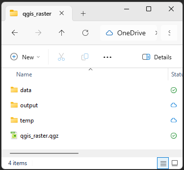



## Setting up

This is an intermediate level tutorial. Before completing this tutorial, we recommend our [QGIS: Introduction to Mapping](../intro/QGIS_intro.qmd) tutorial. This tutorial is designed for **QGIS 3.44**. If you need to install it on your computer, go to our [installation instructions](../intro/QGIS_intro.qmd#setting-up).

We will start by creating a good folder structure to work within. This folder is where our project, our data, and creations will live. Folder structure is very important for keeping your data tidy, as well as for ease of sharing your project with others. You simply need to zip the project folder if you need to share the whole thing.

- Open QGIS and create a **new project** with `Project > New`.
- Let's now **save** our project: `Project > Save`.
- Create a new folder, let's call it "qgis_raster".

:::::: columns
::: {.column width="60%"}

- Inside that folder, create these folders:
    - "data" - for all the data we will use to make our maps, split into:
        - "raw" - raw data from your research or the internet
        - "processed" - any data you've modified
    - "output" - for any maps or images we export
    - "temp" - this isn't *necessary*, but when you're playing around and testing, it stops things getting messy.
- Finally, let's save our .qgz project file here, named "qgis_raster_map.qgz"

:::

::: {.column width="5%"}
<!-- empty column to create gap -->
:::

::: {.column width="30%"}

:::

::: {.column width="5%"}
<!-- empty column to create gap -->
:::
::::::

Your .qgz file should always be in the highest level folder, so it's only looking down into folders for data, not back out.

This might seem necessary now, but things quickly get out of control and hard to find if you don't have a good folder structure.

Let's finally add an OpenStreetMap basemap to locate ourselves on the globe:

- `Browser panel > XYZ Tiles > OpenStreetMap` (double-click, or drag and drop into the Layers panel).

## Install the SAGA Plugin

We need to install a plugin so we can access certain geoprocessing tools (the built-in SAGA provider was [removed in version 3.30](https://changelog.qgis.org/en/qgis/version/3.30/#processing-drop-unmainted-saga-provider-from-qgis-)). Go to `Plugins > Manage and Install Plugins... > All` and `Search...` for "**SAGA**". From the list, select **Processing Saga NextGen Provider** and click `Install Plugin` (bottom right). If SAGA is not already installed on your computer, you will need to follow the instructions in the plugin description.

## Get some elevation data

A Digital Elevation Model (DEM) is a common example of **raster data**, i.e. grid data that contains a value in each cell (a bit like the pixels in a coloured picture).

For this tutorial, we are using a DEM sourced from the USGS website.

- Go to the [USGS website](https://earthexplorer.usgs.gov/)
- Click the "World Features" box, and then search for "Brisbane" in the "Feature Name" search box
- Click Show and select the first result
- Zoom onto an area of interest around Brisbane and click "Use Map"
- Click the "Data Sets" tab and then `Digital Elevation > SRTM`, select "SRTM 1 Arc-Second Global" and click "Results"

"SRTM" stands for "[Shuttle Radar Topography Mission](https://www.usgs.gov/centers/eros/science/usgs-eros-archive-digital-elevation-shuttle-radar-topography-mission-srtm-1-arc?qt-science_center_objects=0#qt-science_center_objects)". It provides global elevation data collected in 2000 by the space shuttle Endeavour.

Our area covers two separate raster files. We can click on the foot icon to see the footprint of each file, and the picture icon to see what the DEM looks like.

Use the download button to download each file into your project directory. You will need a login for that, which is free but can take a bit of time. You can instead **download the two raster files** as an archive from our GitHub repository [here](https://github.com/uqlibrary/technology-training-assets/raw/master/QGIS/raster/QGIS_Raster_Data.zip).

## Merge the two DEM layers

If you downloaded the archive, make sure you place it into the project directory so you can find it in "Project Home" and easily **load the raster files**: from the Browser panel, we can go into the data archive and drag and drop each `.tif` file into the Layers panel.

See the visible line between the two raster tiles? That is because the two separate raster files have different maximum and minimum values, so use different shades for different elevations. We have to **merge** them to make sure they use the same colour scale.

To do that, we use the `Raster > Miscellaneous > Merge...` tool to create one single layer from them.

- First, select both DEM layers for the "Input layers"
- Make sure the option "Place each input file into a separate band" is off, as we want to end up with one single-band layer
- We can save the output on disk instead of only creating a temporary file (for example, name it `SRTM_DEM_merged` and save it inside your project directory)
- Click "Run"

::: {.callout-note}
The Merge tool is an example of a geoprocessing tool that's listed in the QGIS menu but relies on the GDAL library, a major geospatial library that should already be available in any installation of QGIS. If you search for the Merge tool in the Processing Toolbox panel, you will see it listed under "GDAL".
:::

We can now remove the two original raster layers.

## Reproject the DEM

In the merged layer's Properties (`Right click > Properties... > Source`), we can see that the Coordinate Reference System (CRS) in use is [EPSG:4326 - WGS 84](https://epsg.io/4326). It is the one that QGIS detected when opening the file. This Geographic Reference System is good for global data, but if we want to focus on a more precise area around Brisbane/Meanjin, and want our analyses to be accurate, we should reproject the data to a local Projected Reference System (PRS). We will also need a projection that uses metres, rather than degrees (as EPSG:4326 does). A good PRS for around Brisbane/Meanjin is "[EPSG:7856 - GDA2020 / MGA zone 56](https://epsg.io/7856)". We don't want to change it in the Source tab, as it's the CRS that's used to understand the original data! Changing it would lead to the data being misplaced on the map. Instead, we use the **Warp (Reproject)** tool.

- In  the top menu: `Raster > Projections > Warp (Reproject)`
- Use the merged layer as an input
- Pick "EPSG:7856 - GDA2020 / MGA zone 56" as the Target CRS
    - you may need to click the Select CRS button 
    - change from "No CRS" to "Predefined CRS"
    - use the filter to search for "7856"
    - You should be able to find "EPSG:7856 - GDA2020 / MGA zone 56" under **Predefined Coordinate Reference Systems**
    - click the blue arrow to go back to the main view
- Click "Run"

::: {.callout-note}
If you want to learn more about the static datum GDA2020 (for "Geocentric Datum of Australia 2020"), an upgrade from the previous, less precise GDA94, see e.g. [a description from Geoscience Australia](https://www.ga.gov.au/scientific-topics/positioning-navigation/positioning-australia/geodesy/datums-projections/gda2020)
:::

## Clip the DEM

We now use `Raster > Extraction > Clip Raster by Extent` to **focus on a smaller area of interest**.

Make sure the reprojected DEM is selected in the Input layer, and set the "Clipping extent" with `... > Draw on Map Canvas`. We want to select an area that is inland, and contains both some of the D'Aguilar National Park, and a section of the Brisbane/Maiwar river (you can untick the DEM in the Layers panel to reveal the basemap).

If you don't save to file directly, remember two things:

- **rename** your clipped layer so it is more descriptive than the generic "Clipped (extent)"
- you are currently using a temporary, **scratch layer**. It will be discarded if you exit QGIS. It is very useful for temporary intermediate files, but it can be safer to save copies of your intermediate data while you work, just in case! You can right-click on the layer and use `Export > Save As..`

## Change the symbology

We can style our DEM with a **terrain colour palette**:

- double-click on the clipped DEM layer
- go to the "Symbology" tab
- change the Render type to "Singleband pseudocolor"
- we can change the "Color ramp" to something more suitable:
    - Expand drop-down menu next to the color ramp and select "Create New Color Ramp..."
    - Select "Catalog: cpt-city" and click "OK"
    - Pick the theme name "Topography" on the left
    - Select a suitable palette, "elevation" for example, and click "OK"

## Add a hillshade

Adding a **hillshade** makes your visualisation of elevation more readable and visually pleasing by simulating and light source that casts shadows on your map.

- Right-click on the DEM layer and "Duplicate layer"
- Rename the duplicated layer "hillshade"
- Open the Layer Styling panel for the hillshade layer
- Change the render type from "Singleband pseudocolor" to "Hillshade"
- The defaults should work well, but you can play with the settings, like the Altitude and the Azimuth
- Down the bottom of the panel, under **Resampling**, change the `Zoomed: in` from "Nearest Neighbour" to "Cubic (4x4 Kernel)", which removes some of the grid-like patterns you might see in your Hillshade layer otherwise
- Switch to the pseudocolour DEM and reduce its opacity (in the Transparency tab of the Layer Styling panel)
- Make sure the hillshade layer is underneath the pseudocolor layer

::: {.callout-tip}
Another method is to use the hillshade tool instead of the symbology: `Raster > Analysis > Hillshade...`.

The output data would not store elevation data anymore, but instead the computed illumination value based on the settings used. Using the Hillshade render type makes it easy to test and change the settings, whereas the Hillshade tool offers a few more options.
:::

## Create a watershed layer

Using the Strahler Order tool, we can create a **watershed** raster that shows where water would flow according to the DEM. The [Strahler order](https://en.wikipedia.org/wiki/Strahler_number) is a measure of branching complexity of the hypothetical waterway network, assigning higher numbers to cells as branching complexity increases. We should therefore end up with a layer in which major watercourses are distinguishable.

Open the Processing Toolbox (cog icon) and try using the SAGA Next Gen tool called "**Strahler Order**" using the clipped DEM as an input (a temporary file is fine for now).

Look at the result. It looks like there are few issues with our data. You may get a question mark symbol  next to your data, when hovered over it will say "There is no coordinate reference system set!". To resolve this issue, simply left-click on the question mark symbol and assign "EPSG:7856 - GDA2020 / MGA zone 56" as the CRS.

However there is still another issue with our data. A common problem with DEMs is that they have sinks and spikes that will make further analyses more difficult. This will mean the analysis is unable to best find where the water would flow. To resolve this, we need to use another tool to smooth out our raster before using the Strahler Order tool.

We can use the "Fill sinks (Wang & Liu)" tool to **fill the sinks** in our clipped DEM.

- When we do that, we might have to play with the "Minimum slope" value. A value of 0.01 degrees should work well if the layer was reprojected to a suitable Projected Reference System.
- As an output, we only need to tick the "Filled DEM" (first one in the list), which we can also save to file.

If we **re-run the Strahler order tool** on the filled DEM, we will be able to see more useful data.

We can now colour the layer with "Paletted/Unique values" to highlight the bigger streams. A colour ramp that goes from white (for low values) to a dark colour (for high values) should work well, like "Blues". After clicking "Classify", the main streams should pop up with a darker colour. You can also remove the lower values in the list to filter them out.

::: {.callout-tip}
Another way to filter out the noise of the smaller streams and **highlight the major streams** in the network, we can use the `Raster > Raster Calculator` tool and use a formula like: `"name_of_layer@1" >= 6` (the value will depend on how many levels exist in the Strahler layer). We need to save to file to be able to do that (name it "strahler_filtered", for example). This will assign the value 1 to the cells matching the condition, and 0 to what is under the limit.
:::

## Channel network and drainage basin

Another analysis we can do is use the "Channel network and drainage basins" tool to calculate the **flow direction, channels and drainage basins**.

- Make sure you run this tool on the filled DEM.
- We might have to change the threshold to a higher one if the output includes too many small basins and channels. As the threshold is related to the Strahler order number, the middle point of your previous Strahler order values is usually a good default.

You might want to play with different threshold values depending on what you're looking for. If you want to look at the main drainage basins of a region, you need to set the threshold higher. If you want to find all the small channels, you need to set the threshold lower. It's worth trying a few options to find what works best for your dataset and the story you're trying to tell.

As an output, we only want to load (and save to file) the two non-optional outputs:

- Channels
- Drainage basins (shapefile) (to differentiate the two "Drainage basins" options, you can check what format it saves the file as)

This is an example of **creating vector data from raster data**!

We can now play with the **symbology** for those elements. For example:

- Try using different colours for each basin, by classifying by ID, or remove the fill (`Simple fill > Fill Style > No Brush`) so you can see the colours of the elevation colours underneath. You can also make the borders more obvious by changing the width of the stroke.
- Change the colour of the channels.
    - Change the symbol from "Single Symbol" to Graduated.
    - Set the `Value` to "Order"
    - Choose an appropriate colour ramp
    - Change the `Mode` down the bottom of the window to "Equal Interval"
    - Click Apply
- You can also further differentiate minor channels from major ones by using a "Data defined override" for the Width value:
    - Click on the bar next to `Symbol` 
    - Click on the "Data defined override" icon  next to the Width field
    - Use the "Assistant"
    - "Source" needs to be the column "ORDER" (which corresponds to the Strahler order)
    - Click the double-arrow icon to "Fetch value range from layer"
    - Change the "Size from" and "to" values to suitable values

## Viewshed

If you want to know what can be seen from a certain point in a landscape you can use a DEM to perform a Viewshed Analysis.

Open the Processing Toolbox (cog icon) and search for the GDAL tool called "**Viewshed**".

- **Input Layer**: Choose your **Reprojected DEM** layer
- Click the three dots next to **Observer location** to select a point on the map
- **Observer height, DEM units**: 1.6 (the average human eye height is around 1.6m, choose a height you think might be appropriate)
- **Target height, DEM units**: 1 (this means that the points around the observer will be obscured by any surface that is higher than 1m. If you want to know what *ground* your observer will see, choose something closer to 0)
- **Maximum distance from observer to compute visibility**: 5000 (5km is the distance you can see on flat ground due to the curvature of the earth, this would change if you were higher up, for which you can find [calculators and a formula](https://www.omnicalculator.com/physics/distance-to-horizon))

This will produce a black and white raster showing what can be seen, and what can't. Go to the Layer **Styling Menu**, and change it to **Singleband Pseudocolor**, change the **Mode** to **Equal Interval**, and set the **Classes** to **2**. Change one of the Colors to transparent to highlight either what can be see, or what cannot.

As an extra feature. You can do the reverse analysis with a Viewshed. That is, you could use this to know what landmarks are visible in a landscape. Set the Observer Height to that of a building or tree in the landscape, and the Target Height to be that of people in the landscape, and you'll know where it can be seen from.

If you want to get more sophisticated with your Viewshed analyses, there is, of course, a plugin called **Visibility Analysis** which will allow you to use one or multiple points as observers, take in account of the Earth's curvature, see what vector points can see other vector points, and more.

## 3D maps

A 3D viewer is integrated in QGIS: `View > 3D Map Views > New 3D Map View`

In the 3D map window, make sure to first:

- Click the **Options** wrench icon, choose `Configure > Terrain`, set the "Type" to "DEM (Raster layer)", and set the "Elevation" to your clipped DEM.
- Exaggerate the relief with the "Vertical scale" setting (try 3).

To see the 3D effect, you will have to use your <kbd>Ctrl</kbd> or <kbd>Shift</kbd> keys on your keyboard while panning with the mouse to change the angle of view.

To avoid seeing gaps in the rendering, you can go back to your Terrain options and set the "Tile resolution" and "Skirt height" to higher values.

::: {-callout-tip}
A useful plugin for 3D maps is "Qgis2threejs", which might be handy to add a 3D map to a website. Once installed, use the menu: `Web > Qgis2threejs`
:::

## Exporting

Use the Layout Manager to create a new layout, and insert both a 2D map and a 3D map.

When inserting the 3D map, it will tell you that the "scene is not set". You will have to import the 3D scene settings from your view: `Item Properties > Scene Settings > Copy Scene Settings from a 3D View...` and then select your 3D map from the drop-down.

## Saving your project

Notice the little icon next to some of your layers? We previously created "temporary scratch layers". This is useful if you keep processing data and creating new layers that you want to discard afterwards. In our case, we do want to keep the "cities" and "rivers" layers, so we need to save them to a file. If we try to close QGIS with scratch layers loaded, it will give you a warning that they will be lost in the process.

You can click on the scratch layer icon to save the file. In the dialog, we can give the layers a `File name` (in our project's home directory) and click OK.

You can save your project with the floppy disk icon, or using <kbd>Ctrl</kbd> + <kbd>S</kbd>, and the project should be visible in a list as soon as you open QGIS again.

## Feedback

Please visit our website to [provide feedback](https://web.library.uq.edu.au/study-and-learning-support/training-and-workshops/software-training-resources) and find upcoming training courses we have on offer.

