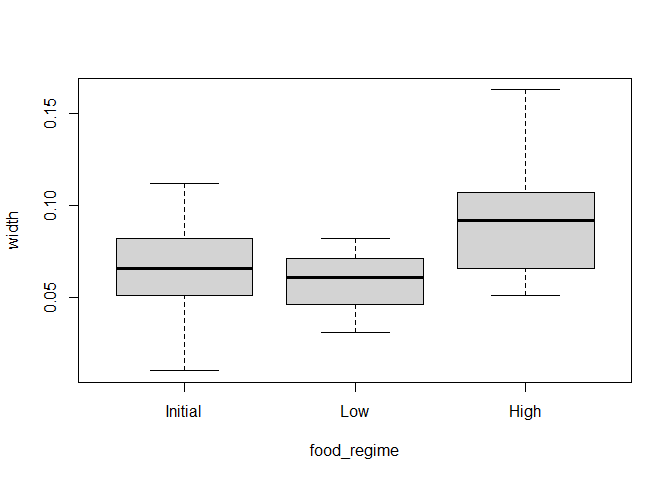
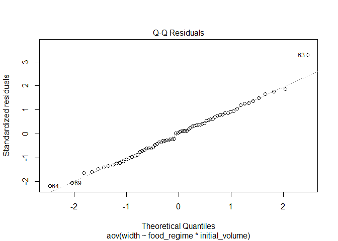
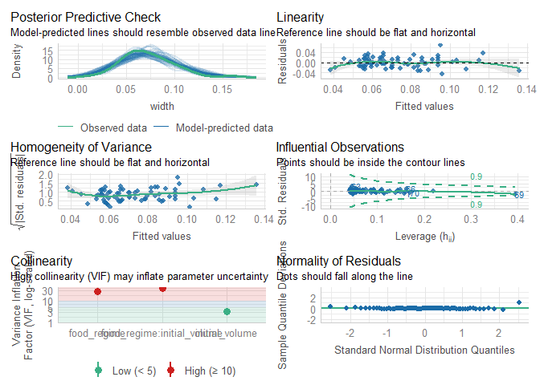
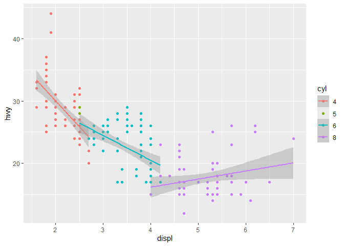
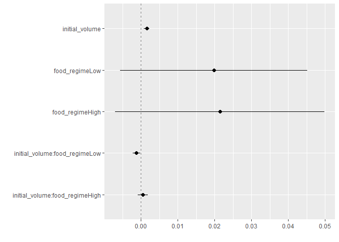

# R statistics: ANOVA and linear regression
UQ Library
2024-09-17

- [What are we going to learn?](#what-are-we-going-to-learn)
- [Keep in mind](#keep-in-mind)
- [Open RStudio](#open-rstudio)
- [Setting up](#setting-up)
- [Statistics in R using base and
  stats](#statistics-in-r-using-base-and-stats)
- [The inbetween…](#the-inbetween)
- [Introducing Tidymodels](#introducing-tidymodels)
- [Use a model to predict](#use-a-model-to-predict)
- [Close project](#close-project)
- [Useful links](#useful-links)

## What are we going to learn?

In this hands-on session, you will use R, RStudio to run analysis of
variance (ANOVA) and linear regression models.

Specifically, you will learn:

- visualize data in base R and using the ggplot2 package
- analysis of variance (ANOVA) in base R
- linear models in base R
- the tidy model approach

## Keep in mind

- Everything we write today will be saved in your project. Please
  remember to save it in your H drive or USB if you are using a Library
  computer.
- R is case sensitive: it will tell the difference between uppercase and
  lowercase.
- Respect the naming rules for objects (no spaces, does not start with a
  number…)

### Help

For any dataset or function doubts that you might have, don’t forget the
three ways of getting help in RStudio:

1.  the shortcut command: `?functionname`
2.  the help function: `help(functionname)`
3.  the keyboard shortcut: press F1 after writing a function name

## Open RStudio

- If you are using your own laptop please open RStudio
  - If you need them, we have [installation
    instructions](/R/Installation.md#r--rstudio-installation-instructions)
- Make sure you have a working internet connection
- On Library computers (the first time takes about 10 min.):
  - Log in with your UQ credentials (student account if you have two)
  - Make sure you have a working internet connection
  - Go to search at bottom left corner (magnifiying glass)
  - Open the ZENworks application
  - Look for RStudio
  - Double click on RStudio which will install both R and RStudio

## Setting up

### Install and load required packages for first sections

``` r
# install.packages("readr")
library(readr)       # for importing data
# install.packages("dplyr")
library(dplyr) # data manipulation package
# install.packages("ggplot2")
library(ggplot2) # data visualization
# install.packages("car")
library(car)         # Companion to Applied Regression package
# install.packages("performance")
library(performance) # Assessment of Regressmon Models performance
```

> Remember to use <kbd>Ctrl</kbd>+<kbd>Enter</kbd> to execute a command
> from the script.

### New project

- Click the “File” menu button (top left corner), then “New Project”
- Click “New Directory”
- Click “New Project” (“Empty project” if you have an older version of
  RStudio)
- In “Directory name”, type the name of your project, e.g. “dplyr_intro”
- Select the folder where to locate your project: for example, the
  `Documents/RProjects` folder, which you can create if it doesn’t exist
  yet.
- Click the “Create Project” button

### Create a script

We will use a script to write code more comfortably.

- Menu: Top left corner, click the green “plus” symbol, or press the
  shortcut (for Windows/Linux) <kbd>Ctrl</kbd>+Shift</kbd>+N</kbd> or
  (for Mac) <kbd>Cmd</kbd>+<kbd>Shift</kbd>+<kbd>N</kbd>. This will open
  an “Untitled1” file.
- Go to “File \> Save” or press (for Windows/Linux)
  <kbd>Ctrl</kbd>+<kbd>S</kbd> or (for Mac) <kbd>Cmd</kbd>+<kbd>S</kbd>.
  This will ask where you want to save your file and the name of the new
  file.
- Call your file “process.R”

### Introducing our data

The following section will be using data from [Constable
(1993)](https://link.springer.com/article/10.1007/BF00349318) to explore
how three different feeding regimes affect the size of sea urchins over
time.

Sea urchins reportedly regulate their size according to the level of
food available to regulate maintenance requirements. The paper examines
whether a reduction in suture width (i.e., connection points between
plates; see Fig 1 from constable 1993) is the basis for shrinking due to
low food conditions.


The [data in csv
format](https://tidymodels.org/start/models/urchins.csv) is available
from the tidymodels website and were assembled for a tutorial
[here](https://www.flutterbys.com.au/stats/tut/tut7.5a.html).

``` r
urchins <- 
   # read in the data
   read_csv("https://tidymodels.org/start/models/urchins.csv") %>% 
   # change the names to be more description
   setNames(c("food_regime", "initial_volume", "width")) %>% 
   # convert food_regime from chr to a factor, helpful for modeling
   mutate(food_regime = factor(food_regime, 
                               levels = c("Initial", "Low", "High")))
```

``` r
urchins # see the data as a tibble
```

    # A tibble: 72 × 3
       food_regime initial_volume width
       <fct>                <dbl> <dbl>
     1 Initial                3.5 0.01 
     2 Initial                5   0.02 
     3 Initial                8   0.061
     4 Initial               10   0.051
     5 Initial               13   0.041
     6 Initial               13   0.061
     7 Initial               15   0.041
     8 Initial               15   0.071
     9 Initial               16   0.092
    10 Initial               17   0.051
    # ℹ 62 more rows

We have 72 urchins with data on:

- experimental feeding regime group with 3 levels (Initial, Low, or
  High)
- size in milliliters at the start of the experiment (initial_volume)
- suture width in millimeters at the end of the experiment (width, see
  [Fig 1](pictures/Constable-1993-fig1.PNG))

## Statistics in R using base and stats

### Visualize the data

Use a boxplot to visualize width versus `food_regime` as a factor and a
scatterplot for width versus `initial_volume` as a continuous variable.

``` r
boxplot(width ~ food_regime, data = urchins)
```



``` r
plot(width ~ initial_volume, data = urchins)
```


We can see that there are some relationships between the response
variable (width) and our two covariates (food_regime and initial
volume). But what about the interaction between the two covariates?

**Challenge 1 - Use ggplot2 to make a plot visualizing the interaction
between our two variables. Add a trendline to the data.**

> Hint: think about grouping and coloring.

``` r
ggplot(urchins,
       aes(x = initial_volume,
           y = width,
           col = food_regime)) +
   geom_point() +
   geom_smooth(method = "lm", se = FALSE) + # add a linear trendline with out a confidence interval e.g., se = FALSE
   scale_color_viridis_d(option = "plasma", end = 0.7)   # change to color blind friendly palette, end is a corrected hue value
```

    `geom_smooth()` using formula = 'y ~ x'


Urchins that were larger in volume at the start of the experiment tended
to have wider sutures at the end. Slopes of the lines look different so
this effect may depend on the feeding regime indicating we should
include an interaction term.

### Analysis of Variance (ANOVA)

Information in this section was taken from
[rpubs.com](https://rpubs.com/tmcurley/twowayanova) and [Data Analysis
in R Ch
7](https://bookdown.org/steve_midway/DAR/understanding-anova-in-r.html#multiple-comparisons).

We can do an ANOVA with the `aov()` function to test for differences in
sea urchin suture width between our groups. We are technically running
and **analysis of covariance (ANCOVA)** as we have both a continuous and
a categorical variable. ANOVAs are for categorical variables and we will
see that some of the *post-hoc* tests are not amenable to continuous
variables.

> `aov()` uses the model formula
> `response variable ~ covariate1 + covariate2`. The \* denotes the
> inclusion of both main effects and interactions which we have done
> below. The formula below is equivalent to
> `reponse ~ covar1 + covar2 + covar1:covar2` i.e., the main effect of
> covar 1 and covar 2, and the interaction between the two.

``` r
aov_urch <- aov(width ~ food_regime * initial_volume, 
                data = urchins)
summary(aov_urch)  # print the summary statistics
```

                               Df   Sum Sq  Mean Sq F value   Pr(>F)    
    food_regime                 2 0.012380 0.006190  13.832 9.62e-06 ***
    initial_volume              1 0.008396 0.008396  18.762 5.15e-05 ***
    food_regime:initial_volume  2 0.004609 0.002304   5.149  0.00835 ** 
    Residuals                  66 0.029536 0.000448                     
    ---
    Signif. codes:  0 '***' 0.001 '**' 0.01 '*' 0.05 '.' 0.1 ' ' 1

Both the main effects and interaction are significant (p \< 0.05)
indicating a significant interactive effect between food regime and
initial volume on urchin suture width. We need to do a
pairwise-comparison to find out which factor levels and combination of
the two covariates have the largest effect on width.

#### Pair-wise comparison

Run a **Tukey’s Honestly Significant Difference (HSD)** test - note it
does not work for non-factors as per the warning message.

``` r
TukeyHSD(aov_urch)
```

      Tukey multiple comparisons of means
        95% family-wise confidence level

    Fit: aov(formula = width ~ food_regime * initial_volume, data = urchins)

    $food_regime
                         diff          lwr         upr     p adj
    Low-Initial  -0.006791667 -0.021433881 0.007850548 0.5100502
    High-Initial  0.023791667  0.009149452 0.038433881 0.0006687
    High-Low      0.030583333  0.015941119 0.045225548 0.0000129

The comparison between High-Initial and High-Low food regimes are
significant (p \< 0.05).

#### Checking the model

We also want to check that our model is a good fit and does not violate
any ANOVA **assumptions**:

1.  Data are independent and normally distributed.
2.  The residuals from the data are normally distributed.
3.  The variances of the sampled populations are equal.

**Challenge 2 - Use a histogram and qqplots to visually check data are
normal**.

``` r
hist(urchins$width)
```


``` r
qqnorm(urchins$width)
qqline(urchins$width)
```


You could also run a Shapiro-Wilk test on the data:

``` r
shapiro.test(urchins$width)
```


        Shapiro-Wilk normality test

    data:  urchins$width
    W = 0.95726, p-value = 0.01552

The p-value is less than 0.05 so the data are significantly different
from a normal distribution.

Check the **model residuals**. Plot the residuals vs fitted values - do
not want too much deviation from 0.

``` r
plot(aov_urch, 1)
```


Can also plot the predicted values from the model with the acutal
values.

``` r
plot(predict(aov_urch) ~ urchins$width)
abline(0, 1, col = "red") # plot a red line with intercept of 0 and slope of 1
```


Check the **normality of residuals**, run Shapiro-Wilk test on
residuals:

``` r
plot(aov_urch, 2)
```



``` r
shapiro.test(resid(aov_urch))
```


        Shapiro-Wilk normality test

    data:  resid(aov_urch)
    W = 0.98456, p-value = 0.5244

The residuals fall on the Normal Q-Q plot diagonal and the Shapiro-Wilk
result is non-significant (p \> 0.05).

Check for **homogeneity of variance**

**Challenge 3 - use the help documentation for `leveneTest()` from the
`car` package to check homogenetity of variance on `food_regime`.**

> Again, only works for factor groups.

``` r
leveneTest(width ~ food_regime, data = urchins)
```

    Levene's Test for Homogeneity of Variance (center = median)
          Df F value  Pr(>F)  
    group  2  4.4224 0.01559 *
          69                  
    ---
    Signif. codes:  0 '***' 0.001 '**' 0.01 '*' 0.05 '.' 0.1 ' ' 1

The Levene’s Test is significant for `food_regime` (not what we want)
and there are a few options to deal with this. You can ignore this
violation based on your own *a priori* knowledge of the distribution of
the population being samples, drop the p-value significance, or use a
different test.

### Linear Model

``` r
lm_urch <- lm(width ~ food_regime * initial_volume, 
              data = urchins)
summary(lm_urch)
```


    Call:
    lm(formula = width ~ food_regime * initial_volume, data = urchins)

    Residuals:
          Min        1Q    Median        3Q       Max 
    -0.045133 -0.013639  0.001111  0.013226  0.067907 

    Coefficients:
                                     Estimate Std. Error t value Pr(>|t|)    
    (Intercept)                     0.0331216  0.0096186   3.443 0.001002 ** 
    food_regimeLow                  0.0197824  0.0129883   1.523 0.132514    
    food_regimeHigh                 0.0214111  0.0145318   1.473 0.145397    
    initial_volume                  0.0015546  0.0003978   3.908 0.000222 ***
    food_regimeLow:initial_volume  -0.0012594  0.0005102  -2.469 0.016164 *  
    food_regimeHigh:initial_volume  0.0005254  0.0007020   0.748 0.456836    
    ---
    Signif. codes:  0 '***' 0.001 '**' 0.01 '*' 0.05 '.' 0.1 ' ' 1

    Residual standard error: 0.02115 on 66 degrees of freedom
    Multiple R-squared:  0.4622,    Adjusted R-squared:  0.4215 
    F-statistic: 11.35 on 5 and 66 DF,  p-value: 6.424e-08

In the output, we have the model call, residuals, and the coefficients.
The first coefficient is the `(Intercept)` and you might notice the
`food_regimeInitial` is missing. The function defaults to an effects
parameterization where the intercept is the reference or baseline of the
categorical group - Initial in this case.

> You can change the reference level of a factor using the `relevel()`
> function.

The estimates of the remaining group levels of `food_regime` represents
the effect of being in that group. To calculate the group coefficients
for all group levels you *add* the estimates for the level to the
intercept (first group level) estimate. For example, the estimate for
the ‘Initial’ feeding regime is 0.0331 and we add the estimate of ‘Low’
(0.0331 + 0.0197) to get the mean maximum size of 0.0528 mm for width.

For the continuous covariate, the estimate represents the change in the
response variable for a unit increase in the covariate. ‘Initial
Volume’s’ estimate of 0.0015 represents a 0.0015 mm increase (the
estimate is positive) in width per ml increase in urchin initial volume.

We can get ANOVA test statistics on our linear model using the `anova()`
in base or `Anova()` from the `car` package.

``` r
anova(lm_urch)
```

    Analysis of Variance Table

    Response: width
                               Df    Sum Sq   Mean Sq F value    Pr(>F)    
    food_regime                 2 0.0123801 0.0061900 13.8321 9.616e-06 ***
    initial_volume              1 0.0083962 0.0083962 18.7621 5.154e-05 ***
    food_regime:initial_volume  2 0.0046088 0.0023044  5.1494  0.008354 ** 
    Residuals                  66 0.0295358 0.0004475                      
    ---
    Signif. codes:  0 '***' 0.001 '**' 0.01 '*' 0.05 '.' 0.1 ' ' 1

``` r
Anova(lm_urch)
```

    Anova Table (Type II tests)

    Response: width
                                  Sum Sq Df F value    Pr(>F)    
    food_regime                0.0168653  2 18.8434 3.358e-07 ***
    initial_volume             0.0083962  1 18.7621 5.154e-05 ***
    food_regime:initial_volume 0.0046088  2  5.1494  0.008354 ** 
    Residuals                  0.0295358 66                      
    ---
    Signif. codes:  0 '***' 0.001 '**' 0.01 '*' 0.05 '.' 0.1 ' ' 1

These are effectively the same as the `aov()` model we ran before.

> **Note**: The statistics outputs are the same comparing the `aov()`
> and `anova()` models while the `Anova()` model is **not** exactly the
> same. The `Anova()` output tells us it was a Type II test and the
> `aov()` documentation says it is only for *balanced* designs which
> means the Type 1 test is the applied (see
> [here](https://bookdown.org/ndphillips/YaRrr/type-i-type-ii-and-type-iii-anovas.html)).
> The type of test can be set for `Anova()` but not the others. Here,
> the overall take-away from the different ANOVA functions are
> comparable.

**Challenge 4 - use the check_model() documentation to apply the
function to our `lm_urch` model.**

The performance package has a handy function `check_model()` that will
check several aspects of your model in one go:

``` r
check_model(lm_urch)
```



**Challenge 5 - conduct your own ANOVA or linear regression using the
mgp dataset from {ggplot2}.**

1.  Test whether \# of cylinders and/or engine displacement affect fuel
    efficiency.
2.  Make a plot to visualize the relationship.

> **Hint**: Check out the documentation for the dataset `?mpg` to see
> the varaibles in the dataset. Are the variables the right data type?
> Suggest saving the dataset locally in your environment i.e.,
> `mpg2 <- mpg` so you can change data types if necessary.

``` r
mpg2 <-  mpg
mpg2$cyl <- as.factor(mpg$cyl) # convert cyl from numeric to factor

# base R ANOVA
aov_cars <- aov(hwy ~ cyl * displ, data = mpg2)
summary(aov_cars)
```

                 Df Sum Sq Mean Sq F value   Pr(>F)    
    cyl           3   4836  1612.1  142.69  < 2e-16 ***
    displ         1    219   218.8   19.37 1.66e-05 ***
    cyl:displ     2    642   321.1   28.42 9.65e-12 ***
    Residuals   227   2565    11.3                     
    ---
    Signif. codes:  0 '***' 0.001 '**' 0.01 '*' 0.05 '.' 0.1 ' ' 1

``` r
TukeyHSD(aov_cars, "cyl")
```

      Tukey multiple comparisons of means
        95% family-wise confidence level

    Fit: aov(formula = hwy ~ cyl * displ, data = mpg2)

    $cyl
                diff        lwr       upr     p adj
    5-4  -0.05246914  -4.508182  4.403244 0.9999898
    6-4  -5.97968433  -7.355259 -4.604110 0.0000000
    8-4 -11.17389771 -12.593534 -9.754261 0.0000000
    6-5  -5.92721519 -10.385582 -1.468848 0.0038274
    8-5 -11.12142857 -15.593586 -6.649271 0.0000000
    8-6  -5.19421338  -6.622156 -3.766270 0.0000000

``` r
# linear model
lm_cars <- lm(hwy ~ cyl * displ, data = mpg2)
summary(lm_cars)
```


    Call:
    lm(formula = hwy ~ cyl * displ, data = mpg2)

    Residuals:
        Min      1Q  Median      3Q     Max 
    -6.6698 -2.0533 -0.4563  1.6948 13.1597 

    Coefficients: (1 not defined because of singularities)
                Estimate Std. Error t value Pr(>|t|)    
    (Intercept)   46.601      2.586  18.018  < 2e-16 ***
    cyl5           2.887      1.773   1.628  0.10484    
    cyl6         -10.221      3.795  -2.693  0.00760 ** 
    cyl8         -35.626      4.390  -8.114 3.07e-14 ***
    displ         -8.295      1.193  -6.954 3.74e-11 ***
    cyl5:displ        NA         NA      NA       NA    
    cyl6:displ     4.318      1.440   2.998  0.00302 ** 
    cyl8:displ     9.591      1.376   6.969 3.43e-11 ***
    ---
    Signif. codes:  0 '***' 0.001 '**' 0.01 '*' 0.05 '.' 0.1 ' ' 1

    Residual standard error: 3.361 on 227 degrees of freedom
    Multiple R-squared:  0.6896,    Adjusted R-squared:  0.6814 
    F-statistic: 84.05 on 6 and 227 DF,  p-value: < 2.2e-16

``` r
Anova(lm_cars) # from the car package
```

    Note: model has aliased coefficients
          sums of squares computed by model comparison

    Anova Table (Type II tests)

    Response: hwy
               Sum Sq  Df F value    Pr(>F)    
    cyl        207.16   3  6.1123 0.0005139 ***
    displ      218.78   1 19.3655 1.661e-05 ***
    cyl:displ  642.17   2 28.4211 9.654e-12 ***
    Residuals 2564.50 227                      
    ---
    Signif. codes:  0 '***' 0.001 '**' 0.01 '*' 0.05 '.' 0.1 ' ' 1

``` r
ggplot(data = mpg2,
       aes(x = displ,
           y = hwy,
           color = cyl)) +
  geom_point() +
  geom_smooth(method = "lm") 
```

    `geom_smooth()` using formula = 'y ~ x'



## The inbetween…

Before going into Tidymodels, it should be mentioned there are *many*
excellent linear regression packages. To name a few:

- nlme
- lmer
- lmerTest
- glmmTMB
- and more…

The packages vary in the methods, how to specify random factors, etc.
The model outputs also tend to be not so friendly to export into a table
and document.

## Introducing Tidymodels

Like the tidyverse package, the Tidymodels framework is a collection of
packages for modeling and machine learning following the tidyverse
principles.

This section is modified from the first [Tidymodels
article](https://www.tidymodels.org/start/models/).

### Load more packages

``` r
# install.packages("tidymodels")
library(tidymodels) # for parsnip package and rest of tidymodels
# install.packages("dotwhisker")
# dotwhiskers was archived from CRAN in 2024, see:
# https://github.com/fsolt/dotwhisker/issues/115
# if unavailable, can be installed from GitHub:
# remotes::install_github('fsolt/dotwhisker')
library(dotwhisker)# for visualizing regression results
# install.packages("parsnip")
library(parsnip)
```

### Build and fit a model

Let’s apply a standard two-way analysis of variance (ANOVA) model to the
dataset as we did before. For this kind of model, ordinary least squares
is a good initial approach.

For Tidymodels, we need to specify the following:

1.  The *functional form* using the [parsnip
    package](https://parsnip.tidymodels.org/).
2.  The *method for fitting* the model by setting the **engine**.

We will specify the *functional form* or model type as [“linear
regression”](https://parsnip.tidymodels.org/reference/linear_reg.html)
as there is a numeric outcome with a linear slope and intercept. We can
do this with:

``` r
linear_reg()  
```

    Linear Regression Model Specification (regression)

    Computational engine: lm 

On its own, not that interesting. Next, we specify the method for
*fitting* or training the model using the `set_engine()` function. The
engine value is often a mash-up of the software that can be used to fit
or train the model as well as the estimation method. For example, to use
ordinary least squares, we can set the engine to be `lm`.

The [documentation
page](https://parsnip.tidymodels.org/reference/linear_reg.html) for
linear_reg() lists the possible engines. We’ll save this model object as
lm_mod.

``` r
lm_mod <- 
linear_reg() %>% 
   set_engine("lm")
```

Next, the model can be estimated or trained using the `fit()` function
and the model formula we used for the ANOVA:

`width ~ initial_volume * food_regime`

``` r
lm_fit <- 
   lm_mod %>% 
   fit(width ~ initial_volume * food_regime, data = urchins)

lm_fit
```

    parsnip model object


    Call:
    stats::lm(formula = width ~ initial_volume * food_regime, data = data)

    Coefficients:
                       (Intercept)                  initial_volume  
                         0.0331216                       0.0015546  
                    food_regimeLow                 food_regimeHigh  
                         0.0197824                       0.0214111  
     initial_volume:food_regimeLow  initial_volume:food_regimeHigh  
                        -0.0012594                       0.0005254  

We can use the `tidy()` function for our `lm` object to output model
parameter estimates and their statistical properties. Similar to
`summary()` but the results are more predictable and useful format.

``` r
tidy(lm_fit)
```

    # A tibble: 6 × 5
      term                            estimate std.error statistic  p.value
      <chr>                              <dbl>     <dbl>     <dbl>    <dbl>
    1 (Intercept)                     0.0331    0.00962      3.44  0.00100 
    2 initial_volume                  0.00155   0.000398     3.91  0.000222
    3 food_regimeLow                  0.0198    0.0130       1.52  0.133   
    4 food_regimeHigh                 0.0214    0.0145       1.47  0.145   
    5 initial_volume:food_regimeLow  -0.00126   0.000510    -2.47  0.0162  
    6 initial_volume:food_regimeHigh  0.000525  0.000702     0.748 0.457   

This output can be used to generate a dot-and-whisker plot of our
regression results using the `dotwhisker` package:

``` r
tidy(lm_fit) %>% 
   dwplot(dot_args = list(size = 2, color = "black"),
          whisker_args = list(color = "black"),
          vline = geom_vline(xintercept = 0, 
                             color = "grey50",
                             linetype = 2))
```



## Use a model to predict

Say that it would be interesting to make a plot of the mean body size
for urchins that started the experiment with an initial volume of 20 ml.

First, lets make some new example data to predict for our graph:

``` r
new_points <- expand.grid(initial_volume = 20,
                          food_regime = c("Initial", "Low", "High"))
new_points
```

      initial_volume food_regime
    1             20     Initial
    2             20         Low
    3             20        High

We can then use the `predict()` function to find the mean values at 20
ml initial volume.

With tidymodels, the types of predicted values are standardized so that
we can use the same syntax to get these values.

Let’s generate the mean suture width values:

``` r
mean_pred <- predict(lm_fit, new_data = new_points)
mean_pred
```

    # A tibble: 3 × 1
       .pred
       <dbl>
    1 0.0642
    2 0.0588
    3 0.0961

When making predictions, the tidymodels convention is to always produce
a tibble of results with standardized column names. This makes it easy
to combine the original data and the predictions in a usable format:

``` r
conf_int_pred <- predict(lm_fit, 
                         new_data = new_points,
                         type = "conf_int")
conf_int_pred
```

    # A tibble: 3 × 2
      .pred_lower .pred_upper
            <dbl>       <dbl>
    1      0.0555      0.0729
    2      0.0499      0.0678
    3      0.0870      0.105 

``` r
# now combine:
plot_data <- 
   new_points %>% 
   bind_cols(mean_pred, conf_int_pred)

plot_data
```

      initial_volume food_regime      .pred .pred_lower .pred_upper
    1             20     Initial 0.06421443  0.05549934  0.07292952
    2             20         Low 0.05880940  0.04986251  0.06775629
    3             20        High 0.09613343  0.08696233  0.10530453

``` r
# and plot:
ggplot(plot_data, 
       aes(x = food_regime)) +
   geom_point(aes(y = .pred)) +
   geom_errorbar(aes(ymin = .pred_lower,
                     ymax = .pred_upper),
                 width = .2) +
   labs(y = "urchin size")
```


There is also an example of a *Bayesian* model in the tidymodels article
I have not included here.

## Close project

Closing RStudio will ask you if you want to save your workspace and
scripts. Saving your workspace is usually not recommended if you have
all the necessary commands in your script.

## Useful links

- For statistical analysis in R:
  - Steve Midway’s [Data Analysis in R Part II
    Analysis](https://bookdown.org/steve_midway/DAR/part-ii-analysis.html)
  - Jeffrey A. Walker’s [Applied Statistics for Experiemental
    Biology](https://www.middleprofessor.com/files/applied-biostatistics_bookdown/_book/)
  - Chester Ismay and Albert Y. Kim’s [ModernDive Statistical Inference
    via Data Science](https://moderndive.com/)
- For tidymodels:
  - [tidymodels website](https://www.tidymodels.org/)
- Our compilation of [general R
  resources](https://gitlab.com/stragu/DSH/blob/master/R/usefullinks.md)
