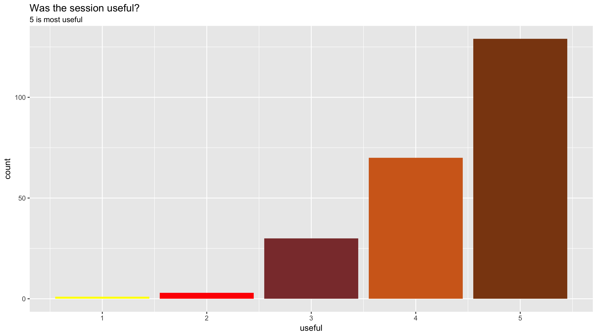

# Report feedback of 2017 R sessions

For every session we have collected feedback from attendees and this are the summary responses.
There was 13 session and we have collected 233 responses.

Q.1 Was the session useful for you? (1 not useful - 5 very useful)

Q.2 What did you like about the session?

Q.3 One thing we can do to improve the next session

Q.4 How did you hear about the session?

Q.5 Are you?

Q.6 what is your school?

Updated, Dec 1, 2017
