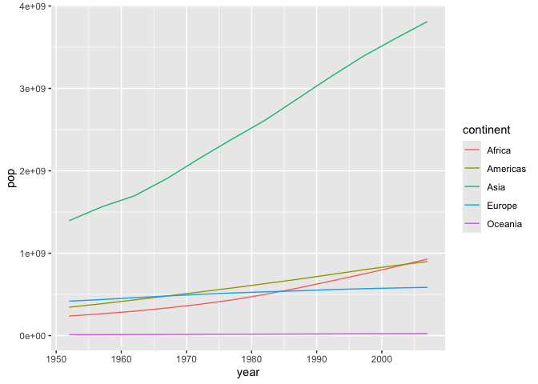
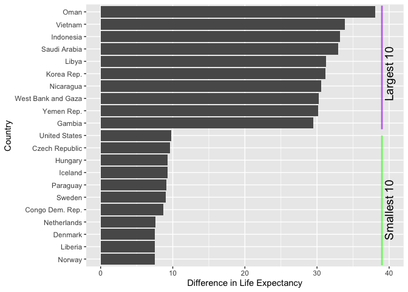

# R dplyr: preparing data for analysis
UQ Library
2024-09-17

- [What are we going to learn?](#what-are-we-going-to-learn)
- [Keep in mind](#keep-in-mind)
- [Open RStudio](#open-rstudio)
- [Setting up](#setting-up)
- [Basic dplyr verbs](#basic-dplyr-verbs)
- [More examples](#more-examples)
- [Close project](#close-project)
- [What next?](#what-next)

## What are we going to learn?

In this hands-on session, you will use R, RStudio and the `dplyr`
package to transform your data.

Specifically, you will learn how to **explore, filter, reorganise and
process** a table of data with the following verbs:

- `select()`: pick variables
- `filter()`: pick observations
- `arrange()`: reorder observations
- `mutate()`: create new variables
- `summarise()`: collapse to a single summary
- `group_by()`: change the scope of function

## Keep in mind

- Everything we write today will be saved in your project. Please
  remember to save it in your H drive or USB if you are using a Library
  computer.
- R is case sensitive: it will tell the difference between uppercase and
  lowercase.
- Respect the naming rules for objects (no spaces, does not start with a
  number…)

### Help

For any dataset or function doubts that you might have, don’t forget the
three ways of getting help in RStudio:

1.  the shortcut command: `?functionname`
2.  the help function: `help(functionname)`
3.  the keyboard shortcut: press F1 after writing a function name

## Open RStudio

- If you are using your own laptop please open RStudio
  - If you need them, we have [installation
    instructions](/R/Installation.md#r--rstudio-installation-instructions)
- Make sure you have a working internet connection
- On Library computers (the first time takes about 10 min.):
  - Log in with your UQ credentials (student account if you have two)
  - Make sure you have a working internet connection
  - Go to search at bottom left corner (magnifiying glass)
  - Open the ZENworks application
  - Look for RStudio
  - Double click on RStudio which will install both R and RStudio

## Setting up

### Install the dplyr package

If you don’t have it already, you can install dplyr with the command:
`install.packages("dplyr")`

> At home, you can install the whole
> “[tidyverse](https://www.tidyverse.org/)”, a meta-package useful for
> data science: `install.packages("tidyverse")`

### New project

- Click the “File” menu button (top left corner), then “New Project”
- Click “New Directory”
- Click “New Project” (“Empty project” if you have an older version of
  RStudio)
- In “Directory name”, type the name of your project, e.g. “dplyr_intro”
- Select the folder where to locate your project: for example, the
  `Documents/RProjects` folder, which you can create if it doesn’t exist
  yet.
- Click the “Create Project” button

### Create a script

We will use a script to write code more comfortably.

- Menu: Top left corner, click the green “plus” symbol, or press the
  shortcut (for Windows/Linux) <kbd>Ctrl</kbd>+Shift</kbd>+N</kbd> or
  (for Mac) <kbd>Cmd</kbd>+<kbd>Shift</kbd>+<kbd>N</kbd>. This will open
  an “Untitled1” file.
- Go to “File \> Save” or press (for Windows/Linux)
  <kbd>Ctrl</kbd>+<kbd>S</kbd> or (for Mac) <kbd>Cmd</kbd>+<kbd>S</kbd>.
  This will ask where you want to save your file and the name of the new
  file.
- Call your file “process.R”

### Introducing our data

#### Challenge 1 – import data

Let’s import and explore our data.

1.  read the data into an object called “gapminder”, using `read.csv()`:

``` r
gapminder <- read.csv("https://raw.githubusercontent.com/resbaz/r-novice-gapminder-files/master/data/gapminder-FiveYearData.csv")
```

> Remember you can use <kbd>Ctrl</kbd>+<kbd>shift</kbd> to execute a
> command from the script.

2.  Explore the gapminder dataset using `dim()` and `str()`

How can we get the dataframe’s variable names? There are two ways:
`names(gapminder)` returns the names regardless of the object type, such
as list, vector, data.frame etc., whereas `colnames(gapminder)` returns
the variable names for matrix-like objects, such as matrices,
dataframes…

To return one specific column in the dataframe, you can use the dollar
syntax: `gapminder$year`. For example, try these:

``` r
class(gapminder$country) # what kind of data?
```

    [1] "character"

``` r
range(gapminder$year) # what is the time range?
```

    [1] 1952 2007

## Basic dplyr verbs

The R package `dplyr` was developed by Hadley Wickham for data
manipulation.

The book *[R for Data Science](https://r4ds.hadley.nz/)* introduces the
package as follows:

> You are going to learn the five key dplyr functions that allow you to
> solve the vast majority of your data manipulation challenges:
>
> - Pick variables by their names with `select()`
> - Pick observations by their values with `filter()`
> - Reorder the rows with `arrange()`
> - Create new variables with functions of existing variables with
>   `mutate()`
> - Collapse many values down to a single summary with `summarise()`
>
> These can all be used in conjunction with `group_by()` which changes
> the scope of each function from operating on the entire dataset to
> operating on it group-by-group. These six functions provide the main
> **verbs for a language of data manipulation**.

To use the verbs to their full extent, we will need **pipes** and
**logical operators**, which we will introduce as we go.

Let’s load the `dplyr` package to access its functions:

``` r
library(dplyr)
```


    Attaching package: 'dplyr'

    The following objects are masked from 'package:stats':

        filter, lag

    The following objects are masked from 'package:base':

        intersect, setdiff, setequal, union

> You only need to install a package once (with `install.packages()`),
> but you need to reload it every time you start a new R session (with
> `library()`).

### 1. Pick variables with `select()`

`select()` allows us to pick variables (i.e. columns) from the dataset.
For example, to only keep the data about year, country and GDP per
capita:

``` r
gap_small <- select(gapminder, year, country, gdpPercap)
```

The first argument refers to the dataframe that is being transformed,
and the following arguments are the columns you want to keep. Notice
that it keeps the order you specified?

You can also rename columns in the same command:

``` r
gap_small <- select(gapminder, year, country, gdpPerPerson = gdpPercap)
```

If you have many variables but only want to remove a small number, it
might be better to deselect instead of selecting. You can do that by
using the `-` character in front of a variable name:

``` r
names(select(gapminder, -continent))
```

    [1] "country"   "year"      "pop"       "lifeExp"   "gdpPercap"

There are also a lot of helper functions to select columns according to
a logic. For example, to only keep the columns that have “a” in their
names:

``` r
names(select(gapminder, contains("a")))
```

    [1] "year"      "gdpPercap"

### 2. Pick observations with `filter()`

The `filter()` function allows use to pick observations depending on one
or several conditions. But to be able to define these conditions, we
need to learn about logical operators.

**Logical operators** allow us to **compare things**. Here are some of
the most important ones:

- `==`: equal
- `!=`: different or not equal
- `>`: greater than
- `<`: smaller than
- `>=`: greater or equal
- `<=`: smaller or equal

> Remember: `=` is used to pass on a value to an argument, whereas `==`
> is used to check for equality. Using `=` instead of `==` for a logical
> statment is one of the most common errors and R will give you a
> reminder in the console when this happens.

You can compare any kind of data For example:

``` r
1 == 1
```

    [1] TRUE

``` r
1 == 2
```

    [1] FALSE

``` r
1 != 2
```

    [1] TRUE

``` r
1 > 0
```

    [1] TRUE

``` r
"money" == "happiness"
```

    [1] FALSE

When R executes these commands, it answers `TRUE` of `FALSE`, as if
asked a yes/no question. These `TRUE` and `FALSE` values are called
**logical values**.

Note that we can compare a single value to many. For example, compare
one value to three others:

``` r
1 == c(1, 2, 3, 1, 3)
```

    [1]  TRUE FALSE FALSE  TRUE FALSE

This kind of operation results in a logical vector with a logical value
for each element. This is exactly what we will use to filter our rows.

For example, to filter the observations for Australia, we can use the
following condition:

``` r
australia <- filter(gapminder, country == "Australia")
australia
```

    # A tibble: 12 × 6
       country    year      pop continent lifeExp gdpPercap
       <chr>     <int>    <dbl> <chr>       <dbl>     <dbl>
     1 Australia  1952  8691212 Oceania      69.1    10040.
     2 Australia  1957  9712569 Oceania      70.3    10950.
     3 Australia  1962 10794968 Oceania      70.9    12217.
     4 Australia  1967 11872264 Oceania      71.1    14526.
     5 Australia  1972 13177000 Oceania      71.9    16789.
     6 Australia  1977 14074100 Oceania      73.5    18334.
     7 Australia  1982 15184200 Oceania      74.7    19477.
     8 Australia  1987 16257249 Oceania      76.3    21889.
     9 Australia  1992 17481977 Oceania      77.6    23425.
    10 Australia  1997 18565243 Oceania      78.8    26998.
    11 Australia  2002 19546792 Oceania      80.4    30688.
    12 Australia  2007 20434176 Oceania      81.2    34435.

The function compares the value “Australia” to all the values in the
`country` variable, and only keeps the rows that have `TRUE` as an
answer.

Now, let’s filter the rows that have a life expectancy `lifeExp` greater
than 81 years:

``` r
life81 <- filter(gapminder, lifeExp > 81)
dim(life81)
```

    [1] 7 6

### 3. Reorder observations with `arrange()`

`arrange()` will reorder our rows according to a variable, by default in
ascending order:

``` r
arrange(life81, lifeExp)
```

    # A tibble: 7 × 6
      country          year       pop continent lifeExp gdpPercap
      <chr>           <int>     <dbl> <chr>       <dbl>     <dbl>
    1 Australia        2007  20434176 Oceania      81.2    34435.
    2 Hong Kong China  2002   6762476 Asia         81.5    30209.
    3 Switzerland      2007   7554661 Europe       81.7    37506.
    4 Iceland          2007    301931 Europe       81.8    36181.
    5 Japan            2002 127065841 Asia         82      28605.
    6 Hong Kong China  2007   6980412 Asia         82.2    39725.
    7 Japan            2007 127467972 Asia         82.6    31656.

If we want to have a look at the entries with highest life expectancy
first, we can use the `desc()` function (for “descending”):

``` r
arrange(life81, desc(lifeExp))
```

    # A tibble: 7 × 6
      country          year       pop continent lifeExp gdpPercap
      <chr>           <int>     <dbl> <chr>       <dbl>     <dbl>
    1 Japan            2007 127467972 Asia         82.6    31656.
    2 Hong Kong China  2007   6980412 Asia         82.2    39725.
    3 Japan            2002 127065841 Asia         82      28605.
    4 Iceland          2007    301931 Europe       81.8    36181.
    5 Switzerland      2007   7554661 Europe       81.7    37506.
    6 Hong Kong China  2002   6762476 Asia         81.5    30209.
    7 Australia        2007  20434176 Oceania      81.2    34435.

We could also use the `-` shortcut, which only works for numerical data:

``` r
arrange(life81, -lifeExp)
```

#### The pipe operator

What if we wanted to get that result in one single command, without an
intermediate `life81` object?

We could nest the commands into each other, the first step as the first
argument of the second step:

``` r
arrange(filter(gapminder, lifeExp > 81), -lifeExp)
```

… but this becomes very hard to read, very quickly. (Imagine with 3
steps or more!)

We can make our code more readable and avoid creating useless
intermediate objects by **piping** commands into each other. The pipe
operator `%>%` **strings commands together**, using the left side’s
output as the first argument of the right side function.

For example, this command:

``` r
round(1.23, digits = 1)
```

    [1] 1.2

… is equivalent to:

``` r
1.23 %>% round(digits = 1)
```

    [1] 1.2

Here’s another example with the `filter()` verb:

``` r
gapminder %>%
  filter(country != "France")
```

    # A tibble: 1,692 × 6
       country      year      pop continent lifeExp gdpPercap
       <chr>       <int>    <dbl> <chr>       <dbl>     <dbl>
     1 Afghanistan  1952  8425333 Asia         28.8      779.
     2 Afghanistan  1957  9240934 Asia         30.3      821.
     3 Afghanistan  1962 10267083 Asia         32.0      853.
     4 Afghanistan  1967 11537966 Asia         34.0      836.
     5 Afghanistan  1972 13079460 Asia         36.1      740.
     6 Afghanistan  1977 14880372 Asia         38.4      786.
     7 Afghanistan  1982 12881816 Asia         39.9      978.
     8 Afghanistan  1987 13867957 Asia         40.8      852.
     9 Afghanistan  1992 16317921 Asia         41.7      649.
    10 Afghanistan  1997 22227415 Asia         41.8      635.
    # ℹ 1,682 more rows

… becomes:

``` r
filter(gapminder, country != "France")
```

    # A tibble: 1,692 × 6
       country      year      pop continent lifeExp gdpPercap
       <chr>       <int>    <dbl> <chr>       <dbl>     <dbl>
     1 Afghanistan  1952  8425333 Asia         28.8      779.
     2 Afghanistan  1957  9240934 Asia         30.3      821.
     3 Afghanistan  1962 10267083 Asia         32.0      853.
     4 Afghanistan  1967 11537966 Asia         34.0      836.
     5 Afghanistan  1972 13079460 Asia         36.1      740.
     6 Afghanistan  1977 14880372 Asia         38.4      786.
     7 Afghanistan  1982 12881816 Asia         39.9      978.
     8 Afghanistan  1987 13867957 Asia         40.8      852.
     9 Afghanistan  1992 16317921 Asia         41.7      649.
    10 Afghanistan  1997 22227415 Asia         41.8      635.
    # ℹ 1,682 more rows

To do what we did previously in one single command, using the pipe:

``` r
gapminder %>% 
  filter(lifeExp > 81) %>% 
  arrange(-lifeExp)
```

    # A tibble: 7 × 6
      country          year       pop continent lifeExp gdpPercap
      <chr>           <int>     <dbl> <chr>       <dbl>     <dbl>
    1 Japan            2007 127467972 Asia         82.6    31656.
    2 Hong Kong China  2007   6980412 Asia         82.2    39725.
    3 Japan            2002 127065841 Asia         82      28605.
    4 Iceland          2007    301931 Europe       81.8    36181.
    5 Switzerland      2007   7554661 Europe       81.7    37506.
    6 Hong Kong China  2002   6762476 Asia         81.5    30209.
    7 Australia        2007  20434176 Oceania      81.2    34435.

The pipe operator can be read as “then” and makes the code a lot **more
readable** than when nesting functions into each other, and avoids the
creation of several intermediate objects. It is also easier to
troubleshoot as it makes it easy to execute the pipeline step by step.

From now on, we’ll use the pipe syntax as a default.

> Note that this material uses the `magrittr` pipe. The `magrittr`
> package is the one that introduced the pipe operator to the R world,
> and `dplyr` automatically imports this useful operator when it is
> loaded. However, the pipe being such a widespread and popular concept
> in programming and data science, it ended up making it into Base R
> (the “native” pipe) in 2021 with the release of R 4.1, using a
> different operator: `|>`. You can switch your pipe shortcut to the
> native pipe in
> `Tools > Global options > Code > Use native pipe operator`.

#### Challenge 2 – a tiny dataset

Only keep the 2002 life expectancy observation for Eritrea and remove
the superfluous variables.

``` r
eritrea_2002 <- gapminder %>%
    select(year, country, lifeExp) %>%
    filter(country == "Eritrea", year == 2002)
```

### 4. Create new variables with `mutate()`

Have a look at what the verb `mutate()` can do with `?mutate`.

Let’s see what the two following variables can be used for:

``` r
gapminder %>%
    select(gdpPercap, pop)
```

    # A tibble: 1,704 × 2
       gdpPercap      pop
           <dbl>    <dbl>
     1      779.  8425333
     2      821.  9240934
     3      853. 10267083
     4      836. 11537966
     5      740. 13079460
     6      786. 14880372
     7      978. 12881816
     8      852. 13867957
     9      649. 16317921
    10      635. 22227415
    # ℹ 1,694 more rows

How do you think we could combine them to add something new to our
dataset?

#### Challenge 3 – mutate the GDP

Use `mutate()` to create a `gdp` variable.

Name your new dataset `gap_gdp`. When finished, `dim(gap_gdp)` should
result in `1704 7`.

Hint: use the `*` operator within `mutate()`.

``` r
gap_gdp <- gapminder %>%
    mutate(gdp = gdpPercap * pop)
dim(gap_gdp)
```

    [1] 1704    7

``` r
head(gap_gdp)
```

    # A tibble: 6 × 7
      country      year      pop continent lifeExp gdpPercap          gdp
      <chr>       <int>    <dbl> <chr>       <dbl>     <dbl>        <dbl>
    1 Afghanistan  1952  8425333 Asia         28.8      779.  6567086330.
    2 Afghanistan  1957  9240934 Asia         30.3      821.  7585448670.
    3 Afghanistan  1962 10267083 Asia         32.0      853.  8758855797.
    4 Afghanistan  1967 11537966 Asia         34.0      836.  9648014150.
    5 Afghanistan  1972 13079460 Asia         36.1      740.  9678553274.
    6 Afghanistan  1977 14880372 Asia         38.4      786. 11697659231.

You can reuse a variable computed by ‘mutate()’ straight away. For
example, we also want a more readable version of our new variable, in
billion dollars:

``` r
gap_gdp <- gapminder %>%
    mutate(gdp = gdpPercap * pop,
           gdpBil = gdp / 1e9)
```

### 5. Collapse to a single value with `summarise()`

`summarise()` collapses many values down to a single summary. For
example, to find the mean life expectancy for the whole dataset:

``` r
gapminder %>%
  summarise(meanLE = mean(lifeExp))
```

    # A tibble: 1 × 1
      meanLE
       <dbl>
    1   59.5

However, a single-value summary is not particularly interesting.
`summarise()` becomes more powerful when used with `group_by()`.

### 6. Change the scope with `group_by()`

`group_by()` changes the scope of the following function(s) from
operating on the entire dataset to operating on it group-by-group.

See the effect of the grouping step:

``` r
gapminder %>%
    group_by(continent)
```

    # A tibble: 1,704 × 6
       country      year      pop continent lifeExp gdpPercap
       <chr>       <int>    <dbl> <chr>       <dbl>     <dbl>
     1 Afghanistan  1952  8425333 Asia         28.8      779.
     2 Afghanistan  1957  9240934 Asia         30.3      821.
     3 Afghanistan  1962 10267083 Asia         32.0      853.
     4 Afghanistan  1967 11537966 Asia         34.0      836.
     5 Afghanistan  1972 13079460 Asia         36.1      740.
     6 Afghanistan  1977 14880372 Asia         38.4      786.
     7 Afghanistan  1982 12881816 Asia         39.9      978.
     8 Afghanistan  1987 13867957 Asia         40.8      852.
     9 Afghanistan  1992 16317921 Asia         41.7      649.
    10 Afghanistan  1997 22227415 Asia         41.8      635.
    # ℹ 1,694 more rows

The data in the cells is the same, the size of the object is the same.
However, the dataframe was converted to a **tibble**, because a
dataframe is not capable of storing grouping information.

Using the `group_by()` function before summarising makes things more
interesting. Let’s re-run the previous command, with the intermediate
grouping step:

``` r
gapminder %>%
  group_by(continent) %>% 
  summarise(meanLE = mean(lifeExp))
```

    # A tibble: 5 × 2
      continent meanLE
      <chr>      <dbl>
    1 Africa      48.9
    2 Americas    64.7
    3 Asia        60.1
    4 Europe      71.9
    5 Oceania     74.3

We now have the summary computed for each continent.

Similarly, to find out the total population per continent in 2007, we
can do the following:

``` r
gapminder %>% 
    filter(year == 2007) %>%
    group_by(continent) %>%
    summarise(pop = sum(pop))
```

    # A tibble: 5 × 2
      continent        pop
      <chr>          <dbl>
    1 Africa     929539692
    2 Americas   898871184
    3 Asia      3811953827
    4 Europe     586098529
    5 Oceania     24549947

#### Challenge 4 – max life expectancy per country

Group by country, and find out the maximum life expectancy ever recorded
for each one.

Hint: `?max`

``` r
gapminder %>% 
    group_by(country) %>%
    summarise(maxLE = max(lifeExp))
```

    # A tibble: 142 × 2
       country     maxLE
       <chr>       <dbl>
     1 Afghanistan  43.8
     2 Albania      76.4
     3 Algeria      72.3
     4 Angola       42.7
     5 Argentina    75.3
     6 Australia    81.2
     7 Austria      79.8
     8 Bahrain      75.6
     9 Bangladesh   64.1
    10 Belgium      79.4
    # ℹ 132 more rows

## More examples

Another example of a summary, with a the starwars data set that dplyr
provides:

Grouping by species, summarise the number of characters per species and
find the mean mass. Only for species groups with more than 1 character.

``` r
starwars %>%
  group_by(species) %>%
  summarise(
    n = n(), # this counts the number of rows in each group
    mass = mean(mass, na.rm = TRUE)
  ) %>%
  filter(n > 1) # the mean of a single value is not worth reporting
```

    # A tibble: 9 × 3
      species      n  mass
      <chr>    <int> <dbl>
    1 Droid        6  69.8
    2 Gungan       3  74  
    3 Human       35  81.3
    4 Kaminoan     2  88  
    5 Mirialan     2  53.1
    6 Twi'lek      2  55  
    7 Wookiee      2 124  
    8 Zabrak       2  80  
    9 <NA>         4  81  

An example of data manipulation and data visualisation in the same
command with gapminder:

Summarise the gapminder population data into total population per
continent per year and plot coloured by continent.

``` r
# increase in population per continent
library(ggplot2)
gapminder %>% 
  group_by(continent, year) %>% 
  summarise(pop = sum(pop)) %>% 
  ggplot(aes(x = year,
             y = pop,
             colour = continent)) +
  geom_line()
```

    `summarise()` has grouped output by 'continent'. You can override using the
    `.groups` argument.



And another example, using using our gapminder dataset:

Let’s say we want to calulate the variation (range) in life expectancy
per country and plot the top and bottom 10 countries?

``` r
gapminder %>% 
  group_by(country) %>% 
  summarise(maxLifeExp = max(lifeExp),
            minLifeExp = min(lifeExp)) %>% 
  mutate(dif = maxLifeExp - minLifeExp) %>%  # new col with difference betwen max/min lifeExp
  arrange(desc(dif)) %>%  # arrange by dif, descending order for the next step
  slice(1:10, (nrow(.)-10):nrow(.)) %>%  # slice top 10 rows and bottom 10 rows
  ggplot(aes(x = reorder(country, dif), y = dif)) +
  geom_col() +
  coord_flip() + # flip the x and y axis for a horizontal bar chart
  labs(x = "Country",
       y = "Difference in Life Expectancy") + # prettier labels for axes (which have been flipped) 
  annotate("segment", x = 11.5, xend = 21.5, y = 39, yend = 39, colour = "purple", size=1, alpha=0.6) +
  annotate("segment", x = 0.5, xend = 11, y = 39, yend = 39, colour = "green", size=1, alpha=0.6) +
    annotate("text", x = c(5, 16), y = c(40, 40), 
           label = c("Smallest 10", "Largest 10") ,
           color="black", size= 5 , angle=90) # add labels to colored lines
```

    Warning: Using `size` aesthetic for lines was deprecated in ggplot2 3.4.0.
    ℹ Please use `linewidth` instead.



## Close project

If you want to close RStudio, make sure you save your script first.

You can then close the window, and if your script contains all the steps
necessary for your data processing, it is safer to *not* save your
workspace at the prompt. It should only take a second te execute all the
commands stored in your script when you re-open your project.

## What next?

More on dplyr:

- [dplyr
  cheatsheet](https://rstudio.github.io/cheatsheets/data-transformation.pdf)
- *R for Data Science*, [chapter about
  dplyr](https://r4ds.hadley.nz/transform)

For further R resources, look at [our compilation of
resources](/R/usefullinks.md#what-next).
