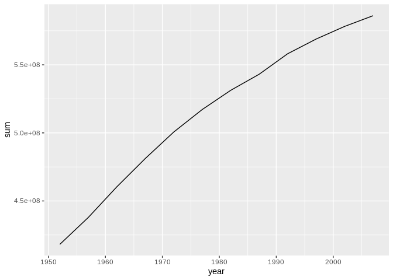

R data manipulation with RStudio and dplyr: an introduction
================
Stéphane Guillou
2019-04-11

If you want to review the installation instructions: <https://gitlab.com/stragu/DSH/blob/master/R/Installation.md>

Everything we write today will be saved in your R project. Please remember to save it in your H drive or USB if you are using Library computers.

Useful links, exercises and more information on how to continue your R learning are provided in our community resource in this Etherpad: <https://frama.link/DSH-dplyr> During the session, it is the only document you need to have open.

Keep in mind
------------

-   R is case sensitive: it will tell the difference between uppercase and lowercase.
-   Respect the naming rules for objects (no spaces, does not start with a number...)

### Help

For any dataset or function doubts that you might have, don't forget the three ways of getting help in RStudio:

1.  the shortcut command: `?functionname`
2.  the help function: `help(functionname)`
3.  the keyboard shortcut: press F1 after writing a function name

What are we going to learn?
---------------------------

In this hands-on session, you will use RStudio and the `dplyr` package to manipulate your data.

Specifically, you will learn how to **explore, filter, reorganise and process** your data with the following verbs:

-   `filter()`: pick observations
-   `arrange()`: reorder rows
-   `select()`: pick variables
-   `mutate()`: create new variables
-   `summarise()`: collapse to a single summary
-   `group_by()`: change the scope of function

Open RStudio
------------

-   If you are using your own laptop please open RStudio
-   Make sure you have a working internet connection
-   On Library computers (the first time takes about 10 min.):
    -   Log in with your UQ username (student if you have two) and password
    -   Make sure you have a working internet connection
    -   Go to search at bottom left corner (magnifiying glass)
    -   Open the ZENworks application
    -   Look for RStudio
    -   Double click on RStudio which will install both R and RStudio

Material
--------

### New project

Exercise 1 - New RStudio project

-   Click the "File" menu button (top left corner), then "New Project"
-   Click "New Directory"
-   Click "New Project" ("Empty project" if you have an older version of RStudio)
-   In "Directory name", type the name of your project, e.g. "dplyr\_intro"
-   Select the folder where to locate your project: the `Documents/RProjects` folder, which you can create if it doesn't exist yet.
-   Click the "Create Project" button

### Setting up

Exercise 2 - create a script, install `dplyr`

-   Menu: Top left corner, click the green "plus" symbol, or press the shortcut (for Windows/Linux) Ctrl+Shift+N or (for Mac) Cmd+Shift+N. This will open an "Untitled1" file.
-   Go to "File &gt; Save" or press (for Windows/Linux) Ctrl+S or (for Mac) Cmd+S. This will ask where you want to save your file and the name of the new file.
-   Call your file "dplyr\_intro.R"

We can add a sequence of useful commands to our script as we go.

-   Install and load the `dplyr` package:
    -   in the console, install the package: `install.packages("dplyr")`
    -   While you wait for dplyr to be installed, check <https://www.rdocumentation.org> and type "dplyr" in the search
    -   load the package:

``` r
library(dplyr)
```

    ## 
    ## Attaching package: 'dplyr'

    ## The following objects are masked from 'package:stats':
    ## 
    ##     filter, lag

    ## The following objects are masked from 'package:base':
    ## 
    ##     intersect, setdiff, setequal, union

> At home, you can install the whole "[tidyverse](https://www.tidyverse.org/)", a meta-package of useful packages for data science:

You only need to install a package once (with `install.packages()`), but you need to reload it every time you start a new R session (with `library()`).

### Introducing our data

Exercise 3 – import and explore data

1.  read the data into an object called "gapminder", using `read.csv()`:

``` r
gapminder <- read.csv("https://raw.githubusercontent.com/resbaz/r-novice-gapminder-files/master/data/gapminder-FiveYearData.csv")
```

1.  Explore the gapminder dataset using `dim()` and `str()`

How can we get the dataframe's variable names? There are two ways: `names(gapminder)` returns the names regardless of the object type, such as list, vector, data.frame etc., whereas `colnames(gapminder)` returns the variable names for matrix-like objects, such as matrices, dataframes...

To select one specific column in the dataframe, you can use the dollar sign in: `gapminder$year`. For example, try these:

``` r
nlevels(gapminder$country)
```

    ## [1] 142

``` r
class(gapminder$country)
```

    ## [1] "factor"

If we want nicer printing, we can convert our dataframe to a "tibble". You can install the `tibble` package with `install.packages(tibble)` and then run:

``` r
library(tibble)
gapminder <- as_tibble(gapminder)
```

### Basic dplyr verbs

The R package `dplyr` was developed by Hadley Wickham for data manipulation.

The book *[R for Data Science](http://r4ds.had.co.nz)* introduces the package as follows:

> You are going to learn the five key dplyr functions that allow you to solve the vast majority of your data manipulation challenges:
>
> -   Pick observations by their values with `filter()`.
> -   Reorder the rows with `arrange()`.
> -   Pick variables by their names with `select()`.
> -   Create new variables with functions of existing variables with `mutate()`.
> -   Collapse many values down to a single summary with `summarise()`.
>
> These can all be used in conjunction with `group_by()` which changes the scope of each function from operating on the entire dataset to operating on it group-by-group. These six functions provide the **verbs for a language of data manipulation**.

To use the verbs to their full extent, we will need **pipes** and **logical operators**, which we will introduce as we go.

#### Pick observations with `filter()`

The `filter()` function allows use to pick observations depending on one ore several conditions.

**Logical operators** allow us to **check for a condition**. Remember: `=` is to assign a value to a variable, `==` is to check for a condition.

-   `==` equal
-   `!=` different
-   `>` greater than
-   `<` smaller than
-   `>=` greater or equal
-   `<=` smaller or equal

Filter the observations for Australia, using `filter()` and a logical operator:

``` r
australia <- filter(gapminder, country == "Australia")
australia
```

    ## # A tibble: 12 x 6
    ##    country    year      pop continent lifeExp gdpPercap
    ##    <fct>     <int>    <dbl> <fct>       <dbl>     <dbl>
    ##  1 Australia  1952  8691212 Oceania      69.1    10040.
    ##  2 Australia  1957  9712569 Oceania      70.3    10950.
    ##  3 Australia  1962 10794968 Oceania      70.9    12217.
    ##  4 Australia  1967 11872264 Oceania      71.1    14526.
    ##  5 Australia  1972 13177000 Oceania      71.9    16789.
    ##  6 Australia  1977 14074100 Oceania      73.5    18334.
    ##  7 Australia  1982 15184200 Oceania      74.7    19477.
    ##  8 Australia  1987 16257249 Oceania      76.3    21889.
    ##  9 Australia  1992 17481977 Oceania      77.6    23425.
    ## 10 Australia  1997 18565243 Oceania      78.8    26998.
    ## 11 Australia  2002 19546792 Oceania      80.4    30688.
    ## 12 Australia  2007 20434176 Oceania      81.2    34435.

Filter the rows that have a life expectancy `lifeExp` greater than 80 years:

``` r
life80 <- filter(gapminder, lifeExp > 80)
dim(life80)
```

    ## [1] 21  6

#### Reorder rows with `arrange()`

If we want to have a look at the entries with highest GDP per capita:

``` r
arrange(gapminder, desc(gdpPercap))
```

    ## # A tibble: 1,704 x 6
    ##    country    year     pop continent lifeExp gdpPercap
    ##    <fct>     <int>   <dbl> <fct>       <dbl>     <dbl>
    ##  1 Kuwait     1957  212846 Asia         58.0   113523.
    ##  2 Kuwait     1972  841934 Asia         67.7   109348.
    ##  3 Kuwait     1952  160000 Asia         55.6   108382.
    ##  4 Kuwait     1962  358266 Asia         60.5    95458.
    ##  5 Kuwait     1967  575003 Asia         64.6    80895.
    ##  6 Kuwait     1977 1140357 Asia         69.3    59265.
    ##  7 Norway     2007 4627926 Europe       80.2    49357.
    ##  8 Kuwait     2007 2505559 Asia         77.6    47307.
    ##  9 Singapore  2007 4553009 Asia         80.0    47143.
    ## 10 Norway     2002 4535591 Europe       79.0    44684.
    ## # … with 1,694 more rows

#### Pick variables with `select()`

Select allows use to pick variable (i.e. columns) from the dataset. For example, to only keep the data about year, country and GDP per capita:

``` r
(gap_small <- select(gapminder, year, country, gdpPercap))
```

    ## # A tibble: 1,704 x 3
    ##     year country     gdpPercap
    ##    <int> <fct>           <dbl>
    ##  1  1952 Afghanistan      779.
    ##  2  1957 Afghanistan      821.
    ##  3  1962 Afghanistan      853.
    ##  4  1967 Afghanistan      836.
    ##  5  1972 Afghanistan      740.
    ##  6  1977 Afghanistan      786.
    ##  7  1982 Afghanistan      978.
    ##  8  1987 Afghanistan      852.
    ##  9  1992 Afghanistan      649.
    ## 10  1997 Afghanistan      635.
    ## # … with 1,694 more rows

We wrap it in parentheses so it also prints to screen.

If we only want this data for 1997, we can associate `select()` to `filter()`:

``` r
gap_small_97 <- filter(gap_small, year == 1997)
```

We can make our code more readable and avoid creating useless intermediate objects by **piping** commands into each other. The pipe symbol `%>%` **strings commands together**, using the left-side output as the first argument of the right-side function.

This command:

``` r
summary(gapminder)
```

    ##         country          year           pop               continent  
    ##  Afghanistan:  12   Min.   :1952   Min.   :6.001e+04   Africa  :624  
    ##  Albania    :  12   1st Qu.:1966   1st Qu.:2.794e+06   Americas:300  
    ##  Algeria    :  12   Median :1980   Median :7.024e+06   Asia    :396  
    ##  Angola     :  12   Mean   :1980   Mean   :2.960e+07   Europe  :360  
    ##  Argentina  :  12   3rd Qu.:1993   3rd Qu.:1.959e+07   Oceania : 24  
    ##  Australia  :  12   Max.   :2007   Max.   :1.319e+09                 
    ##  (Other)    :1632                                                    
    ##     lifeExp        gdpPercap       
    ##  Min.   :23.60   Min.   :   241.2  
    ##  1st Qu.:48.20   1st Qu.:  1202.1  
    ##  Median :60.71   Median :  3531.8  
    ##  Mean   :59.47   Mean   :  7215.3  
    ##  3rd Qu.:70.85   3rd Qu.:  9325.5  
    ##  Max.   :82.60   Max.   :113523.1  
    ## 

Is equivalent to:

``` r
gapminder %>% summary()
```

    ##         country          year           pop               continent  
    ##  Afghanistan:  12   Min.   :1952   Min.   :6.001e+04   Africa  :624  
    ##  Albania    :  12   1st Qu.:1966   1st Qu.:2.794e+06   Americas:300  
    ##  Algeria    :  12   Median :1980   Median :7.024e+06   Asia    :396  
    ##  Angola     :  12   Mean   :1980   Mean   :2.960e+07   Europe  :360  
    ##  Argentina  :  12   3rd Qu.:1993   3rd Qu.:1.959e+07   Oceania : 24  
    ##  Australia  :  12   Max.   :2007   Max.   :1.319e+09                 
    ##  (Other)    :1632                                                    
    ##     lifeExp        gdpPercap       
    ##  Min.   :23.60   Min.   :   241.2  
    ##  1st Qu.:48.20   1st Qu.:  1202.1  
    ##  Median :60.71   Median :  3531.8  
    ##  Mean   :59.47   Mean   :  7215.3  
    ##  3rd Qu.:70.85   3rd Qu.:  9325.5  
    ##  Max.   :82.60   Max.   :113523.1  
    ## 

Here's another example with the `filter()` verb:

``` r
gapminder %>%
  filter(country != "France")
```

    ## # A tibble: 1,692 x 6
    ##    country      year      pop continent lifeExp gdpPercap
    ##    <fct>       <int>    <dbl> <fct>       <dbl>     <dbl>
    ##  1 Afghanistan  1952  8425333 Asia         28.8      779.
    ##  2 Afghanistan  1957  9240934 Asia         30.3      821.
    ##  3 Afghanistan  1962 10267083 Asia         32.0      853.
    ##  4 Afghanistan  1967 11537966 Asia         34.0      836.
    ##  5 Afghanistan  1972 13079460 Asia         36.1      740.
    ##  6 Afghanistan  1977 14880372 Asia         38.4      786.
    ##  7 Afghanistan  1982 12881816 Asia         39.9      978.
    ##  8 Afghanistan  1987 13867957 Asia         40.8      852.
    ##  9 Afghanistan  1992 16317921 Asia         41.7      649.
    ## 10 Afghanistan  1997 22227415 Asia         41.8      635.
    ## # … with 1,682 more rows

... becomes:

``` r
filter(gapminder, country != "France")
```

    ## # A tibble: 1,692 x 6
    ##    country      year      pop continent lifeExp gdpPercap
    ##    <fct>       <int>    <dbl> <fct>       <dbl>     <dbl>
    ##  1 Afghanistan  1952  8425333 Asia         28.8      779.
    ##  2 Afghanistan  1957  9240934 Asia         30.3      821.
    ##  3 Afghanistan  1962 10267083 Asia         32.0      853.
    ##  4 Afghanistan  1967 11537966 Asia         34.0      836.
    ##  5 Afghanistan  1972 13079460 Asia         36.1      740.
    ##  6 Afghanistan  1977 14880372 Asia         38.4      786.
    ##  7 Afghanistan  1982 12881816 Asia         39.9      978.
    ##  8 Afghanistan  1987 13867957 Asia         40.8      852.
    ##  9 Afghanistan  1992 16317921 Asia         41.7      649.
    ## 10 Afghanistan  1997 22227415 Asia         41.8      635.
    ## # … with 1,682 more rows

To do what we did previously in one single command, using the pipe:

``` r
gap_small_97 <- gapminder %>%
    select(year, country, gdpPercap) %>%
    filter(year == 1997)
```

The pipe operator can be read as "then" and makes the code a lot **more readable** than when nesting functions into each other, and avoids the creation of several intermediate objects.

From now on, we'll use this syntax.

Exercise 4 – Select the 2002 life expectancy observation for Eritrea (and remove the rest of the variables)

``` r
eritrea_2002 <- gapminder %>%
    select(year, country, lifeExp) %>%
    filter(country == "Eritrea", year == 2002)
```

#### Create new variables with `mutate()`

Have a look at what the verb `mutate()` can do with `?mutate`.

Let's see what the two following variables can be used for:

``` r
gapminder %>%
    select(gdpPercap, pop)
```

    ## # A tibble: 1,704 x 2
    ##    gdpPercap      pop
    ##        <dbl>    <dbl>
    ##  1      779.  8425333
    ##  2      821.  9240934
    ##  3      853. 10267083
    ##  4      836. 11537966
    ##  5      740. 13079460
    ##  6      786. 14880372
    ##  7      978. 12881816
    ##  8      852. 13867957
    ##  9      649. 16317921
    ## 10      635. 22227415
    ## # … with 1,694 more rows

Exercise 5 – use `mutate()` to create a `gdp` variable

Name your new dataset `gap_gdp`. When finished, `dim(gap_gdp)` should result in `1704 7`.

Hint: use the `*` operator within `mutate()`.

``` r
gap_gdp <- gapminder %>%
    mutate(gdp = gdpPercap * pop)
dim(gap_gdp)
```

    ## [1] 1704    7

``` r
head(gap_gdp)
```

    ## # A tibble: 6 x 7
    ##   country      year      pop continent lifeExp gdpPercap          gdp
    ##   <fct>       <int>    <dbl> <fct>       <dbl>     <dbl>        <dbl>
    ## 1 Afghanistan  1952  8425333 Asia         28.8      779.  6567086330.
    ## 2 Afghanistan  1957  9240934 Asia         30.3      821.  7585448670.
    ## 3 Afghanistan  1962 10267083 Asia         32.0      853.  8758855797.
    ## 4 Afghanistan  1967 11537966 Asia         34.0      836.  9648014150.
    ## 5 Afghanistan  1972 13079460 Asia         36.1      740.  9678553274.
    ## 6 Afghanistan  1977 14880372 Asia         38.4      786. 11697659231.

Reuse a variable computed by 'mutate()' straight away:

``` r
(gap_gdp <- gapminder %>%
    mutate(gdp = gdpPercap * pop, gdpMil = gdp / 10^6))
```

    ## # A tibble: 1,704 x 8
    ##    country      year     pop continent lifeExp gdpPercap         gdp gdpMil
    ##    <fct>       <int>   <dbl> <fct>       <dbl>     <dbl>       <dbl>  <dbl>
    ##  1 Afghanistan  1952  8.43e6 Asia         28.8      779.     6.57e 9  6567.
    ##  2 Afghanistan  1957  9.24e6 Asia         30.3      821.     7.59e 9  7585.
    ##  3 Afghanistan  1962  1.03e7 Asia         32.0      853.     8.76e 9  8759.
    ##  4 Afghanistan  1967  1.15e7 Asia         34.0      836.     9.65e 9  9648.
    ##  5 Afghanistan  1972  1.31e7 Asia         36.1      740.     9.68e 9  9679.
    ##  6 Afghanistan  1977  1.49e7 Asia         38.4      786.     1.17e10 11698.
    ##  7 Afghanistan  1982  1.29e7 Asia         39.9      978.     1.26e10 12599.
    ##  8 Afghanistan  1987  1.39e7 Asia         40.8      852.     1.18e10 11821.
    ##  9 Afghanistan  1992  1.63e7 Asia         41.7      649.     1.06e10 10596.
    ## 10 Afghanistan  1997  2.22e7 Asia         41.8      635.     1.41e10 14122.
    ## # … with 1,694 more rows

#### `group_by()` and `summarise()`

`group_by()` changes the scope of each function from operating on the entire dataset to operating on it group-by-group. For example, to group by continents:

``` r
gap_continents <- gapminder %>%
    group_by(continent)
head(gap_continents)
```

    ## # A tibble: 6 x 6
    ## # Groups:   continent [1]
    ##   country      year      pop continent lifeExp gdpPercap
    ##   <fct>       <int>    <dbl> <fct>       <dbl>     <dbl>
    ## 1 Afghanistan  1952  8425333 Asia         28.8      779.
    ## 2 Afghanistan  1957  9240934 Asia         30.3      821.
    ## 3 Afghanistan  1962 10267083 Asia         32.0      853.
    ## 4 Afghanistan  1967 11537966 Asia         34.0      836.
    ## 5 Afghanistan  1972 13079460 Asia         36.1      740.
    ## 6 Afghanistan  1977 14880372 Asia         38.4      786.

`summarise()` collapses many values down to a single summary. For example, to find the mean life expectancy for the whole dataset:

``` r
gapminder %>%
  summarise(meanLE = mean(lifeExp))
```

    ## # A tibble: 1 x 1
    ##   meanLE
    ##    <dbl>
    ## 1   59.5

Associating the two functions makes it more interesting. To find out the mean life expectancy for each continent in 2007, we can do the following:

``` r
gapminder %>% 
    filter(year == 2007) %>%
    group_by(continent) %>%
    summarise(meanLE = mean(lifeExp))
```

    ## # A tibble: 5 x 2
    ##   continent meanLE
    ##   <fct>      <dbl>
    ## 1 Africa      54.8
    ## 2 Americas    73.6
    ## 3 Asia        70.7
    ## 4 Europe      77.6
    ## 5 Oceania     80.7

Exercise 6 – group by country, and find out the maximum life expectancy ever recorded

Hint: `?max`

``` r
gapminder %>% 
    group_by(country) %>%
    summarise(maxLE = max(lifeExp))
```

    ## # A tibble: 142 x 2
    ##    country     maxLE
    ##    <fct>       <dbl>
    ##  1 Afghanistan  43.8
    ##  2 Albania      76.4
    ##  3 Algeria      72.3
    ##  4 Angola       42.7
    ##  5 Argentina    75.3
    ##  6 Australia    81.2
    ##  7 Austria      79.8
    ##  8 Bahrain      75.6
    ##  9 Bangladesh   64.1
    ## 10 Belgium      79.4
    ## # … with 132 more rows

#### More examples

Another example of new variable with `mutate()`:

``` r
starwars %>% 
  mutate(name, bmi = mass / ((height / 100)  ^ 2)) %>%
  select(name:mass, bmi)
```

    ## # A tibble: 87 x 4
    ##    name               height  mass   bmi
    ##    <chr>               <int> <dbl> <dbl>
    ##  1 Luke Skywalker        172    77  26.0
    ##  2 C-3PO                 167    75  26.9
    ##  3 R2-D2                  96    32  34.7
    ##  4 Darth Vader           202   136  33.3
    ##  5 Leia Organa           150    49  21.8
    ##  6 Owen Lars             178   120  37.9
    ##  7 Beru Whitesun lars    165    75  27.5
    ##  8 R5-D4                  97    32  34.0
    ##  9 Biggs Darklighter     183    84  25.1
    ## 10 Obi-Wan Kenobi        182    77  23.2
    ## # … with 77 more rows

And a more complex processing of a dataset:

``` r
starwars %>%
  group_by(species) %>%
  summarise(
    n = n(),
    mass = mean(mass, na.rm = TRUE)
  ) %>%
  filter(n > 1)
```

    ## # A tibble: 9 x 3
    ##   species      n  mass
    ##   <chr>    <int> <dbl>
    ## 1 <NA>         5  48  
    ## 2 Droid        5  69.8
    ## 3 Gungan       3  74  
    ## 4 Human       35  82.8
    ## 5 Kaminoan     2  88  
    ## 6 Mirialan     2  53.1
    ## 7 Twi'lek      2  55  
    ## 8 Wookiee      2 124  
    ## 9 Zabrak       2  80

An example of data manipulation and data visualisation in the same command:

``` r
library(ggplot2)
gapminder %>% 
  filter(continent == "Europe") %>%
  group_by(year) %>% 
  summarise(sum = sum(pop)) %>% 
  ggplot(aes(x = year,
             y = sum)) +
  geom_line()
```



Close Rproject
--------------

If you want to close RStudio, you should save your project first.

-   File
-   close project (It will ask you if you want to save your history)
-   then, close RStudio

What next?
----------

Look at our compilation of resources: <https://gitlab.com/stragu/DSH/blob/master/R/usefullinks.md>
