R data visualisation with RStudio and ggplot2: intermediate
================
2022-02-03

## Essential shortcuts

-   function or dataset help: press <kbd>F1</kbd> with your cursor
    anywhere in a function name.
-   execute from script: <kbd>Ctrl</kbd> + <kbd>Enter</kbd>
-   assignment operator (`<-`): <kbd>Alt</kbd> + <kbd>-</kbd>

## Open RStudio

On library computers:

-   Log in with your UQ username and password (use your student
    credentials if you are both staff and student)
-   Make sure you have a working internet connection
-   Go to search the magnifying glass (bottom left)
-   Open the ZENworks application
-   Look for the letter R
-   Double click on RStudio which will install both R and RStudio

If you are using your own laptop:

-   Make sure you have a working internet connection
-   Open RStudio

## Disclaimer

We will assume you are an R intermediate user and that you have used
ggplot2 before.

## What are we going to learn?

During this hands-on session, you will:

-   install a tool for picking colours
-   customise scales and ranges
-   divide a visualisation into facets
-   explore new geometries
-   modify statistical transformations
-   adjust a geometry’s position
-   further modify themes
-   make a plot interactive

## Material

### Setting up

**Install ggplot2** if you don’t already have it, with:
`install.packages("ggplot2")`

**Create a new project** to keep everything nicely contained in one
directory:

-   Click the “Create a project” button (top left cube icon)
-   Click “New Directory”
-   Click “New Project” (“Empty project” if you have an older version of
    RStudio)
-   In “Directory name”, type the name of your project,
    e.g. “ggplot2_intermediate”
-   Select the folder where to locate your project:
    e.g. `Documents/RProjects`, which you can create if it doesn’t exist
    yet. You can use your H drive at UQ to make sure you can find it
    again.
-   Click the “Create Project” button

Let’s also create a “plots” folder to store exports:

``` r
dir.create("plots")
```

Create a **new script** (File \> New File \> R Script) and add a few
comments to give context:

    # Description : ggplot2 intermediate with gapminder data
    # Author: <your name>
    # Date: <today's date>

Finally, make sure you **load ggplot2** so we can use its functions:

``` r
library(ggplot2)
```

### Import data

#### Challenge 1 – import data

Our data is located at
<https://raw.githubusercontent.com/resbaz/r-novice-gapminder-files/master/data/gapminder-FiveYearData.csv>

Using the following syntax, how can you read the online CSV data into an
R object?

    gapminder <- ...

You have to use the `read.csv()` function, which can take a URL:

``` r
gapminder <- read.csv(
  file = "https://raw.githubusercontent.com/resbaz/r-novice-gapminder-files/master/data/gapminder-FiveYearData.csv")
```

If you are not familiar with the dataset, `View()` and `summary()` can
help you explore it.

``` r
View(gapminder)    # view as a separate spreadsheet
summary(gapminder) # summary statistics for each variable
```

The Environment pane gives you an overview of the variables.

### Explore data visually

Let’s start with a question: how do Gross Domestic Product (GDP) and
life expectancy relate?

We can make a simple plot with the basics of ggplot2:

``` r
ggplot(data = gapminder,
       mapping = aes(x = gdpPercap,
                     y = lifeExp)) +
  geom_point()
```

<!-- -->

Remember that the 3 main elements of a ggplot2 visualisation are:

-   the *data*
-   the *mapping of aesthetics to variables*
-   the *geometry*

### Aesthetics available

So far we have been using the `x` and `y` aesthetics. There are more
available, depending on the geometry that you are using.

Here are some common examples:

-   To change the *shape* based on a variable, use
    `shape = <discrete variable>` inside the `aes()` call.
-   If you want to change the size of the geometric object, you can use
    the `size = <continuous variable>` argument.
-   Similarly, to change the *colour* based on a variable, use
    `colour = <variable>` and `fill = <variable>` inside the `aes()`
    call.

Let’s modify our plot to colour the points according to the continent
variable.

``` r
ggplot(data = gapminder,
       mapping = aes(x = gdpPercap,
                     y = lifeExp)) +
  geom_point(aes(colour = continent)) +
  geom_smooth()
```

    ## `geom_smooth()` using method = 'gam' and formula 'y ~ s(x, bs = "cs")'

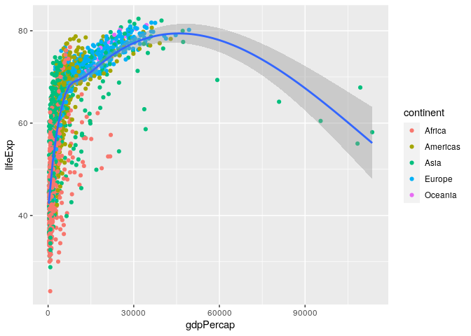<!-- -->

#### Challenge 2 - save our plot

How can we save our scatter plot to the ‘plots’ directory we created
using a function?

``` r
ggsave(filename = "plots/gdpPercap_v_lifeExp.png", width = 7, height = 4)
```

    ## `geom_smooth()` using method = 'gam' and formula 'y ~ s(x, bs = "cs")'

> Remember that the `ggsave` function saves the last plot.

### Modifying scales

#### More control over colours

This plot uses the default discrete palette.

> **Saving some typing**: We will keep modifying this plot. To reuse the
> constant base of our plot (the `ggplot()` call and the point
> geometry), we can create an object:

``` r
p <- ggplot(data = gapminder,
       mapping = aes(x = gdpPercap,
                     y = lifeExp)) +
  geom_point(aes(colour = continent)) +
  geom_smooth()
```

We can use other palettes than the default one. ggplot2 provides extra
functions to modify colour scales. For example:

``` r
p +
  scale_colour_viridis_d()
```

    ## `geom_smooth()` using method = 'gam' and formula 'y ~ s(x, bs = "cs")'

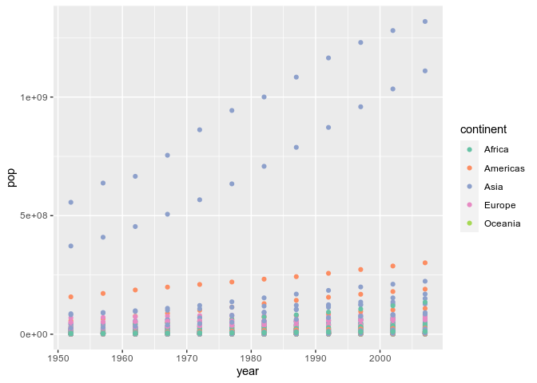<!-- -->

Viridis is a collection of palettes that are designed to be accessible
(i.e. perceptually uniform in colour or black and white, and perceivable
for various forms of colour blindness). The structure of the function
name is `scale_<aesthetic>_viridis_<datatype>()`, the different data
types being **d**iscrete, **c**ontinuous or **b**inned.

Another collection of palettes is the ColorBrewer collection:

``` r
p +
  scale_colour_brewer(palette = "Set1")
```

    ## `geom_smooth()` using method = 'gam' and formula 'y ~ s(x, bs = "cs")'

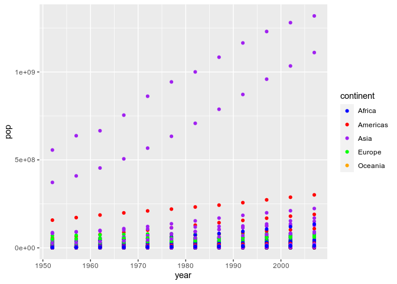<!-- -->

You can see the palettes available by looking at the help page of
`scale_colour_brewer()`, under the header “Palettes”. However, the names
alone might not be enough to picture them, so head to
<http://colorbrewer2.org/> to find the one that you like. Importantly,
the website allows you to tick the options “colorblind safe” and “print
friendly”… which would rule out all the qualitative palettes for our 5
continents!

A useful package that introduces many palettes for ggplot2 is the
colorspace package, which promotes the [Hue-Chroma-Luminance (HCL)
colour
space](https://colorspace.r-forge.r-project.org/articles/color_spaces.html#human-color-vision-and-the-hcl-color-model-1).
This colour space is perceptually-based, which means it is particularly
suited for human perception of colours.

For colorspace, the function names are structured as follows:
`scale_<aesthetic>_<datatype>_<colorscale>()`

Let’s first use an alternative qualitative palette:

``` r
library(colorspace)
p +
  scale_colour_discrete_qualitative()
```

    ## `geom_smooth()` using method = 'gam' and formula 'y ~ s(x, bs = "cs")'

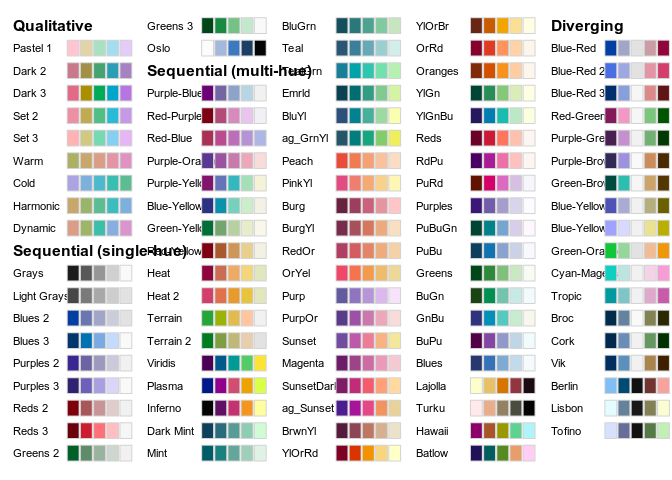<!-- -->

This is the default ggplot2 palette! Which means ggplot2 already use a
HCL palette. But having the colorspace package loaded, we can now see
all the palettes available:

``` r
hcl_palettes(plot = TRUE)
```

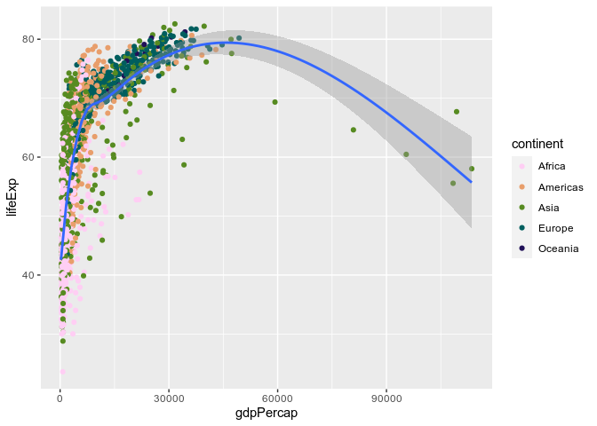<!-- -->

Let’s try a different one:

``` r
p +
  scale_colour_discrete_sequential("Batlow")
```

    ## `geom_smooth()` using method = 'gam' and formula 'y ~ s(x, bs = "cs")'

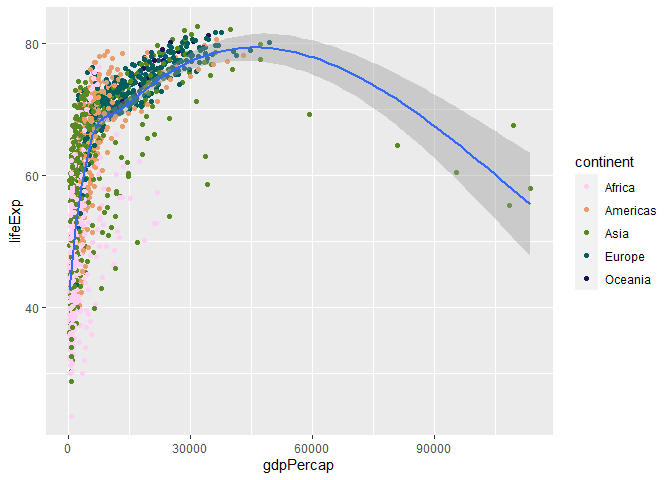<!-- -->

Finally, to use a custom palette, we can use the ggplot2 function
`scale_colour_manual()` and provide a list of colour names.

``` r
p +
  scale_colour_manual(values = c("lightblue", "pink", "purple", "black", "red"))
```

    ## `geom_smooth()` using method = 'gam' and formula 'y ~ s(x, bs = "cs")'

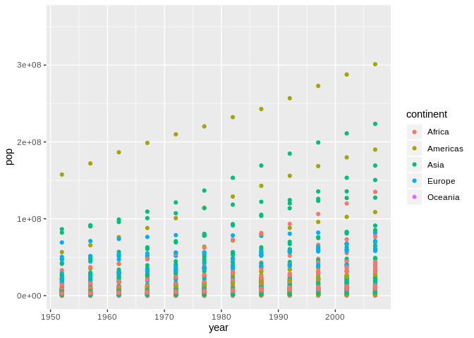<!-- -->

You can list all the R colour names with the function `colours()`, which
prints out a list of their names, but know that you are not limited to
these 657 values: you can also use HEX values, which is particularly
useful if you have to respect a colour scheme you were given.

You can find [visual lists](https://r-charts.com/colors/) of all the R
colours, but there is a way to pick colours more comfortably: we can use
the colourpicker package, which adds a handy add-in to RStudio. Install
it and use the new “Addins \> Colour Picker” tool to create a vector of
colours for your custom palette.

> That was a lot of options about colours, but know that in some cases,
> the most straight-forward way to make your visualisations readable by
> most is to use symbols instead of colours. In ggplot2, you would use
> the `shape` aesthetic.

#### Axis scale modifiers

We could further modify our plot to make it more readable. For example,
we can use a different x axis scale to distribute the data differently:

``` r
p +
  scale_x_log10()
```

    ## `geom_smooth()` using method = 'gam' and formula 'y ~ s(x, bs = "cs")'

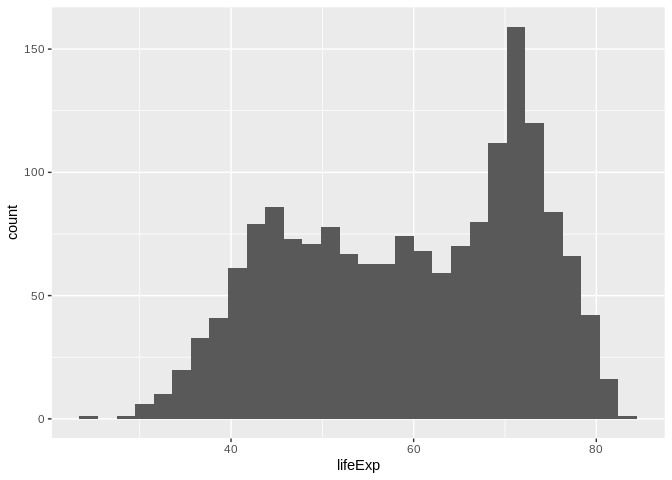<!-- -->

We can also further customise a scale with breaks and labels:

``` r
p +
  scale_x_log10(breaks = c(5e2, 1e3, 1e4, 1e5),
                labels = c("500", "1 k", "10 k", "100 k"))
```

    ## `geom_smooth()` using method = 'gam' and formula 'y ~ s(x, bs = "cs")'

<!-- -->

> You can use the scientific notation `1e5` to mean “a 1 followed by 5
> zeros”.

### Zooming in

We might want to focus on the left hand side part of our original plot:

``` r
p
```

    ## `geom_smooth()` using method = 'gam' and formula 'y ~ s(x, bs = "cs")'

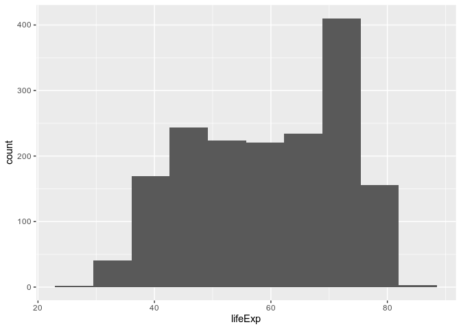<!-- -->

To zoom in, we might want to change our axis limits by using `ylim()`.

``` r
p +
  xlim(c(0, 6e4))
```

    ## `geom_smooth()` using method = 'gam' and formula 'y ~ s(x, bs = "cs")'

    ## Warning: Removed 5 rows containing non-finite values (stat_smooth).

    ## Warning: Removed 5 rows containing missing values (geom_point).

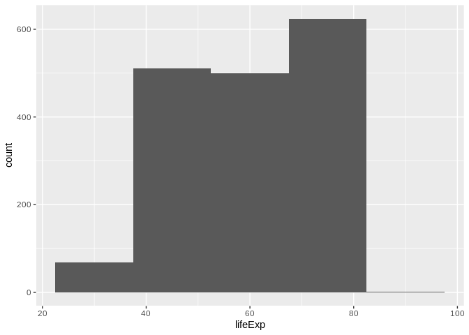<!-- -->

Notice the warning message? ggplot2 informs us that it couldn’t
represent part of the data because of the axis limits.

The method we use works for our point geometry, but is problematic for
other shapes that could disappear entirely or change their appearance
because they are based on different data: we are actually **clipping**
our visualisation! Notice how the trend line now looks different?

A better way to focus on one part of the plot would be to modify the
**coordinate system**:

``` r
p +
  coord_cartesian(xlim = c(0, 6e4))
```

    ## `geom_smooth()` using method = 'gam' and formula 'y ~ s(x, bs = "cs")'

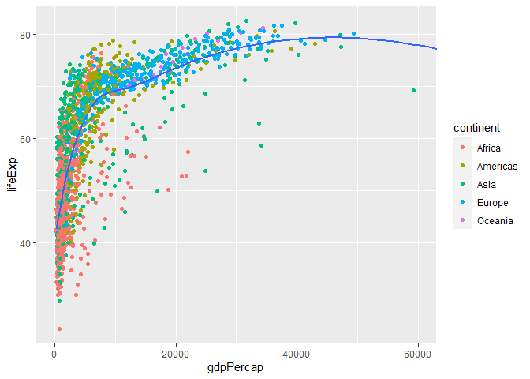<!-- -->

The Cartesian coordinate system is the default one in ggplot2. You could
change the coordinate system to `coord_polar()` for circular
visualisations, or to `coord_map()` to visualise spatial data.

### Interactive plots

The plotly package brings the power of the Plotly javascript library to
R. Install it with `install.packages(plotly)`, and you’ll then be able
to convert a ggplot2 visualisation into an interactive HTML
visualisation with one single function!

Let’s reuse our original plot object, and feed it to `ggplotly()`:

``` r
library(plotly)
ggplotly(p)
```

You can now identify single points, zoom into your plot, and show/hide
categories. However, the pop-up does not tell us which country the point
corresponds to. That’s because we don’t mention the `country` variable
in our code. Let’s reveal that information by slightly modifying the `p`
object:

``` r
p <- ggplot(data = gapminder,
       mapping = aes(x = gdpPercap,
                     y = lifeExp,
                     label = country)) + # one extra aesthetic for an extra variable
  geom_point(aes(colour = continent)) +
  geom_smooth()
```

The interactive version now tells us which country each point correspond
to:

``` r
ggplotly(p)
```

> You can export the visualisation as a HTML page for sharing with
> others.

### Histograms

#### Challenge 3 – histogram of life expectancy

Search for the histogram geometry function, and plot the life
expectancy. How can we modify the bars?

``` r
ggplot(gapminder, aes(x = lifeExp)) +
  geom_histogram() # by default, bins = 30
```

    ## `stat_bin()` using `bins = 30`. Pick better value with `binwidth`.

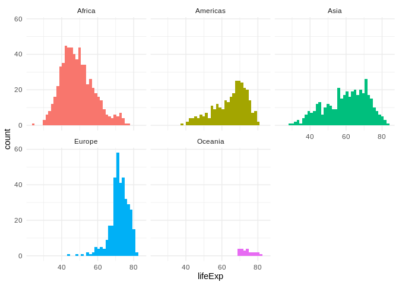<!-- -->

> **Saving some typing:** remember we can omit the names of the
> arguments if we use them in order? Being explicit about the **argument
> names** is useful when learning the ins and outs of a function, but as
> you get more familiar with ggplot2, you can do away with the obvious
> ones, like `data =` and `mapping =` (as long as they are used in the
> right order!).

Let’s change the bin width:

``` r
ggplot(gapminder, aes(x = lifeExp)) +
  geom_histogram(binwidth = 1)
```

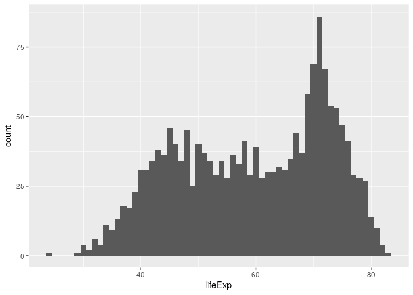<!-- -->

Here, each bar contains one year of life expectancy.

We can also change the number of bins:

``` r
ggplot(gapminder, aes(x = lifeExp)) +
  geom_histogram(bins = 10)
```

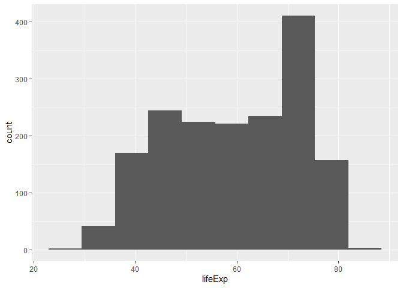<!-- -->

Now, let’s colour the bins by continent. Instinctively, you could try
the `colour` aesthetic:

``` r
ggplot(gapminder, aes(x = lifeExp, colour = continent)) +
  geom_histogram(bins = 10)
```

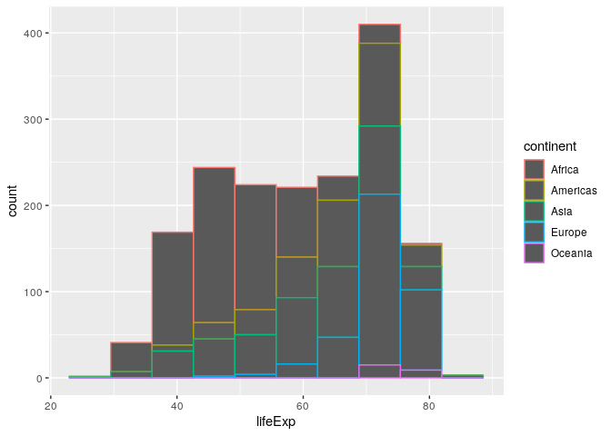<!-- -->

…but it only colours the outline of the rectangles!

Some aesthetics will work better with some geometries than others. We
have to use the `fill` aesthetic to colour the areas instead:

``` r
ggplot(gapminder, aes(x = lifeExp, fill = continent)) +
  geom_histogram(bins = 10)
```

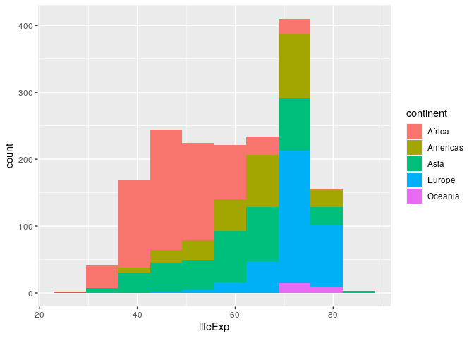<!-- -->

Colouring our bins allows us to experiment with the geometry’s
**position**. The histogram geometry uses the “stack” position by
default. It might convey different information if we make it use ratios
instead, using the `position = "fill"` argument:

``` r
ggplot(gapminder,
       aes(x = lifeExp,
           fill = continent)) +
  geom_histogram(bins = 10,
                 position = "fill")
```

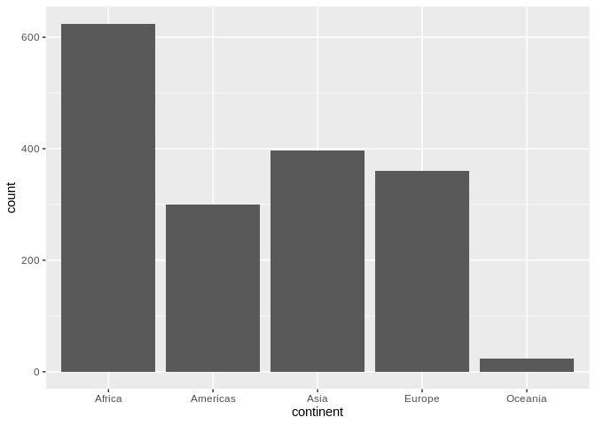<!-- -->

You might have noticed that the y-axis is still labeled ‘count’ when it
has changed to a proportion. We can modify the y-axis labels to percent
using the scales package which is loaded with the ggplot2 package.

We can also modify the y-axis labels with the `labs()` function.

``` r
library(scales)

ggplot(gapminder,
       aes(x = lifeExp,
           fill = continent)) +
  geom_histogram(bins = 10,
                 position = "fill") +
  scale_y_continuous(labels = scales::percent) +
  labs(y = "Percent")
```

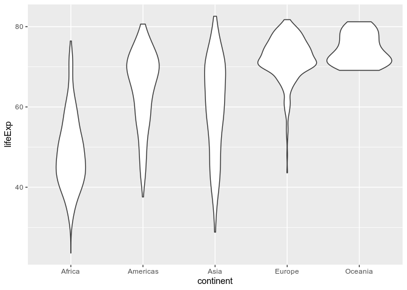<!-- -->

We can also make the bars “dodge” each other:

``` r
ggplot(gapminder,
       aes(x = lifeExp,
           fill = continent)) +
  geom_histogram(bins = 10,
                 position = "dodge")
```

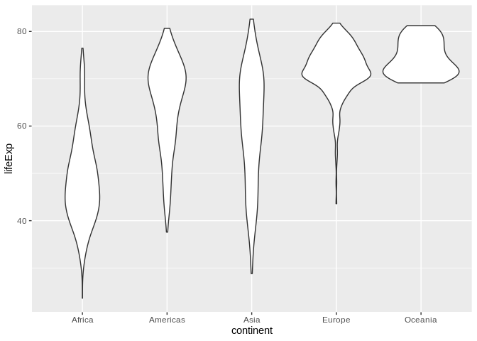<!-- -->

### Faceting

An even more readable representation could use **faceting**:

``` r
ggplot(gapminder,
       aes(x = lifeExp,
           fill = continent)) +
  geom_histogram(bins = 40) +
  facet_wrap(vars(continent))
```

<!-- -->

We have to wrap the variable(s) we want to facet by into the `vars()`
function.

> Faceting is a great way to add yet another variable to your
> visualisation, instead of using another aesthetic.

### Theming

The legend is probably superfluous. We want to keep the colours, but we
use the `theme()` function to customise the look of our plot and remove
the legend:

``` r
ggplot(gapminder,
       aes(x = lifeExp,
           fill = continent)) +
  geom_histogram(bins = 40) +
  facet_wrap(~ continent) +
  theme(legend.position = "none")
```

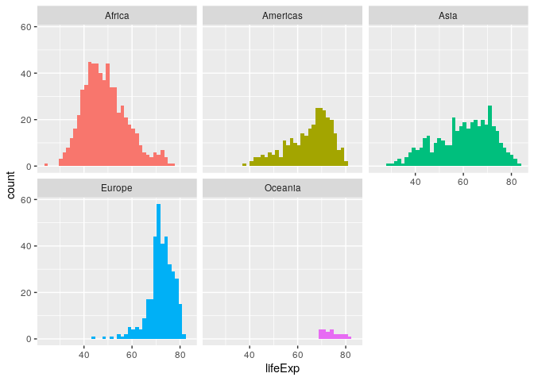<!-- -->

If you use a pre-built theme function, make sure you place it before
customising the legend. Otherwise it will bring the legend back!

``` r
ggplot(gapminder,
       aes(x = lifeExp,
           fill = continent)) +
  geom_histogram(bins = 40) +
  facet_wrap(~ continent) +
  theme_minimal() + # before customising the legend!
  theme(legend.position = "none")
```

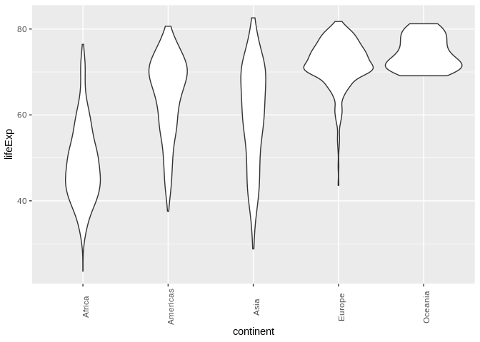<!-- -->

### A more refined facetted example

This extra example gives an idea of how a refined ggplot2 visualisation
might be constructed. It represents 4 different variables, using the
larger diamonds data set.

``` r
ggplot(diamonds,
       aes(x = carat,
           y = price)) +
  geom_point(aes(colour = color),
             alpha = 0.5,
             size = 0.5) +
  scale_color_brewer(palette = "Spectral") +
  geom_smooth(se = FALSE,
              linetype = "dashed",
              colour = "black",
              size = 0.5) +
  facet_wrap(vars(cut)) +
  theme_minimal() +
  labs(y = "price (USD)")
```

    ## `geom_smooth()` using method = 'gam' and formula 'y ~ s(x, bs = "cs")'

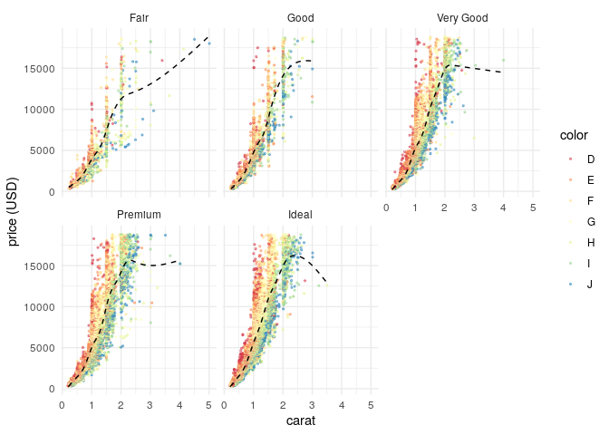<!-- -->

In this visualisation:

-   4 different variables are represented, thanks to both aesthetics and
    facets
-   two geometries are layered on top of each other to represent a
    relationship
-   both geometries are customised to make the plot readable (important
    here, since there are close to 54000 rows of data)
-   the default the colour scale is replaced
-   a built-in theme is used
-   a label clarifies the unit of measurement

### Boxplots

A simple boxplot can help visualise a distribution in categories:

``` r
ggplot(gapminder, aes(x = continent, y = lifeExp)) +
  geom_boxplot()
```

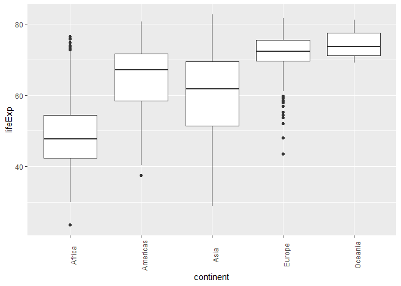<!-- -->

#### Challenge 4 – code comprehension

What do you think this extra line might do to our boxplots?

``` r
ggplot(gapminder, aes(x = continent, y = lifeExp)) +
  geom_boxplot() +
  theme(axis.text.x = element_text(angle = 90))
```

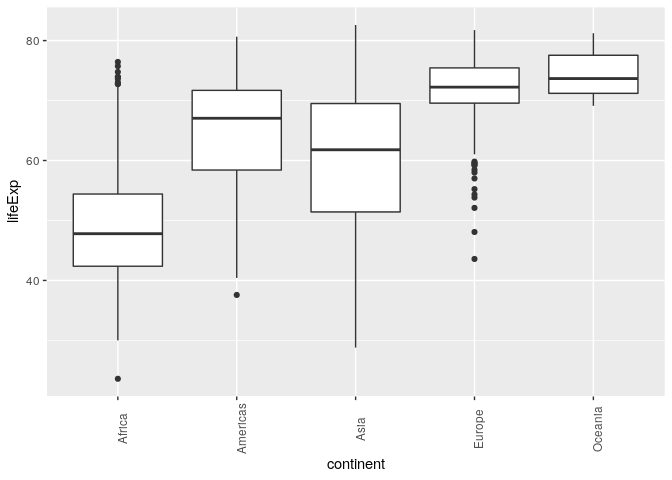<!-- -->

This is useful if the x labels get too cramped on the x axis: you can
rotate them to whatever angle you want.

> Try turning this plot into an interactive visualisation to see stats
> easily!

### Summarise data and plot

Let’s try summarising the average and standard deviation of life
expectancy by continent from the gapminder data and piping it directly
into a ggplot. We will need to install/load dplyr for this.

``` r
# install.packages("dplyr")
library(dplyr)
```

    ## 
    ## Attaching package: 'dplyr'

    ## The following objects are masked from 'package:stats':
    ## 
    ##     filter, lag

    ## The following objects are masked from 'package:base':
    ## 
    ##     intersect, setdiff, setequal, union

``` r
gapminder %>% 
  group_by(continent) %>% 
  summarise(aveLE = mean(lifeExp),
            sdLE = sd(lifeExp)) %>% 
  ggplot(aes(x = continent, 
             y = aveLE)) +
  geom_bar(stat = "identity",
           fill = "tomato") +
  geom_errorbar(aes(ymin = aveLE - sdLE,
                    ymax = aveLE + sdLE),
                width = 0.1)
```

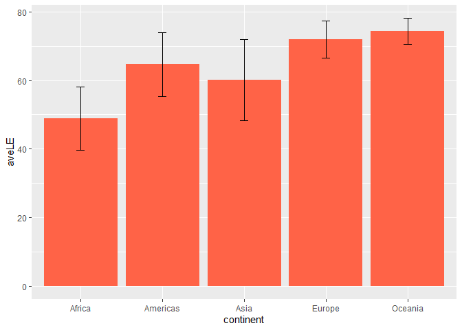<!-- -->

### Plot from mutliple summarised dataframes

In ggplot2, multiple data frames can be plotted on the same plot. For
example, let’s say we wanted to make a bar graph of total population by
year with the gapminder data set colored by continent and also include
the standard deviation of the total population per year at the top of
each column as an error bar? This may or may not make the most sense in
terms of representing the data, but we will do it here as an exercise.

1.  summarise the data by year to calculate the standard deviation
2.  summarise the data by continent and year for the filled columns
3.  plot the continent data and add the error bars from the first
    summary

``` r
total <- gapminder %>% 
   group_by(year) %>% # group by year
   summarise(tot = sum(pop), # sum the population for every year
             SD = sd(pop))
total
```

    ## # A tibble: 12 x 3
    ##     year         tot         SD
    ##    <int>       <dbl>      <dbl>
    ##  1  1952 2406957151.  58100863.
    ##  2  1957 2664404580   65504285.
    ##  3  1962 2899782974   69788650.
    ##  4  1967 3217478384   78375481.
    ##  5  1972 3576977158   88646817.
    ##  6  1977 3930045807   97481091.
    ##  7  1982 4289436840  105098650.
    ##  8  1987 4691477418  114756180.
    ##  9  1992 5110710260  124502589.
    ## 10  1997 5515204472  133417391.
    ## 11  2002 5886977579  140848283.
    ## 12  2007 6251013179  147621398.

``` r
cont_ave <- gapminder %>% 
  group_by(continent, year) %>% 
  summarise(totalpop = sum(pop)) %>% 
   ungroup()
```

    ## `summarise()` has grouped output by 'continent'. You can override using the `.groups` argument.

``` r
cont_ave
```

    ## # A tibble: 60 x 3
    ##    continent  year  totalpop
    ##    <chr>     <int>     <dbl>
    ##  1 Africa     1952 237640501
    ##  2 Africa     1957 264837738
    ##  3 Africa     1962 296516865
    ##  4 Africa     1967 335289489
    ##  5 Africa     1972 379879541
    ##  6 Africa     1977 433061021
    ##  7 Africa     1982 499348587
    ##  8 Africa     1987 574834110
    ##  9 Africa     1992 659081517
    ## 10 Africa     1997 743832984
    ## # ... with 50 more rows

When specifying a data set outside of the main `ggplot()` function - the
`data =` argument must be used. The other functions `geom_bar()` etc.
assume the first argument is `mapping = aes()` unless the data argument
is explicitly defined.

``` r
ggplot(data = cont_ave, aes(x = year, 
             y = totalpop)) +
  geom_bar(aes(fill = continent),
           stat = "identity") + # default is `stat = count` like a histogram
  geom_errorbar(data = total, # must use `data = ` to specify a new data set being used
                 aes(y = tot, # the y from the ggplot(aes()) is inherited, update
                     ymin = tot - SD, # error bar arguments
                     ymax = tot + SD),
                width = 0.8) +
   labs(x = "Year", 
        y = "Population in Billions",
        fill = "Continent") + # relabel legend from the 'fill' in the geom_bar
   scale_x_continuous(breaks = seq(from = 1952, to = 2007, by = 5)) + # use seq to get years from 1952 - 2007 every 5 yrs to label every column
   scale_y_continuous(breaks = c(2e9, 4e9, 6e9), # keep the same breaks
      labels = c("2", "4", "6")) + # relabel
   theme_dark() + # different theme 
   theme(panel.grid = element_blank()) # remove the grid lines
```

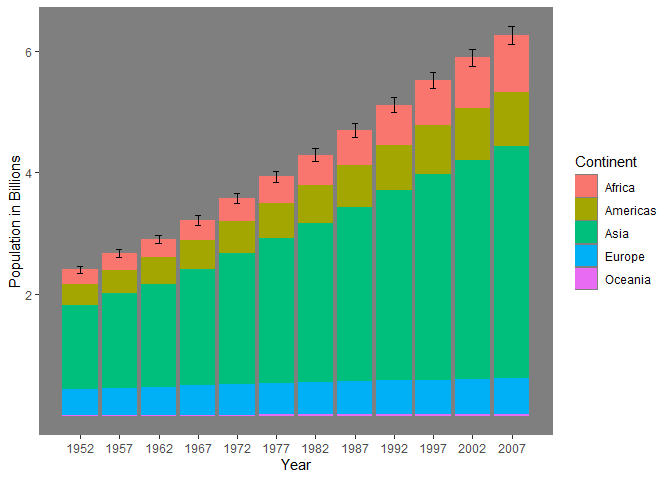<!-- -->

### Close project

Closing RStudio will ask you if you want to save your workspace and
scripts. Saving your workspace is usually not recommended if you have
all the necessary commands in your script.

## Useful links

-   For ggplot2:
    -   [ggplot2
        cheatsheet](https://www.rstudio.org/links/data_visualization_cheat_sheet)
    -   Official [ggplot2
        documentation](https://docs.ggplot2.org/current/)
    -   Official [ggplot2 website](https://ggplot2.tidyverse.org/)
    -   [Chapter on data
        visualisation](https://r4ds.had.co.nz/data-visualisation.html)
        in the book *R for Data Science*
    -   [From Data to Viz](https://www.data-to-viz.com/), a website to
        explore different visualisations and the code that generates
        them
    -   Selva Prabhakaran’s [*r-statistics.co* section on
        ggplot2](https://r-statistics.co/ggplot2-Tutorial-With-R.html)
    -   [Coding Club’s data visualisation
        tutorial](https://ourcodingclub.github.io/2017/01/29/datavis.html)
    -   [Cookbook for R graphs](https://www.cookbook-r.com/Graphs/)
    -   [STHDA’s ggplot2
        essentials](https://www.sthda.com/english/wiki/ggplot2-essentials)
-   Our compilation of [general R resources](/R/usefullinks.md)
