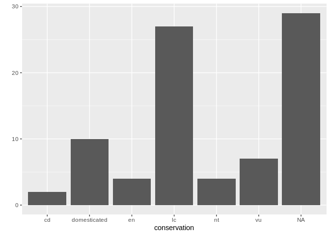
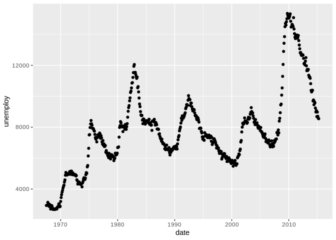
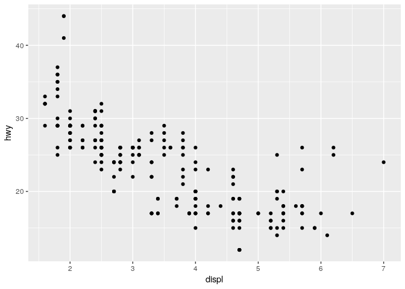
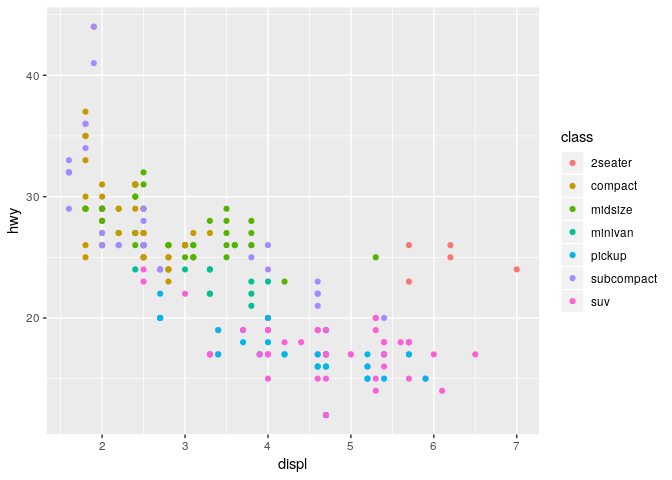
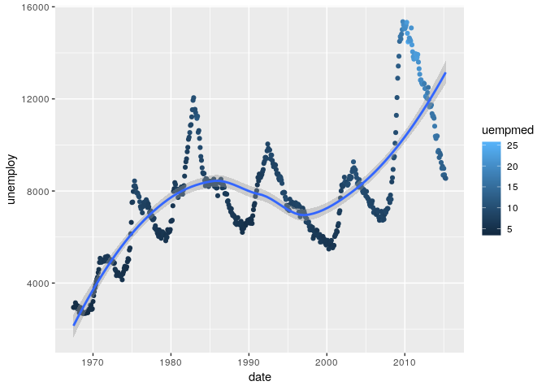
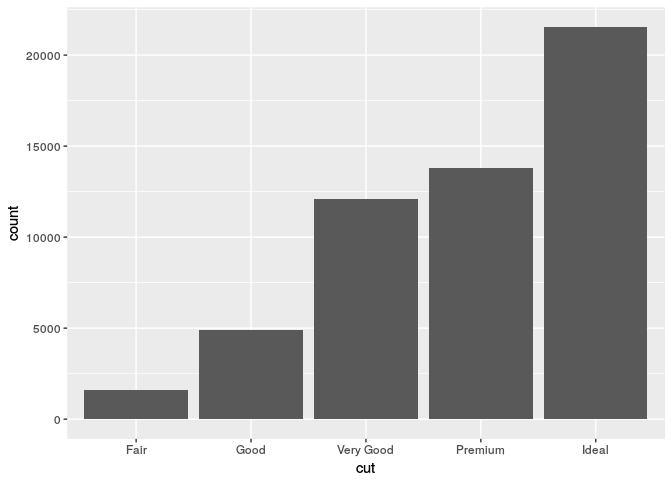
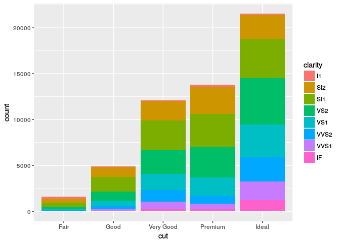
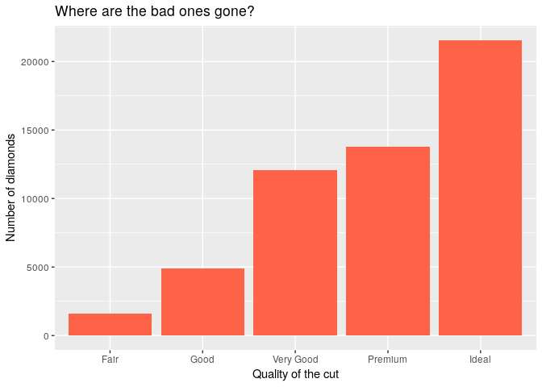
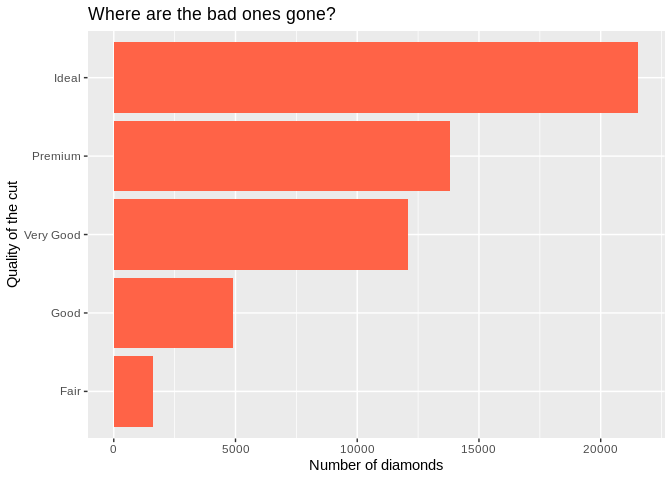
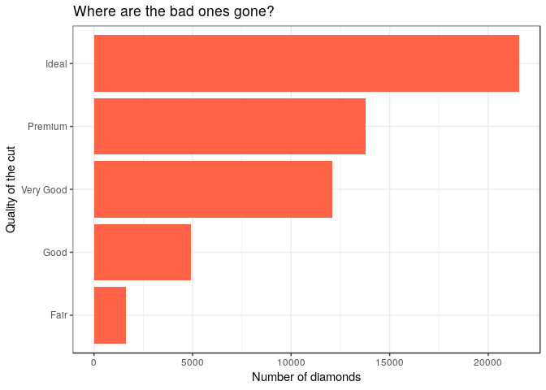

Introduction to R data visualisation using ggplot2
================
2018-09-20

> This document is redacted in Rmd; the source file is available here: <https://gitlab.com/stragu/CDS/blob/master/R/ggplot2_intro/ggplot2_intro.Rmd>
> It is then knitted as a GitHub document, which is the best version to view online and to print: <https://gitlab.com/stragu/CDS/blob/master/R/ggplot2_intro/ggplot2_intro.md>

If you want to review the installation instructions: <https://gitlab.com/stragu/CDS/blob/master/R/Installation.md>

Everything we write today will be saved in your R project. Please remember to save it in your H drive or USB if you are using Library computers.

Keep in mind
------------

-   Case sensitive
-   No spaces in names
-   You can use <kbd>Ctrl</kbd>+<kbd>Shift</kbd> to space out your code and <kbd>Ctrl</kbd>+<kbd>Enter</kbd> to run a command.

Open RStudio
------------

-   If you are using your own laptop please open RStudio
-   Make sure you have a working Internet connection
-   On CDS computers (the first time takes about 10 min):
-   Log in with your UQ username and password
-   Make sure you have a working Internet connection
-   Open the ZENworks application
-   Look for RStudio
-   Double click on RStudio which will install both R and RStudio

What are we going to learn?
---------------------------

During this session, you will:

-   Have a visualisation package installed (`ggplot2`)
-   Learn how to explore data
-   Learn about the basic ggplot2 components
-   Use different kinds of visualisations
-   Layer several visualisations
-   Learn how to amend colours, labels, themes and coordinates.

Disclaimer
----------

We will assume you are an R beginner, who has used R before.

Material
--------

### Rstudio project

**Exercise 1 - New RStudio project**

-   Click the "File" menu button (top left corner), then "New Project"
-   Click "New Directory"
-   Click "New Project" ("Empty project" if you have an older version of RStudio)
-   In "Directory name", type the name of your project, e.g. "ggplot2\_intro"
-   Select the folder where to locate your project: the `Documents/RProjects` folder, which you can create if it doesn't exist yet.
-   Click the "Create Project" button
-   create two folders in your new project
-   `dir.create("scripts")`
-   `dir.create("plots")`

### Introducing ggplot2

**Exercise 2 - create a script, ggplot2 setup**

-   Menu: Top left corner, click the green "plus" symbol, or press the shortcut (for Windows/Linux) Ctrl+Shift+N or (for Mac) Cmd+Shift+N. This will open an "Untitled1" file.
-   Go to file "Save" or press (for Windows/Linux) Ctrl+S or (for Mac) Cmd+S. This will ask where you want to save your file and the name of the new file
-   Call your file "ggplot2\_intro.R" located in the "scripts" folder
-   install and load the package ggplot2:
-   install it with `install.packages("ggplot2")`
-   While you wait for ggplot2 to be installed, check out Rdocumentation.org and type "ggplot2" in the search
-   load the package with:

``` r
library(ggplot2)
```

The R package ggplot2 was developed by Hadley Wickham with the objective of creating a grammar of graphics for categorical data (in 2007). It is based on the book *The Grammar of Graphics* Developed by Leland Wilkinson (1999/2005).

You only need to install a package once, and reload it every time you start a new R session.

### Find help

We are going to work with different datasets that come with the ggplot2 package. For any dataset or function doubts that you might have, don't forget the two main ways to bring up a help page:

1.  the command: `?functionname`
2.  the keyboard shortcut: press <kbd>F1</kbd> after writing a function name

### ggplot2 components and layers

ggplot2 is based on the idea that you can build every graph from the same few components.

The main components that compose a plot are the **data**, the **aesthetic mappings**, and **geometric objects**. Extra elements can be specified, like:

-   scales,
-   facetting,
-   position,
-   statistical transformations,
-   a coordinate system, and
-   a theme.

Together, the data, mappings, stats and geoms form a **layer**.

In its most basic form, a ggplot2 plot can be written with the`qplot()` function:

``` r
qplot(data = msleep,
      x = conservation,
      geom = "bar")
```



We can see our three essential elements:

1.  the data comes from the `msleep` dataset included in `ggplot2`;
2.  the variable `conservation` is mapped to the aesthetic `x`;
3.  the geometry is `"bar"`, for "bar chart".

Find out more about the package and the "quick plot" function:

``` r
?ggplot2
?qplot
```

### Scatterplots

Let's have a look at another dataset:

``` r
?economics
str(economics)
```

    ## Classes 'tbl_df', 'tbl' and 'data.frame':    574 obs. of  6 variables:
    ##  $ date    : Date, format: "1967-07-01" "1967-08-01" ...
    ##  $ pce     : num  507 510 516 513 518 ...
    ##  $ pop     : int  198712 198911 199113 199311 199498 199657 199808 199920 200056 200208 ...
    ##  $ psavert : num  12.5 12.5 11.7 12.5 12.5 12.1 11.7 12.2 11.6 12.2 ...
    ##  $ uempmed : num  4.5 4.7 4.6 4.9 4.7 4.8 5.1 4.5 4.1 4.6 ...
    ##  $ unemploy: int  2944 2945 2958 3143 3066 3018 2878 3001 2877 2709 ...

Do you think that the rate of unemployment is stable over the years?

Let's use the more advanced `ggplot2` syntax from now on, se we can build up our plots further:

``` r
ggplot(data = economics,
       mapping = aes(x = date,
                     y = unemploy)) + 
    geom_point()
```



The `ggplot()` function initialises a ggplot object. It can be used to declare the input data frame and to specify the set of plot aesthetics intended to be common throughout all subsequent layers (unless specifically overridden).

The `aes()` function groups our aesthetic mappings.

The `geom_<...>()` functions specify what geometric element we want to use.

> Make sure you use "Shift + Enter" to go to the next line when adding layers, for readability and to easily recall the whole code block with the up arrow.

New dataset: `mpg`, which stands for "miles per gallon".

``` r
?mpg
str(mpg)
```

Do you think that cars with big engines use fuel less efficiently than cars with small engines?

We can focus on two variables:

> `displ`: a car’s engine size, in litres. `hwy`: a car’s fuel efficiency on the highway, in miles per gallon.

``` r
ggplot(data = mpg,
       mapping = aes(x = displ,
                     y = hwy)) +
    geom_point()
```



The plot shows a negative relationship between engine size (`displ`) and fuel efficiency (`hwy`). In other words, cars with big engines use more fuel. Does this confirm or refute your hypothesis about fuel efficiency and engine size?

However, we can see some outliers. We need to find out more about our data.

### Adding aesthetics

We can highlight the "class" factor by adding a new aesthetic:

``` r
ggplot(data = mpg,
       mapping = aes(x = displ,
                     y = hwy,
                     colour = class)) +
    geom_point()
```



It seems that two-seaters are more fuel efficient than other cars with a similar engine size, which can be explained by the weight of the car.

We now know how to create a simple dotplot.

### Trend lines

A trend line can be created with the `geom_smooth()` function:

``` r
ggplot(data = mpg,
       mapping = aes(x = displ,
                     y = hwy)) +
    geom_smooth()
```

    ## `geom_smooth()` using method = 'loess' and formula 'y ~ x'


### Layering

How can we combine several layers?

``` r
ggplot(data = mpg,
       mapping = aes(x = displ,
                     y = hwy)) + 
    geom_point() +
    geom_smooth()
```

    ## `geom_smooth()` using method = 'loess' and formula 'y ~ x'


Different geoms can also have their own mappings that overwrite the defaults. If you place mappings in a geom function, `ggplot2` will treat them as local mappings for the layer. It will use these mappings to extend or overwrite the global mappings for that layer only. This makes it possible to display different aesthetics in different layers.

### The `colour` aesthetic

We can once again add some information to our visualisation by mapping the `class` variable to the `colour` aesthetic:

``` r
ggplot(data = mpg,
       mapping = aes(x = displ,
                     y = hwy)) + 
    geom_point(mapping = aes(colour = class)) + 
    geom_smooth()
```

    ## `geom_smooth()` using method = 'loess' and formula 'y ~ x'


**Exercise 3 – where should aesthetics be defined?**

Take the last plot we created:

``` r
ggplot(data = mpg,
       mapping = aes(x = displ,
                     y = hwy)) + 
    geom_point(mapping = aes(colour = class)) + 
    geom_smooth()
```

What would happen if you moved the `colour = class` aesthetic from the geometry function to the `ggplot()` call?

Let's use a similar approach with the `economics` data.

Let's take a look at the structure of the dataset:

``` r
str(economics)
```

    ## Classes 'tbl_df', 'tbl' and 'data.frame':    574 obs. of  6 variables:
    ##  $ date    : Date, format: "1967-07-01" "1967-08-01" ...
    ##  $ pce     : num  507 510 516 513 518 ...
    ##  $ pop     : int  198712 198911 199113 199311 199498 199657 199808 199920 200056 200208 ...
    ##  $ psavert : num  12.5 12.5 11.7 12.5 12.5 12.1 11.7 12.2 11.6 12.2 ...
    ##  $ uempmed : num  4.5 4.7 4.6 4.9 4.7 4.8 5.1 4.5 4.1 4.6 ...
    ##  $ unemploy: int  2944 2945 2958 3143 3066 3018 2878 3001 2877 2709 ...

The continuous variable `uempmed` is defined by the help page as "median duration of unemployment, in weeks". Let's colour the data according to the duration of unemployment, and add a smoothing function on top:

``` r
ggplot(data = economics,
       mapping = aes(x = date,
                     y = unemploy)) + 
    geom_point(mapping = aes(colour = uempmed)) +
    geom_smooth()
```

    ## `geom_smooth()` using method = 'loess' and formula 'y ~ x'



See how the legend changes depending on the type of data mapped to the `colour` aesthetic? (i.e. categorical vs continuous)

### Bar charts

Let's use the `diamonds` dataset now. The `diamonds` dataset comes with `ggplot2` and contains information about ~54,000 diamonds, including the price, carat, color, clarity, and cut of each diamond.

``` r
str(diamonds)
diamonds
summary(diamonds)
?diamonds
```

Let’s take a look at a bar chart. Bar charts seem simple, but they are interesting because they reveal something subtle about ggplot. Consider a basic bar chart, as drawn with `geom_bar()`. The following chart displays the total number of diamonds in the `diamonds` dataset, grouped by cut:

``` r
ggplot(data = diamonds,
       mapping = aes(x = cut)) + 
    geom_bar()
```



The chart shows that more diamonds are available with high quality cuts than with low quality cuts. See how the data was processed intuitively by the functions?

**Exercise 4 – add information with `fill`**

Use the previous plot and add information about the diamonds' `clarity` with the `fill` aesthetic:

``` r
ggplot(data = diamonds,
       mapping = aes(x = cut,
                     fill = clarity)) + 
    geom_bar()
```



What is the difference with the `colour` aesthetic?

### Theming

Let's modify our plot: we can pick our favourite colour in `geom_bar()`, and modify labels with the `labs()` function to make our plot more self-explanatory:

``` r
ggplot(data = diamonds,
       mapping = aes(x = cut)) + 
    geom_bar(fill = "tomato") +
    labs(title = "Where are the bad ones gone?",
         x = "Quality of the cut",
         y = "Number of diamonds")
```



**Exercise 5: where should `fill` go?**

We assigned different values to the `fill` argument in previous plots. But why are they located inside or outside of the `aes()` call?

Let's have a look at what `labs()` can do:

``` r
?labs
```

It can edit the title, the subtitle, the x and y axes labels, and the caption. But remember that captions and titles are better sorted out in the publication itself.

### Flip coordinates

`coord_flip()` can be used to quickly flip the axes around:

``` r
ggplot(data = diamonds,
       mapping = aes(x = cut)) +
  geom_bar(fill = "tomato") +
  labs(title = "Where are the bad ones gone?",
       x = "Quality of the cut",
       y = "Number of diamonds") +
  coord_flip()
```



### Built-in themes

Some functions allow to set a bunch of theme defaults easily, like `theme_bw()`:

``` r
ggplot(data = diamonds,
       mapping = aes(x = cut)) + 
  geom_bar(fill = "tomato") +
  labs(title = "Where are the bad ones gone?",
       x = "Quality of the cut",
       y = "Number of diamonds") +
  coord_flip() +
  theme_bw()
```



### Recycle a plot

`last_plot()` allows us to recall the latest plot we created, so we can string extra functions and layers quickly. For example:

``` r
last_plot() + theme_dark()
```

### Export

To save the last plot, you can use the "export" menu, or use the `ggsave()` function:

``` r
ggsave(filename = "plots/horizontalbarplot.png")
```

`ggsave()` has more options, like setting the DPI, which is useful for higher posters for example.

**Exercise 6: explore geometries**

When creating a new layer, start typing `geom_` and see what suggestions pop up. Are there any suggestions that sound useful or familiar to you?

Play time!
----------

Modify your plots, play around with different layers and functions, and ask questions!

Close Rproject
--------------

If you want to close R Studio, you should save your project first.

-   File
-   close project (It will ask you if you want to save your history)
-   then, close RStudio

Useful links
------------

-   For ggplot2:
    -   R ggplot2 Cheatsheet <https://github.com/rstudio/cheatsheets/raw/master/data-visualization-2.1.pdf>
    -   Official ggplot2 documentation: <http://docs.ggplot2.org/current/>
    -   Official ggplot2 website: <http://ggplot2.tidyverse.org/>
    -   Chapter on data visualisation in the book *R for Data Science*: <http://r4ds.had.co.nz/data-visualisation.html>
    -   Coding Club's data visualisation tutorial: <https://ourcodingclub.github.io/2017/01/29/datavis.html>
    -   Cookbook for R graphs: <http://www.cookbook-r.com/Graphs/>
    -   STHDA's ggplot2 essentials: <http://www.sthda.com/english/wiki/ggplot2-essentials>
-   R and RStudio in general:
    -   RStudio Cheatsheet <https://github.com/rstudio/cheatsheets/raw/master/rstudio-ide.pdf>
    -   RStudio online learning <https://www.rstudio.com/online-learning/>
    -   Basic and advanced manuals <https://cran.r-project.org/manuals.html>
    -   Ask about any function or package <http://www.rdocumentation.org/>
    -   If you are looking how-to's or how to fix an error <http://stackoverflow.com/questions/tagged/r>
    -   Lynda.com R training and tutorials <https://www.lynda.com/R-training-tutorials/1570-0.html> (remember to sign in from UQ: <https://web.library.uq.edu.au/library-services/training/lyndacom-online-courses> )
