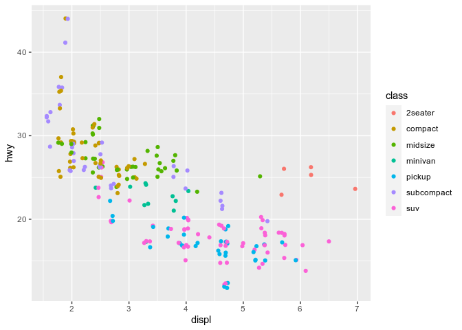
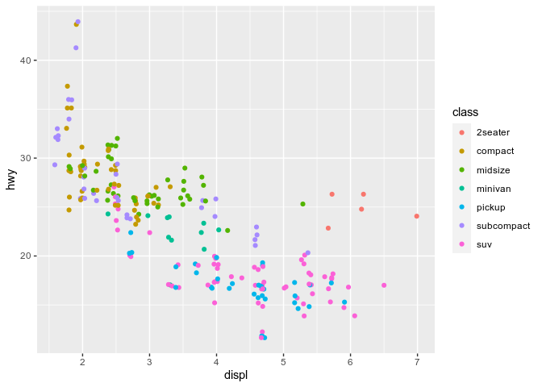
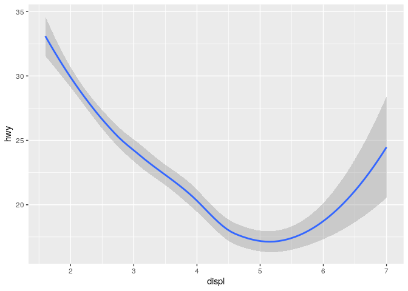
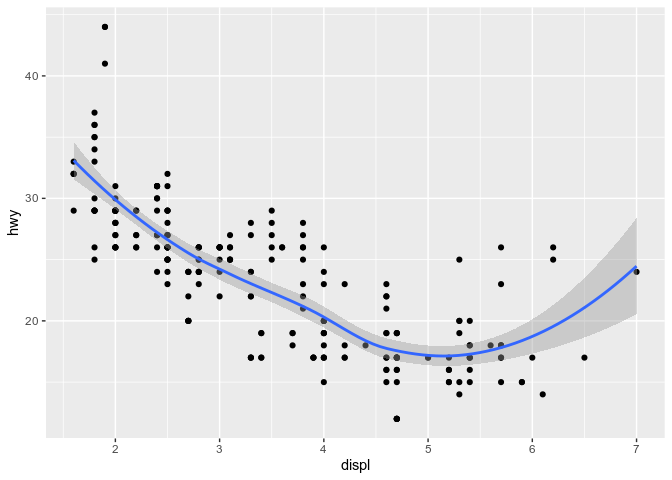
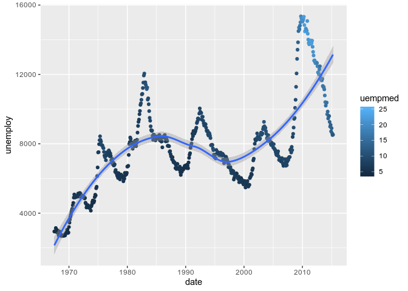
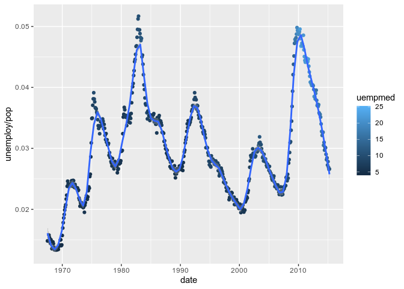
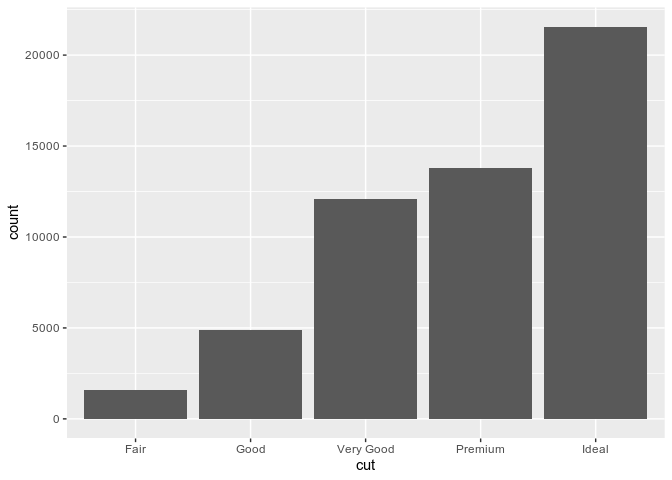
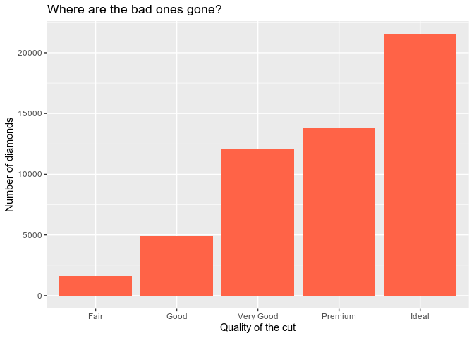

R data visualisation with RStudio and ggplot2: introduction
================
2019-11-28

> This document is redacted in Rmd; the source file is available here:
> <https://gitlab.com/stragu/DSH/blob/master/R/ggplot2_intro/ggplot2_intro.Rmd>
> It is then knitted as a Markdown document, which is the best version
> to view online and to print:
> <https://gitlab.com/stragu/DSH/blob/master/R/ggplot2_intro/ggplot2_intro.md>

If you want to review the installation instructions:
<https://gitlab.com/stragu/DSH/blob/master/R/Installation.md>

Everything we write today will be saved in your R project. Please
remember to save it on your H drive or USB if you are using Library
computers.

## Essential shortcuts

  - function or dataset help: press <kbd>F1</kbd> with your cursor
    anywhere in a function name.
  - execute from script: <kbd>Ctrl</kbd> + <kbd>Enter</kbd>
  - assignment operator (`<-`): <kbd>Alt</kbd> + <kbd>-</kbd>

## Open RStudio

  - If you are using your own laptop please open RStudio
      - Make sure you have a working Internet connection
  - On the Library computers (the first time takes about 10 min):
      - Log in with your UQ username and password (use your student
        account if you have both a staff and student account)
      - Make sure you have a working Internet connection
      - Open the ZENworks application
      - Look for RStudio
      - Double click on RStudio which will install both R and RStudio

## What are we going to learn?

During this session, you will:

  - Have a visualisation package installed (ggplot2)
  - Learn how to explore data visually
  - Learn about the 3 essential ggplot2 components
  - Use different kinds of visualisations
  - Layer several visualisations
  - Learn how to amend colours, labels, themes and coordinates.

## Disclaimer

We will assume you are an R beginner, who has used R before.

## Material

### Installing ggplot2

We first need to make sure we have the **ggplot2 package** available on
our computer. We can use the “Install” button in the “Packages” pane, or
we can execute this command in the console:
`install.packages("ggplot2")`

You only need to install a package once, but you need to load it every
time you start a new R session.

### Setting up a project

Let’s create a new **R project** to keep everything tidy:

  - Click the “File” menu button (top left corner), then “New Project”
  - Click “New Directory”
  - Click “New Project”
  - In “Directory name”, type the name of your project, e.g.
    “ggplot2\_intro”
  - Select the folder where to locate your project: the
    `Documents/RProjects` folder, which you can create if it doesn’t
    exist yet.
  - Click the “Create Project” button
  - create two folders in your new project
      - `dir.create("scripts")`
      - `dir.create("plots")`

We will write ggplot2 code more comfortably in a **script**:

  - Menu: Top left corner, click the green “plus” symbol, or press the
    shortcut (for Windows/Linux)
    <kbd>Ctrl</kbd>+<kbd>Shift</kbd>+<kbd>N</kbd> or (for Mac)
    <kbd>Cmd</kbd>+<kbd>Shift</kbd>+<kbd>N</kbd>. This will open an
    “Untitled1” file.
  - Go to “File \> Save” or press (for Windows/Linux)
    <kbd>Ctrl</kbd>+<kbd>S</kbd> or (for Mac)
    <kbd>Cmd</kbd>+<kbd>S</kbd>. This will ask where you want to save
    your file and the name of the new file.
  - Call your file “process.R”, in the “scripts” folder

We can straight away **load the package** with:

``` r
library(ggplot2)
```

> Remember to use <kbd>Ctrl</kbd>+<kbd>Enter</kbd> to execute a command
> from the script.

### Finding help

We are going to work with different datasets that come with the ggplot2
package. For any dataset or function doubts that you might have, don’t
forget the two main ways to bring up a help page:

1.  the command: `?functionname`
2.  the keyboard shortcut: press <kbd>F1</kbd> after writing a function
    name

### Introducing ggplot2

The R package ggplot2 was developed by Hadley Wickham with the objective
of creating a grammar of graphics for categorical data (in 2007). It is
based on the book *The Grammar of Graphics* Developed by Leland
Wilkinson (1999/2005).

It is now part of the group of data science packages called Tidyverse.

### ggplot2 components and layers

ggplot2 is based on the idea that you can build every graph from the
same few components.

The main components that compose a plot are the **data**, the
**aesthetic mappings**, and **geometric objects**. Extra elements can be
specified, like:

  - scales,
  - facetting,
  - position,
  - statistical transformations,
  - a coordinate system, and
  - a theme.

Together, the data, mappings, stats and geoms form a **layer**.

In its most basic form, a ggplot2 plot can be written with the`qplot()`
function:

``` r
qplot(data = msleep,
      x = conservation,
      geom = "bar")
```

<!-- -->

We can see our three essential elements:

1.  the data comes from the `msleep` dataset included in ggplot2;
2.  the variable `conservation` is mapped to the aesthetic `x` (i.e. the
    x axis);
3.  the geometry is `"bar"`, for “bar chart”.

Here, we don’t need to specify what variable is associated to the y
axis, as the “bar” geometry automatically does a count of the different
values in the `conservation` variable.

Find out more about the package and the “quick plot” function:

``` r
?ggplot2
?qplot
```

### Scatterplots

Let’s have a look at another dataset:

``` r
?economics
str(economics)
```

    ## Classes 'spec_tbl_df', 'tbl_df', 'tbl' and 'data.frame': 574 obs. of  6 variables:
    ##  $ date    : Date, format: "1967-07-01" "1967-08-01" ...
    ##  $ pce     : num  507 510 516 512 517 ...
    ##  $ pop     : num  198712 198911 199113 199311 199498 ...
    ##  $ psavert : num  12.6 12.6 11.9 12.9 12.8 11.8 11.7 12.3 11.7 12.3 ...
    ##  $ uempmed : num  4.5 4.7 4.6 4.9 4.7 4.8 5.1 4.5 4.1 4.6 ...
    ##  $ unemploy: num  2944 2945 2958 3143 3066 ...

Do you think that the rate of unemployment is stable over the years?

Let’s use the full ggplot2 syntax from now on, se we can build up our
plots further:

``` r
ggplot(data = economics,
       mapping = aes(x = date,
                     y = unemploy)) + 
    geom_point()
```

<!-- -->

  - The `ggplot()` function initialises a ggplot object. It can be used
    to declare the input data frame and to specify the set of plot
    aesthetics intended to be common throughout all subsequent layers
    (unless specifically overridden).
  - The `aes()` function groups our mappings of aesthetics to variables.
  - The `geom_<...>()` functions specify what geometric element we want
    to use.

Let’s it with a new dataset: `mpg`, which stands for “miles per gallon”.

``` r
?mpg
str(mpg)
```

Do you think that cars with big engines use fuel less efficiently than
cars with small engines?

We can focus on two variables:

> `displ`: a car’s engine size, in litres. `hwy`: a car’s fuel
> efficiency on the highway, in miles per gallon.

``` r
ggplot(data = mpg,
       mapping = aes(x = displ,
                     y = hwy)) +
    geom_point()
```

<!-- -->

Notice how the points seem to be aligned on a grid? That’s because the
data was rounded. If we want to better visualise the distribution of the
points and avoid overlapping of points, we can use the “jitter” geometry
instead, which gives the points a little shake:

``` r
ggplot(data = mpg,
       mapping = aes(x = displ,
                     y = hwy)) +
    geom_jitter()
```

<!-- -->

The plot shows a negative relationship between engine size (`displ`) and
fuel efficiency (`hwy`). In other words, cars with big engines use more
fuel. Does this confirm or refute your hypothesis about fuel efficiency
and engine size?

However, we can see some outliers. We need to find out more about our
data.

### Adding aesthetics

We can highlight the “class” factor by adding a new aesthetic:

``` r
ggplot(data = mpg,
       mapping = aes(x = displ,
                     y = hwy,
                     colour = class)) +
    geom_jitter()
```

<!-- -->

It seems that two-seaters are more fuel efficient than other cars with a
similar engine size, which can be explained by the lower weight of the
car. The general trend starts to make more sense\!

We now know how to create a simple scatterplot, and how to visualise
extra variables.

### Trend lines

A trend line can be created with the `geom_smooth()` function:

``` r
ggplot(mpg,
       aes(x = displ,
           y = hwy)) +
    geom_smooth()
```

    ## `geom_smooth()` using method = 'loess' and formula 'y ~ x'

<!-- -->

> We stopped using the argument names because we know in which order
> they appear: first the data, then the mapping of aesthetics. Let’s
> save ourselves some typing from now on\!

The console shows you what function / formula was used to draw the trend
line. This is important information, as there are countless ways to do
that. To better understand what happens in the background, open the
function’s help page and notice that the default value for the `method`
argument is “auto”. Read up on how it automatically picks a more
suitable method depending on the sample size, in the “Arguments”
section.

Want a linear trend line instead? Add the argument `method = "lm"` to
you function:

``` r
ggplot(mpg,
       aes(x = displ,
           y = hwy)) +
    geom_smooth(method = "lm")
```

<!-- -->

### Layering

How can we combine several layers? We can string them with the `+`
operator:

``` r
ggplot(mpg,
       aes(x = displ,
           y = hwy)) + 
    geom_point() +
    geom_smooth()
```

    ## `geom_smooth()` using method = 'loess' and formula 'y ~ x'

<!-- -->

> The order of the functions matters: the points will be drawn before
> the trend line, which is probably what you’re after.

### The `colour` aesthetic

We can once again add some information to our visualisation by mapping
the `class` variable to the `colour` aesthetic:

``` r
ggplot(mpg,
       aes(x = displ,
           y = hwy)) + 
    geom_point(aes(colour = class)) + 
    geom_smooth()
```

    ## `geom_smooth()` using method = 'loess' and formula 'y ~ x'

<!-- -->

**Exercise 1 – where should aesthetics be defined?**

Take the last plot we created:

``` r
ggplot(mpg,
       aes(x = displ,
           y = hwy)) + 
    geom_point(aes(colour = class)) + 
    geom_smooth()
```

What would happen if you moved the `colour = class` aesthetic from the
geometry function to the `ggplot()` call?

Different geometries can also have their own mappings that overwrite the
defaults. If you place mappings in a geom function, ggplot2 will treat
them as local mappings for the layer. It will use these mappings to
extend or overwrite the global mappings for that layer only. This makes
it possible to display different aesthetics in different layers.

### Saving a plot

Like your visualisation? You can export it with the “Export” menu in the
“Plots” pane.

  - Building a document or a slideshow? You can copy it straight to your
    clipboard, and paste it into it.
  - A PDF is a good, quick option to export an easily shareable file
    with vector graphics. Try for example the “A5” size, the “Landscape”
    orientation, and save it into your “plots” directory.
  - More options are available in the “Save as image…” option. PNG is a
    good compressed format for graphics, but if you want to further
    customise your visualisation in a different program, use SVG or EPS,
    which are vector formats.

Let’s use a similar approach with the `economics` data.

**Exercise 2 – add a variable and a smooth line**

Take our previous “economics” scatterplot:

``` r
ggplot(economics,
       aes(x = date,
           y = unemploy)) + 
    geom_point()
```

How could we:

1.  Add a trend line for the number of unemployed people
2.  Colour the points according to the median duration of unemployment
    (see `?economics`)

<!-- end list -->

``` r
ggplot(economics,
       aes(x = date,
           y = unemploy)) + 
    geom_point(aes(colour = uempmed)) +
    geom_smooth()
```

    ## `geom_smooth()` using method = 'loess' and formula 'y ~ x'

<!-- -->

> See how the legend changes depending on the type of data mapped to the
> `colour` aesthetic? (i.e. categorical vs continuous)

### Bar charts

Let’s use the `diamonds` dataset now. The `diamonds` dataset comes with
ggplot2 and contains information about ~54,000 diamonds, including the
price, carat, color, clarity, and cut of each diamond.

Let’s have a look at the data:

``` r
str(diamonds)
diamonds
summary(diamonds)
?diamonds
```

Back to bar charts. They seem simple, but they are interesting because
they reveal something subtle about ggplot. Consider a basic bar chart,
as drawn with `geom_bar()`. The following chart displays the total
number of diamonds in the `diamonds` dataset, grouped by cut:

``` r
ggplot(diamonds,
       aes(x = cut)) + 
    geom_bar()
```

<!-- -->

The chart shows that more diamonds are available with high quality cuts
than with low quality cuts.

`cut` is an ordered factor, which you can confirm by printing it to the
console:

``` r
head(diamonds$cut)
```

    ## [1] Ideal     Premium   Good      Premium   Good      Very Good
    ## Levels: Fair < Good < Very Good < Premium < Ideal

ggplot2 respects that order in the bar chart.

We can use the previous plot and add information about the diamonds’
`clarity` with the `fill` aesthetic:

``` r
ggplot(diamonds,
       aes(x = cut,
           fill = clarity)) + 
    geom_bar()
```

<!-- -->

What is the difference with the `colour` aesthetic? `colour` will colour
the outline of an area, whereas `fill` will fill the whole area. Some
aesthetics are more suited to specific geometries than others\!

### Theming

Let’s modify our plot: we can pick our favourite colour in `geom_bar()`,
and modify labels with the `labs()` function to make our plot more
self-explanatory:

``` r
ggplot(diamonds,
       aes(x = cut)) + 
    geom_bar(fill = "tomato") +
    labs(title = "Where are the bad ones gone?",
         x = "Quality of the cut",
         y = "Number of diamonds")
```

<!-- -->

**Exercise 3: where should `fill` go?**

We assigned different values to the `fill` argument in previous plots.
But why are they located inside or outside of the `aes()` call?

Let’s have a look at what `labs()` can do:

``` r
?labs
```

It can edit the title, the subtitle, the x and y axes labels, and the
caption.

> Remember that captions and titles are better sorted out in the
> publication itself (especially to help with screen readers).

### Flip coordinates

`coord_flip()` can be used to quickly flip the axes around:

``` r
ggplot(diamonds,
       aes(x = cut)) +
  geom_bar(fill = "tomato") +
  labs(title = "Where are the bad ones gone?",
       x = "Quality of the cut",
       y = "Number of diamonds") +
  coord_flip()
```

<!-- -->

This is particularly helpful when long category names overlap under the
x axis.

### Built-in themes

Some functions allow to set a bunch of theme defaults easily, like
`theme_bw()`:

``` r
ggplot(diamonds,
       aes(x = cut)) + 
  geom_bar(fill = "tomato") +
  labs(title = "Where are the bad ones gone?",
       x = "Quality of the cut",
       y = "Number of diamonds") +
  coord_flip() +
  theme_bw()
```

<!-- -->

Try `theme_minimal()` as well, and if you want more options, install the
`ggthemes` package\!

### Automate the export

To save the last plot with a command, you can use the `ggsave()`
function:

``` r
ggsave(filename = "plots/horiz_bar.png")
```

This is great to automate the export process for each plot in your
script, but `ggsave()` also has extra options, like setting the DPI,
which is useful for getting the right resolution for a specific use. For
example, to export a plot for your presentation:

``` r
ggsave(filename = "plots/horiz_bar_pres.png", dpi = "screen")
```

## Play time\!

**Exercise 4: explore geometries**

When creating a new layer, start typing `geom_` and see what suggestions
pop up. Are there any suggestions that sound useful or familiar to you?

Modify your plots, play around with different layers and functions, and
ask questions\!

## Close project

Closing RStudio will ask you if you want to save your workspace and
scripts. Saving your workspace is usually not recommended if you have
all the necessary commands in your script.

## Useful links

  - For ggplot2:
      - ggplot2 cheatsheet:
        <https://www.rstudio.org/links/data_visualization_cheat_sheet>
      - Official ggplot2 documentation:
        <http://docs.ggplot2.org/current/>
      - Official ggplot2 website: <http://ggplot2.tidyverse.org/>
      - Chapter on data visualisation in the book *R for Data Science*:
        <http://r4ds.had.co.nz/data-visualisation.html>
      - Selva Prabhakaran’s *r-statistics.co* section on ggplot2:
        <http://r-statistics.co/ggplot2-Tutorial-With-R.html>
      - Coding Club’s data visualisation tutorial:
        <https://ourcodingclub.github.io/2017/01/29/datavis.html>
      - Cookbook for R graphs: <http://www.cookbook-r.com/Graphs/>
      - STHDA’s ggplot2 essentials:
        <http://www.sthda.com/english/wiki/ggplot2-essentials>
  - More ressources for R in general:
    <https://gitlab.com/stragu/DSH/blob/master/R/usefullinks.md>
