Heatmaps in R for intermediate users
================
2018-05-02

> This document is edited as an R markdown file, and regularly exported as a GitHub document. The source code is [here](https://github.com/stragu/CDS/blob/master/R/heatmaps_intermediate.Rmd) The published printer-friendly version is [here](https://github.com/stragu/CDS/blob/master/R/heatmaps/heatmaps_intermediate.md)

If you want to review the installation instructions: <https://github.com/stragu/CDS/blob/master/R/Installation.md>

Everything we write today will be saved in your R project. Please remember to save it in your H drive or USB if you used the University computers.

Keep in mind
------------

-   Case sensitive
-   No spaces in names
-   Use <kbd>Ctrl</kbd>+<kbd>Enter</kbd> to run a command, and <kbd>Ctrl</kbd>+<kbd>Shift</kbd> to make your code more readable.

Open RStudio
------------

-   If you are using your own laptop please open RStudio
-   Make sure you have a working internet connection

-   On CDS computers:
-   Log in with your UQ username and password
-   Make sure you have a working internet connection
-   Open the ZENworks application
-   Look for the letter R
-   Double click on RStudio which will install both R and RStudio

What are we going to learn?
---------------------------

During this session, you will:

-   Learn how to produce a simple heatmap with the base package `heatmap()`;
-   Learn about alternatives to produce more complex heatmaps, like `heatmap.2()` and `pheatmap()`;
-   Learn how to produce a rudimentary heatmap with the `ggplot2` package.

A **heatmap** is a way of visualising a table of numbers, where you substitute the numbers with colored cells. It’s useful for finding highs and lows, and see patterns more clearly.

Disclaimer
----------

We will assume you are an R intermediate user and that you have used RStudio before.

Material
--------

### RStudio Project

**Exercise 1 - New RStudio Project**

-   New project:
-   Click the "New project" menu icon
-   Click "New Directory"
-   Click "New Project" ("New empty project" if you have an older version of RStudio)
-   In Directory name type the name of your project, e.g. "rstudio\_intro" (Browse and select a folder where to locate your project, in our case the RProjects folder. If you don't have an RProjects folder, create it.)
-   Click the "Create Project" button
-   Create new folders with the following commands:

``` r
dir.create("scripts")
dir.create("data")
dir.create("plots")
```

**Exercise 2 - setting up**

-   create a new R script file called "heatmaps.R" in the "scripts" folder

``` r
file.create("scripts/heatmaps.R")
file.edit("scripts/heatmaps.R")
```

### Method 1: the base `heatmap()` function

*Step 1: import the data*

``` r
?read.csv
nba <- read.csv(file = "http://datasets.flowingdata.com/ppg2008.csv")
```

*Step 2: explore the data*

``` r
dim(nba)
str(nba)
head(nba)
View(nba)
```

*Step 3: update the dataset*

Assign the Name values to `rownames(nba)`:

``` r
rownames(nba)
```

    ##  [1] "1"  "2"  "3"  "4"  "5"  "6"  "7"  "8"  "9"  "10" "11" "12" "13" "14"
    ## [15] "15" "16" "17" "18" "19" "20" "21" "22" "23" "24" "25" "26" "27" "28"
    ## [29] "29" "30" "31" "32" "33" "34" "35" "36" "37" "38" "39" "40" "41" "42"
    ## [43] "43" "44" "45" "46" "47" "48" "49" "50"

``` r
rownames(nba) <- nba$Name
rownames(nba)
```

    ##  [1] "Dwyane Wade "       "LeBron James "      "Kobe Bryant "      
    ##  [4] "Dirk Nowitzki "     "Danny Granger "     "Kevin Durant "     
    ##  [7] "Kevin Martin "      "Al Jefferson "      "Chris Paul "       
    ## [10] "Carmelo Anthony "   "Chris Bosh "        "Brandon Roy "      
    ## [13] "Antawn Jamison "    "Tony Parker "       "Amare Stoudemire " 
    ## [16] "Joe Johnson "       "Devin Harris "      "Michael Redd "     
    ## [19] "David West "        "Zachary Randolph "  "Caron Butler "     
    ## [22] "Vince Carter "      "Stephen Jackson "   "Ben Gordon "       
    ## [25] "Dwight Howard "     "Paul Pierce "       "Al Harrington "    
    ## [28] "Jamal Crawford "    "Yao Ming "          "Richard Jefferson "
    ## [31] "Jason Terry "       "Deron Williams "    "Tim Duncan "       
    ## [34] "Monta Ellis "       "Rudy Gay "          "Pau Gasol "        
    ## [37] "Andre Iguodala "    "Corey Maggette "    "O.J. Mayo "        
    ## [40] "John Salmons "      "Richard Hamilton "  "Ray Allen "        
    ## [43] "LaMarcus Aldridge " "Josh Howard "       "Maurice Williams " 
    ## [46] "Shaquille O'neal "  "Rashard Lewis "     "Chauncey Billups " 
    ## [49] "Allen Iverson "     "Nate Robinson "

Delete the column Name:

``` r
nba$Name <- NULL
head(nba)
```

    ##                 G  MIN  PTS  FGM  FGA   FGP FTM FTA   FTP X3PM X3PA  X3PP
    ## Dwyane Wade    79 38.6 30.2 10.8 22.0 0.491 7.5 9.8 0.765  1.1  3.5 0.317
    ## LeBron James   81 37.7 28.4  9.7 19.9 0.489 7.3 9.4 0.780  1.6  4.7 0.344
    ## Kobe Bryant    82 36.2 26.8  9.8 20.9 0.467 5.9 6.9 0.856  1.4  4.1 0.351
    ## Dirk Nowitzki  81 37.7 25.9  9.6 20.0 0.479 6.0 6.7 0.890  0.8  2.1 0.359
    ## Danny Granger  67 36.2 25.8  8.5 19.1 0.447 6.0 6.9 0.878  2.7  6.7 0.404
    ## Kevin Durant   74 39.0 25.3  8.9 18.8 0.476 6.1 7.1 0.863  1.3  3.1 0.422
    ##                ORB DRB TRB AST STL BLK  TO  PF
    ## Dwyane Wade    1.1 3.9 5.0 7.5 2.2 1.3 3.4 2.3
    ## LeBron James   1.3 6.3 7.6 7.2 1.7 1.1 3.0 1.7
    ## Kobe Bryant    1.1 4.1 5.2 4.9 1.5 0.5 2.6 2.3
    ## Dirk Nowitzki  1.1 7.3 8.4 2.4 0.8 0.8 1.9 2.2
    ## Danny Granger  0.7 4.4 5.1 2.7 1.0 1.4 2.5 3.1
    ## Kevin Durant   1.0 5.5 6.5 2.8 1.3 0.7 3.0 1.8

*Step 4: prepare data, again*

Are you noticing something here? It’s important to note that a lot of visualisations involve gathering and preparing data. Rarely do you get data exactly how you need it, so you should expect to do some data munging before the visuals.

The data was loaded into a data frame, but it has to be a **data matrix** to make your heatmap. The difference between a frame and a matrix is not important for this tutorial. You need to know how to change it.

**Exercise 3 – Convert the nba data into a matrix**

``` r
class(nba)
```

    ## [1] "data.frame"

``` r
nba_matrix <- data.matrix(nba) # convert a DF to a numeric matrix
class(nba_matrix)
```

    ## [1] "matrix"

*Step 5: make a heatmap*

We are going to use the `heatmap()` function.

**Exercise 4 – look for the `heatmap()` help**

Read the description of the `scale` argument in particular.

``` r
?heatmap
```

Create a first heatmap:

``` r
nba_heatmap <- heatmap(nba_matrix)
```

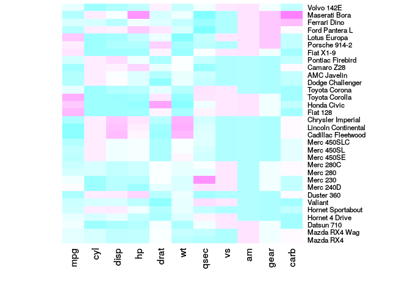

**Scale** is important: the values should be centered and scaled in either the row direction or the column direction.

``` r
heatmap(nba_matrix, scale = "column")
```

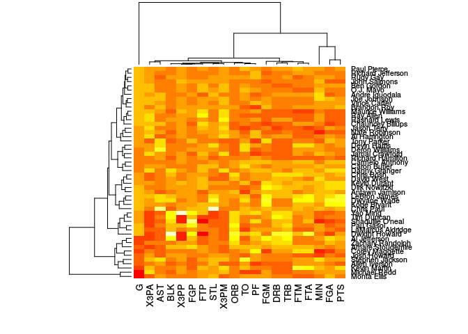

#### Colours

In the palette function `cm.colors(n)`, n is the number of colors (&gt;= 1) contained in the palette. It can be used in the `col` argument.

In the `margins` arguments, the first value is for column names and the second one for row names.

``` r
nba_heatmap <- heatmap(nba_matrix,
        col = cm.colors(15),
        scale = "column",
        margins = c(8, 8))
```

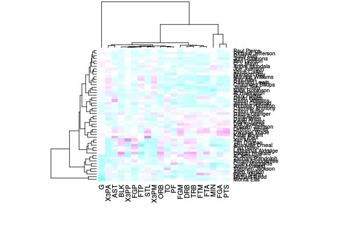

#### Remove dendrograms

Dendrograms don't really make sense for this dataset. `Rowv` and `Colv` can be set to `NA` to remove them.

``` r
nba_heatmap <- heatmap(nba_matrix,
                       col = cm.colors(100),
                       scale = "column",
                       Rowv = NA,
                       Colv = NA)
```

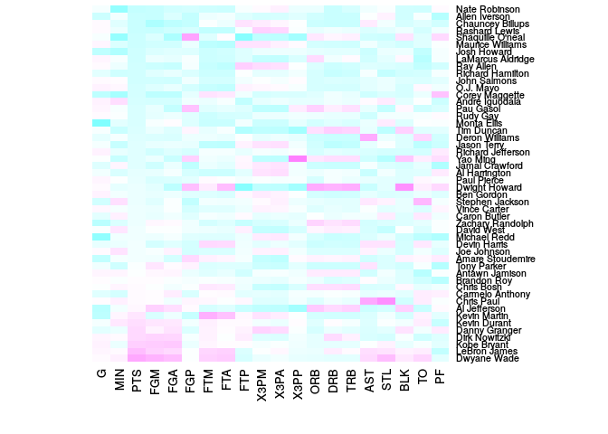

#### Clean the environment

We can start with a fresh environment, using:

``` r
rm(list = ls())
```

### Method 2: `gplots::heatmap.2()`

If you don't have the `gplots` package yet, use `install.packages("gplots")`. We will also need the `RColorBrewer`, so use `install.packages("RColorBrewer")` if you don't have it installed already.

#### Protein data example

*Step 1: data*

Observations for 63 proteins in three control experiments and three experiments where cells are treated with a growth factor.

``` r
rawdata <- read.csv("https://raw.githubusercontent.com/ab604/heatmap/master/leanne_testdata.csv")
?heatmap.2
```

This `gplots` heatmap function provides a number of extensions to the standard R heatmap function.

*Step 2: explore the data*

``` r
dim(rawdata)
str(rawdata)
head(rawdata)
View(rawdata)
```

*Step 3: data munging*

``` r
rawdata$Row_ID <- NULL
rawdata$T.test <- NULL
head(rawdata)
```

    ##   X1.Control X2.Control X3.Control X1.Treatment X2.Treatment X3.Treatment
    ## 1   7.152522   7.163227   7.112041     6.912676     6.882109     6.918670
    ## 2   6.639397   6.614227   6.594811     6.365425     6.349997     6.411068
    ## 3   3.678131   3.776133   3.813182     2.398460     2.088798     2.172404
    ## 4   5.040845   5.007151   4.686440     3.425154     3.516301     3.657402
    ## 5   6.915152   6.810610   6.897310     7.124722     7.211372     7.269469
    ## 6   4.570305   4.658906   4.819562     5.295718     5.119475     5.134975

``` r
colnames(rawdata) <- c(paste("Control", 1:3, sep = "_"), 
                       paste("Treatment", 1:3, sep = "_"))
head(rawdata)
```

    ##   Control_1 Control_2 Control_3 Treatment_1 Treatment_2 Treatment_3
    ## 1  7.152522  7.163227  7.112041    6.912676    6.882109    6.918670
    ## 2  6.639397  6.614227  6.594811    6.365425    6.349997    6.411068
    ## 3  3.678131  3.776133  3.813182    2.398460    2.088798    2.172404
    ## 4  5.040845  5.007151  4.686440    3.425154    3.516301    3.657402
    ## 5  6.915152  6.810610  6.897310    7.124722    7.211372    7.269469
    ## 6  4.570305  4.658906  4.819562    5.295718    5.119475    5.134975

*Step 4: convert the dataframe into a matrix*

``` r
class(rawdata)
```

    ## [1] "data.frame"

``` r
data_matrix <- data.matrix(rawdata)
head(data_matrix)
```

    ##      Control_1 Control_2 Control_3 Treatment_1 Treatment_2 Treatment_3
    ## [1,]  7.152522  7.163227  7.112041    6.912676    6.882109    6.918670
    ## [2,]  6.639397  6.614227  6.594811    6.365425    6.349997    6.411068
    ## [3,]  3.678131  3.776133  3.813182    2.398460    2.088798    2.172404
    ## [4,]  5.040845  5.007151  4.686440    3.425154    3.516301    3.657402
    ## [5,]  6.915152  6.810610  6.897310    7.124722    7.211372    7.269469
    ## [6,]  4.570305  4.658906  4.819562    5.295718    5.119475    5.134975

``` r
class(data_matrix)
```

    ## [1] "matrix"

*Step 5: more munging*

``` r
?scale
```

`scale` is generic function whose default method centers and/or scales the columns of a numeric matrix. We **normalise** the data using `scale()`, **transposing** using `t()` to perform row-wise normalisation of the protein data. This normalises the data across each experiment so we can compare them to each other. Finally, we transpose the data back to the original form.

``` r
# Normalise data, transpose for row wise normalisation
data_scaled_t <- scale(t(rawdata))
# check normalisation for each protein by:
  # checking that means are zero
round(colMeans(data_scaled_t), 1)
```

    ##  [1] 0 0 0 0 0 0 0 0 0 0 0 0 0 0 0 0 0 0 0 0 0 0 0 0 0 0 0 0 0 0 0 0 0 0 0
    ## [36] 0 0 0 0 0 0 0 0 0 0 0 0 0 0 0 0 0 0 0 0 0 0 0 0 0 0 0 0

``` r
  # check std devs are 1
apply(data_scaled_t, 2, sd)
```

    ##  [1] 1 1 1 1 1 1 1 1 1 1 1 1 1 1 1 1 1 1 1 1 1 1 1 1 1 1 1 1 1 1 1 1 1 1 1
    ## [36] 1 1 1 1 1 1 1 1 1 1 1 1 1 1 1 1 1 1 1 1 1 1 1 1 1 1 1 1

``` r
# transpose to original form
data_scaled <- t(data_scaled_t)
```

*Step 5: create heatmaps*

First, let's experiment with the base `heatmap()` function.

``` r
heatmap(data_scaled)
```

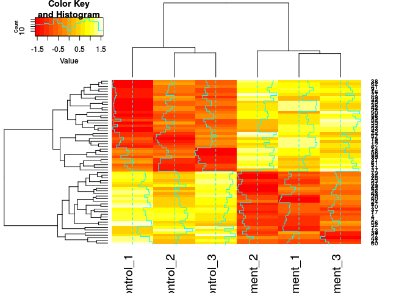

``` r
heatmap(data_scaled,
        col = heat.colors(8), 
        margins = c(8,12)) # , reveal col labels, reduce width
```

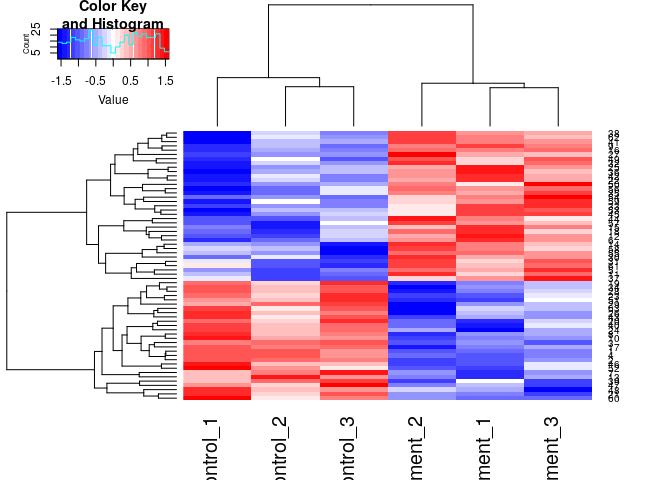

Let's create a new palette with 25 increments:

``` r
my_palette <- colorRampPalette(c("blue",
                                 "white",
                                 "red"))(n = 25)
```

Now, let's use `heatmap.2()`:

``` r
heatmap.2(data_scaled,                  # normalised data
          density.info = "histogram",   # plot histogram of data and colour key
          trace = "none",               # turn off trace lines from heatmap
          col = my_palette)             # use my colour scheme
```

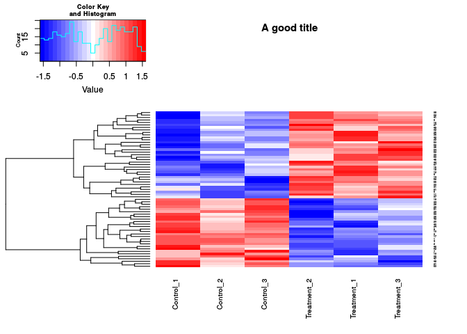

Fix a few things and add a few extras:

``` r
par(cex.main = 0.75)                  # shrink title fonts on plot
heatmap.2(data_scaled,
          density.info = "histogram",
          dendrogram = "row",         # only row dendrogram
          trace = "none",
          col = my_palette,
          main = "Difference between proteins",
          margins = c(8, 5),          # more space from border
          offsetRow = 1,              # space between plot and labels
          keysize = 2,                # make key and histogram fit
          cexRow = 0.5,               # amend row font
          cexCol = 0.75)              # amend column font
```

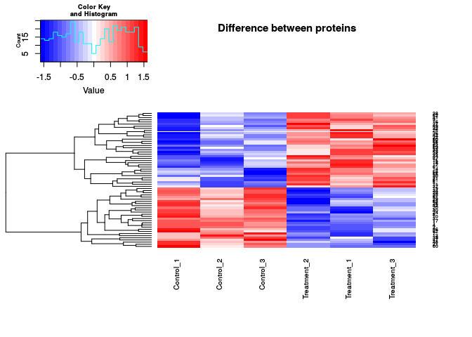

Clean up the environment with:

``` r
rm(list = ls())
```

#### (optional) Genechip data example

The `BiocInstaller` package allows to use the `biocLite()` function to install extra packages, including the `affy` package which we need in this example (it contains the data). Install BiocInstaller with `source("https://bioconductor.org/biocLite.R")`, and then `affy` with the command `biocLite("affy")`

``` r
library(affy)
data(SpikeIn)
pms <- SpikeIn@pm
str(pms)
class(pms)
# just the data, scaled across rows
par(cex.main = 0.75)  
labs <- colnames(pms)
heatmap.2(pms, 
          col = rev(heat.colors(16)), 
          main = "SpikeIn@pm",
          xlab = "Relative Concentration", 
          ylab="Probeset",
          trace = "none",
          labCol = "",
          add.expr = text( x = seq_along(labs), y = -2, srt = 45,
                           labels = labs, xpd = TRUE),
          scale="row")
```

Clean up your environment with:

``` r
rm(list = ls())
```

### Method 3: `pheatmap()`

If you don't have it already, install `pheatmap` with `install.packages("pheatmap")`. Load the packages with:

``` r
library(grid)     # this is a base package  
library(pheatmap) # stands for "pretty heatmaps"
```

How does `pheatmap` differ?

``` r
?pheatmap
```

> A function to draw clustered heatmaps where one has better control over some graphical parameters such as cell size, etc.

Create your data matrix:

``` r
set.seed(100)
d <- matrix(rnorm(25), 5, 5)
colnames(d) <- paste("Treatment", 1:5, sep = "")
rownames(d) <- paste("Gene", 1:5, sep = "")
```

Try it out:

``` r
pheatmap(d, 
         main = "Pretty heatmap",
         cellwidth =  50,
         cellheight = 30,
         fontsize = 12)
```


You can save your plot with an extra argument:

``` r
pheatmap(d, 
         main = "Pretty heatmap",
         cellwidth =  50,
         cellheight = 30,
         fontsize = 12,
         filename = "plots/heatmap.pdf")
```

Clean up your environment with:

``` r
rm(list = ls())
```

### Method 4: a dataframe in `ggplot2`

Load the necessary libraries:

``` r
library(reshape2)
library(ggplot2)
```

Labels the rows and columns:

``` r
name_genes <- paste("GEN", LETTERS[1:20], sep="_") # rows
name_patients <- paste("PATIENT", 1:20, sep="_")  # columns
```

Generation of dataframe:

``` r
value_expression <- data.frame(genes = name_genes, 
                               matrix(rnorm(400, 2, 1.8),
                                      nrow = 20,
                                      ncol = 20))
names(value_expression)[2:21] <- name_patients
```

Melt the dataframe:

``` r
df_heatmap <- melt(value_expression, id.vars = "genes")
names(df_heatmap)[2:3] <- c("patient", "expression_level")
head(df_heatmap)
```

    ##   genes   patient expression_level
    ## 1 GEN_A PATIENT_1       1.21078898
    ## 2 GEN_B PATIENT_1       0.70360121
    ## 3 GEN_C PATIENT_1       2.41570016
    ## 4 GEN_D PATIENT_1      -0.08391303
    ## 5 GEN_E PATIENT_1       2.44473679
    ## 6 GEN_F PATIENT_1       1.83599559

Create a basic heatmaps from the dataframe:

``` r
ggplot(df_heatmap, aes(patient, genes)) +
  geom_tile(aes(fill = expression_level), color = "white") +
  scale_fill_gradient(low = "white", high = "steelblue") +
  ylab("List of genes") +
  xlab("List of patients") +
  theme(legend.title = element_text(size = 10),
        legend.text = element_text(size = 12),
        plot.title = element_text(size=16),
        axis.title=element_text(size=14,face="bold"),
        axis.text.x = element_text(angle = 90, hjust = 1)) +
  labs(fill = "Expression level")
```

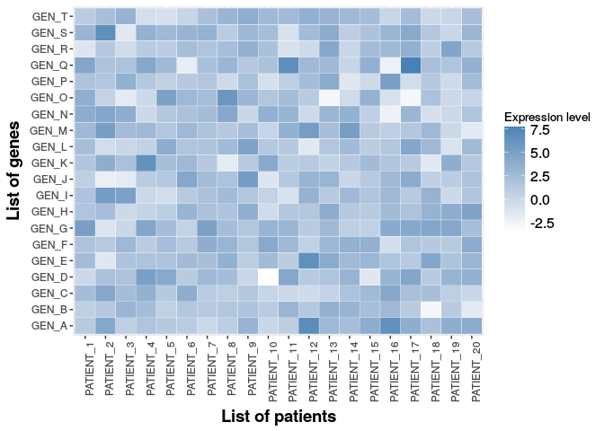

This ggplot2 method does not allow to create dendrograms.

Clean up your environment with:

``` r
rm(list = ls())
```

### (optional) Method 5: `ComplexHeatmap::Heatmap`

URL: <https://www.bioconductor.org/packages/devel/bioc/vignettes/ComplexHeatmap/inst/doc/s2.single_heatmap.html>

*Step 1*

``` r
# source("https://bioconductor.org/biocLite.R")
# biocLite("ComplexHeatmap") 
library(ComplexHeatmap)
```

    ## ========================================
    ## ComplexHeatmap version 1.17.1
    ## Bioconductor page: http://bioconductor.org/packages/ComplexHeatmap/
    ## Github page: https://github.com/jokergoo/ComplexHeatmap
    ## Documentation: http://bioconductor.org/packages/ComplexHeatmap/
    ## 
    ## If you use it in published research, please cite:
    ## Gu, Z. Complex heatmaps reveal patterns and correlations in multidimensional 
    ##   genomic data. Bioinformatics 2016.
    ## ========================================

``` r
# install.packages("circlize")
library(circlize)
```

    ## ========================================
    ## circlize version 0.4.3
    ## CRAN page: https://cran.r-project.org/package=circlize
    ## Github page: https://github.com/jokergoo/circlize
    ## Documentation: http://jokergoo.github.io/circlize_book/book/
    ## 
    ## If you use it in published research, please cite:
    ## Gu, Z. circlize implements and enhances circular visualization 
    ##   in R. Bioinformatics 2014.
    ## ========================================

Create a data matrix:

``` r
set.seed(123)
mat <- cbind(rbind(matrix(rnorm(16, -1), 4), matrix(rnorm(32, 1), 8)),
            rbind(matrix(rnorm(24, 1), 4), matrix(rnorm(48, -1), 8)))
```

*Step 2: munging*

Permute the rows and columns

``` r
mat <- mat[sample(nrow(mat), nrow(mat)), sample(ncol(mat), ncol(mat))]
rownames(mat) <- paste0("R", 1:12)
colnames(mat) <- paste0("C", 1:10)
```

*Step 3: make a heatmap*

``` r
?Heatmap
Heatmap(mat)
```

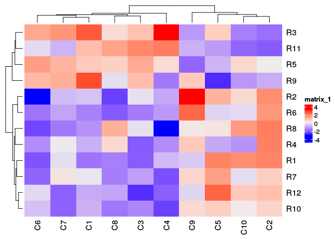

``` r
Heatmap(mat, 
        col = colorRamp2(c(-3, 0, 3), c("brown", "white", "yellow")), 
        cluster_rows = FALSE, 
        cluster_columns = FALSE,
        heatmap_legend_param = list(title = "Values"))
```

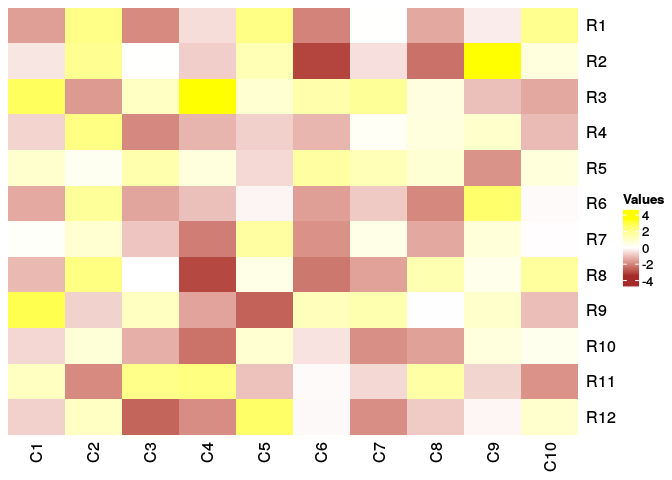

``` r
Heatmap(mat, 
        col = colorRamp2(c(-3, 0, 3), c("brown", "white", "yellow")), 
        heatmap_legend_param = list(title = "Values"))
```

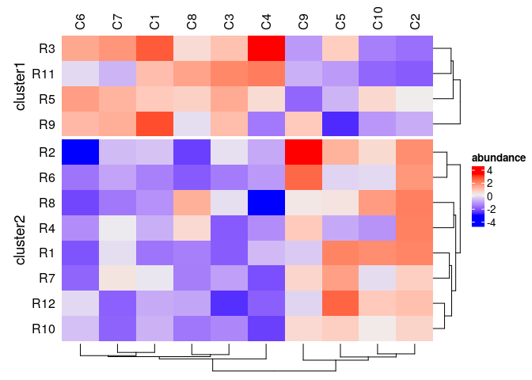

``` r
mat_with_na <- mat
mat_with_na[sample(c(TRUE, FALSE), nrow(mat)*ncol(mat), replace = TRUE, prob = c(1, 9))] <- NA
Heatmap(mat_with_na, 
        col = topo.colors(100),
        na_col = "orange", 
        clustering_distance_rows = "pearson",
        heatmap_legend_param = list(title = "Values"))
```

    ## Warning in get_dist(submat, distance): NA exists in the matrix, calculating
    ## distance by removing NA values.

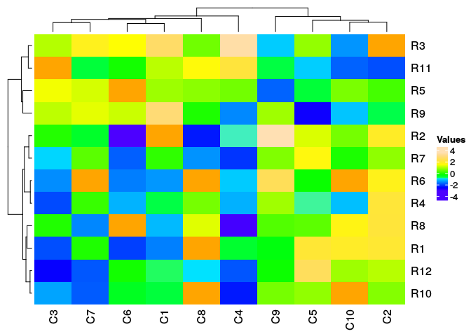

``` r
Heatmap(mat, 
        name = "values", 
        row_names_side = "left", 
        row_dend_side = "right", 
        column_names_side = "top", 
        column_dend_side = "bottom")
```

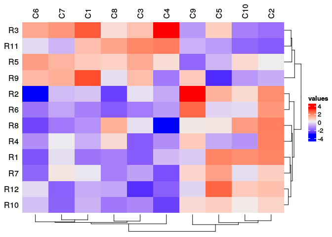

``` r
Heatmap(mat, 
        name = "values", 
        row_names_side = "left", 
        row_dend_side = "right", 
        column_names_side = "top", 
        column_dend_side = "bottom",
        km = 2)
```

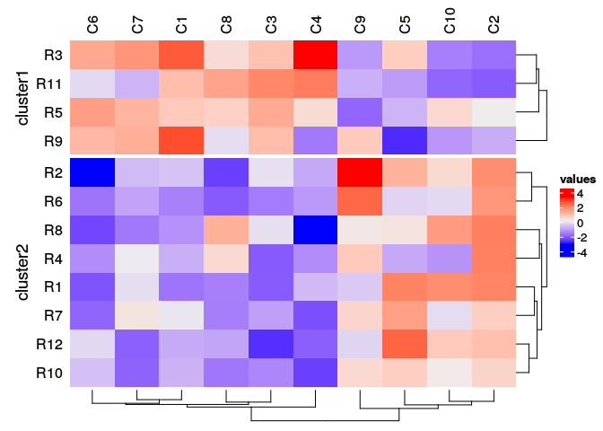

``` r
h1 <- Heatmap(mat, 
        name = "values", 
        #col = topo.colors(50),
        color_space = "sRGB",
        row_dend_width = unit(2, "cm"),
        column_dend_height = unit(2, "cm"),
        row_dend_reorder = TRUE,
        column_dend_reorder = TRUE,
        row_names_gp = gpar(fontsize = 8),
        column_names_gp = gpar(fontsize = 7),
        column_names_max_height = unit(2, "cm"),
        row_names_max_width = unit(9, "cm"),
        column_title = "This is a complex heatmap")
draw(h1, heatmap_legend_side = "left")
```


Clean my environment with:

``` r
rm(list = ls())
```

Close Rproject
--------------

When closing RStudio, you should be prompted to save your workspace.

Important links
---------------

-   RStudio Cheatsheet <https://github.com/rstudio/cheatsheets/raw/master/rstudio-ide.pdf>
-   RStudio online learning <https://www.rstudio.com/online-learning/>
-   Basic and advanced manuals <https://cran.r-project.org/manuals.html>
-   Ask about any function or package <http://www.rdocumentation.org/>
-   If you are looking how-to's or how to fix an error <http://stackoverflow.com/questions/tagged/r>
-   Lynda.com R training and tutorials <https://www.lynda.com/R-training-tutorials/1570-0.html> remember to sign in with your organisational portal,<https://web.library.uq.edu.au/library-services/training/lyndacom-online-courses>
-   R colours <http://www.stat.columbia.edu/~tzheng/files/Rcolor.pdf>
-   Book: Hadley Wickham. ggplot2 Elegant Graphics for Data Analysis Second Edition. 2016 <https://link-springer-com.ezproxy.library.uq.edu.au/content/pdf/10.1007%2F978-3-319-24277-4.pdf>
-   Examples of heatmaps: <https://flowingdata.com/2010/01/21/how-to-make-a-heatmap-a-quick-and-easy-solution/> <https://rpubs.com/ab604/98032> <https://stackoverflow.com/questions/15505607/diagonal-labels-orientation-on-x-axis-in-heatmaps> <https://www.bioconductor.org/packages/devel/bioc/vignettes/ComplexHeatmap/inst/doc/s2.single_heatmap.html>

-   If you need an R and/or RStudio workshop/session, please contact Centre for Digital Scholarship staff to organise one for you. <https://web.library.uq.edu.au/locations-hours/centre-digital-scholarship>
-   If you have further questions, please contact me p.martinez at uq.edu.au
