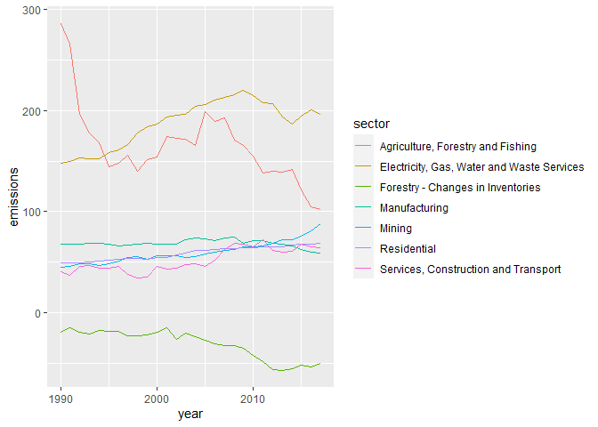

R reproducible reports with R Markdown and knitr
================
Stéphane Guillou
2020-06-17

> This document is redacted in R Markdown; the source file is available
> here:
> <https://gitlab.com/stragu/DSH/blob/master/R/reports/reports.Rmd> It
> is then knitted as a markdown file, which is the best version to view
> online and to print:
> <https://gitlab.com/stragu/DSH/blob/master/R/reports/reports.md>

## Setting up

> If you want to review the installation instructions:
> <https://gitlab.com/stragu/DSH/blob/master/R/Installation.md>

  - If you are using your own laptop please open RStudio
      - Make sure you have a working Internet connection
  - On the Library’s training computers:
      - Log in with your UQ username and password
      - Make sure you have a working Internet connection
      - Open the ZENworks application
      - Look for “RStudio”
      - Double click on RStudio, which will install both R and RStudio

With RStudio open, let’s make sure we have the necessary packages
installed by running this command (this might take a few minutes):

``` r
install.packages(c("tidyverse", "knitr", "ggplotly"))
```

This will install the Tidyverse packages, and the knitr package to
render reproducible reports.

## What are we going to learn?

R is a great tool to go from importing to reporting. Today, we focus on
the “reporting” part.

Using R, RStudio, the R Markdown syntax and the knitr package, we can
create **reproducible reports** that mix code and prose. If the
underlying data changes, we only need to replace the original data file
and “knit” the report once more, which updates all its contents in one
click.

## Create a project and an R Markdown file

Use the project menu (top right) to create a “New project…”. Let’s name
this one “reports”.

We also need to create a new R Markdown file: “File \> New File \> R
Markdown…”. We can change the title of the report, and the author as
well. Let’s stick to “HTML document” as an output for now.

## R Markdown and knitting

See how the document is already populated with a template? Scroll
through and have a look at how it is structured. The three main elements
are:

  - a **YAML header** at the top, between the `---` tags;
  - **Markdown** sections, where we can write prose, format text and add
    headers;
  - and **code chunks**, in between ` ``` ` where we can write R code.

But before we edit this document, let’s go straight to the “knit” button
at the top of the source panel. Clicking that button will compile a
document from the R Markdown file. You should see the process unfolding
in the R Markdown tab, and the HTML document pop up when it is finished.

See how the document contains a title, headers, code input and output,
and explanations?

## Editing the document

Let’s remove everything below our YAML header, and start writing our own
report\!

### Markdown syntax

To add a **header**, we can start a line with `##`: this will be a
header of level 2. The number of hash symbols corresponds to the level
of the header. See how the highlighting changes in the source editor?

We are going to deal with greenhouse gas emissions for Australia, so
let’s add a header and some text about the source of the data and
importing it. For example:

    ## National Greenhouse Gas Inventory data
    
    Our data comes from the NGA, and is released under a [CC-BY](https://creativecommons.org/licenses/by/4.0/) licence. The latest release can be found on [this page](https://publications.industry.gov.au/publications/climate-change/climate-change/climate-science-data/greenhouse-gas-measurement/publications.html)

Notice how we used a `[text](link)` syntax to add a link to a website?

#### Challenge 1

We can also style our text by surrounding with other tags:

  - `**` for **bold**
  - `*` for *italic*

Try to style your text, and add a header of level 3 for a section on
“importing the data”. Knit the document to see if it works\!

### R code chunks

We can now add a **code chunk** to include some R code inside our
reproducible document. To add a code chunk, click the “Insert” button at
the top of the source panel, and click “R”. You can see that the
language of the code chunk is defined at the top, with `{r}`.

Let’s import the Tidyverse, by including this code in the chunk:

``` r
library(tidyverse)
```

    ## ── Attaching packages ─────────────────────────────────────────────────────── tidyverse 1.3.0 ──

    ## ✓ ggplot2 3.3.1     ✓ purrr   0.3.4
    ## ✓ tibble  3.0.1     ✓ dplyr   1.0.0
    ## ✓ tidyr   1.1.0     ✓ stringr 1.4.0
    ## ✓ readr   1.3.1     ✓ forcats 0.5.0

    ## ── Conflicts ────────────────────────────────────────────────────────── tidyverse_conflicts() ──
    ## x dplyr::filter() masks stats::filter()
    ## x dplyr::lag()    masks stats::lag()

Notice that you can test your chunks of code one by one by clicking the
“play” button at the right of the chunk: you don’t have to knit the
whole document every time you want to test your code.

Now, try to knit the document and see what it looks like.

#### Challenge 2

Inside a new chunk, add some code to import the dataset located [here]()
into an object called `ghg`.

``` r
ghg <- read_csv("aus_ghg_2018.csv")
```

    ## Parsed with column specification:
    ## cols(
    ##   year = col_double(),
    ##   `Agriculture, Forestry and Fishing` = col_double(),
    ##   `Forestry - Changes in Inventories` = col_double(),
    ##   Mining = col_double(),
    ##   Manufacturing = col_double(),
    ##   `Electricity, Gas, Water and Waste Services` = col_double(),
    ##   `Services, Construction and Transport` = col_double(),
    ##   Residential = col_double()
    ## )

> Clicking “Knit” will automatically save your .Rmd file as well as the
> HTML output.

Now, we can add a chunk to show the data, by including this code in it:

``` r
ghg
```

    ## # A tibble: 29 x 8
    ##     year `Agriculture, F… `Forestry - Cha… Mining Manufacturing `Electricity, G…
    ##    <dbl>            <dbl>            <dbl>  <dbl>         <dbl>            <dbl>
    ##  1  1990             286.            -19.1   44.6          68.0             148.
    ##  2  1991             266.            -14.8   46.1          67.9             150.
    ##  3  1992             197.            -19.7   48.5          68.1             153.
    ##  4  1993             178.            -21.1   48.8          68.5             152.
    ##  5  1994             168.            -17.6   46.7          68.3             153.
    ##  6  1995             144.            -18.3   48.7          68.1             159.
    ##  7  1996             148.            -18.1   51.0          66.2             161.
    ##  8  1997             156.            -22.6   54.4          66.9             166.
    ##  9  1998             140.            -22.5   55.4          67.5             178.
    ## 10  1999             151.            -22.0   53.0          68.8             184.
    ## # … with 19 more rows, and 2 more variables: `Services, Construction and
    ## #   Transport` <dbl>, Residential <dbl>

### Working directory

Note that the **working directory** for an R Markdown document will be
the .Rmd file’s location (and not necessarily the working directory of
the R project your are in). That is why it is a good idea to save your R
Markdown file at the top of your R Project directory if you want
consistency between your scripts and your R Markdown file.

In our example, we load a CSV file from the Internet, but if we had a
data file stored locally, it is important to keep that in mind.

### Chunk options

Notice how our two first chunks show some messages as an output? We
might want to remove that if it is not important and we don’t want to
include it in the report. At the top of your chunk, you can **modify the
options** like so:

    {r  message=FALSE}

The code will be executed and the output (if there is any) will be
shown, but the messages won’t\!

There are many options to choose from, depending on what you want to do
and show with your chunk of code. For example, to hide both messages and
warnings, and only show the output of the code (without showing the
underlying code), you can use these options, separated by commas:

    {r  message=FALSE, warning=FALSE, echo=FALSE}

It also is a good idea to **label your chunks**, especially in longer
documents, so you can spot issues more easily. It won’t be shown in the
report, but will be used in the R Markdown console and can be used to
navigate your script (with the dropdown menu at the bottom of the source
panel). For example, for our first chunk:

    {r load_packages, message=FALSE}

It is also possible to include a chunk at the top of your document, that
will detail the default options you want to use for all you chunks. That
is particularly useful if you want to define a default size for all your
figures, for example.

## Errors when knitting

It should be straight forward to find where an issue comes from when
knitting a report does not work.

### Challenge 3

Try changing a chunk code so the code is not valid. What can you see in
the R Markdown console?

Double-click on the error message to jump the problem.

## Tidy the data

Let’s keep populating our report with more code. Our data is not
respecting the tidy data principles, so let’s fix that first with a
tidyr function:

``` r
ghg_tidy <- pivot_longer(ghg,
                         -year,
                         names_to = "sector",
                         values_to = "emissions")
```

## Inline code

We can also include code that will be executed *inside* Markdown text.
For example, you can write the following sentence:

> The dataset contains GHG emissions for the period `r
> min(ghg_tidy$year)` to `r max(ghg_tidy$year)`. The maximum GHG
> emissions recorded for the mining sector is `r
> max(ghg_tidy[ghg_tidy$sector == "Mining",]$emissions)`

We can also use this feature to auto-update the date of your report
every time it is knitted. Replace the `date` line in the YAML header
with this one:

    date: "`r Sys.Date()`"

Now, try knitting the report again.

## Visualisation

We can also include a visualisation using ggplot2:

``` r
ggplot(ghg_tidy, aes(x = year, y = emissions, colour = sector)) +
    geom_line()
```

<!-- -->

Make sure you keep adding Markdown text around your chunks to document
your work.

> If you want to hide the code that created an output, like for this
> plot, you can add the option `echo=FALSE` to it.

Finally, let’s create an interactive version of our plot:

``` r
library(plotly)
p <- ggplot(ghg_tidy, aes(x = year, y = emissions, colour = sector)) +
    geom_line()
ggplotly(p)
```

    ## TypeError: Attempting to change the setter of an unconfigurable property.
    ## TypeError: Attempting to change the setter of an unconfigurable property.

<!-- -->

To change the width of all our figures, we can use this is the setup
chunk, that contains the `{r setup, include=FALSE}` header:

    knitr::opts_chunk$set(fig.width = 5)

## Output formats

### HTML documents

The benefits of using HTML documents are multiple:

  - figures won’t break the flow of the document by jumping to the next
    page and leaving a large blank space;
  - you can include interactive visualisations making use of the latest
    HTML features;
  - they can be directly integrated into a website.

However, other output formats are available. Here are some examples:

  - `pdf_document` for a non-editable, widespread, portable format
  - `word_document` and `odt_document` to open and edit with Microsoft
    Word and LibreOffice Writer
  - `md_document` for a Markdown file that can easily be published on
    GitHub or GitLab
  - and more, including for creating slides.

### Knitting to PDF

In some cases, you might be required to share your report as a PDF.
Knitting your document to PDF can generate very professional-looking
documents, but it will require having extra software on your computer.

You can install the necessary LaTeX packages with an R package called
TinyTeX, which is a great alternative to very big LaTeX distributions
that can be several gigabytes-big.

``` r
install.packages("tinytex")
tinytex::install_tinytex()
```

After this, try to change your YAML header’s `output` value to
`pdf_document` and knit it.

## Useful links

Related to R Markdown and knitr:

  - 
Our list of recommended R resources:

  - <https://gitlab.com/stragu/DSH/-/blob/master/R/usefullinks.md>

## R Markdown

This is an R Markdown document. Markdown is a simple formatting syntax
for authoring HTML, PDF, and MS Word documents. For more details on
using R Markdown see <http://rmarkdown.rstudio.com>.

When you click the **Knit** button a document will be generated that
includes both content as well as the output of any embedded R code
chunks within the document. You can embed an R code chunk like this:

``` r
summary(cars)
```

    ##      speed           dist       
    ##  Min.   : 4.0   Min.   :  2.00  
    ##  1st Qu.:12.0   1st Qu.: 26.00  
    ##  Median :15.0   Median : 36.00  
    ##  Mean   :15.4   Mean   : 42.98  
    ##  3rd Qu.:19.0   3rd Qu.: 56.00  
    ##  Max.   :25.0   Max.   :120.00

## Including Plots

You can also embed plots, for example:

<!-- -->

Note that the `echo = FALSE` parameter was added to the code chunk to
prevent printing of the R code that generated the plot.
