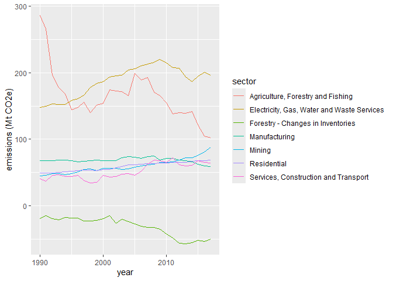

# R reproducible reports with Quarto
UQ Library
2024-10-08

- [Setting up](#setting-up)
- [What are we going to learn?](#what-are-we-going-to-learn)
- [Create a Quarto project](#create-a-quarto-project)
- [Quarto document structure and
  rendering](#quarto-document-structure-and-rendering)
- [A note on R Markdown](#a-note-on-r-markdown)
- [Editing the document](#editing-the-document)
- [Errors when rendering](#errors-when-rendering)
- [Tidy the data](#tidy-the-data)
- [Inline code](#inline-code)
- [Visualisation](#visualisation)
- [Update the report](#update-the-report)
- [Output formats](#output-formats)
- [Useful links](#useful-links)

## Setting up

> If you don’t have R and RStudio installed already, we have
> [installation
> instructions](.\R/Installation.md#r--rstudio-installation-instructions)

- If you are using your own laptop please open RStudio
  - Make sure you have a working Internet connection
- On the Library’s training computers:
  - Log in with your UQ username and password
  - Make sure you have a working Internet connection
  - Open the ZENworks application
  - Look for “RStudio”
  - Double click on RStudio, which will install both R and RStudio

Recent versions of RStudio already include Quarto.

With RStudio open, let’s make sure we have the necessary packages
installed by running this command (this might take a few minutes):

``` r
install.packages(c("tidyverse", "plotly", "htmltools"))
```

This will install the Tidyverse packages, the plotly package for
interactive visualisations, and the htmltools package for having all
bases covered for rendering HTML documents.

> If R asks about installing a binary or building from source, **pick
> the binary option**: it will be faster!

## What are we going to learn?

R is a great tool to go from importing to reporting. Today, we focus on
the “reporting” part.

Using R, RStudio, the Markdown syntax and the Quarto publishing system,
we can create **reproducible reports** that mix code and prose. If the
underlying data changes, we only need to replace the original data file
and “render” the report once more, which updates all its contents in one
click.

## Create a Quarto project

Use the project menu (top right) to **create a “New project…”**. Let’s
select the project type “Quarto Project” and name this one “reports”.

This kind of project automatically creates a `.qmd` file for us, but if
you have an existing R project and want to add a report to it, you can
also create only that file with: “File \> New File \> Quarto Document…”.
If you create a single file, you can use the dialog to choose the title
of the report, and add the author. For a generic report, the HTML output
is the most versatile and the one we use for this tutorial (and it is
Quarto’s default anyway).

## Quarto document structure and rendering

See how the document is already populated with a template? Scroll
through and have a look at how it is structured. The three main elements
are:

- a **YAML header** at the top, between the `---` tags;
- **Markdown** sections, where we can write prose, format text and add
  headings;
- and **code chunks**, in between ```` ``` ```` where we can write R
  code.

But before we edit this document, let’s go straight to the **“Render”
button** at the top of the source panel. Clicking that button will
**compile** a document from the Quarto file. You should see the process
unfolding in the “Background Jobs” tab, and the HTML document pop up in
a separate window when it is finished.

See how the document contains a title, headers, code input and output,
and formatted paragraphs?

## A note on R Markdown

R Markdown was the predecessor to Quarto. If you have existing `.Rmd`
files, you should be able to move them to Quarto with no or very minimal
modification. That being said, R Markdown is here to stay and you can
keep using it independently from Quarto.

## Editing the document

Let’s remove everything below our YAML header, and start writing our own
report!

Note that by default, the editor uses the “Visual” mode. We can change
it to “Source” for now, using the editor toolbar, to familiarise
ourselves with the syntax.

### Markdown syntax

[Markdown](https://quarto.org/docs/authoring/markdown-basics.html) is a
markup language that allows us to format text with simple tags,
similarly to HTML or LaTeX.

To add a **heading**, we can start a line with `##`: this will be a
heading of level 2. The number of hash symbols corresponds to the level
of the header.

We are going to deal with greenhouse gas emissions for Australia, so
let’s add a header and some text about the source of the data and how to
import it. For example:

    ## National Greenhouse Gas Inventory data

    Our data comes from the NGA, and is released under a [CC-BY](https://creativecommons.org/licenses/by/4.0/) licence. The latest release can be found on [this page](https://www.industry.gov.au/data-and-publications/national-inventory-reports)

    The values are reported in Mt CO<sub>2</sub>-e.

Notice how we used a `[text](link)` syntax to add a link to a website?

#### Challenge 1

We can also style our text by surrounding with other tags:

- `**` for **bold**
- `*` for *italic*

Try to style your text, and add a heading of level 3 for a section on
“importing the data”. Render the document to see if it works!

### R code chunks

We can now add a **code chunk** to include some R code inside our
reproducible document. To add a code chunk, click the “Insert a new code
chunk” button at the top of the source panel, and click “R”. You can see
that the language of the code chunk is defined at the top, with `{r}`.

Let’s import the Tidyverse, by including this code in the chunk:

``` r
library(tidyverse)
```

Notice that you can **run your chunks of code** one by one by clicking
the green “play” button at the right of the chunk: you don’t have to
render the whole document every time you want to test your code.

Now, try to render the document and see what it looks like.

#### Challenge 2

Inside a new chunk, add some code to import the dataset located
[here](https://raw.githubusercontent.com/uqlibrary/technology-training/master/R/reports/aus_ghg_2017.csv)
into an object called `ghg`.

``` r
ghg <- read_csv("https://raw.githubusercontent.com/uqlibrary/technology-training/master/R/reports/aus_ghg_2017.csv")
```

> Clicking “Render” will automatically save your `.qmd` file as well as
> the HTML output.

Now, we can add a chunk to show the data, by including this code in it:

``` r
ghg
```

    # A tibble: 28 × 8
        year Agriculture, Forestry and…¹ Forestry - Changes i…² Mining Manufacturing
       <dbl>                       <dbl>                  <dbl>  <dbl>         <dbl>
     1  1990                        286.                  -19.1   44.6          68.0
     2  1991                        266.                  -14.8   46.1          67.9
     3  1992                        197.                  -19.7   48.5          68.1
     4  1993                        178.                  -21.1   48.8          68.5
     5  1994                        168.                  -17.6   46.7          68.3
     6  1995                        144.                  -18.3   48.7          68.1
     7  1996                        148.                  -18.1   51.0          66.2
     8  1997                        156.                  -22.6   54.4          66.9
     9  1998                        140.                  -22.5   55.4          67.5
    10  1999                        151.                  -22.0   53.0          68.8
    # ℹ 18 more rows
    # ℹ abbreviated names: ¹​`Agriculture, Forestry and Fishing`,
    #   ²​`Forestry - Changes in Inventories`
    # ℹ 3 more variables: `Electricity, Gas, Water and Waste Services` <dbl>,
    #   `Services, Construction and Transport` <dbl>, Residential <dbl>

### Working directory

Note that the **working directory** for a Quarto document will be the
`.qmd` file’s location by default (and not necessarily the working
directory of the R project your are in). That is why it is a good idea
to save your Quarto file at the top of your project directory if you
want consistency between your scripts and your Quarto file.

In our example, we load a CSV file from the Internet, but if we had a
data file stored locally, it is important to keep that in mind.

### Chunk options

Notice how our two first chunks show some messages as an output? We
might want to remove that if it is not important and we don’t want to
include it in the report. At the top of your chunk, you can **modify the
options** like so:

    #| message: false

The code will be executed and the output (if there is any) will be
shown, but the messages won’t!

There are many options to choose from, depending on what you want to do
and show with your chunk of code. For example, to hide both messages and
warnings, and only show the output of the code (without showing the
underlying code), you can use these options, separated by commas:

    #| message: false
    #| warning: false
    #| echo: false

It also is a good idea to **label your chunks**, especially in longer
documents, so you can spot issues more easily. It won’t be shown in the
report, but will be used in the console and can be used to navigate your
script (with the dropdown menu at the bottom of the source panel). For
example, for our first chunk:

    {r}
    #| label: load-packages
    #| message: false

These labels also allow you to use
[cross-references](https://quarto.org/docs/authoring/cross-references.html)
when generating plots.

It is also possible to include options in the YAML header at the top of
the document, to set default options you want to use for all you chunks.
That is particularly useful if you want to define a default size for all
your figures, for example.

Here is an example of options you might use in your YAML header:

    title: "My Report"
    execute:
      echo: true
      message: false
      warning: false

That would make sure that, by default:

- The code is shown, but
- the messages and warnings are hidden.

## Errors when rendering

It should be straight forward to find where an issue comes from when
rendering a report does not work.

### Challenge 3

1.  Try changing a chunk code so the code is not valid.
2.  What can you see in the console? Which parts are helpful to identify
    the issue?

## Tidy the data

Let’s keep populating our report with more code. Our data is not
respecting the tidy data principles, so let’s fix that first with a
tidyr function:

``` r
ghg_tidy <- pivot_longer(ghg,
                         -year,
                         names_to = "sector",
                         values_to = "emissions")
```

## Inline code

We can also **include code that will be executed *inside* Markdown
text**. For example, you can write the following sentence:

> The dataset contains GHG emissions for the period
> `` `{r} min(ghg$year)` `` to `` `{r} max(ghg$year)` ``. The maximum
> GHG emissions recorded for the mining sector is
> `` `{r} round(max(ghg$Mining), 2)` ``.

## Visualisation

We can also include a visualisation using, for example, ggplot2:

``` r
ggplot(ghg_tidy, aes(x = year, y = emissions, colour = sector)) +
  geom_line() +
  ylab("emissions (Mt CO2e)")
```



> If you want to hide the code that created an output, like for this
> plot, you can add the option `#| echo: false` to it.

Finally, let’s create an interactive version of our plot:

``` r
library(plotly)
p <- ggplot(ghg_tidy, aes(x = year, y = emissions, colour = sector)) +
  geom_line() +
  ylab("emissions (Mt CO2e)")
ggplotly(p)
```

This will work in a HTML document, but will most likely fail in other
output formats.

If you want to change the size of your visualisations, you can tweak the
width and height with chunk options like `fig-width: 8`. However, to
make that consistent for all your figures, better use an extra default
option in the YAML header. For example:

    format: 
      html:
        fig-width: 8
        fig-height: 6

## Update the report

We have an updated version of the dataset. The only thing we need to do
to update the whole report is point the data import code to the new
file, at the top of our document, changing the year to “2019”:

``` r
ghg <- read_csv("https://raw.githubusercontent.com/uqlibrary/technology-training/master/R/reports/aus_ghg_2019.csv")
```

Rendering again will update all the objects and visualisations for us!
This is the power of reproducible reports in R.

With reproducible reports, you can potentially structure and write (most
of) a report even before you have your research project’s final dataset.
(Well, at least the data analysis part, maybe not so much the
conclusions!)

## Output formats

The benefits of using HTML documents are multiple:

- figures won’t break the flow of the document by jumping to the next
  page and leaving a large blank space;
- you can include interactive visualisations making use of the latest
  HTML features;
- they can be directly integrated into a website.

However, other output formats are available. Here are some examples for
the `format` value in your YAML header:

- `pdf` for a non-editable, widespread, portable format
- `docx` and `odt` to open and edit with Microsoft Word and LibreOffice
  Writer
- `gfm` for a Markdown file that can easily be published on GitHub or
  GitLab
- and [more](https://quarto.org/docs/output-formats/all-formats.html),
  including for creating slides.

### Rendering to PDF

In some cases, you might be required to share your report as a PDF.
Rendering your document to PDF can generate very professional-looking
reports, but it will require having extra software on your computer.

You can install the necessary LaTeX packages with an R package called
TinyTeX, which is a great alternative to very big LaTeX distributions
that can be several gigabytes-big.

In a terminal, run the following:

    quarto install tinytex

After this, try to change your YAML header’s `format` value to `pdf` and
render it.

## Useful links

Related to R Markdown and knitr:

- *[R Markdown
  Cookbook](https://bookdown.org/yihui/rmarkdown-cookbook/)*, by Yihui
  Xie and Christophe Dervieux
- [Official R Markdown website](https://rmarkdown.rstudio.com/) by
  RStudio
  - [Tutorial](https://rmarkdown.rstudio.com/lesson-1.html)
  - [Documentation](https://rmarkdown.rstudio.com/docs/)
- [R Markdown
  cheatsheet](https://raw.githubusercontent.com/rstudio/cheatsheets/main/rmarkdown.pdf)

We also have a [list of recommended R
resources](https://github.com/uqlibrary/technology-training/blob/master/R/usefullinks.md#what-next).
