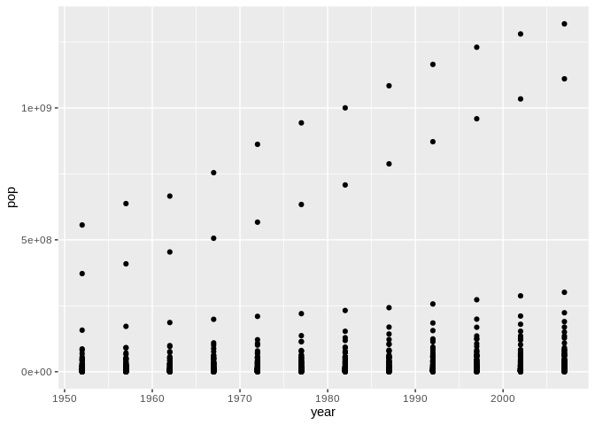
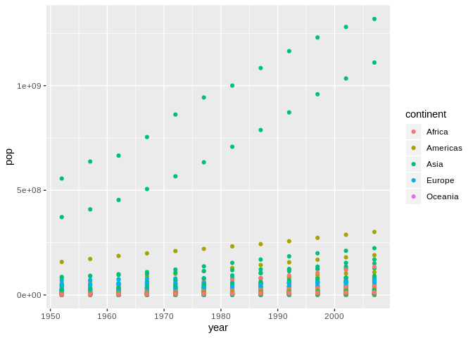

R with RStudio: getting started
================
Stéphane Guillou
2019-05-28

> These notes are available on GitLab:
> <https://gitlab.com/stragu/DSH/blob/master/R/rstudio_intro/rstudio_intro.md>

If you want to review the installation instructions:
<https://gitlab.com/stragu/DSH/blob/master/R/Installation.md>

## R + RStudio

RStudio is an open source IDE (Integrated Development Interface) for the
R programming language.

We can use R for calculations, statistics and visualisations.

R’s main strong points are:

  - **Open Source**: you can install it anywhere and adapt it to your
    needs;
  - Makes research **reproducible** by working with scripts;
  - **Customisable**: you can code nearly anything you want;
  - **Large ecosystem**: packages allow you to extend R for thousands of
    different analyses.

The learning curve will be steeper than point-and-click tools, but as
far as programming languages go, R is more user-friendly than others.

## Open RStudio

  - If you are using your own laptop please open RStudio
      - Make sure you have a working Internet connection
  - On Library computers:
      - Log in with your UQ username and password (if you are both staff
        and student, use your student account)
      - Make sure you have a working Internet connection
      - Go to search at bottom left corner (magnifiying glass)
      - Open the ZENworks application
      - Search for “RStudio”
      - Double-click on RStudio which will install both R and RStudio

## What are we going to learn?

This session is designed to get straight into using R in a short amount
of time, which is why we won’t spend too much time on the smaller
details that make the language.

During this session, you will:

  - Create a project for data analysis
  - Create a folder structure
  - Know where to find help
  - Learn about a few useful functions
  - Create a script
  - Import a dataset
  - Understand the different RStudio pannels
  - Use a few shortcuts
  - Know how to extend R with packages
  - Generate a data visualisation

## Material

### RStudio Project

Let’s first create a new project:

  - Click the “File” menu button (top left corner), then “New Project”
  - Click “New Directory”
  - Click “New Project”
  - In “Directory name”, type the name of your project, e.g.
    “rstudio\_intro” (Browse and select a folder where to locate your
    project, if you want to keep them all in one spot. For example, a
    folder called “r\_projects”.)
  - Click the “Create Project” button

> R Projects make your work with R more straight forward, as they allow
> you to segregate your different projects in separate folders. You can
> create a .Rproj file in a new directory or an existing directory that
> already has R code and data. Everything then happens by default in
> this directory. The .Rproj file stores information about your project
> options, and allows you to go straight back to your work.

### Maths and objects

In the **console**, we can use R interactively. We write a **command**
and then **execute** it by pressing <kbd>Enter</kbd>.

In its most basic use, R can be a calculator. Try executing the
following commands:

``` r
10 - 2
```

    ## [1] 8

``` r
3 * 4
```

    ## [1] 12

``` r
10 / 2 + 5
```

    ## [1] 10

``` r
11^6
```

    ## [1] 1771561

Those symbols are binary operators, which we can use to multiply,
divide, add, substract and exponentiate. Once we execute the command
(the “input”), we can see the result in the console (the “output”).

What if we want to keep reusing the same value? We can store data by
creating **objects**, and assigning values to them with the **assignment
operator** `<-`:

``` r
num1 <- 42
num2 <- num1 / 9
num2
```

    ## [1] 4.666667

``` r
sentence <- "Hello World!"
sentence
```

    ## [1] "Hello World!"

You should now see your objects listed in you **environment pane** (top
right).

As you can see, you can store different kinds of data as objects. If you
want to store a string of characters, you have to use quotes around
them.

> You can use the shortcut <kbd>Alt</kbd>+<kbd>-</kbd> to type the
> assignement operator quicker.

### Using functions

An R function usually looks like this:

    <functionname>(<argument(s)>)

Some functions don’t need arguments, others need one or several, but
they always need the parentheses after their name.

For example, try running the following command:

``` r
class(x = num1)
```

    ## [1] "numeric"

The `class()` function tells us what class of data we are dealing with.
Here, we use the argument `x` and assign it the object `num1`.

#### Help

What if we want to learn more about a function?

There are two main ways to find help about a function in RStudio:

1.  the shortcut command: `?functionname`
2.  the keyboard shortcut: press <kbd>F1</kbd> with your cursor in a
    function name

Let’s look through the help page for the `class()` function:

``` r
?class
```

There is quite a lot of information in there, but the most important
bits are:

  - **Description**: general description of the function(s)
  - **Usage**: overview of what syntax can be used
  - **Arguments**: description of what each argument is
  - **Examples**: some examples that demonstrate what is possible

##### Challenge 1 – Finding help

Use the help pages to find out what these functions do, and try
executing commands with them:

1.  `c()`

2.  `rep()`

3.  `mean()`

4.  `rm()`

5.  `c()` concatenates the arguments into a vector. For example:

<!-- end list -->

``` r
ages <- c(4, 10, 2, NA, 3)
2 * ages
```

    ## [1]  8 20  4 NA  6

> The argument `...` means we can pass on any number of values.

2.  `rep()` replicates values. For
    example:

<!-- end list -->

``` r
rep("Ha! ", 30)
```

    ##  [1] "Ha! " "Ha! " "Ha! " "Ha! " "Ha! " "Ha! " "Ha! " "Ha! " "Ha! " "Ha! "
    ## [11] "Ha! " "Ha! " "Ha! " "Ha! " "Ha! " "Ha! " "Ha! " "Ha! " "Ha! " "Ha! "
    ## [21] "Ha! " "Ha! " "Ha! " "Ha! " "Ha! " "Ha! " "Ha! " "Ha! " "Ha! " "Ha! "

> We don’t need to specify the names of the arguments if we use them in
> order.

3.  `mean()` returns the mean of a vector of numbers:

<!-- end list -->

``` r
mean(ages)
```

    ## [1] NA

What happened there?

We have an NA value in the vector, which means the function can’t tell
what the mean is. If we want to change this default behaviour, we can
use an extra argument:

``` r
mean(ages, na.rm = TRUE)
```

    ## [1] 4.75

4.  `rm()` removes an object from your environment (`remove()` and
    `rm()` point to the same function). For example:

<!-- end list -->

``` r
rm(num1)
```

> R does not check if you are sure you want to remove something\! As a
> programming language, it does what you ask it to do, which means you
> might have to be more careful. But you’ll see later on that, when
> working with scripts, this is less of a problem.

Let’s do some more complex operations by combining two functions:

`ls()` returns a character vector: it is a list of all the objects in
the current environment (i.e. the objects we created in this R session).
Is there a way we could combine it with `rm()`?

You can remove *all* the objects in the environment by using `ls()` as
the value for the `list` argument:

``` r
rm(list = ls())
```

We are nesting a function inside an other one. More precisely, we are
using the output of the `ls()` function as the value passed on to the
`list` argument in the `rm()` function.

##### More help

We’ve practised how to find help about functions we know the name of.
What if we don’t know what the function is called? Or if we want general
help about R?

The function `help.start()` is a good starting point: it opens a browser
of official R help. If you want to search for a word in all the
documentation, you can use the `??` syntax. For example, try executing
`??anova`. Finally, you will often go to your web browser and search for
a particular question, or a specific error message: most times, there
already is an answer somewhere on the Internet. The challenge is to ask
the right question\!

### Creating a folder structure

To keep it tidy, we are creating 3 folders in our project directory:

  - scripts
  - data
  - plots

For that, we use the function `dir.create()`:

``` r
dir.create("scripts")
dir.create("data")
dir.create("plots")
```

> You can recall your recent commands with the up arrow, which is
> especially useful to correct typos or slightly modify a long command.

### Scripts

Scripts are simple text files that contain R code. They are useful for:

  - saving a set of commands for later use (and executing it in one
    click)
  - making research reproducible
  - making writing and reading code more comfortable
  - documenting the code with comments, and
  - sharing your work with peers

Let’s create a new R script with a command:

``` r
file.create("scripts/process.R")
```

> All the file paths are **relative** to our current working directory,
> i.e. the project directory. To use an **absolute** file path, we can
> start with `/`.

To edit the new script, use the `file.edit()` function. Try using the
<kbd>Tab</kbd> key to autocomplete your function name and your file
path\!

``` r
file.edit("scripts/process.R")
```

This opens our fourth pannel in RStudio: the **source pannel**.

### Many ways to do one thing

As in many programs, there are many ways to achieve one thing.

For example, we used commands to create and edit a script, but we could
also:

  - use the shortcut <kbd>Ctrl</kbd>+<kbd>Shift</kbd>+<kbd>N</kbd>
  - use the top left drop-down menus

Learning how to use functions rather than the graphical user interface
(GUI) will allow you to integrate them in scripts, and will sometimes
help you to do things faster.

### Comments

We should start with a couple of **comments**, to document our script.
Comments start with `#`, and will be ignored by R:

``` r
# Description: Introduction to R and RStudio
# Author: <your name>
# Date: <today's date>
```

### Syntax highlighting

Now, add a command to your script:

``` r
vect <- c(3, "Hi!")
```

Notice the colours? This is called **syntax highlighting**. This is one
of the many ways RStudio makes it more comfortable to work with R. The
code is more readable when working in a script.

> While editing your script, you can run the active command (or the
> selected block of lines) by using <kbd>Ctrl</kbd>+<kbd>Enter</kbd>.
> Remember to save your script regularly with the shortcut
> <kbd>Ctrl</kbd>+<kbd>S</kbd>. You can find more shortcuts with
> <kbd>Alt</kbd>+<kbd>Shift</kbd>+<kbd>K</kbd>, or the menu “Tools \>
> Keyboard Shortcuts Help”.

### Import data

#### Challenge 2 – Import data

Copy and paste the following two commands into your
script:

``` r
download.file(url = "https://raw.githubusercontent.com/resbaz/r-novice-gapminder-files/master/data/gapminder-FiveYearData.csv",
  destfile = "data/gapminderdata.csv")
gapminder <- read.csv("data/gapminderdata.csv")
```

What do you think they do? Describe each one in detail, and try
executing them.

### Explore data

We have downloaded a CSV file from the Internet, and read it into an
object called `gapminder`.

You can type the name of your new object to print it to screen:

``` r
gapminder
```

That’s a lot of lines printed to your console. To have a look at the
first few lines only, we can use the `head()` function:

``` r
head(gapminder)
```

    ##       country year      pop continent lifeExp gdpPercap
    ## 1 Afghanistan 1952  8425333      Asia  28.801  779.4453
    ## 2 Afghanistan 1957  9240934      Asia  30.332  820.8530
    ## 3 Afghanistan 1962 10267083      Asia  31.997  853.1007
    ## 4 Afghanistan 1967 11537966      Asia  34.020  836.1971
    ## 5 Afghanistan 1972 13079460      Asia  36.088  739.9811
    ## 6 Afghanistan 1977 14880372      Asia  38.438  786.1134

Now let’s use a few functions to learn more about our
    dataset:

``` r
class(gapminder) # what kind of object is it stored as?
```

    ## [1] "data.frame"

``` r
nrow(gapminder) # how many rows?
```

    ## [1] 1704

``` r
ncol(gapminder) # how many columns?
```

    ## [1] 6

``` r
dim(gapminder) # rows and columns
```

    ## [1] 1704    6

``` r
names(gapminder) # variable names
```

    ## [1] "country"   "year"      "pop"       "continent" "lifeExp"   "gdpPercap"

All the information we just saw (and more) is available with one single
function:

``` r
str(gapminder) # general structure
```

    ## 'data.frame':    1704 obs. of  6 variables:
    ##  $ country  : Factor w/ 142 levels "Afghanistan",..: 1 1 1 1 1 1 1 1 1 1 ...
    ##  $ year     : int  1952 1957 1962 1967 1972 1977 1982 1987 1992 1997 ...
    ##  $ pop      : num  8425333 9240934 10267083 11537966 13079460 ...
    ##  $ continent: Factor w/ 5 levels "Africa","Americas",..: 3 3 3 3 3 3 3 3 3 3 ...
    ##  $ lifeExp  : num  28.8 30.3 32 34 36.1 ...
    ##  $ gdpPercap: num  779 821 853 836 740 ...

> The RStudio’s environment pannel already shows us some of that
> information (click on the blue arrow next to the object name).

And to explore the data in a viewer, run the following:

``` r
View(gapminder) # spreadsheet-like view in new tab
```

This viewer allows you to explore your data by scrolling through,
searching terms, filtering rows and sorting the data. Remember that it
is only a viewer: it will never modify your original object.

Notice that in R, the case matters: trying to use `view()` (with a
lowercase “V”) will yield an error.

> You can also click on the spreadsheet icon in your environment pane to
> open the viewer.

Finally, to see summary statistics for each of our
    variables:

``` r
summary(gapminder)
```

    ##         country          year           pop               continent  
    ##  Afghanistan:  12   Min.   :1952   Min.   :6.001e+04   Africa  :624  
    ##  Albania    :  12   1st Qu.:1966   1st Qu.:2.794e+06   Americas:300  
    ##  Algeria    :  12   Median :1980   Median :7.024e+06   Asia    :396  
    ##  Angola     :  12   Mean   :1980   Mean   :2.960e+07   Europe  :360  
    ##  Argentina  :  12   3rd Qu.:1993   3rd Qu.:1.959e+07   Oceania : 24  
    ##  Australia  :  12   Max.   :2007   Max.   :1.319e+09                 
    ##  (Other)    :1632                                                    
    ##     lifeExp        gdpPercap       
    ##  Min.   :23.60   Min.   :   241.2  
    ##  1st Qu.:48.20   1st Qu.:  1202.1  
    ##  Median :60.71   Median :  3531.8  
    ##  Mean   :59.47   Mean   :  7215.3  
    ##  3rd Qu.:70.85   3rd Qu.:  9325.5  
    ##  Max.   :82.60   Max.   :113523.1  
    ## 

Notice how categorical and numerical variables are handled differently?

### Packages

Packages add functionnalities to R and RStudio. There are more than
17000 available.

You can see the list of installed packages in your “Packages” tab, or by
using the `library()` function without any argument.

We are going to install and load a new package called “praise”. We can
do that with the GUI: click the “Install” button in the “Packages” tab
(bottom right pane), and search for “praise”.

Notice how it runs an `install.packages()` command in the console? You
can use that too.

If I try running the command `praise()`, I get an error. That’s because,
even though the package is installed, I need to **load** it every time I
start a new R session. The `library()` function can do that.

``` r
library(praise) # load the package
praise() # use a function from the package
```

    ## [1] "You are first-class!"

Even though you might need the motivation provided by this function,
other packages are more useful for your work.

### Plotting

R already has a number of base plotting functions to visualise data in
many different ways. However, many R users will use the package ggplot2
by default because it introduces a logic that makes data visualisation
more streamlined, called “Grammar of graphics”.

Let’s first install ggplot2 on our computer. In the console, execute the
following command:

``` r
install.packages("ggplot2")
```

We can now load the package, and use the `qplot()` function to visualise
the population growth. In our script:

``` r
library(ggplot2)
```

    ## Registered S3 methods overwritten by 'ggplot2':
    ##   method         from 
    ##   [.quosures     rlang
    ##   c.quosures     rlang
    ##   print.quosures rlang

``` r
qplot(data = gapminder,
      x = year,
      y = pop,
      geom = "point")
```

<!-- -->

If we want to add an extra variable, we can add an extra argument:

``` r
qplot(data = gapminder,
      x = year,
      y = pop,
      colour = continent,
      geom = "point")
```

<!-- -->

We can now use the “Export” dropdown menu to save our plot into our
“plots” directory in a variety of formats.

### Close RStudio

You can close RStudio after making sure that you saved your script.

When you create a **project** in RStudio, it create an .Rproj file that
gathers information about your project, and it allows you to save your
**workspace** inside an .Rdata file. The .Rdata file is by default used
to reload your workspace when you open your Rproject again (i.e. the
objects in your **environment**). Rprojects also bring back whatever
source file (e.g. script) you had open, and your command history. You
will find your command history in the “History” tab (upper right panel):
all the commands that we used should be in there.

If you have a script that contains all your work, it is a good idea
*not* to save your workspace: it makes it less likely to run into errors
because of accumulating objects. The script will allow you to get back
to where you left it, by executing all the clearly laid-out steps.

The console, on the other hand, only shows a brand new R **session**
when you reopen RStudio. Sessions are not persistent, and a new one is
started when you open your project again, which is why you have to load
any extra package your work requires again with the `library()`
function.

## What next?

We have a compilation of links for the rest of your R learning:
<https://gitlab.com/stragu/DSH/blob/master/R/usefullinks.md>
