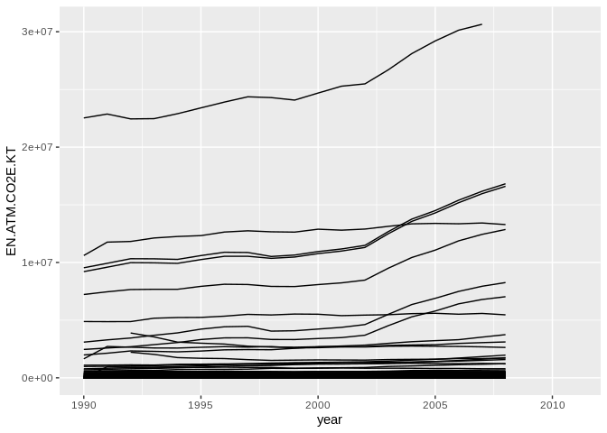
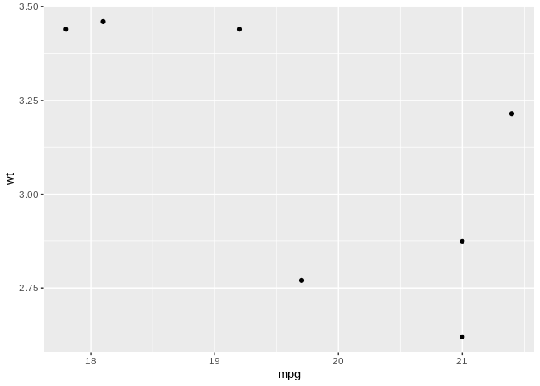
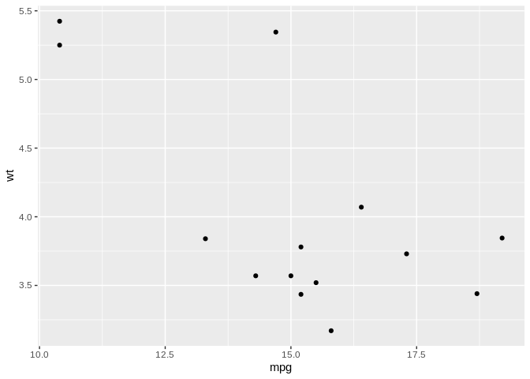

R and the Tidyverse: next steps
================
Stéphane Guillou
2019-04-05

> This document is redacted in R Markdown; the source file is available here: <https://gitlab.com/stragu/DSH/blob/master/R/tidyverse_next_steps/tidyverse_next_steps.Rmd> It is then knitted as a markdown file, which is the best version to view online and to print: <https://gitlab.com/stragu/DSH/blob/master/R/tidyverse_next_steps/tidyverse_next_steps.md>

Setting up
----------

> If you want to review the installation instructions: <https://gitlab.com/stragu/DSH/blob/master/R/Installation.md>

-   If you are using your own laptop please open RStudio
    -   Make sure you have a working Internet connection
-   On the Library's training computers:
    -   Log in with your UQ username and password
    -   Make sure you have a working Internet connection
    -   Open the ZENworks application
    -   Look for "RStudio"
    -   Double click on RStudio, which will install both R and RStudio With RStudio open, let's make sure we have the necessary packages installed by running this command (this might take a few minutes):

``` r
install.packages("tidyverse")
```

This will install the 8 core Tidyverse packages (and their dependencies).

What are we going to learn?
---------------------------

tidyr and purrr, just like dplyr and ggplot2, are core to the Tidyverse.

-   tidyr can be used to tidy your data
-   purrr is useful to apply functions iteratively on lists or vectors

Create a project and a script
-----------------------------

Use the project menu (top right) to create a "New project...". Let's name this one "tidyverse\_inter".

We also want to work more comfortably by typing our code in a script. You can use the new file dropdown menu, or <kbd>Ctrl</kbd>+<kbd>Shift</kbd>+<kbd>N</kbd>, and save your script as "process.R" in the current working directory.

Load the necessary packages
---------------------------

We can use one single command to load the core Tidyverse packages:

``` r
library(tidyverse)
```

    ## ── Attaching packages ─────────────────────────────── tidyverse 1.2.1 ──

    ## ✔ ggplot2 3.1.0       ✔ purrr   0.3.2  
    ## ✔ tibble  2.1.1       ✔ dplyr   0.8.0.1
    ## ✔ tidyr   0.8.3       ✔ stringr 1.4.0  
    ## ✔ readr   1.3.1       ✔ forcats 0.4.0

    ## ── Conflicts ────────────────────────────────── tidyverse_conflicts() ──
    ## ✖ dplyr::filter() masks stats::filter()
    ## ✖ dplyr::lag()    masks stats::lag()

Tidy data
---------

Tidy data makes it easy to transform and analyse data in R (and many other tools). Tidy data has observations in rows, and variables in columns. The whole Tidyverse is designed to work with tidy data.

### Reshaping data

Often, a dataset is organised in a way that makes it easy for humans to read and populate. This is called wide format. Tidy data is in long format.

#### Gathering

To go from wide format to long format, we can use the tidyr function `gather()`:

``` r
# data originally from:
# https://datacatalog.worldbank.org/dataset/climate-change-data
# download data
download.file(url = "https://gitlab.com/stragu/DSH/raw/master/R/tidyverse_next_steps/data_who_climate.csv",
              destfile = "data_who_climate.csv")
climate_raw <- read_csv("data_who_climate.csv",
                    na = "..")
```

    ## Parsed with column specification:
    ## cols(
    ##   .default = col_double(),
    ##   `Country code` = col_character(),
    ##   `Country name` = col_character(),
    ##   `Series code` = col_character(),
    ##   `Series name` = col_character(),
    ##   `2011` = col_logical()
    ## )

    ## See spec(...) for full column specifications.

``` r
climate_long <- gather(climate_raw,
                       key = "year",
                       value = "value",
                       `1990`:`2011`,
                       convert = TRUE)
```

### Spreading

To do the opposite, going from long to wide format, we can use the `spread()` function.

We have single observations spread across several rows, so we can spread the data.

First, let's keep a record of the correspondence between long descriptive variable names and their "code", for later reference:

``` r
codes <- unique(climate_long[,c("Series code", "Series name")])
codes
```

    ## # A tibble: 5 x 2
    ##   `Series code`       `Series name`                                        
    ##   <chr>               <chr>                                                
    ## 1 EG.USE.COMM.GD.PP.… Energy use per units of GDP (kg oil eq./$1,000 of 20…
    ## 2 EG.USE.PCAP.KG.OE   Energy use per capita (kilograms of oil equivalent)  
    ## 3 EN.ATM.CO2E.KT      CO2 emissions, total (KtCO2)                         
    ## 4 EN.ATM.CO2E.PC      CO2 emissions per capita (metric tons)               
    ## 5 EN.ATM.CO2E.PP.GD.… CO2 emissions per units of GDP (kg/$1,000 of 2005 PP…

Now, let's spread the data:

``` r
climate_tidy <- climate_long %>% 
  select(-`Series name`, -SCALE, -Decimals) %>% 
  spread(key = `Series code`,
         value = value)
```

Now we can use the Tidyverse functions more easily:

``` r
climate_tidy %>% 
  ggplot(aes(x = year,
             y = EN.ATM.CO2E.KT,
             group = `Country name`)) +
  geom_line()
```

    ## Warning: Removed 1139 rows containing missing values (geom_path).


Let's have a look at the increase in lobal CO2 emission in KT:

``` r
climate_tidy %>% 
  group_by(year) %>% 
  summarise(CO2 = sum(EN.ATM.CO2E.KT, na.rm = TRUE)) %>% 
  ggplot(aes(x = year, y = CO2)) +
  geom_point()
```


#### Challenge 1

Looks like our data is incomplete from 2006, so how can we remove that?

We can add this extra step:

``` r
climate_tidy %>% 
  group_by(year) %>% 
  summarise(CO2 = sum(EN.ATM.CO2E.KT, na.rm = TRUE)) %>%
  filter(year < 2006) %>% 
  ggplot(aes(x = year, y = CO2)) +
  geom_point()
```



Functional programming
----------------------

Functional programming (as opposed to "imperative programming") makes use of functions rather than loops to iterate over objects. The functions will allow to simplify our code, by abstracting common building blocks used in different cases of iteration. However, it means that there will usually be a different function for each different pattern.

You can iterate over elements by using:

1.  the basic building blocks in R (for loops, while loops...), or
2.  the `apply` function family, or
3.  the purrr functions.

Here is an example of a for loop:

``` r
output <- vector("double", ncol(mtcars))
for (i in seq_along(mtcars)) {
  output[[i]] <- mean(mtcars[[i]])
}
output
```

    ##  [1]  20.090625   6.187500 230.721875 146.687500   3.596563   3.217250
    ##  [7]  17.848750   0.437500   0.406250   3.687500   2.812500

Better than having the same code repeated 11 times!

We allocate space in the expected **output** first (more efficient). We then specify the **sequence** for the loop, and put what we want to iterate in the **body**.

The apply family in base R is handy, but the purrr functions are easiers to learn because they are more consistent.

Here's our third option: purrr offers several functions to iterate functions over elements in a vector or a list.

### The map family

-   `map()` makes a list.
-   `map_lgl()` makes a logical vector.
-   `map_int()` makes an integer vector.
-   `map_dbl()` makes a double vector.
-   `map_chr()` makes a character vector.

For example, to do a similar operation to our previous for loop:

``` r
car_means <- map_dbl(mtcars, mean)
car_means
```

    ##        mpg        cyl       disp         hp       drat         wt 
    ##  20.090625   6.187500 230.721875 146.687500   3.596563   3.217250 
    ##       qsec         vs         am       gear       carb 
    ##  17.848750   0.437500   0.406250   3.687500   2.812500

``` r
typeof(car_means)
```

    ## [1] "double"

The map functions automatically name the resulting vectors, which is particularly handy.

We can use extra arguments to pass to the function:

``` r
map_dbl(mtcars, mean, trim = 0.2)
```

    ##      mpg      cyl     disp       hp     drat       wt     qsec       vs 
    ##  19.2200   6.3000 219.1750 137.9000   3.5755   3.1970  17.8175   0.4000 
    ##       am     gear     carb 
    ##   0.3500   3.5500   2.7000

``` r
map_lgl(starwars, is_character)
```

    ##       name     height       mass hair_color skin_color  eye_color 
    ##       TRUE      FALSE      FALSE       TRUE       TRUE       TRUE 
    ## birth_year     gender  homeworld    species      films   vehicles 
    ##      FALSE       TRUE       TRUE       TRUE      FALSE      FALSE 
    ##  starships 
    ##      FALSE

Just like most functions in the Tidyverse, the first argument is the data that we want to process (which means we can use the pipe). The second argument is the name of the function we want to apply, but it can also be a custom formula. For example:

``` r
map_dbl(mtcars, ~ round(max(.x)))
```

    ##  mpg  cyl disp   hp drat   wt qsec   vs   am gear carb 
    ##   34    8  472  335    5    5   23    1    1    5    8

We have to use the tilde `~` to introduce a custom function, and `.x` to use the vector being processed.

#### Challenge 2

How can we find out the number of unique values in each variable of the `starwars` data.frame?

``` r
map_int(starwars, ~ length(unique(.x)))
```

    ##       name     height       mass hair_color skin_color  eye_color 
    ##         87         46         39         13         31         15 
    ## birth_year     gender  homeworld    species      films   vehicles 
    ##         37          5         49         38         24         11 
    ##  starships 
    ##         17

To split a dataset an apply an operation to separate parts, we can use the `split()` function:

``` r
unique(mtcars$cyl)
```

    ## [1] 6 4 8

``` r
mtcars %>% 
  split(.$cyl) %>% # separate in three parts
  map(summary) # applied to each data.frame
```

    ## $`4`
    ##       mpg             cyl         disp              hp        
    ##  Min.   :21.40   Min.   :4   Min.   : 71.10   Min.   : 52.00  
    ##  1st Qu.:22.80   1st Qu.:4   1st Qu.: 78.85   1st Qu.: 65.50  
    ##  Median :26.00   Median :4   Median :108.00   Median : 91.00  
    ##  Mean   :26.66   Mean   :4   Mean   :105.14   Mean   : 82.64  
    ##  3rd Qu.:30.40   3rd Qu.:4   3rd Qu.:120.65   3rd Qu.: 96.00  
    ##  Max.   :33.90   Max.   :4   Max.   :146.70   Max.   :113.00  
    ##       drat             wt             qsec             vs        
    ##  Min.   :3.690   Min.   :1.513   Min.   :16.70   Min.   :0.0000  
    ##  1st Qu.:3.810   1st Qu.:1.885   1st Qu.:18.56   1st Qu.:1.0000  
    ##  Median :4.080   Median :2.200   Median :18.90   Median :1.0000  
    ##  Mean   :4.071   Mean   :2.286   Mean   :19.14   Mean   :0.9091  
    ##  3rd Qu.:4.165   3rd Qu.:2.623   3rd Qu.:19.95   3rd Qu.:1.0000  
    ##  Max.   :4.930   Max.   :3.190   Max.   :22.90   Max.   :1.0000  
    ##        am              gear            carb      
    ##  Min.   :0.0000   Min.   :3.000   Min.   :1.000  
    ##  1st Qu.:0.5000   1st Qu.:4.000   1st Qu.:1.000  
    ##  Median :1.0000   Median :4.000   Median :2.000  
    ##  Mean   :0.7273   Mean   :4.091   Mean   :1.545  
    ##  3rd Qu.:1.0000   3rd Qu.:4.000   3rd Qu.:2.000  
    ##  Max.   :1.0000   Max.   :5.000   Max.   :2.000  
    ## 
    ## $`6`
    ##       mpg             cyl         disp             hp       
    ##  Min.   :17.80   Min.   :6   Min.   :145.0   Min.   :105.0  
    ##  1st Qu.:18.65   1st Qu.:6   1st Qu.:160.0   1st Qu.:110.0  
    ##  Median :19.70   Median :6   Median :167.6   Median :110.0  
    ##  Mean   :19.74   Mean   :6   Mean   :183.3   Mean   :122.3  
    ##  3rd Qu.:21.00   3rd Qu.:6   3rd Qu.:196.3   3rd Qu.:123.0  
    ##  Max.   :21.40   Max.   :6   Max.   :258.0   Max.   :175.0  
    ##       drat             wt             qsec             vs        
    ##  Min.   :2.760   Min.   :2.620   Min.   :15.50   Min.   :0.0000  
    ##  1st Qu.:3.350   1st Qu.:2.822   1st Qu.:16.74   1st Qu.:0.0000  
    ##  Median :3.900   Median :3.215   Median :18.30   Median :1.0000  
    ##  Mean   :3.586   Mean   :3.117   Mean   :17.98   Mean   :0.5714  
    ##  3rd Qu.:3.910   3rd Qu.:3.440   3rd Qu.:19.17   3rd Qu.:1.0000  
    ##  Max.   :3.920   Max.   :3.460   Max.   :20.22   Max.   :1.0000  
    ##        am              gear            carb      
    ##  Min.   :0.0000   Min.   :3.000   Min.   :1.000  
    ##  1st Qu.:0.0000   1st Qu.:3.500   1st Qu.:2.500  
    ##  Median :0.0000   Median :4.000   Median :4.000  
    ##  Mean   :0.4286   Mean   :3.857   Mean   :3.429  
    ##  3rd Qu.:1.0000   3rd Qu.:4.000   3rd Qu.:4.000  
    ##  Max.   :1.0000   Max.   :5.000   Max.   :6.000  
    ## 
    ## $`8`
    ##       mpg             cyl         disp             hp       
    ##  Min.   :10.40   Min.   :8   Min.   :275.8   Min.   :150.0  
    ##  1st Qu.:14.40   1st Qu.:8   1st Qu.:301.8   1st Qu.:176.2  
    ##  Median :15.20   Median :8   Median :350.5   Median :192.5  
    ##  Mean   :15.10   Mean   :8   Mean   :353.1   Mean   :209.2  
    ##  3rd Qu.:16.25   3rd Qu.:8   3rd Qu.:390.0   3rd Qu.:241.2  
    ##  Max.   :19.20   Max.   :8   Max.   :472.0   Max.   :335.0  
    ##       drat             wt             qsec             vs   
    ##  Min.   :2.760   Min.   :3.170   Min.   :14.50   Min.   :0  
    ##  1st Qu.:3.070   1st Qu.:3.533   1st Qu.:16.10   1st Qu.:0  
    ##  Median :3.115   Median :3.755   Median :17.18   Median :0  
    ##  Mean   :3.229   Mean   :3.999   Mean   :16.77   Mean   :0  
    ##  3rd Qu.:3.225   3rd Qu.:4.014   3rd Qu.:17.55   3rd Qu.:0  
    ##  Max.   :4.220   Max.   :5.424   Max.   :18.00   Max.   :0  
    ##        am              gear            carb     
    ##  Min.   :0.0000   Min.   :3.000   Min.   :2.00  
    ##  1st Qu.:0.0000   1st Qu.:3.000   1st Qu.:2.25  
    ##  Median :0.0000   Median :3.000   Median :3.50  
    ##  Mean   :0.1429   Mean   :3.286   Mean   :3.50  
    ##  3rd Qu.:0.0000   3rd Qu.:3.000   3rd Qu.:4.00  
    ##  Max.   :1.0000   Max.   :5.000   Max.   :8.00

Using purrr functions with ggplot2 functions allows us to generate several plots in one function:

``` r
mtcars %>% 
  split(.$cyl) %>% 
  map(~ggplot(., aes(mpg, wt)) + geom_point())
```

    ## $`4`


    ## 
    ## $`6`



    ## 
    ## $`8`



### Predicate functions

Purrr also contains functions that return a boolean.

``` r
str(iris)
```

    ## 'data.frame':    150 obs. of  5 variables:
    ##  $ Sepal.Length: num  5.1 4.9 4.7 4.6 5 5.4 4.6 5 4.4 4.9 ...
    ##  $ Sepal.Width : num  3.5 3 3.2 3.1 3.6 3.9 3.4 3.4 2.9 3.1 ...
    ##  $ Petal.Length: num  1.4 1.4 1.3 1.5 1.4 1.7 1.4 1.5 1.4 1.5 ...
    ##  $ Petal.Width : num  0.2 0.2 0.2 0.2 0.2 0.4 0.3 0.2 0.2 0.1 ...
    ##  $ Species     : Factor w/ 3 levels "setosa","versicolor",..: 1 1 1 1 1 1 1 1 1 1 ...

``` r
iris %>%
  map_dbl(mean) # NA for Species
```

    ## Warning in mean.default(.x[[i]], ...): argument is not numeric or logical:
    ## returning NA

    ## Sepal.Length  Sepal.Width Petal.Length  Petal.Width      Species 
    ##     5.843333     3.057333     3.758000     1.199333           NA

``` r
iris %>%
  discard(is.factor) %>% 
  map_dbl(mean) # clean!
```

    ## Sepal.Length  Sepal.Width Petal.Length  Petal.Width 
    ##     5.843333     3.057333     3.758000     1.199333

``` r
starwars %>% 
  keep(is.character) %>% 
  map_int(~length(unique(.)))
```

    ##       name hair_color skin_color  eye_color     gender  homeworld 
    ##         87         13         31         15          5         49 
    ##    species 
    ##         38

To return everything, but apply a function only if a condition is met, we can use `map_if()`:

``` r
str(iris)
```

    ## 'data.frame':    150 obs. of  5 variables:
    ##  $ Sepal.Length: num  5.1 4.9 4.7 4.6 5 5.4 4.6 5 4.4 4.9 ...
    ##  $ Sepal.Width : num  3.5 3 3.2 3.1 3.6 3.9 3.4 3.4 2.9 3.1 ...
    ##  $ Petal.Length: num  1.4 1.4 1.3 1.5 1.4 1.7 1.4 1.5 1.4 1.5 ...
    ##  $ Petal.Width : num  0.2 0.2 0.2 0.2 0.2 0.4 0.3 0.2 0.2 0.1 ...
    ##  $ Species     : Factor w/ 3 levels "setosa","versicolor",..: 1 1 1 1 1 1 1 1 1 1 ...

``` r
iris %>%
  map_if(is.numeric, round) %>% 
  str()
```

    ## List of 5
    ##  $ Sepal.Length: num [1:150] 5 5 5 5 5 5 5 5 4 5 ...
    ##  $ Sepal.Width : num [1:150] 4 3 3 3 4 4 3 3 3 3 ...
    ##  $ Petal.Length: num [1:150] 1 1 1 2 1 2 1 2 1 2 ...
    ##  $ Petal.Width : num [1:150] 0 0 0 0 0 0 0 0 0 0 ...
    ##  $ Species     : Factor w/ 3 levels "setosa","versicolor",..: 1 1 1 1 1 1 1 1 1 1 ...
