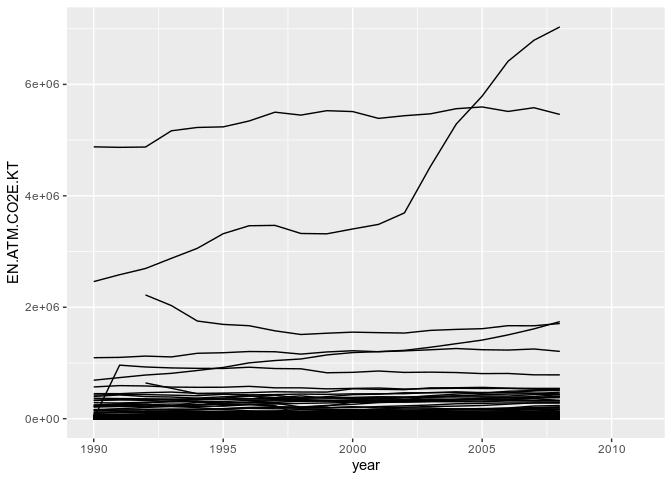
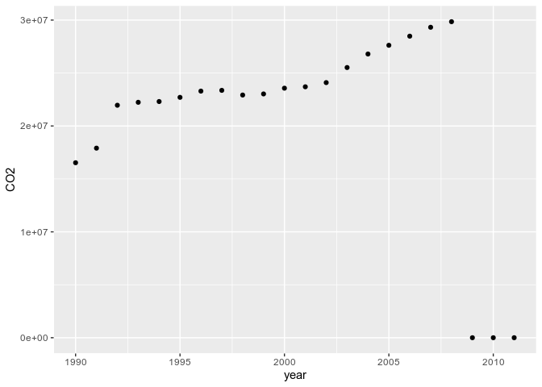
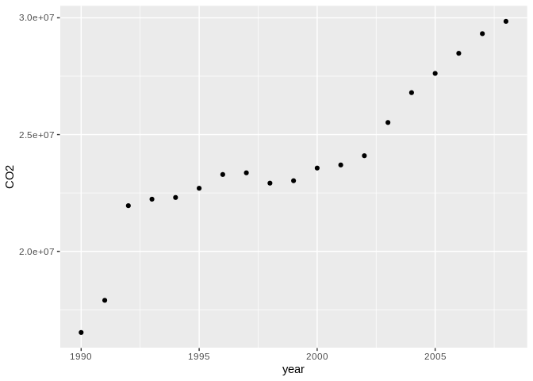
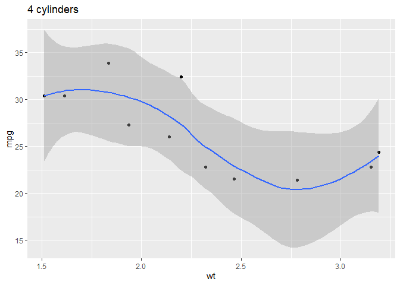
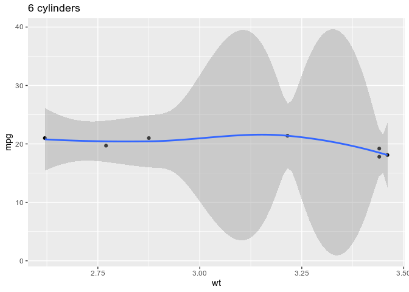
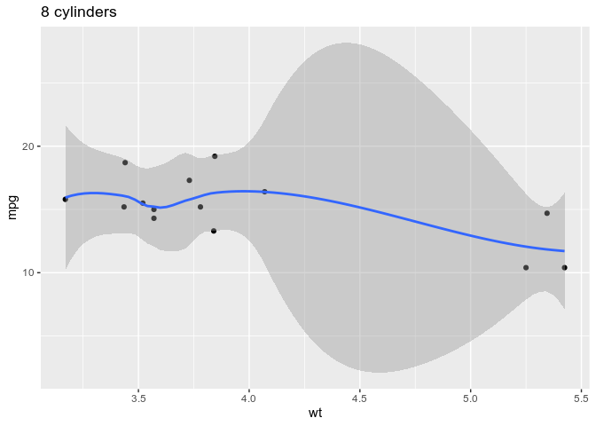
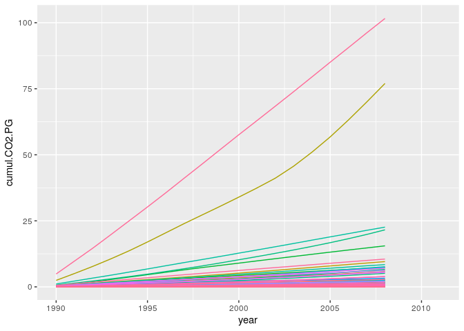
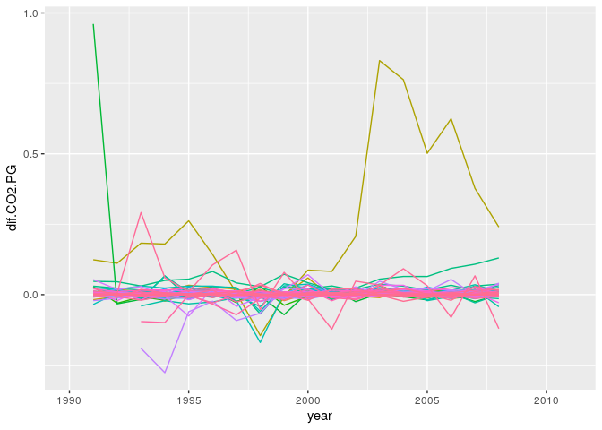

R and the Tidyverse: next steps
================
Stéphane Guillou
2021-12-17

## Setting up

> If needed, review the [installation
> instructions](R/Installation.md#r--rstudio-installation-instructions).

-   If you are using your own laptop please open RStudio
    -   Make sure you have a working Internet connection
-   On the Library’s training computers:
    -   Log in with your UQ username and password
    -   Make sure you have a working Internet connection
    -   Open the ZENworks application
    -   Look for “RStudio”
    -   Double click on RStudio, which will install both R and RStudio

With RStudio open, let’s make sure we have the necessary packages
installed by running this command (this might take a few minutes):

``` r
install.packages("tidyverse")
```

This will install all the Tidyverse packages (and their dependencies).

## What are we going to learn?

tidyr and purrr, just like dplyr and ggplot2, are core to the Tidyverse.

-   tidyr can be used to tidy your data
-   purrr is useful to apply functions iteratively on lists or vectors

## Create a project and a script

Use the project menu (top right) to create a “New project…”. Let’s name
this one “tidyverse”.

We also want to work more comfortably by typing our code in a script.
You can use the new file dropdown menu, or
<kbd>Ctrl</kbd>+<kbd>Shift</kbd>+<kbd>N</kbd>, and save your script as
“process.R” in the current working directory.

## Load the necessary packages

We can use one single command to load the 8 core Tidyverse packages:

``` r
library(tidyverse)
```

    ## ── Attaching packages ─────────────────────────────────────── tidyverse 1.3.1 ──

    ## ✓ ggplot2 3.3.5     ✓ purrr   0.3.4
    ## ✓ tibble  3.1.6     ✓ dplyr   1.0.7
    ## ✓ tidyr   1.1.4     ✓ stringr 1.4.0
    ## ✓ readr   2.1.1     ✓ forcats 0.5.1

    ## ── Conflicts ────────────────────────────────────────── tidyverse_conflicts() ──
    ## x dplyr::filter() masks stats::filter()
    ## x dplyr::lag()    masks stats::lag()

## Tidy data

Tidy data makes it easy to transform and analyse data in R (and many
other tools). Tidy data has observations in rows, and variables in
columns. The whole Tidyverse is designed to work with tidy data.

Often, a dataset is organised in a way that makes it easy for humans to
read and populate. This is usually called “wide format”. Tidy data is
*usually* in “long” format.

The ultimate rules of tidy data are:

-   Each row is an observation
-   Each column is a variable
-   Each cell contains one single value

> To learn more about Tidy Data, you can read [Hadley Wickham’s 2014
> article on the
> topic](https://www.jstatsoft.org/index.php/jss/article/view/v059i10/v59i10.pdf).

### Import data

We are using a [dataset from the World
Bank](https://datacatalog.worldbank.org/dataset/climate-change-data),
which contains data about energy consumption and greenhouse gas
emissions.

Let’s download the file:

``` r
# download data, save locally
download.file(url = "https://raw.githubusercontent.com/uqlibrary/technology-training/master/R/tidyverse_next_steps/data_wb_climate.csv",
              destfile = "data_wb_climate.csv")
```

… and read the data into an object:

``` r
# read CSV into an object
climate_raw <- read_csv("data_wb_climate.csv",
                    na = "..")
```

    ## Rows: 1165 Columns: 28

    ## ── Column specification ────────────────────────────────────────────────────────
    ## Delimiter: ","
    ## chr  (4): Country code, Country name, Series code, Series name
    ## dbl (23): SCALE, Decimals, 1990, 1991, 1992, 1993, 1994, 1995, 1996, 1997, 1...
    ## lgl  (1): 2011

    ## 
    ## ℹ Use `spec()` to retrieve the full column specification for this data.
    ## ℹ Specify the column types or set `show_col_types = FALSE` to quiet this message.

We defined with the `na` argument that, in this dataset, missing data is
recorded as “..”.

You can use `View()` to explore your dataset. We can see that it doesn’t
respect the tidy data principles in a couple of ways, the most obvious
one being that different years are spread out between different columns.

### Reshaping data

#### Lengthening

To go from wide format to long format, we can use the tidyr function
`pivot_longer()`. Here, we want to gather all the columns titled with a
year: we store the data in a “value” variable, and the years in a “year”
variable.

``` r
climate_long <- pivot_longer(climate_raw,
                             `1990`:`2011`,
                             names_to = "year",
                             values_to = "value") %>% 
  mutate(year = as.integer(year))
```

We add a `mutate()` step to convert the type fo the year column from
character to integer.

This is better, but there is still an issue: our `value` variable
contains many different indicators (i.e. entirely different units).

#### Widening

To do the opposite, going from long to wide format, we can use the
`pivot_wider()` function.

We have single observations spread across several rows, so we should
spread the “value” column.

First, let’s keep a record of the correspondence between long
descriptive variable names and their “code”, for later reference:

``` r
codes <- climate_long %>% 
  select(`Series code`, `Series name`) %>% 
  unique()
codes
```

    ## # A tibble: 5 × 2
    ##   `Series code`        `Series name`                                            
    ##   <chr>                <chr>                                                    
    ## 1 EG.USE.COMM.GD.PP.KD Energy use per units of GDP (kg oil eq./$1,000 of 2005 P…
    ## 2 EG.USE.PCAP.KG.OE    Energy use per capita (kilograms of oil equivalent)      
    ## 3 EN.ATM.CO2E.KT       CO2 emissions, total (KtCO2)                             
    ## 4 EN.ATM.CO2E.PC       CO2 emissions per capita (metric tons)                   
    ## 5 EN.ATM.CO2E.PP.GD.KD CO2 emissions per units of GDP (kg/$1,000 of 2005 PPP $)

This will be our key to variable details, or “code book”, for future
reference.

Now, let’s widen the data (and remove some useless columns with
`dplyr::select()`):

``` r
climate_tidy <- climate_long %>% 
  select(-`Series name`, -SCALE, -Decimals) %>% 
  pivot_wider(names_from = `Series code`,
              values_from = value)
```

### Challenge 1: Code comprehension

There’s one more cleaning step we need to apply.

Have a look at this block of code. What do you think it does?

``` r
groups <- c("Europe & Central Asia",
            "East Asia & Pacific",
            "Euro area",
            "High income",
            "Lower middle income",
            "Low income",
            "Low & middle income",
            "Middle income",
            "Middle East & North Africa",
            "Latin America & Caribbean",
            "South Asia",
            "Small island developing states",
            "Sub-Saharan Africa",
            "Upper middle income",
            "World")
climate_tidy <- climate_tidy %>% 
  filter(!`Country name` %in% groups)
```

Turns out this dataset contains grouped data as well as unique
countries. Here, we created a vector of group names, and removed them
from the data by using dplyr’s `filter()` function (inverting the filter
with `!`).

We can now check that we’ve only got single countries left:

``` r
unique(climate_tidy$`Country name`)
```

### Visualising

Now that we have clean, tidy data, we can process and visualise it more
comfortably! For example, to visualise the increase in KT of
CO<sup>2</sup>-equivalent for each country:

``` r
climate_tidy %>% 
  ggplot(aes(x = year,
             y = EN.ATM.CO2E.KT,
             group = `Country name`)) +
  geom_line()
```

    ## Warning: Removed 1091 row(s) containing missing values (geom_path).

<!-- -->

Let’s have a look at the increase in *global* greenhouse gas emissions
in KT:

``` r
climate_tidy %>% 
  group_by(year) %>% 
  summarise(CO2e = sum(EN.ATM.CO2E.KT, na.rm = TRUE)) %>% 
  ggplot(aes(x = year, y = CO2e)) +
  geom_point()
```

<!-- -->

#### Challenge 2

Looks like our data is missing after 2008, so how can we remove that?

We can add this extra step:

``` r
climate_tidy %>% 
  group_by(year) %>% 
  summarise(CO2e = sum(EN.ATM.CO2E.KT, na.rm = TRUE)) %>%
  filter(year < 2009) %>% 
  ggplot(aes(x = year, y = CO2e)) +
  geom_point()
```

<!-- -->

## Functional programming

Functional programming (as opposed to “imperative programming”) makes
use of functions rather than loops to iterate over objects. The
functions will allow to simplify our code, by abstracting common
building blocks used in different cases of iteration. However, it means
that there will usually be a different function for each different
pattern.

You can iterate over elements by using:

1.  the basic building blocks in R (for loops, while loops…), or
2.  the `apply` function family from base R, or
3.  the purrr functions.

Imagine we want to find out the median value for each variable in the
`mtcars` dataset. Here is an example of a for loop:

``` r
output <- vector("double", ncol(mtcars))
for (i in seq_along(mtcars)) {
  output[[i]] <- median(mtcars[[i]])
}
output
```

    ##  [1]  19.200   6.000 196.300 123.000   3.695   3.325  17.710   0.000   0.000
    ## [10]   4.000   2.000

Better than having the same code repeated 11 times!

We allocate space in the expected **output** first (more efficient). We
then specify the **sequence** for the loop, and put what we want to
iterate in the loop **body**.

The apply family in base R is useful to replace for loops, but the purrr
functions are easier to learn because they are more consistent. This
package offers several tools to iterate functions over elements in a
vector or a list (e.g. a dataframe).

### The map family

At purrr’s core, there is the map family:

-   `map()` outputs a list.
-   `map_lgl()` outputs a logical vector.
-   `map_int()` outputs an integer vector.
-   `map_dbl()` outputs a double vector.
-   `map_chr()` outputs a character vector.

For example, to do a similar operation to our previous for loop:

``` r
map_dbl(mtcars, median)
```

    ##     mpg     cyl    disp      hp    drat      wt    qsec      vs      am    gear 
    ##  19.200   6.000 196.300 123.000   3.695   3.325  17.710   0.000   0.000   4.000 
    ##    carb 
    ##   2.000

A lot leaner, right?

The map functions automatically name the values in the resulting vector,
which makes the result easier to read.

Lets try a different type of output. Here, we want to find out which
columns in the starwars dataset are of type “character”:

``` r
map_lgl(starwars, is_character)
```

    ##       name     height       mass hair_color skin_color  eye_color birth_year 
    ##       TRUE      FALSE      FALSE       TRUE       TRUE       TRUE      FALSE 
    ##        sex     gender  homeworld    species      films   vehicles  starships 
    ##       TRUE       TRUE       TRUE       TRUE      FALSE      FALSE      FALSE

If we don’t want to use the default behaviour of the mapped function, we
can use extra arguments to pass to it. For example, for a trimmed mean:

``` r
map_dbl(mtcars, mean, trim = 0.2)
```

    ##      mpg      cyl     disp       hp     drat       wt     qsec       vs 
    ##  19.2200   6.3000 219.1750 137.9000   3.5755   3.1970  17.8175   0.4000 
    ##       am     gear     carb 
    ##   0.3500   3.5500   2.7000

Just like most functions in the Tidyverse, the first argument is the
data that we want to process (which means we can use the pipe). The
second argument is the name of the function we want to apply, but it can
also be a custom formula. For example:

``` r
map_dbl(mtcars, ~ round(mean(.x)))
```

    ##  mpg  cyl disp   hp drat   wt qsec   vs   am gear carb 
    ##   20    6  231  147    4    3   18    0    0    4    3

``` r
map_lgl(mtcars, ~ max(.x) > 3 * min(.x))
```

    ##   mpg   cyl  disp    hp  drat    wt  qsec    vs    am  gear  carb 
    ##  TRUE FALSE  TRUE  TRUE FALSE  TRUE FALSE  TRUE  TRUE FALSE  TRUE

We have to use the tilde `~` to introduce a custom formula, and `.x` to
place the element being processed.

#### Challenge 3: custom formula

How can we find out the number of unique values in each variable of the
`starwars` data.frame?

``` r
map_int(starwars, ~ length(unique(.x)))
```

    ##       name     height       mass hair_color skin_color  eye_color birth_year 
    ##         87         46         39         13         31         15         37 
    ##        sex     gender  homeworld    species      films   vehicles  starships 
    ##          5          3         49         38         24         11         17

### Splitting

To split a dataset and apply an operation to separate parts, we can use
the `group_split()` function:

``` r
unique(mtcars$cyl)
```

    ## [1] 6 4 8

``` r
mtcars %>% 
  group_split(cyl) %>% # split into three dataframes
  map(summary) # applied to each dataframe
```

    ## [[1]]
    ##       mpg             cyl         disp              hp              drat      
    ##  Min.   :21.40   Min.   :4   Min.   : 71.10   Min.   : 52.00   Min.   :3.690  
    ##  1st Qu.:22.80   1st Qu.:4   1st Qu.: 78.85   1st Qu.: 65.50   1st Qu.:3.810  
    ##  Median :26.00   Median :4   Median :108.00   Median : 91.00   Median :4.080  
    ##  Mean   :26.66   Mean   :4   Mean   :105.14   Mean   : 82.64   Mean   :4.071  
    ##  3rd Qu.:30.40   3rd Qu.:4   3rd Qu.:120.65   3rd Qu.: 96.00   3rd Qu.:4.165  
    ##  Max.   :33.90   Max.   :4   Max.   :146.70   Max.   :113.00   Max.   :4.930  
    ##        wt             qsec             vs               am        
    ##  Min.   :1.513   Min.   :16.70   Min.   :0.0000   Min.   :0.0000  
    ##  1st Qu.:1.885   1st Qu.:18.56   1st Qu.:1.0000   1st Qu.:0.5000  
    ##  Median :2.200   Median :18.90   Median :1.0000   Median :1.0000  
    ##  Mean   :2.286   Mean   :19.14   Mean   :0.9091   Mean   :0.7273  
    ##  3rd Qu.:2.623   3rd Qu.:19.95   3rd Qu.:1.0000   3rd Qu.:1.0000  
    ##  Max.   :3.190   Max.   :22.90   Max.   :1.0000   Max.   :1.0000  
    ##       gear            carb      
    ##  Min.   :3.000   Min.   :1.000  
    ##  1st Qu.:4.000   1st Qu.:1.000  
    ##  Median :4.000   Median :2.000  
    ##  Mean   :4.091   Mean   :1.545  
    ##  3rd Qu.:4.000   3rd Qu.:2.000  
    ##  Max.   :5.000   Max.   :2.000  
    ## 
    ## [[2]]
    ##       mpg             cyl         disp             hp             drat      
    ##  Min.   :17.80   Min.   :6   Min.   :145.0   Min.   :105.0   Min.   :2.760  
    ##  1st Qu.:18.65   1st Qu.:6   1st Qu.:160.0   1st Qu.:110.0   1st Qu.:3.350  
    ##  Median :19.70   Median :6   Median :167.6   Median :110.0   Median :3.900  
    ##  Mean   :19.74   Mean   :6   Mean   :183.3   Mean   :122.3   Mean   :3.586  
    ##  3rd Qu.:21.00   3rd Qu.:6   3rd Qu.:196.3   3rd Qu.:123.0   3rd Qu.:3.910  
    ##  Max.   :21.40   Max.   :6   Max.   :258.0   Max.   :175.0   Max.   :3.920  
    ##        wt             qsec             vs               am        
    ##  Min.   :2.620   Min.   :15.50   Min.   :0.0000   Min.   :0.0000  
    ##  1st Qu.:2.822   1st Qu.:16.74   1st Qu.:0.0000   1st Qu.:0.0000  
    ##  Median :3.215   Median :18.30   Median :1.0000   Median :0.0000  
    ##  Mean   :3.117   Mean   :17.98   Mean   :0.5714   Mean   :0.4286  
    ##  3rd Qu.:3.440   3rd Qu.:19.17   3rd Qu.:1.0000   3rd Qu.:1.0000  
    ##  Max.   :3.460   Max.   :20.22   Max.   :1.0000   Max.   :1.0000  
    ##       gear            carb      
    ##  Min.   :3.000   Min.   :1.000  
    ##  1st Qu.:3.500   1st Qu.:2.500  
    ##  Median :4.000   Median :4.000  
    ##  Mean   :3.857   Mean   :3.429  
    ##  3rd Qu.:4.000   3rd Qu.:4.000  
    ##  Max.   :5.000   Max.   :6.000  
    ## 
    ## [[3]]
    ##       mpg             cyl         disp             hp             drat      
    ##  Min.   :10.40   Min.   :8   Min.   :275.8   Min.   :150.0   Min.   :2.760  
    ##  1st Qu.:14.40   1st Qu.:8   1st Qu.:301.8   1st Qu.:176.2   1st Qu.:3.070  
    ##  Median :15.20   Median :8   Median :350.5   Median :192.5   Median :3.115  
    ##  Mean   :15.10   Mean   :8   Mean   :353.1   Mean   :209.2   Mean   :3.229  
    ##  3rd Qu.:16.25   3rd Qu.:8   3rd Qu.:390.0   3rd Qu.:241.2   3rd Qu.:3.225  
    ##  Max.   :19.20   Max.   :8   Max.   :472.0   Max.   :335.0   Max.   :4.220  
    ##        wt             qsec             vs          am              gear      
    ##  Min.   :3.170   Min.   :14.50   Min.   :0   Min.   :0.0000   Min.   :3.000  
    ##  1st Qu.:3.533   1st Qu.:16.10   1st Qu.:0   1st Qu.:0.0000   1st Qu.:3.000  
    ##  Median :3.755   Median :17.18   Median :0   Median :0.0000   Median :3.000  
    ##  Mean   :3.999   Mean   :16.77   Mean   :0   Mean   :0.1429   Mean   :3.286  
    ##  3rd Qu.:4.014   3rd Qu.:17.55   3rd Qu.:0   3rd Qu.:0.0000   3rd Qu.:3.000  
    ##  Max.   :5.424   Max.   :18.00   Max.   :0   Max.   :1.0000   Max.   :5.000  
    ##       carb     
    ##  Min.   :2.00  
    ##  1st Qu.:2.25  
    ##  Median :3.50  
    ##  Mean   :3.50  
    ##  3rd Qu.:4.00  
    ##  Max.   :8.00

Using purrr functions with ggplot2 functions allows us to generate
several plots in one command:

``` r
mtcars %>% 
  group_split(cyl) %>% 
  map(~ ggplot(.x, aes(wt, mpg)) +
        geom_point() +
        geom_smooth() +
        labs(title = paste(.x$cyl, "cylinders"))) # give a title
```

    ## [[1]]

    ## `geom_smooth()` using method = 'loess' and formula 'y ~ x'

<!-- -->

    ## 
    ## [[2]]

    ## `geom_smooth()` using method = 'loess' and formula 'y ~ x'

<!-- -->

    ## 
    ## [[3]]

    ## `geom_smooth()` using method = 'loess' and formula 'y ~ x'

<!-- -->

### Predicate functions

Purrr also contains functions that check for a condition, so we can set
up conditions before iterating.

``` r
str(iris)
```

    ## 'data.frame':    150 obs. of  5 variables:
    ##  $ Sepal.Length: num  5.1 4.9 4.7 4.6 5 5.4 4.6 5 4.4 4.9 ...
    ##  $ Sepal.Width : num  3.5 3 3.2 3.1 3.6 3.9 3.4 3.4 2.9 3.1 ...
    ##  $ Petal.Length: num  1.4 1.4 1.3 1.5 1.4 1.7 1.4 1.5 1.4 1.5 ...
    ##  $ Petal.Width : num  0.2 0.2 0.2 0.2 0.2 0.4 0.3 0.2 0.2 0.1 ...
    ##  $ Species     : Factor w/ 3 levels "setosa","versicolor",..: 1 1 1 1 1 1 1 1 1 1 ...

``` r
iris %>%
  map_dbl(mean) # warning, NA for Species
```

    ## Warning in mean.default(.x[[i]], ...): argument is not numeric or logical:
    ## returning NA

    ## Sepal.Length  Sepal.Width Petal.Length  Petal.Width      Species 
    ##     5.843333     3.057333     3.758000     1.199333           NA

``` r
iris %>%
  discard(is.factor) %>% 
  map_dbl(mean) # clean!
```

    ## Sepal.Length  Sepal.Width Petal.Length  Petal.Width 
    ##     5.843333     3.057333     3.758000     1.199333

``` r
starwars %>% 
  keep(is.character) %>% 
  map_int(~length(unique(.x)))
```

    ##       name hair_color skin_color  eye_color        sex     gender  homeworld 
    ##         87         13         31         15          5          3         49 
    ##    species 
    ##         38

`is.factor()` and `is.character()` are examples of “predicate
functions”.

To return everything, but apply a function only if a condition is met,
we can use `map_if()`:

``` r
str(iris)
```

    ## 'data.frame':    150 obs. of  5 variables:
    ##  $ Sepal.Length: num  5.1 4.9 4.7 4.6 5 5.4 4.6 5 4.4 4.9 ...
    ##  $ Sepal.Width : num  3.5 3 3.2 3.1 3.6 3.9 3.4 3.4 2.9 3.1 ...
    ##  $ Petal.Length: num  1.4 1.4 1.3 1.5 1.4 1.7 1.4 1.5 1.4 1.5 ...
    ##  $ Petal.Width : num  0.2 0.2 0.2 0.2 0.2 0.4 0.3 0.2 0.2 0.1 ...
    ##  $ Species     : Factor w/ 3 levels "setosa","versicolor",..: 1 1 1 1 1 1 1 1 1 1 ...

``` r
iris %>%
  map_if(is.numeric, round) %>% 
  str()
```

    ## List of 5
    ##  $ Sepal.Length: num [1:150] 5 5 5 5 5 5 5 5 4 5 ...
    ##  $ Sepal.Width : num [1:150] 4 3 3 3 4 4 3 3 3 3 ...
    ##  $ Petal.Length: num [1:150] 1 1 1 2 1 2 1 2 1 2 ...
    ##  $ Petal.Width : num [1:150] 0 0 0 0 0 0 0 0 0 0 ...
    ##  $ Species     : Factor w/ 3 levels "setosa","versicolor",..: 1 1 1 1 1 1 1 1 1 1 ...

This results in a list in which the elements are rounded only if they
store numeric data.

Now, let’s see a more involved example with our climate dataset. In this
one, we use functions from dplyr, purrr, stringr, tibble and ggplot2.

``` r
# cumulative and yearly change in CO2 emissions dataset
climate_cumul <- climate_tidy %>% 
  arrange(`Country name`, year) %>% 
  group_by(`Country name`) %>%
  mutate(cumul.CO2.KT = cumsum(EN.ATM.CO2E.KT),
         dif.CO2.KT = EN.ATM.CO2E.KT - lag(EN.ATM.CO2E.KT)) %>%
  map_at(vars(ends_with("KT")), ~ .x / 10^6) %>% 
  as_tibble() %>%  # from list to tibble
  rename_with(~ str_replace(.x, "KT", "PG"))

# visualise cumulative change
p <- climate_cumul %>%
  ggplot() +
  aes(x = year,
      y = cumul.CO2.PG,
      colour = `Country name`) +
  geom_line() +
  theme(legend.position = "none")
p
```

    ## Warning: Removed 1541 row(s) containing missing values (geom_path).

<!-- -->

If you want to create an interactive visualisation, you can use plotly:

``` r
library(plotly)
ggplotly(p)
```

Plot the annual change in PG CO2 by country:

``` r
pdif <- climate_cumul %>%
  ggplot() +
  aes(x = year,
      y = dif.CO2.PG,
      colour = `Country name`) +
  geom_line() +
  theme(legend.position = "none")
pdif
```

    ## Warning: Removed 1292 row(s) containing missing values (geom_path).

<!-- -->

``` r
# interactive plot
ggplotly(pdif)
```

## What next

-   [Chapter on iteration](https://r4ds.had.co.nz/iteration.html) in the
    book *R for Data Science*
-   Cheatsheets:
    -   [tidyr](https://raw.githubusercontent.com/rstudio/cheatsheets/master/tidyr.pdf)
    -   [purrr](https://raw.githubusercontent.com/rstudio/cheatsheets/master/purrr.pdf)
-   Explore our [recommended resources, online and around
    UQ](R/usefullinks.md#what-next)
-   [Tidy Data
    paper](https://www.jstatsoft.org/index.php/jss/article/view/v059i10/v59i10.pdf)
