RStats: Working with and analysing time series data
================
2022-02-17

## Essential shortcuts

-   function or dataset help: press <kbd>F1</kbd> with your cursor
    anywhere in a function name.
-   execute from script: <kbd>Ctrl</kbd> + <kbd>Enter</kbd>
-   assignment operator (`<-`): <kbd>Alt</kbd> + <kbd>-</kbd>

## Open RStudio

On library computers:

-   Log in with your UQ username and password (use your student
    credentials if you are both staff and student)
-   Make sure you have a working internet connection
-   Go to search the magnifying glass (bottom left)
-   Open the ZENworks application
-   Look for the letter R
-   Double click on RStudio which will install both R and RStudio

If you are using your own laptop:

-   Make sure you have a working internet connection
-   Open RStudio

## Disclaimer

We will assume basic knowledge of R and RStudio for this course
including installing and loading packages, reading in data, creating
objects in R, tranforming data frames and tibbles with `dplyr` package.

## What are we going to learn?

This hands-on session is broken into two parts

In Part 1 you will:

-   read in data from multiple excel sheets
-   clean the data and extract information
-   use different date/time data formats
-   visualize time series data, “rolling” operations

And Part 2 will focus on:

-   investigating aspects of a times series such as trends, seasonality,
    and stationarity
-   assessing autocorrelation
-   applying different models

## Material

### Setting up

**Install tidyverse, readxl, lubridate, plotly, RcppRoll, zoo, forecast,
tseries, and xts** if you don’t already have them, with:

-   `install.packages("tidyvserse")` - the data science ‘metapackage’
-   `install.packages("readxl")` - reading in data from excel
-   `install.packages("lubridate")` - to work with date and time data
-   `install.packages("plotly")` - interactive plots
-   `install.packages("RcppRoll")` - rolling average package
-   `install.packages("zoo")` - “Zeileis ordered observations”
    irregularly spaced time series using the zoo
-   `install.packages("forecast")` - seasonality components
-   `install.packages("tseries")` - test for stationarity
-   `install.packages("xts")` - moving averages

**Create a new project** to keep everything nicely contained in one
directory:

-   Click the “Create a project” button (top left cube icon)
-   Click “New Directory”
-   Click “New Project” (“Empty project” if you have an older version of
    RStudio)
-   In “Directory name”, type the name of your project,
    e.g. “ggplot2_intermediate”
-   Select the folder where to locate your project:
    e.g. `Documents/RProjects`, which you can create if it doesn’t exist
    yet. You can use your H drive at UQ to make sure you can find it
    again.
-   Click the “Create Project” button

Let’s also create a “data” and “images” folder to store exports:

``` r
dir.create("data")
dir.create("images")
```

## About the data

Our dataset describes atmospheric samples of a compound which were
collected each day during seven consecutive days for different month in
the year. Some years and months had less samples due to technical
issues.

## Part 1: working with time series data

### Download the data

Let’s download our dataset form the web:

``` r
download.file("https://github.com/uqlibrary/technology-training/blob/master/R/timeseries/data/analytes_data.xlsx"
              destfile = "data/analytes_data.xlsx",
              mode = 'wb')
```

> The `mode = 'wb'` is binary and necessary for `download.file()` to
> work on Windows OS.

### Read in the data

We have an XLSX workbook that contains several sheets. The first one is
only documenting what the data is about, whereas the two other ones
contain the data we are interested in.

The package [readxl](https://readxl.tidyverse.org/) is useful for
importing data stored in XLS and XLSX files. For example, to have a look
at a single sheet of data, we can do the following:

``` r
# load the package
library(readxl)
# only import the second sheet
analytes <- read_excel("data/analytes_data.xlsx",
                       sheet = 2)
```

We could also point to the correct sheet by using the sheet name instead
of its index. For that, the `excel_sheets()` function is useful to find
the names:

``` r
# excel_sheets() shows the sheet names
excel_sheets("data/analytes_data.xlsx")
```

    ## [1] "infromation data " "Site_759"          "Site_1335"

``` r
analytes <- read_excel("data/analytes_data.xlsx", sheet = "Site_759")
```

Let’s have a look at the first few rows of data:

``` r
head(analytes)
```

    ## # A tibble: 6 x 4
    ##   `Site code` Analyte    `Real date`         `mg/day`
    ##         <dbl> <chr>      <dttm>                 <dbl>
    ## 1         759 Compound x 1991-11-29 00:00:00    0.334
    ## 2         759 Compound x 1991-11-30 00:00:00    0.231
    ## 3         759 Compound x 1991-12-01 00:00:00    0.216
    ## 4         759 Compound x 1991-12-02 00:00:00    0.219
    ## 5         759 Compound x 1991-12-03 00:00:00    0.203
    ## 6         759 Compound x 1991-12-04 00:00:00    0.206

### Bind several workbook sheets

Even though this workbook only has two sheets of data, we might want to
automate the reading and binding of all data sheets to avoid repeating
code. This comes in very handy if you have a workbook with a dozen
sheets of data, or if your data is split between several files.

The Tidyverse’s [purrr](https://purrr.tidyverse.org/) package allows
“mapping” a function (or a more complex command) to several elements.
Here, we will *map* the reading of the sheet to each *element* in a
vector of sheet names.

Using the `map_dfr()` function makes sure we have a single data frame as
an output.

``` r
library(tidyverse)
```

    ## -- Attaching packages --------------------------------------- tidyverse 1.3.1 --

    ## v ggplot2 3.3.5     v purrr   0.3.4
    ## v tibble  3.1.6     v dplyr   1.0.7
    ## v tidyr   1.1.4     v stringr 1.4.0
    ## v readr   2.0.1     v forcats 0.5.1

    ## -- Conflicts ------------------------------------------ tidyverse_conflicts() --
    ## x dplyr::filter() masks stats::filter()
    ## x dplyr::lag()    masks stats::lag()

``` r
# only keep sheet names that contain actual data
sheets <- excel_sheets("data/analytes_data.xlsx")[2:3]
# map the reading to each sheet
analytes <- map_dfr(sheets,
                    ~ read_excel("data/analytes_data.xlsx", sheet = .x))
```

We could map a function by simply providing the name of the function.
However, because we are doing something slightly more elaborate here
(pointing to one single file, and using an extra argument to point to
the sheet itself), we need to use the `~` syntax, and point to the
element being processed with the `.x` placeholder.

> For more information on the different options the `map` family offers,
> see `?map`.

## Data cleaning

There are a few issues with the dataset. First of all, there are
variations in how the compound is named. We can replace the value in the
first column with a simpler, consistent one:

``` r
# all same compound
analytes$Analyte <- "x"
```

Our column names are not the most reusable names for R. Better names do
not contain spaces or special characters like `/`. dplyr’s `rename()`
function is very handy for that:

``` r
library(dplyr)
analytes <- rename(analytes, Site = 1, Date = 3, mg_per_day = 4)
```

Finally, the Site column is stored as numeric data. If we plot it as it
is, R will consider it to be a continuous variable, when it really
should be discrete. Let’s fix that with dplyr’s `mutate()` function:

``` r
analytes <- mutate(analytes, Site = as.character(Site))
```

> We could convert it to a factor instead, but the Tidyverse packages
> tend to be happy with categorical data stored as the character type.

### Export a clean dataset

We now have a clean dataset in a single table, which we could make a
copy of, especially to share with others, or if we want to split our
code into several scripts that can work independently.

``` r
write.csv(analytes, "data/analytes_data_clean.csv",
          row.names = FALSE)
```

> `write.csv()` will by default include a column of row names in the
> exported file, which are the row numbers if no row names have been
> assigned. That’s not usually something we want, so we can turn it off
> with `row.names = FALSE`

## Visualisation with ggplot2

At this stage, we can start exploring visually. For a lot of R users,
the go-to package for data visualisation is
[ggplot2](https://ggplot2.tidyverse.org/), which is also part of the
Tidyverse.

For a ggplot2 visualisations, remember that we usually need these three
essential elements:

-   the dataset
-   the mapping of aesthetic elements to variables in the dataset
-   the geometry used to represent the data

Let’s try a first timeline visualisation with a line plot:

``` r
library(ggplot2)
ggplot(analytes,             # data
       aes(x = Date,         # mapping of aesthetics
           y = mg_per_day,
           colour = Site)) + # (separate by site)
  geom_line()                # geometry
```

<!-- -->

A simple line plot is not great here, because of the periodicity: there
were bursts of sampling, several days in a row, and then nothing for a
while. Which results in a fine, daily resolution for small periods of
time, and a straight line joining these periods of time.

We might want to “smoothen” that line, hoping to get a better idea of
the trend, keeping the original data as points in the background:

``` r
ggplot(analytes, aes(x = Date, y = mg_per_day, colour = Site)) +
  geom_point() +
  geom_smooth()
```

    ## `geom_smooth()` using method = 'loess' and formula 'y ~ x'

<!-- -->

The trend lines only give a very general trend. What if we make it
follow the points more closely?

``` r
ggplot(analytes, aes(x = Date, y = mg_per_day, colour = Site)) +
  geom_point(size = 0.3) + # smaller points
  geom_smooth(span = 0.05) # follow the data more closely
```

    ## `geom_smooth()` using method = 'loess' and formula 'y ~ x'

<!-- -->

With the method used, we end up with an increased uncertainty (the
shaded area around the curves). It also creates artificial “dips” to fit
the data, for example close to the beginning of 2000 for the site 1335
(it even reaches negative values).

## Summarise the data

In this case, because we have sampling points for what looks like groups
of successive days, we can try to summarise them.

Operations on time-date data can be done more comfortably with extra
packages. The Tidyverse comes with the
[lubridate](https://lubridate.tidyverse.org/) package, which has been
around for a while and is very powerful. Another, more recent package
called “[clock](https://clock.r-lib.org/)” can do most of what lubridate
can, and more, but it is still being heavily developed, so we stick to
lubridate here.

Let’s start by extracting all the date components that could be useful:

``` r
library(lubridate)
```

    ## 
    ## Attaching package: 'lubridate'

    ## The following objects are masked from 'package:base':
    ## 
    ##     date, intersect, setdiff, union

``` r
analytes <- analytes %>% 
   mutate(year = year(Date),
          month = month(Date),
          day = day(Date),
          week = week(Date),
          weekday = weekdays(Date))
```

How many sampling days per month are there?

``` r
analytes %>% 
   group_by(Site, year, month) %>% 
   count() %>% 
   head(12)
```

    ## # A tibble: 12 x 4
    ## # Groups:   Site, year, month [12]
    ##    Site   year month     n
    ##    <chr> <dbl> <dbl> <int>
    ##  1 1335   1991    11     3
    ##  2 1335   1991    12     3
    ##  3 1335   1992     1     2
    ##  4 1335   1992     2     5
    ##  5 1335   1992     3     5
    ##  6 1335   1992     4     2
    ##  7 1335   1992     5     4
    ##  8 1335   1992     6     3
    ##  9 1335   1992     7     2
    ## 10 1335   1992     8     4
    ## 11 1335   1992    10     7
    ## 12 1335   1992    12     6

The number of samples per month is irregular, and some months have no
data.

Furthermore, the week numbers don’t align with the sampling weeks, and
some sampling weeks overlap over two months:

``` r
analytes %>%  select(year, month, day, week) %>% head(10)
```

    ## # A tibble: 10 x 4
    ##     year month   day  week
    ##    <dbl> <dbl> <int> <dbl>
    ##  1  1991    11    29    48
    ##  2  1991    11    30    48
    ##  3  1991    12     1    48
    ##  4  1991    12     2    48
    ##  5  1991    12     3    49
    ##  6  1991    12     4    49
    ##  7  1991    12     5    49
    ##  8  1992     1    31     5
    ##  9  1992     2     1     5
    ## 10  1992     2     2     5

In any case, the fact that week numbers are reset at the beginning of
the year wouldn’t help.

One way to group the sampling days together is to detect which ones are
spaced by one day, and which ones by a lot more. The `lag()` and
`lead()` functions from dplyr are very useful to compare values in a
single column:

``` r
analytes <- analytes %>%
   arrange(Site, Date) %>% # make sure it is in chronological order
   group_by(Site) %>% # deal with sites separately
   mutate(days_lapsed = as.integer(Date - lag(Date))) %>%  # compare date to previous date
   ungroup() # leftover grouping might have unintended consequences later on
```

> Grouping by site is important, otherwise we get an erroneous value at
> the row after switching to the second site. Because we grouped, it
> does not compare to the previous value in the different site, but
> instead only returns an `NA`.

How consistent are the sampling periods? Let’s investigate:

``` r
analytes %>% 
   count(days_lapsed) %>% 
   head()
```

    ## # A tibble: 6 x 2
    ##   days_lapsed     n
    ##         <int> <int>
    ## 1           1   608
    ## 2           2     4
    ## 3           3     3
    ## 4          39     1
    ## 5          42     1
    ## 6          43     5

It looks like some sampling days might have been missed, so we can
define a sampling period as “a period in which sampling times are not
spaced by more than 3 days”.

To create a grouping index, we can first assign a value of `TRUE` to the
first row of each time period, and then use the cumulative sum function
on that column (as it converts `TRUE`s to 1s and `FALSE`s to 0s):

``` r
analytes <- analytes %>% 
   group_by(Site) %>%
   mutate(sampling_period = row_number() == 1 | days_lapsed > 3,
          sampling_period = cumsum(sampling_period)) %>%
   ungroup()
```

We can now use these new group indices to summarise by time period:

``` r
analytes_summary <- analytes %>% 
   group_by(Analyte, Site, sampling_period) %>% # we are keeping Analyte
   summarise(Date = round_date(mean(Date), unit = "day"),
             mg_per_day = mean(mg_per_day)) %>% 
   ungroup()
```

    ## `summarise()` has grouped output by 'Analyte', 'Site'. You can override using the `.groups` argument.

> We chose to average and round the date for each sampling period, but
> we could opt for another option depending on what we want to do, for
> example keeping the actual time interval:
> `interval(start = min(Date), end = max(Date))`

Let’s try again our line plot with the summarised data:

``` r
ggplot(analytes_summary,
       aes(x = Date,
           y = mg_per_day,
           colour = Site)) +
  geom_line()  
```

<!-- -->

This is a lot cleaner than what we had originally!

## Export summarised data

We have previously exported a CSV, which is a great, simple format that
can be opened pretty much anywhere. However, if you want to save an R
object to reopen it exactly as it was, you can use an R-specific format
like RData.

``` r
save(analytes_summary, file = "data/summary.RData")
```

The file can then be imported again with the `load()` function. You
won’t need to convert the columns to the correct data type again.

## Interactive visualisation

Exploring timelines might be more comfortable with an interactive
visualisation. [Plotly](https://plotly.com/r/) is a helpful library
available for various programming languages, and the plotly package
makes it easy to use it in R.

Once a visualisation is created in R, it is trivial to convert it to a
Plotly visualisation with one single function: `ggplotly()`.

``` r
# save as an object
p <- ggplot(analytes_summary,
       aes(x = Date,
           y = mg_per_day,
           colour = Site)) +
  geom_line()
# turn it into a plotly visualisation
library(plotly)
```

    ## 
    ## Attaching package: 'plotly'

    ## The following object is masked from 'package:ggplot2':
    ## 
    ##     last_plot

    ## The following object is masked from 'package:stats':
    ## 
    ##     filter

    ## The following object is masked from 'package:graphics':
    ## 
    ##     layout

``` r
ggplotly(p)
```

    ## PhantomJS not found. You can install it with webshot::install_phantomjs(). If it is installed, please make sure the phantomjs executable can be found via the PATH variable.

<div id="htmlwidget-ade08d90c200216de89a" style="width:672px;height:480px;" class="plotly html-widget"></div>
<script type="application/json" data-for="htmlwidget-ade08d90c200216de89a">{"x":{"data":[{"x":[691545600,696988800,701913600,707270400,712713600,718243200,723600000,729043200,734659200,739324800,744768000,749606400,755049600,760492800,765331200,770774400,776044800,781401600,786585600,791942400,797990400,802137600,807667200,813715200,817948800,823392000,828748800,834278400,839116800,845078400,849312000,855360000,860198400,865641600,870739200,876182400,881020800,887068800,891907200,896745600,902966400,912470400,917913600,923356800,928281600,934070400,949363200,954806400,959644800,966038400,969926400],"y":[0.212600968404053,0.264098233266516,0.19269961796989,0.215749485604517,0.269053702856392,0.188344509093252,0.0949463064249318,0.163510674899607,0.208070044896479,0.24936087095228,0.269213572913539,0.264486560569199,0.370149548926033,0.331779295272988,0.328276542520932,0.324670684704295,0.268652378778703,0.313608945535038,0.267736905121743,0.344811409092583,0.342356790274702,0.451976991428665,0.446694323908587,0.3720674476949,0.468439501884643,0.334363194275963,0.382415555384546,0.385704980315966,0.466012762586555,0.654577489229594,0.665716883611786,0.571680514672521,0.407246865737372,0.411953790844082,0.508630238281375,0.609210899199135,0.671177589549717,0.84627446475425,0.261167153171242,0.25104041758912,0.324209206396599,0.457869334439024,0.357103665788697,0.32072347010418,0.273745886060628,0.358377992714145,0.466406915721393,0.482077358364403,0.260096459565358,0.244787297581133,0.189378182414287],"text":["Date: 1991-12-01<br />mg_per_day: 0.21260097<br />Site: 1335","Date: 1992-02-02<br />mg_per_day: 0.26409823<br />Site: 1335","Date: 1992-03-30<br />mg_per_day: 0.19269962<br />Site: 1335","Date: 1992-05-31<br />mg_per_day: 0.21574949<br />Site: 1335","Date: 1992-08-02<br />mg_per_day: 0.26905370<br />Site: 1335","Date: 1992-10-05<br />mg_per_day: 0.18834451<br />Site: 1335","Date: 1992-12-06<br />mg_per_day: 0.09494631<br />Site: 1335","Date: 1993-02-07<br />mg_per_day: 0.16351067<br />Site: 1335","Date: 1993-04-13<br />mg_per_day: 0.20807004<br />Site: 1335","Date: 1993-06-06<br />mg_per_day: 0.24936087<br />Site: 1335","Date: 1993-08-08<br />mg_per_day: 0.26921357<br />Site: 1335","Date: 1993-10-03<br />mg_per_day: 0.26448656<br />Site: 1335","Date: 1993-12-05<br />mg_per_day: 0.37014955<br />Site: 1335","Date: 1994-02-06<br />mg_per_day: 0.33177930<br />Site: 1335","Date: 1994-04-03<br />mg_per_day: 0.32827654<br />Site: 1335","Date: 1994-06-05<br />mg_per_day: 0.32467068<br />Site: 1335","Date: 1994-08-05<br />mg_per_day: 0.26865238<br />Site: 1335","Date: 1994-10-06<br />mg_per_day: 0.31360895<br />Site: 1335","Date: 1994-12-05<br />mg_per_day: 0.26773691<br />Site: 1335","Date: 1995-02-05<br />mg_per_day: 0.34481141<br />Site: 1335","Date: 1995-04-16<br />mg_per_day: 0.34235679<br />Site: 1335","Date: 1995-06-03<br />mg_per_day: 0.45197699<br />Site: 1335","Date: 1995-08-06<br />mg_per_day: 0.44669432<br />Site: 1335","Date: 1995-10-15<br />mg_per_day: 0.37206745<br />Site: 1335","Date: 1995-12-03<br />mg_per_day: 0.46843950<br />Site: 1335","Date: 1996-02-04<br />mg_per_day: 0.33436319<br />Site: 1335","Date: 1996-04-06<br />mg_per_day: 0.38241556<br />Site: 1335","Date: 1996-06-09<br />mg_per_day: 0.38570498<br />Site: 1335","Date: 1996-08-04<br />mg_per_day: 0.46601276<br />Site: 1335","Date: 1996-10-12<br />mg_per_day: 0.65457749<br />Site: 1335","Date: 1996-11-30<br />mg_per_day: 0.66571688<br />Site: 1335","Date: 1997-02-08<br />mg_per_day: 0.57168051<br />Site: 1335","Date: 1997-04-05<br />mg_per_day: 0.40724687<br />Site: 1335","Date: 1997-06-07<br />mg_per_day: 0.41195379<br />Site: 1335","Date: 1997-08-05<br />mg_per_day: 0.50863024<br />Site: 1335","Date: 1997-10-07<br />mg_per_day: 0.60921090<br />Site: 1335","Date: 1997-12-02<br />mg_per_day: 0.67117759<br />Site: 1335","Date: 1998-02-10<br />mg_per_day: 0.84627446<br />Site: 1335","Date: 1998-04-07<br />mg_per_day: 0.26116715<br />Site: 1335","Date: 1998-06-02<br />mg_per_day: 0.25104042<br />Site: 1335","Date: 1998-08-13<br />mg_per_day: 0.32420921<br />Site: 1335","Date: 1998-12-01<br />mg_per_day: 0.45786933<br />Site: 1335","Date: 1999-02-02<br />mg_per_day: 0.35710367<br />Site: 1335","Date: 1999-04-06<br />mg_per_day: 0.32072347<br />Site: 1335","Date: 1999-06-02<br />mg_per_day: 0.27374589<br />Site: 1335","Date: 1999-08-08<br />mg_per_day: 0.35837799<br />Site: 1335","Date: 2000-02-01<br />mg_per_day: 0.46640692<br />Site: 1335","Date: 2000-04-04<br />mg_per_day: 0.48207736<br />Site: 1335","Date: 2000-05-30<br />mg_per_day: 0.26009646<br />Site: 1335","Date: 2000-08-12<br />mg_per_day: 0.24478730<br />Site: 1335","Date: 2000-09-26<br />mg_per_day: 0.18937818<br />Site: 1335"],"type":"scatter","mode":"lines","line":{"width":1.88976377952756,"color":"rgba(248,118,109,1)","dash":"solid"},"hoveron":"points","name":"1335","legendgroup":"1335","showlegend":true,"xaxis":"x","yaxis":"y","hoverinfo":"text","frame":null},{"x":[691632000,697075200,701827200,707270400,712713600,718329600,723600000,729043200,734486400,739324800,744768000,749606400,755049600,760492800,765244800,770774400,776044800,781315200,786585600,791942400,798076800,802224000,807667200,813715200,817948800,823392000,828748800,834278400,839635200,845078400,849312000,855360000,860198400,865641600,870652800,876182400,881020800,887068800,891907200,896745600,903225600,907632000,912470400,917913600,923356800,928281600,933984000,938476800,943920000,949363200,954806400,959644800,965174400,969926400],"y":[0.240643234328402,0.239866565002718,0.211103397811454,0.260162353840332,0.304296247670793,0.269262207504279,0.158852727378311,0.194866033857096,0.236929477428102,0.278617742780945,0.344656900580159,0.338663781964189,0.343149057634364,0.401927292639152,0.378457779333745,0.476518673518538,0.376610754347694,0.392942264401925,0.349698657067696,0.42331136112791,0.471299730954495,0.427908669452204,0.498963306529792,0.468227214282493,0.601436677281373,0.49164044871491,0.545712898647491,0.524188662920043,0.575373252340876,0.76791108278992,0.704379560335598,0.577035107328985,0.507615303671166,0.474351850103901,0.840092255145847,1.14889595102964,0.950474749192172,0.972511630492929,0.475151808458954,0.463213732343174,0.591410974995349,0.648980807337117,0.728667427053717,0.61270664975639,0.525029067129478,0.407787073625081,0.483586950750504,0.540148579053444,0.606263354707929,0.614667983173169,0.603191258313058,0.558189620049785,0.332048404115157,0.259511846965015],"text":["Date: 1991-12-02<br />mg_per_day: 0.24064323<br />Site: 759","Date: 1992-02-03<br />mg_per_day: 0.23986657<br />Site: 759","Date: 1992-03-29<br />mg_per_day: 0.21110340<br />Site: 759","Date: 1992-05-31<br />mg_per_day: 0.26016235<br />Site: 759","Date: 1992-08-02<br />mg_per_day: 0.30429625<br />Site: 759","Date: 1992-10-06<br />mg_per_day: 0.26926221<br />Site: 759","Date: 1992-12-06<br />mg_per_day: 0.15885273<br />Site: 759","Date: 1993-02-07<br />mg_per_day: 0.19486603<br />Site: 759","Date: 1993-04-11<br />mg_per_day: 0.23692948<br />Site: 759","Date: 1993-06-06<br />mg_per_day: 0.27861774<br />Site: 759","Date: 1993-08-08<br />mg_per_day: 0.34465690<br />Site: 759","Date: 1993-10-03<br />mg_per_day: 0.33866378<br />Site: 759","Date: 1993-12-05<br />mg_per_day: 0.34314906<br />Site: 759","Date: 1994-02-06<br />mg_per_day: 0.40192729<br />Site: 759","Date: 1994-04-02<br />mg_per_day: 0.37845778<br />Site: 759","Date: 1994-06-05<br />mg_per_day: 0.47651867<br />Site: 759","Date: 1994-08-05<br />mg_per_day: 0.37661075<br />Site: 759","Date: 1994-10-05<br />mg_per_day: 0.39294226<br />Site: 759","Date: 1994-12-05<br />mg_per_day: 0.34969866<br />Site: 759","Date: 1995-02-05<br />mg_per_day: 0.42331136<br />Site: 759","Date: 1995-04-17<br />mg_per_day: 0.47129973<br />Site: 759","Date: 1995-06-04<br />mg_per_day: 0.42790867<br />Site: 759","Date: 1995-08-06<br />mg_per_day: 0.49896331<br />Site: 759","Date: 1995-10-15<br />mg_per_day: 0.46822721<br />Site: 759","Date: 1995-12-03<br />mg_per_day: 0.60143668<br />Site: 759","Date: 1996-02-04<br />mg_per_day: 0.49164045<br />Site: 759","Date: 1996-04-06<br />mg_per_day: 0.54571290<br />Site: 759","Date: 1996-06-09<br />mg_per_day: 0.52418866<br />Site: 759","Date: 1996-08-10<br />mg_per_day: 0.57537325<br />Site: 759","Date: 1996-10-12<br />mg_per_day: 0.76791108<br />Site: 759","Date: 1996-11-30<br />mg_per_day: 0.70437956<br />Site: 759","Date: 1997-02-08<br />mg_per_day: 0.57703511<br />Site: 759","Date: 1997-04-05<br />mg_per_day: 0.50761530<br />Site: 759","Date: 1997-06-07<br />mg_per_day: 0.47435185<br />Site: 759","Date: 1997-08-04<br />mg_per_day: 0.84009226<br />Site: 759","Date: 1997-10-07<br />mg_per_day: 1.14889595<br />Site: 759","Date: 1997-12-02<br />mg_per_day: 0.95047475<br />Site: 759","Date: 1998-02-10<br />mg_per_day: 0.97251163<br />Site: 759","Date: 1998-04-07<br />mg_per_day: 0.47515181<br />Site: 759","Date: 1998-06-02<br />mg_per_day: 0.46321373<br />Site: 759","Date: 1998-08-16<br />mg_per_day: 0.59141097<br />Site: 759","Date: 1998-10-06<br />mg_per_day: 0.64898081<br />Site: 759","Date: 1998-12-01<br />mg_per_day: 0.72866743<br />Site: 759","Date: 1999-02-02<br />mg_per_day: 0.61270665<br />Site: 759","Date: 1999-04-06<br />mg_per_day: 0.52502907<br />Site: 759","Date: 1999-06-02<br />mg_per_day: 0.40778707<br />Site: 759","Date: 1999-08-07<br />mg_per_day: 0.48358695<br />Site: 759","Date: 1999-09-28<br />mg_per_day: 0.54014858<br />Site: 759","Date: 1999-11-30<br />mg_per_day: 0.60626335<br />Site: 759","Date: 2000-02-01<br />mg_per_day: 0.61466798<br />Site: 759","Date: 2000-04-04<br />mg_per_day: 0.60319126<br />Site: 759","Date: 2000-05-30<br />mg_per_day: 0.55818962<br />Site: 759","Date: 2000-08-02<br />mg_per_day: 0.33204840<br />Site: 759","Date: 2000-09-26<br />mg_per_day: 0.25951185<br />Site: 759"],"type":"scatter","mode":"lines","line":{"width":1.88976377952756,"color":"rgba(0,191,196,1)","dash":"solid"},"hoveron":"points","name":"759","legendgroup":"759","showlegend":true,"xaxis":"x","yaxis":"y","hoverinfo":"text","frame":null}],"layout":{"margin":{"t":26.2283105022831,"r":7.30593607305936,"b":40.1826484018265,"l":43.1050228310502},"plot_bgcolor":"rgba(235,235,235,1)","paper_bgcolor":"rgba(255,255,255,1)","font":{"color":"rgba(0,0,0,1)","family":"","size":14.6118721461187},"xaxis":{"domain":[0,1],"automargin":true,"type":"linear","autorange":false,"range":[677626560,983845440],"tickmode":"array","ticktext":["1992","1994","1996","1998","2000"],"tickvals":[694224000,757382400,820454400,883612800,946684800],"categoryorder":"array","categoryarray":["1992","1994","1996","1998","2000"],"nticks":null,"ticks":"outside","tickcolor":"rgba(51,51,51,1)","ticklen":3.65296803652968,"tickwidth":0.66417600664176,"showticklabels":true,"tickfont":{"color":"rgba(77,77,77,1)","family":"","size":11.689497716895},"tickangle":-0,"showline":false,"linecolor":null,"linewidth":0,"showgrid":true,"gridcolor":"rgba(255,255,255,1)","gridwidth":0.66417600664176,"zeroline":false,"anchor":"y","title":{"text":"Date","font":{"color":"rgba(0,0,0,1)","family":"","size":14.6118721461187}},"hoverformat":".2f"},"yaxis":{"domain":[0,1],"automargin":true,"type":"linear","autorange":false,"range":[0.0422488241946963,1.20159343325988],"tickmode":"array","ticktext":["0.3","0.6","0.9","1.2"],"tickvals":[0.3,0.6,0.9,1.2],"categoryorder":"array","categoryarray":["0.3","0.6","0.9","1.2"],"nticks":null,"ticks":"outside","tickcolor":"rgba(51,51,51,1)","ticklen":3.65296803652968,"tickwidth":0.66417600664176,"showticklabels":true,"tickfont":{"color":"rgba(77,77,77,1)","family":"","size":11.689497716895},"tickangle":-0,"showline":false,"linecolor":null,"linewidth":0,"showgrid":true,"gridcolor":"rgba(255,255,255,1)","gridwidth":0.66417600664176,"zeroline":false,"anchor":"x","title":{"text":"mg_per_day","font":{"color":"rgba(0,0,0,1)","family":"","size":14.6118721461187}},"hoverformat":".2f"},"shapes":[{"type":"rect","fillcolor":null,"line":{"color":null,"width":0,"linetype":[]},"yref":"paper","xref":"paper","x0":0,"x1":1,"y0":0,"y1":1}],"showlegend":true,"legend":{"bgcolor":"rgba(255,255,255,1)","bordercolor":"transparent","borderwidth":1.88976377952756,"font":{"color":"rgba(0,0,0,1)","family":"","size":11.689497716895},"y":0.93503937007874},"annotations":[{"text":"Site","x":1.02,"y":1,"showarrow":false,"ax":0,"ay":0,"font":{"color":"rgba(0,0,0,1)","family":"","size":14.6118721461187},"xref":"paper","yref":"paper","textangle":-0,"xanchor":"left","yanchor":"bottom","legendTitle":true}],"hovermode":"closest","barmode":"relative"},"config":{"doubleClick":"reset","showSendToCloud":false},"source":"A","attrs":{"511030128a9":{"x":{},"y":{},"colour":{},"type":"scatter"}},"cur_data":"511030128a9","visdat":{"511030128a9":["function (y) ","x"]},"highlight":{"on":"plotly_click","persistent":false,"dynamic":false,"selectize":false,"opacityDim":0.2,"selected":{"opacity":1},"debounce":0},"shinyEvents":["plotly_hover","plotly_click","plotly_selected","plotly_relayout","plotly_brushed","plotly_brushing","plotly_clickannotation","plotly_doubleclick","plotly_deselect","plotly_afterplot","plotly_sunburstclick"],"base_url":"https://plot.ly"},"evals":[],"jsHooks":[]}</script>

To focus on a section, draw a rectangle (and double-click to reset to
the full view).

With several time series plotted, it is useful to change the hover
setting to “compare data on hover” with this button:


It is however possible to set a similar hover mode as a default:

``` r
ggplotly(p) %>% 
   layout(hovermode = "x unified")
```

<div id="htmlwidget-37a64f2268572b1623e5" style="width:672px;height:480px;" class="plotly html-widget"></div>
<script type="application/json" data-for="htmlwidget-37a64f2268572b1623e5">{"x":{"data":[{"x":[691545600,696988800,701913600,707270400,712713600,718243200,723600000,729043200,734659200,739324800,744768000,749606400,755049600,760492800,765331200,770774400,776044800,781401600,786585600,791942400,797990400,802137600,807667200,813715200,817948800,823392000,828748800,834278400,839116800,845078400,849312000,855360000,860198400,865641600,870739200,876182400,881020800,887068800,891907200,896745600,902966400,912470400,917913600,923356800,928281600,934070400,949363200,954806400,959644800,966038400,969926400],"y":[0.212600968404053,0.264098233266516,0.19269961796989,0.215749485604517,0.269053702856392,0.188344509093252,0.0949463064249318,0.163510674899607,0.208070044896479,0.24936087095228,0.269213572913539,0.264486560569199,0.370149548926033,0.331779295272988,0.328276542520932,0.324670684704295,0.268652378778703,0.313608945535038,0.267736905121743,0.344811409092583,0.342356790274702,0.451976991428665,0.446694323908587,0.3720674476949,0.468439501884643,0.334363194275963,0.382415555384546,0.385704980315966,0.466012762586555,0.654577489229594,0.665716883611786,0.571680514672521,0.407246865737372,0.411953790844082,0.508630238281375,0.609210899199135,0.671177589549717,0.84627446475425,0.261167153171242,0.25104041758912,0.324209206396599,0.457869334439024,0.357103665788697,0.32072347010418,0.273745886060628,0.358377992714145,0.466406915721393,0.482077358364403,0.260096459565358,0.244787297581133,0.189378182414287],"text":["Date: 1991-12-01<br />mg_per_day: 0.21260097<br />Site: 1335","Date: 1992-02-02<br />mg_per_day: 0.26409823<br />Site: 1335","Date: 1992-03-30<br />mg_per_day: 0.19269962<br />Site: 1335","Date: 1992-05-31<br />mg_per_day: 0.21574949<br />Site: 1335","Date: 1992-08-02<br />mg_per_day: 0.26905370<br />Site: 1335","Date: 1992-10-05<br />mg_per_day: 0.18834451<br />Site: 1335","Date: 1992-12-06<br />mg_per_day: 0.09494631<br />Site: 1335","Date: 1993-02-07<br />mg_per_day: 0.16351067<br />Site: 1335","Date: 1993-04-13<br />mg_per_day: 0.20807004<br />Site: 1335","Date: 1993-06-06<br />mg_per_day: 0.24936087<br />Site: 1335","Date: 1993-08-08<br />mg_per_day: 0.26921357<br />Site: 1335","Date: 1993-10-03<br />mg_per_day: 0.26448656<br />Site: 1335","Date: 1993-12-05<br />mg_per_day: 0.37014955<br />Site: 1335","Date: 1994-02-06<br />mg_per_day: 0.33177930<br />Site: 1335","Date: 1994-04-03<br />mg_per_day: 0.32827654<br />Site: 1335","Date: 1994-06-05<br />mg_per_day: 0.32467068<br />Site: 1335","Date: 1994-08-05<br />mg_per_day: 0.26865238<br />Site: 1335","Date: 1994-10-06<br />mg_per_day: 0.31360895<br />Site: 1335","Date: 1994-12-05<br />mg_per_day: 0.26773691<br />Site: 1335","Date: 1995-02-05<br />mg_per_day: 0.34481141<br />Site: 1335","Date: 1995-04-16<br />mg_per_day: 0.34235679<br />Site: 1335","Date: 1995-06-03<br />mg_per_day: 0.45197699<br />Site: 1335","Date: 1995-08-06<br />mg_per_day: 0.44669432<br />Site: 1335","Date: 1995-10-15<br />mg_per_day: 0.37206745<br />Site: 1335","Date: 1995-12-03<br />mg_per_day: 0.46843950<br />Site: 1335","Date: 1996-02-04<br />mg_per_day: 0.33436319<br />Site: 1335","Date: 1996-04-06<br />mg_per_day: 0.38241556<br />Site: 1335","Date: 1996-06-09<br />mg_per_day: 0.38570498<br />Site: 1335","Date: 1996-08-04<br />mg_per_day: 0.46601276<br />Site: 1335","Date: 1996-10-12<br />mg_per_day: 0.65457749<br />Site: 1335","Date: 1996-11-30<br />mg_per_day: 0.66571688<br />Site: 1335","Date: 1997-02-08<br />mg_per_day: 0.57168051<br />Site: 1335","Date: 1997-04-05<br />mg_per_day: 0.40724687<br />Site: 1335","Date: 1997-06-07<br />mg_per_day: 0.41195379<br />Site: 1335","Date: 1997-08-05<br />mg_per_day: 0.50863024<br />Site: 1335","Date: 1997-10-07<br />mg_per_day: 0.60921090<br />Site: 1335","Date: 1997-12-02<br />mg_per_day: 0.67117759<br />Site: 1335","Date: 1998-02-10<br />mg_per_day: 0.84627446<br />Site: 1335","Date: 1998-04-07<br />mg_per_day: 0.26116715<br />Site: 1335","Date: 1998-06-02<br />mg_per_day: 0.25104042<br />Site: 1335","Date: 1998-08-13<br />mg_per_day: 0.32420921<br />Site: 1335","Date: 1998-12-01<br />mg_per_day: 0.45786933<br />Site: 1335","Date: 1999-02-02<br />mg_per_day: 0.35710367<br />Site: 1335","Date: 1999-04-06<br />mg_per_day: 0.32072347<br />Site: 1335","Date: 1999-06-02<br />mg_per_day: 0.27374589<br />Site: 1335","Date: 1999-08-08<br />mg_per_day: 0.35837799<br />Site: 1335","Date: 2000-02-01<br />mg_per_day: 0.46640692<br />Site: 1335","Date: 2000-04-04<br />mg_per_day: 0.48207736<br />Site: 1335","Date: 2000-05-30<br />mg_per_day: 0.26009646<br />Site: 1335","Date: 2000-08-12<br />mg_per_day: 0.24478730<br />Site: 1335","Date: 2000-09-26<br />mg_per_day: 0.18937818<br />Site: 1335"],"type":"scatter","mode":"lines","line":{"width":1.88976377952756,"color":"rgba(248,118,109,1)","dash":"solid"},"hoveron":"points","name":"1335","legendgroup":"1335","showlegend":true,"xaxis":"x","yaxis":"y","hoverinfo":"text","frame":null},{"x":[691632000,697075200,701827200,707270400,712713600,718329600,723600000,729043200,734486400,739324800,744768000,749606400,755049600,760492800,765244800,770774400,776044800,781315200,786585600,791942400,798076800,802224000,807667200,813715200,817948800,823392000,828748800,834278400,839635200,845078400,849312000,855360000,860198400,865641600,870652800,876182400,881020800,887068800,891907200,896745600,903225600,907632000,912470400,917913600,923356800,928281600,933984000,938476800,943920000,949363200,954806400,959644800,965174400,969926400],"y":[0.240643234328402,0.239866565002718,0.211103397811454,0.260162353840332,0.304296247670793,0.269262207504279,0.158852727378311,0.194866033857096,0.236929477428102,0.278617742780945,0.344656900580159,0.338663781964189,0.343149057634364,0.401927292639152,0.378457779333745,0.476518673518538,0.376610754347694,0.392942264401925,0.349698657067696,0.42331136112791,0.471299730954495,0.427908669452204,0.498963306529792,0.468227214282493,0.601436677281373,0.49164044871491,0.545712898647491,0.524188662920043,0.575373252340876,0.76791108278992,0.704379560335598,0.577035107328985,0.507615303671166,0.474351850103901,0.840092255145847,1.14889595102964,0.950474749192172,0.972511630492929,0.475151808458954,0.463213732343174,0.591410974995349,0.648980807337117,0.728667427053717,0.61270664975639,0.525029067129478,0.407787073625081,0.483586950750504,0.540148579053444,0.606263354707929,0.614667983173169,0.603191258313058,0.558189620049785,0.332048404115157,0.259511846965015],"text":["Date: 1991-12-02<br />mg_per_day: 0.24064323<br />Site: 759","Date: 1992-02-03<br />mg_per_day: 0.23986657<br />Site: 759","Date: 1992-03-29<br />mg_per_day: 0.21110340<br />Site: 759","Date: 1992-05-31<br />mg_per_day: 0.26016235<br />Site: 759","Date: 1992-08-02<br />mg_per_day: 0.30429625<br />Site: 759","Date: 1992-10-06<br />mg_per_day: 0.26926221<br />Site: 759","Date: 1992-12-06<br />mg_per_day: 0.15885273<br />Site: 759","Date: 1993-02-07<br />mg_per_day: 0.19486603<br />Site: 759","Date: 1993-04-11<br />mg_per_day: 0.23692948<br />Site: 759","Date: 1993-06-06<br />mg_per_day: 0.27861774<br />Site: 759","Date: 1993-08-08<br />mg_per_day: 0.34465690<br />Site: 759","Date: 1993-10-03<br />mg_per_day: 0.33866378<br />Site: 759","Date: 1993-12-05<br />mg_per_day: 0.34314906<br />Site: 759","Date: 1994-02-06<br />mg_per_day: 0.40192729<br />Site: 759","Date: 1994-04-02<br />mg_per_day: 0.37845778<br />Site: 759","Date: 1994-06-05<br />mg_per_day: 0.47651867<br />Site: 759","Date: 1994-08-05<br />mg_per_day: 0.37661075<br />Site: 759","Date: 1994-10-05<br />mg_per_day: 0.39294226<br />Site: 759","Date: 1994-12-05<br />mg_per_day: 0.34969866<br />Site: 759","Date: 1995-02-05<br />mg_per_day: 0.42331136<br />Site: 759","Date: 1995-04-17<br />mg_per_day: 0.47129973<br />Site: 759","Date: 1995-06-04<br />mg_per_day: 0.42790867<br />Site: 759","Date: 1995-08-06<br />mg_per_day: 0.49896331<br />Site: 759","Date: 1995-10-15<br />mg_per_day: 0.46822721<br />Site: 759","Date: 1995-12-03<br />mg_per_day: 0.60143668<br />Site: 759","Date: 1996-02-04<br />mg_per_day: 0.49164045<br />Site: 759","Date: 1996-04-06<br />mg_per_day: 0.54571290<br />Site: 759","Date: 1996-06-09<br />mg_per_day: 0.52418866<br />Site: 759","Date: 1996-08-10<br />mg_per_day: 0.57537325<br />Site: 759","Date: 1996-10-12<br />mg_per_day: 0.76791108<br />Site: 759","Date: 1996-11-30<br />mg_per_day: 0.70437956<br />Site: 759","Date: 1997-02-08<br />mg_per_day: 0.57703511<br />Site: 759","Date: 1997-04-05<br />mg_per_day: 0.50761530<br />Site: 759","Date: 1997-06-07<br />mg_per_day: 0.47435185<br />Site: 759","Date: 1997-08-04<br />mg_per_day: 0.84009226<br />Site: 759","Date: 1997-10-07<br />mg_per_day: 1.14889595<br />Site: 759","Date: 1997-12-02<br />mg_per_day: 0.95047475<br />Site: 759","Date: 1998-02-10<br />mg_per_day: 0.97251163<br />Site: 759","Date: 1998-04-07<br />mg_per_day: 0.47515181<br />Site: 759","Date: 1998-06-02<br />mg_per_day: 0.46321373<br />Site: 759","Date: 1998-08-16<br />mg_per_day: 0.59141097<br />Site: 759","Date: 1998-10-06<br />mg_per_day: 0.64898081<br />Site: 759","Date: 1998-12-01<br />mg_per_day: 0.72866743<br />Site: 759","Date: 1999-02-02<br />mg_per_day: 0.61270665<br />Site: 759","Date: 1999-04-06<br />mg_per_day: 0.52502907<br />Site: 759","Date: 1999-06-02<br />mg_per_day: 0.40778707<br />Site: 759","Date: 1999-08-07<br />mg_per_day: 0.48358695<br />Site: 759","Date: 1999-09-28<br />mg_per_day: 0.54014858<br />Site: 759","Date: 1999-11-30<br />mg_per_day: 0.60626335<br />Site: 759","Date: 2000-02-01<br />mg_per_day: 0.61466798<br />Site: 759","Date: 2000-04-04<br />mg_per_day: 0.60319126<br />Site: 759","Date: 2000-05-30<br />mg_per_day: 0.55818962<br />Site: 759","Date: 2000-08-02<br />mg_per_day: 0.33204840<br />Site: 759","Date: 2000-09-26<br />mg_per_day: 0.25951185<br />Site: 759"],"type":"scatter","mode":"lines","line":{"width":1.88976377952756,"color":"rgba(0,191,196,1)","dash":"solid"},"hoveron":"points","name":"759","legendgroup":"759","showlegend":true,"xaxis":"x","yaxis":"y","hoverinfo":"text","frame":null}],"layout":{"margin":{"t":26.2283105022831,"r":7.30593607305936,"b":40.1826484018265,"l":43.1050228310502},"plot_bgcolor":"rgba(235,235,235,1)","paper_bgcolor":"rgba(255,255,255,1)","font":{"color":"rgba(0,0,0,1)","family":"","size":14.6118721461187},"xaxis":{"domain":[0,1],"automargin":true,"type":"linear","autorange":false,"range":[677626560,983845440],"tickmode":"array","ticktext":["1992","1994","1996","1998","2000"],"tickvals":[694224000,757382400,820454400,883612800,946684800],"categoryorder":"array","categoryarray":["1992","1994","1996","1998","2000"],"nticks":null,"ticks":"outside","tickcolor":"rgba(51,51,51,1)","ticklen":3.65296803652968,"tickwidth":0.66417600664176,"showticklabels":true,"tickfont":{"color":"rgba(77,77,77,1)","family":"","size":11.689497716895},"tickangle":-0,"showline":false,"linecolor":null,"linewidth":0,"showgrid":true,"gridcolor":"rgba(255,255,255,1)","gridwidth":0.66417600664176,"zeroline":false,"anchor":"y","title":{"text":"Date","font":{"color":"rgba(0,0,0,1)","family":"","size":14.6118721461187}},"hoverformat":".2f"},"yaxis":{"domain":[0,1],"automargin":true,"type":"linear","autorange":false,"range":[0.0422488241946963,1.20159343325988],"tickmode":"array","ticktext":["0.3","0.6","0.9","1.2"],"tickvals":[0.3,0.6,0.9,1.2],"categoryorder":"array","categoryarray":["0.3","0.6","0.9","1.2"],"nticks":null,"ticks":"outside","tickcolor":"rgba(51,51,51,1)","ticklen":3.65296803652968,"tickwidth":0.66417600664176,"showticklabels":true,"tickfont":{"color":"rgba(77,77,77,1)","family":"","size":11.689497716895},"tickangle":-0,"showline":false,"linecolor":null,"linewidth":0,"showgrid":true,"gridcolor":"rgba(255,255,255,1)","gridwidth":0.66417600664176,"zeroline":false,"anchor":"x","title":{"text":"mg_per_day","font":{"color":"rgba(0,0,0,1)","family":"","size":14.6118721461187}},"hoverformat":".2f"},"shapes":[{"type":"rect","fillcolor":null,"line":{"color":null,"width":0,"linetype":[]},"yref":"paper","xref":"paper","x0":0,"x1":1,"y0":0,"y1":1}],"showlegend":true,"legend":{"bgcolor":"rgba(255,255,255,1)","bordercolor":"transparent","borderwidth":1.88976377952756,"font":{"color":"rgba(0,0,0,1)","family":"","size":11.689497716895},"y":0.93503937007874},"annotations":[{"text":"Site","x":1.02,"y":1,"showarrow":false,"ax":0,"ay":0,"font":{"color":"rgba(0,0,0,1)","family":"","size":14.6118721461187},"xref":"paper","yref":"paper","textangle":-0,"xanchor":"left","yanchor":"bottom","legendTitle":true}],"hovermode":"x unified","barmode":"relative"},"config":{"doubleClick":"reset","showSendToCloud":false},"source":"A","attrs":{"51107d593a1a":{"x":{},"y":{},"colour":{},"type":"scatter"}},"cur_data":"51107d593a1a","visdat":{"51107d593a1a":["function (y) ","x"]},"highlight":{"on":"plotly_click","persistent":false,"dynamic":false,"selectize":false,"opacityDim":0.2,"selected":{"opacity":1},"debounce":0},"shinyEvents":["plotly_hover","plotly_click","plotly_selected","plotly_relayout","plotly_brushed","plotly_brushing","plotly_clickannotation","plotly_doubleclick","plotly_deselect","plotly_afterplot","plotly_sunburstclick"],"base_url":"https://plot.ly"},"evals":[],"jsHooks":[]}</script>

## Rolling operations

With time series affected by seasonality, or with a lot of variation
creating visual noise, it is sometimes useful to represent long-term
trends with a rolling average.

The package [RcppRoll](https://cran.r-project.org/package=RcppRoll) is
useful for this kind of windowed operation:

``` r
library(RcppRoll)
analytes_summary %>% 
   group_by(Site) %>% 
   mutate(rolling_mean = roll_mean(mg_per_day,
                                   n = 6,          # the size of the window
                                   fill = NA)) %>% # to have same length
   ggplot(aes(x = Date,
           y = rolling_mean,
           colour = Site)) +
  geom_line()
```

    ## Warning: Removed 10 row(s) containing missing values (geom_path).

<!-- -->

This method might not be the best for this data, but it proves very
useful in other cases, for example for COVID-19 daily infection rates
(with a 7-day window).

## Part 2: time series analysis

### Load more packages

``` r
library(lubridate) # work with date/time data

library(zoo)
library(forecast)
library(tseries) # test for stationarity
```

### Read in the data

For this section, we will go the process of analysing time series for
one site.

Let’s read in the cleaned data from Part 1, filter out the same site
(1335), and split the Date column with lubridate. This can be done in
one go with piping.

``` r
s1335 <- read_csv("data/analytes_data_clean.csv") %>% 
   filter(Site == "1335") %>% 
   mutate(Year = year(Date),
          Month = month(Date),
          Day = day(Date),
          Site = factor(Site)) # change Site to a factor
```

    ## Rows: 720 Columns: 4

    ## -- Column specification --------------------------------------------------------
    ## Delimiter: ","
    ## chr  (1): Analyte
    ## dbl  (2): Site, mg_per_day
    ## date (1): Date

    ## 
    ## i Use `spec()` to retrieve the full column specification for this data.
    ## i Specify the column types or set `show_col_types = FALSE` to quiet this message.

``` r
s1335
```

    ## # A tibble: 352 x 7
    ##    Site  Analyte Date       mg_per_day  Year Month   Day
    ##    <fct> <chr>   <date>          <dbl> <dbl> <dbl> <int>
    ##  1 1335  x       1991-11-28      0.253  1991    11    28
    ##  2 1335  x       1991-11-29      0.239  1991    11    29
    ##  3 1335  x       1991-11-30      0.197  1991    11    30
    ##  4 1335  x       1991-12-01      0.173  1991    12     1
    ##  5 1335  x       1991-12-02      0.222  1991    12     2
    ##  6 1335  x       1991-12-03      0.191  1991    12     3
    ##  7 1335  x       1992-01-30      0.298  1992     1    30
    ##  8 1335  x       1992-01-31      0.253  1992     1    31
    ##  9 1335  x       1992-02-01      0.256  1992     2     1
    ## 10 1335  x       1992-02-02      0.284  1992     2     2
    ## # ... with 342 more rows

### Visualize the data for one site

``` r
ggplot(s1335,
        aes(Date, mg_per_day, color = Site)) +
   geom_point()
```

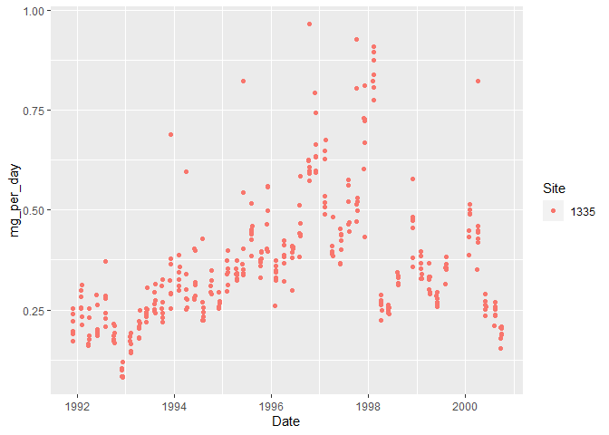<!-- -->

Count the number of samples per month.

``` r
s1335 %>% 
   group_by(Year, Month) %>% 
   summarize(count = n()) %>% 
   arrange(-count) # arrange by count column in descending order
```

    ## `summarise()` has grouped output by 'Year'. You can override using the `.groups` argument.

    ## # A tibble: 68 x 3
    ## # Groups:   Year [10]
    ##     Year Month count
    ##    <dbl> <dbl> <int>
    ##  1  1992    10     7
    ##  2  1993     2     7
    ##  3  1993     4     7
    ##  4  1993     6     7
    ##  5  1993     8     7
    ##  6  1993    12     7
    ##  7  1994     2     7
    ##  8  1994     6     7
    ##  9  1994     8     7
    ## 10  1994    12     7
    ## # ... with 58 more rows

The maximum number of samples we have per month is 7. Probably not
enough to do any meaningful analysis for a daily trend. Let’s average
samples by month. There also can be no data gaps for a time series (ts)
data class.

``` r
ave_s1335 <- s1335 %>% 
   group_by(Year, Month, Site) %>% 
   summarize(mg_per_day = mean(mg_per_day),
             SD = sd(mg_per_day))
```

    ## `summarise()` has grouped output by 'Year', 'Month'. You can override using the `.groups` argument.

Alternatively, can graphically summarize the distribution of dates using
the `hist()` (`hist.Date()`) function.

``` r
hist(as.Date(s1335$Date), # change POSIXct to Date object
     breaks = "months", 
     freq = TRUE,
     xlab = "", # remove label so doesn't overlap with date labels,
     format = "%b %Y", # format the date label, mon year
     las = 2)
```

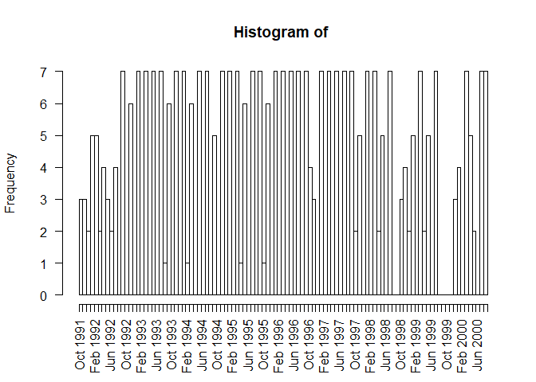<!-- -->

Let’s convert our data into a time series. Times series data must be
sampled at equispaced points in time.

There are several different time series object that have different
functionalities such as working with irregularly spaced time series. See
this
[resource](https://faculty.washington.edu/ezivot/econ424/Working%20with%20Time%20Series%20Data%20in%20R.pdf).

``` r
ts_1335 <- ts(ave_s1335$mg_per_day, frequency = 12,
                 start = c(1991, 11), end = c(2000, 9))

class(ts_1335) # check the object class
```

    ## [1] "ts"

``` r
ts_1335 # see the data
```

    ##             Jan        Feb        Mar        Apr        May        Jun
    ## 1991                                                                  
    ## 1992 0.27545325 0.25955623 0.17283015 0.24237330 0.21492034 0.21685501
    ## 1993 0.24936087 0.26921357 0.30978222 0.25693728 0.37014955 0.33177930
    ## 1994 0.34481141 0.34235679 0.36426187 0.46659618 0.44669432 0.37206745
    ## 1995 0.65457749 0.69834479 0.62221301 0.57168051 0.40724687 0.41195379
    ## 1996 0.24812201 0.25220778 0.32420921 0.40677658 0.49618890 0.34124538
    ## 1997 0.49926914 0.48207736 0.26538307 0.24687993 0.24478730 0.18937818
    ## 1998 0.21492034 0.21685501 0.21884272 0.29415920 0.18834451 0.09494631
    ## 1999 0.37014955 0.33177930 0.27831867 0.33660285 0.32467068 0.26865238
    ## 2000 0.44669432 0.37206745 0.39990788 0.47986144 0.33436319 0.38241556
    ##             Jul        Aug        Sep        Oct        Nov        Dec
    ## 1991                                             0.22975903 0.19544291
    ## 1992 0.21884272 0.29415920 0.18834451 0.09494631 0.16351067 0.20807004
    ## 1993 0.27831867 0.33660285 0.32467068 0.26865238 0.31360895 0.26773691
    ## 1994 0.39990788 0.47986144 0.33436319 0.38241556 0.38570498 0.46601276
    ## 1995 0.50863024 0.60921090 0.66656370 0.67302314 0.84627446 0.26116715
    ## 1996 0.36344698 0.32072347 0.29003143 0.26723167 0.35837799 0.42259062
    ## 1997 0.22975903 0.19544291 0.27545325 0.25955623 0.17283015 0.24237330
    ## 1998 0.16351067 0.20807004 0.24936087 0.26921357 0.30978222 0.25693728
    ## 1999 0.31360895 0.26773691 0.34481141 0.34235679 0.36426187 0.46659618
    ## 2000 0.38570498 0.46601276 0.65457749

### Create a irregularly spaced time series using the zoo (Zeileis ordered observations) package

The `zoo` class is a flexible time series data with an ordered time
index. The data is stored in a matrix with vector date information
attached. Can be regularly or irregularly spaced.
[document](https://faculty.washington.edu/ezivot/econ424/Working%20with%20Time%20Series%20Data%20in%20R.pdf).

``` r
library(zoo)
z_1335 <- zoo(s1335$mg_per_day, order.by = s1335$Date)

head(z_1335)
```

    ## 1991-11-28 1991-11-29 1991-11-30 1991-12-01 1991-12-02 1991-12-03 
    ##  0.2530688  0.2390078  0.1972005  0.1728767  0.2224569  0.1909951

### Decomposition

Decomposition separates out a times series *Y*<sub>*t*</sub> into a
seasonal *S*<sub>*t*</sub>, trend *T*<sub>*t*</sub>, and error/residual
*E*<sub>*t*</sub> components. NOTE: there are lot of different words for
this last component - irregular, random, residual, etc. See resources at
the bottom.

These elements can be *additive* when the seasonal component is
relatively constant over time.

*Y*<sub>*t*</sub> = *S*<sub>*t*</sub> + *T*<sub>*t*</sub> + *E*<sub>*t*</sub>

Or *multiplicative* when seasonal effects tend to increase as the trend
increases.

*Y*<sub>*t*</sub> = *S*<sub>*t*</sub> \* *T*<sub>*t*</sub> \* *E*<sub>*t*</sub>

The `decompose()` function uses a moving average (MA) approach to filter
the data. The *window* or period over which you after is based on the
frequency of the data. For example, monthly data can be averaged across
a 12 month period. Original code from [Time Series Analysis with R Ch.
7.2.1](https://nicolarighetti.github.io/Time-Series-Analysis-With-R/structural-decomposition.html#components-of-a-time-series).

``` r
library(xts)
```

    ## 
    ## Attaching package: 'xts'

    ## The following objects are masked from 'package:dplyr':
    ## 
    ##     first, last

``` r
xts_1335 <- as.xts(x = ts_1335)

k2 <- rollmean(xts_1335, k = 2)
k4 <- rollmean(xts_1335, k = 4)
k8 <- rollmean(xts_1335, k = 8)
k16 <- rollmean(xts_1335, k = 16)
k32 <- rollmean(xts_1335, k = 32)

kALL <- merge.xts(xts_1335, k2, k4, k8, k16, k32)
head(kALL)
```

    ##           xts_1335        k2        k4        k8 k16 k32
    ## Nov 1991 0.2297590 0.2126010        NA        NA  NA  NA
    ## Dec 1991 0.1954429 0.2354481 0.2400529        NA  NA  NA
    ## Jan 1992 0.2754533 0.2675047 0.2258206        NA  NA  NA
    ## Feb 1992 0.2595562 0.2161932 0.2375532 0.2258988  NA  NA
    ## Mar 1992 0.1728301 0.2076017 0.2224200 0.2245342  NA  NA
    ## Apr 1992 0.2423733 0.2286468 0.2117447 0.2368738  NA  NA

``` r
plot.xts(kALL, multi.panel = TRUE)
```

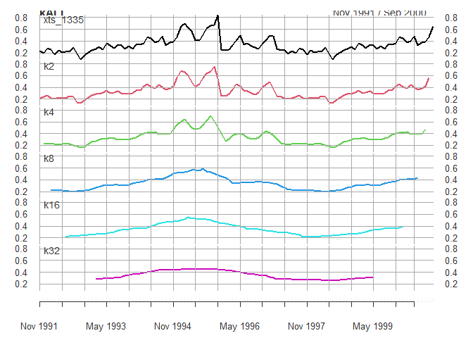<!-- -->

Let’s use the use the `stats::decompose()` function for an additive
model:

``` r
decomp_1335 <- decompose(ts_1335, type = "additive") # additive is the default
plot(decomp_1335)
```

<!-- -->

In the top ‘observed’ plot there does not appear to be a clear case of
seasonality increasing over time so the additive model should be fine.
There is a huge peak in the trend in 1995 which decreases until around
1998 before increasing again.

### Remove seasonality components using the forecast package.

``` r
stl_1335 <- stl(ts_1335, s.window = "periodic") # deompose into seasonal, trend, and irregular components
head(stl_1335$time.series)
```

    ##              seasonal     trend    remainder
    ## Nov 1991  0.021512597 0.2253694 -0.017122969
    ## Dec 1991 -0.019995577 0.2243884 -0.008949903
    ## Jan 1992  0.035564624 0.2234074  0.016481258
    ## Feb 1992  0.024725533 0.2220857  0.012744950
    ## Mar 1992 -0.007203528 0.2207641 -0.040730440
    ## Apr 1992  0.028745667 0.2191495 -0.005521904

The seasonal and reminder/irregular components are small compared to the
trend component.

Let’s seasonally adjust the data and plot the raw data and adjusted
data.

``` r
sa_1335 <- seasadj(stl_1335) # seasonally adjusted data

par(mfrow = c(2,1))
plot(ts_1335) #, type = "1")
plot(sa_1335)
```

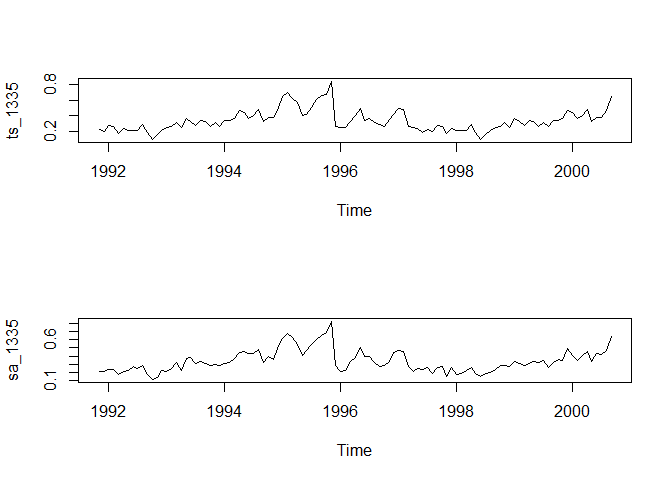<!-- -->

These two plots are pretty much the same. There does not seem to be a
large seasonality component in the data.

It can also be visualised using on the same plot to highlight the small
effect of seasonality. Code modified from [Time Series Analysis with R
Ch.
7.3](https://nicolarighetti.github.io/Time-Series-Analysis-With-R/structural-decomposition.html#seasonality).

``` r
s1335_deseason <- ts_1335 - decomp_1335$seasonal # manually adjust for seasonality

deseason <- ts.intersect(ts_1335, s1335_deseason) # bind the two time series

plot.ts(deseason, 
        plot.type = "single",
        col = c("red", "blue"),
        main = "Original (red) and Seasonally Adjusted Series (blue)")
```

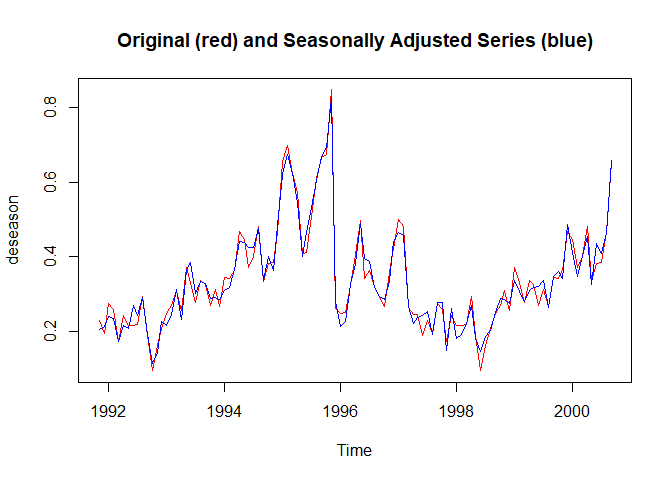<!-- -->

Plot the time series against the seasons in separate years.

``` r
par(mfrow = c(1,1))
seasonplot(sa_1335, 12, col=rainbow(12), year.labels=TRUE, main="Seasonal plot: Site 1335")
```

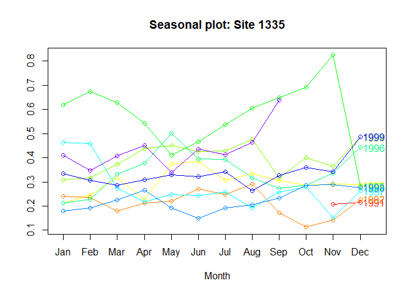<!-- -->

The lines do not really follow the same pattern throughout the year -
again, not a big seasonality component.

### Stationarity

The **residual** part of the model should be **random** where the model
explained most significant patterns or *signal* in the time series
leaving out the *noise*.

[This article](http://r-statistics.co/Time-Series-Analysis-With-R.html)
states that the following conditions must be met:

1.  The mean value of time-series is constant over time, which implies,
    the trend component is nullified.
2.  The variance does not increase over time.
3.  Seasonality effect is minimal.

There are a few tests for stationarity with the `tseries` package:
Augmented Dickery-Fuller and KPSS. See this
[section](https://atsa-es.github.io/atsa-labs/sec-boxjenkins-aug-dickey-fuller.html).

``` r
adf.test(ts_1335) # p-value < 0.05 indicates the TS is stationary
```

    ## 
    ##  Augmented Dickey-Fuller Test
    ## 
    ## data:  ts_1335
    ## Dickey-Fuller = -2.0988, Lag order = 4, p-value = 0.5357
    ## alternative hypothesis: stationary

``` r
kpss.test(ts_1335, null = "Trend") # null hypothesis is that the ts is level/trend stationary, so do not want to reject the null, p > 0.05
```

    ## Warning in kpss.test(ts_1335, null = "Trend"): p-value smaller than printed p-
    ## value

    ## 
    ##  KPSS Test for Trend Stationarity
    ## 
    ## data:  ts_1335
    ## KPSS Trend = 0.25335, Truncation lag parameter = 4, p-value = 0.01

The tests indicate that the time series is not stationary. How do you
make a non-stationary time series stationary?

### Differencing

One common way is to *difference* a time series - subtract each point in
the series from the previous point.

Using the `forecast` package, we can do *seasonal differencing* and
*regular differencing*.

``` r
nsdiffs(ts_1335, type = "trend") # seasonal differencing
```

    ## Warning: The chosen seasonal unit root test encountered an error when testing for the first difference.
    ## From seas.heuristic(): unused argument (type = "trend")
    ## 0 seasonal differences will be used. Consider using a different unit root test.

    ## [1] 0

``` r
ndiffs(ts_1335, type = "trend") # type 'level' deterministic component is default
```

    ## [1] 1

``` r
stationaryTS <- diff(ts_1335, differences= 1)

diffed <- ts.intersect(ts_1335, stationaryTS) # bind the two time series

plot.ts(diffed, 
        plot.type = "single",
        col = c("red", "blue"),
        main = "Original (red) and Differenced Series (blue)")
```

<!-- -->

Let’s check the differenced time series with the same stationarity
tests:

``` r
adf.test(stationaryTS) 
```

    ## Warning in adf.test(stationaryTS): p-value smaller than printed p-value

    ## 
    ##  Augmented Dickey-Fuller Test
    ## 
    ## data:  stationaryTS
    ## Dickey-Fuller = -8.1769, Lag order = 4, p-value = 0.01
    ## alternative hypothesis: stationary

``` r
kpss.test(stationaryTS, null = "Trend")
```

    ## Warning in kpss.test(stationaryTS, null = "Trend"): p-value greater than printed
    ## p-value

    ## 
    ##  KPSS Test for Trend Stationarity
    ## 
    ## data:  stationaryTS
    ## KPSS Trend = 0.069269, Truncation lag parameter = 4, p-value = 0.1

The both tests now indicate the differenced time series is now
stationary.

### Autocorrelation

#### Autocorrelation plots

Plot the **autocorrelation function** (ACF) correlogram for the time
series. There are *k* lags on the x-axis and the unit of lag is sampling
interval (month here). Lag 0 is always the theoretical maximum of 1 and
helps to compare other lags.

The cutest explanation of ACF by Dr Allison Horst:


See the full artwork series explaining ACF
[here](https://qaehs-lib-rtimeseries2022.netlify.app/2022/02/03/acf-art/).

``` r
acf(s1335$mg_per_day)
```

<!-- -->

You can used the ACF to estimate the number of moving average (MA)
coefficients in the model. Here, the number of significant lags is high.
The lags crossing the dotted blue line are statistically significant.

The **partial autocorrelation function** can also be plotted. The
partial correlation is the left over correlation at lag *k* between all
data points that are *k* steps apart accounting for the correlation with
the data between *k* steps.

``` r
pacf(s1335$mg_per_day)
```

<!-- -->

Practically, this can help us identify the number of autoregression (AR)
coefficients in an autoregression integrated moving average (ARIMA)
model. The above plot shows *k* = 3 so the initial ARIMA model will have
three AR coefficients (AR(3)). The model will still require fitting and
checking.

#### Autocorrelation test

There is also the `base::Box.test()` function that can be used to test
for autocorrelation:

``` r
Box.test(ts_1335)
```

    ## 
    ##  Box-Pierce test
    ## 
    ## data:  ts_1335
    ## X-squared = 57.808, df = 1, p-value = 2.887e-14

The p-value is significant which means the data contains significant
autocorrelations.

## Models for time series data

> Most of the content below follows the great book: Introductory Time
> Series with R by Cowpertwait & Metcalfe. ### Autoregressive model

Autoregressive (AR) models can simulate *stochastic* trends by
regressing the time series on its past values. Order selection is done
by Arkaike Information Criterion (AIC) and method chosen here is maximum
likelihood estimation (mle).

``` r
ar_1335 <- ar(ts_1335, method = "mle")

mean(ts_1335)
```

    ## [1] 0.3390491

``` r
ar_1335$order
```

    ## [1] 6

``` r
ar_1335$ar
```

    ## [1]  0.692318630  0.056966778 -0.007328706 -0.164283447  0.023423585
    ## [6]  0.284339996

``` r
acf(ar_1335$res[-(1:ar_1335$order)], lag = 50) 
```

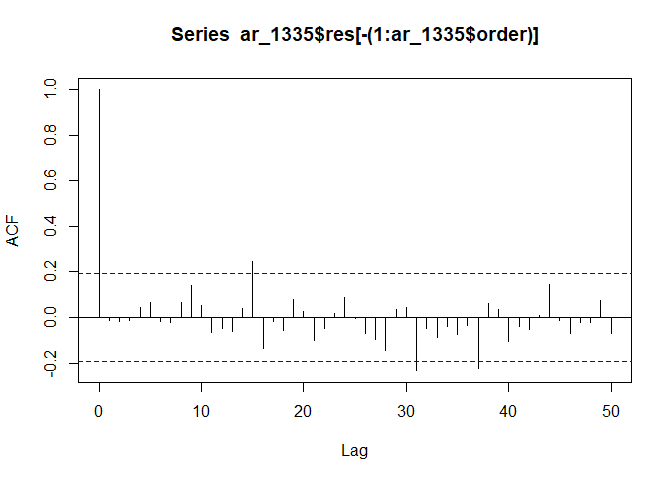<!-- -->

The correlogram of residuals has a few marginally significant lags
(around 15 and between 30-40). The AR(6) model is a relatively good fit
for the time series.

### Regression

*Deterministic* trends and seasonal variation can be modeled using
regression.

Linear models are non-stationary for time series data, thus a
non-stationary time series must be differenced.

``` r
diff <- window(ts_1335, start = 1991)
```

    ## Warning in window.default(x, ...): 'start' value not changed

``` r
head(diff)
```

    ##            Jan       Feb       Mar       Apr May Jun Jul Aug Sep Oct       Nov
    ## 1991                                                                 0.2297590
    ## 1992 0.2754533 0.2595562 0.1728301 0.2423733                                  
    ##            Dec
    ## 1991 0.1954429
    ## 1992

``` r
lm_s1335 <- lm(diff ~ time(diff)) # extract the time component as the explanatory variable
coef(lm_s1335)
```

    ##   (Intercept)    time(diff) 
    ## -11.040746179   0.005700586

``` r
confint(lm_s1335)
```

    ##                     2.5 %     97.5 %
    ## (Intercept) -31.137573143 9.05608078
    ## time(diff)   -0.004366695 0.01576787

``` r
acf(resid(lm_s1335))
```

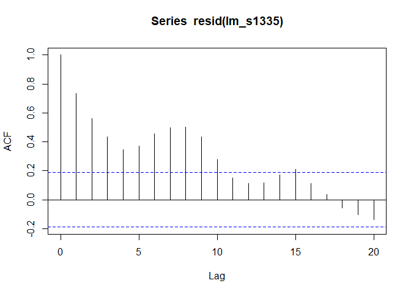<!-- -->

The confidence interval does not include 0, which means there is no
statistical evidence of increasing Compound X in the atmosphere. The ACF
of the model residuals are significantly positively autocorrelated
meaning the model likely underestimates the standard error and the
confidence interval is too narrow.

### Adding a seasonal component

``` r
Seas <- cycle(diff)
Time <- time(diff)
s1335_slm <- lm(ts_1335 ~ 0 + Time + factor(Seas))
coef(s1335_slm)
```

    ##           Time  factor(Seas)1  factor(Seas)2  factor(Seas)3  factor(Seas)4 
    ##    0.005756378  -11.122691112  -11.131937489  -11.162273796  -11.124295885 
    ##  factor(Seas)5  factor(Seas)6  factor(Seas)7  factor(Seas)8  factor(Seas)9 
    ##  -11.155275762  -11.202207940  -11.174639108  -11.139997655  -11.123771124 
    ## factor(Seas)10 factor(Seas)11 factor(Seas)12 
    ##  -11.171495571  -11.139425944  -11.179592661

``` r
acf(resid(s1335_slm))
```

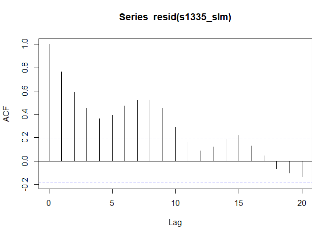<!-- -->

### Generalised Least Squares

*Generalised Least Squares* model can account for some of this
autocorrelation.

From 5.4 of Cowpertwait & Metcalfe, 2009:

> *Generalised Least Squares* can be used to provide better estimates of
> the standard errors of the regression parameters to account for the
> autocorrelation in the residual series.

A correlation structure is defined using the `cor` argument. The value
is estimated from the acf at lag 1 in the previous correlogram. The
residuals are approximated as an AR(1).

``` r
library(nlme)
```

    ## 
    ## Attaching package: 'nlme'

    ## The following object is masked from 'package:forecast':
    ## 
    ##     getResponse

    ## The following object is masked from 'package:dplyr':
    ## 
    ##     collapse

``` r
gls_s1335 <- gls(ts_1335 ~ time(ts_1335), cor = corAR1(0.7))
coef(gls_s1335)
```

    ##   (Intercept) time(ts_1335) 
    ##   -27.9996694     0.0141997

``` r
confint(gls_s1335)
```

    ##                      2.5 %      97.5 %
    ## (Intercept)   -87.94374736 31.94440847
    ## time(ts_1335)  -0.01582862  0.04422801

``` r
acf(resid(gls_s1335))
```

<!-- -->

The confidence interval still includes 0 and the acf of the model
residuals still have significant autocorrelation.

### Autoregressive Integated Moving Average (ARIMA)

Autoregressive *integrated* moving average models define the model order
(*p*, *d*, *q*).

[Cookbook R](https://rc2e.com/timeseriesanalysis#recipe-id085) explains
it as:

> *p* is the number of autoregressive coefficients, *d* is the degree of
> differencing, and *q* is tne number of moving average coefficients.

``` r
par(mfrow = c(2,1)) # change window so 2 rows, 1 column of plots
plot(ts_1335)
plot(diff(ts_1335))
```

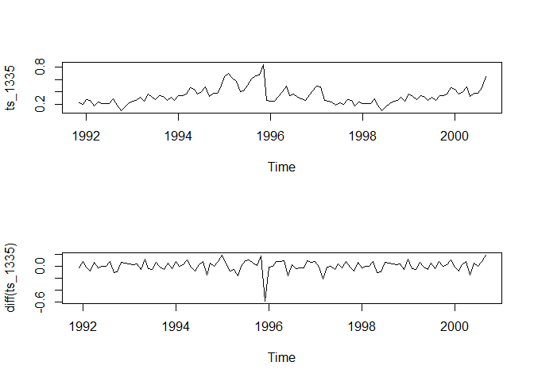<!-- -->

``` r
arima_1 <-  arima(ts_1335, order = c(6,1,12))
```

    ## Warning in arima(ts_1335, order = c(6, 1, 12)): possible convergence problem:
    ## optim gave code = 1

``` r
arima_1
```

    ## 
    ## Call:
    ## arima(x = ts_1335, order = c(6, 1, 12))
    ## 
    ## Coefficients:

    ## Warning in sqrt(diag(x$var.coef)): NaNs produced

    ##          ar1      ar2      ar3      ar4     ar5      ar6      ma1    ma2
    ##       0.3101  -0.1672  -0.2606  -0.5937  0.3171  -0.3346  -0.6401  0.161
    ## s.e.  0.4987      NaN   0.1375   0.2446  0.3642      NaN   0.5091    NaN
    ##          ma3     ma4      ma5     ma6      ma7     ma8     ma9    ma10     ma11
    ##       0.2277  0.3546  -0.7157  0.5324  -0.1141  0.0339  0.0639  0.0186  -0.2655
    ## s.e.  0.3045  0.1810   0.2855     NaN      NaN     NaN     NaN  0.1282   0.2167
    ##         ma12
    ##       0.2497
    ## s.e.  0.1244
    ## 
    ## sigma^2 estimated as 0.005943:  log likelihood = 119.27,  aic = -200.54

``` r
acf(resid(arima_1), lag = 50)
```

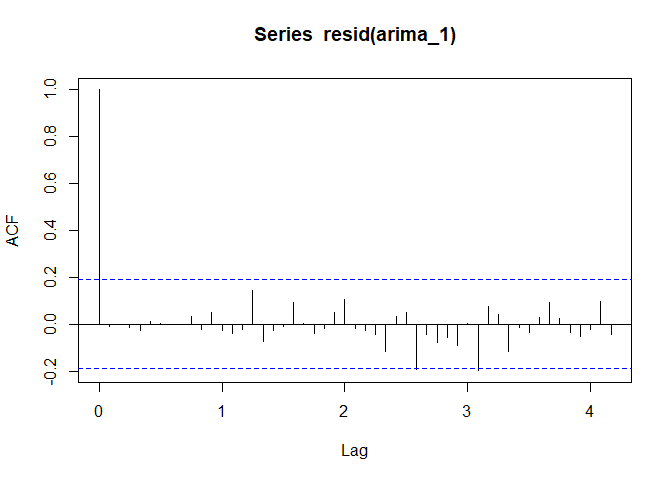<!-- -->

Let’s run a model with order(1, 1, 1) and compare AIC.

``` r
arima_2 <-  arima(ts_1335, order = c(1, 1, 1))
arima_2
```

    ## 
    ## Call:
    ## arima(x = ts_1335, order = c(1, 1, 1))
    ## 
    ## Coefficients:
    ##          ar1      ma1
    ##       0.5484  -0.8285
    ## s.e.  0.1300   0.0795
    ## 
    ## sigma^2 estimated as 0.007826:  log likelihood = 106.51,  aic = -207.01

``` r
acf(resid(arima_2), lag = 50)
```

<!-- -->

The second model had a lower AIC. Let’s use the `forecast::auto.arima()`
function from the forecast package to search for the best *p, d, q*.

``` r
arima_3 <- auto.arima(ts_1335, seasonal = FALSE, max.p = 20, max.q = 20)
arima_3
```

    ## Series: ts_1335 
    ## ARIMA(1,0,0) with non-zero mean 
    ## 
    ## Coefficients:
    ##          ar1    mean
    ##       0.7719  0.3452
    ## s.e.  0.0637  0.0362
    ## 
    ## sigma^2 = 0.007892:  log likelihood = 107.77
    ## AIC=-209.54   AICc=-209.31   BIC=-201.52

``` r
acf(resid(arima_3), lag = 50)
```

<!-- -->

``` r
autoplot(ts_1335) # plot the time series
```

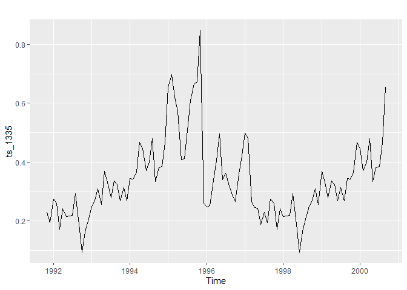<!-- -->

### Seasonal ARIMA

A seasonal component can also be added to ARIMA. The default for
`auto.arima()` includes the seasonal component.

``` r
sarima <- auto.arima(ts_1335)
sarima
```

    ## Series: ts_1335 
    ## ARIMA(1,0,0) with non-zero mean 
    ## 
    ## Coefficients:
    ##          ar1    mean
    ##       0.7719  0.3452
    ## s.e.  0.0637  0.0362
    ## 
    ## sigma^2 = 0.007892:  log likelihood = 107.77
    ## AIC=-209.54   AICc=-209.31   BIC=-201.52

``` r
acf(resid(sarima), lag = 50)
```

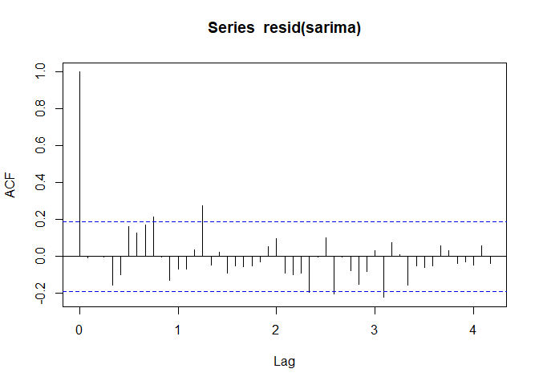<!-- -->

The addition of the seasonal component improves the AIC and the
correlogram is close to the ‘white noise’ standard.

## Resources

Check out [tidyverts](https://tidyverts.org/), tidy tools for time
series!

Resources used to compile this session included:

-   [Introductory Time Series with
    R](https://link-springer-com.ezproxy.library.uq.edu.au/chapter/10.1007%2F978-0-387-88698-5_5)
    by Paul Cowpertwait and Andrew Metcalfe, Springer 2009.
-   [Ch 14 Time Series Analysis](https://rc2e.com/timeseriesanalysis) in
    R Cookbook, 2nd edition, by JD Long and Paul Teetor. Copyright 2019
    JD Long and Paul Teetor, 978-1-492-04068-2
-   [Time Series Analysis with
    R](https://nicolarighetti.github.io/Time-Series-Analysis-With-R/) by
    Nicola Righetti
-   [Applied Time Series Analysis For Fisheries and Environmental
    Sciences](https://atsa-es.github.io/atsa-labs/sec-boxjenkins-aug-dickey-fuller.html)
    by Elizabeth Holmes, Mark Scheuerell, and Eric Ward.
-   [Time Series
    Analysis](http://r-statistics.co/Time-Series-Analysis-With-R.html)
    article by Selva Prabhakaran
-   [Working with Financial Time Series Data in
    R](https://faculty.washington.edu/ezivot/econ424/Working%20with%20Time%20Series%20Data%20in%20R.pdf)
    document by Eric Zivot.
